# I. Bienvenida al tutorial

Hola, este tutorial está escrito como la actividad de aplicación de la ayudantía 2 del curso

La idea es ir desarrollando el tutorial en paralelo a la sesión y que puedan tomar apuntes adicionales directamente en el notebook. Está escrito como .qmd, un notebook Quarto y puede ser editado en rstudio, vscode o cualquier otro IDE o editor de texto. El lenguaje utilizado para el procesamiento y análisis es R.

Se recomienda crear un fork al repositorio y trabajar en su propia rama.

**Como funciona**

-   El tutorial se estructura como un proyecto de investigación ficticio completo, que empezaremos cargando datos brutos hasta obtener e interpretar coficientes de regresión.

-   Lo métodos a cubir son:

    1. Regresión lineal y método de diferencias (en datos experimentales)

    2. Logit y probit

    3. Variables Instrumentales

    4. Regresión Discontinua

    5. Diferencias en Diferencias

    6. Efectos fijos, aleatorios y modelos jerárquicos

    7. Matching

-   Los datos y notebook son descargables en el siguiente [repositorio de proyecto](https://github.com/ClasesMOW/ayudantia2ccs)  así que se recomienda correr todo en tu propio computador o en una instancia en la nube.

-   Este tutorial es una adaptación del trabajo de [Hans H. Sievertsen](https://hhsievertsen.shinyapps.io/applied_econ_with_R_dynamic), agregando la estimación con métodos de de métodos de matching y algunos cambios a la situación a analizar.

<br>

## 1 Pregunta de investigación y datos

Vamos a usar una situación ficticia, con datos simulados para poder aplicar de manera consisa los diferentes tipos de estrategias de identificación revisadas en clase. Algunas (que se supone ya manejan) las revisaremos muy rápidamente y en otras, vamos a tener mayor énfasis.

### 1.1 Pregunta de investigación

Nuestro objetivo es responder la siguiente pregunta **ficticia** de investigación:

> Asistir a cursos de verano mejora los resultados académicos?

Para responder esta pregunta, usaremos unos datos **ficticios y simulados**

### 1.2 Contexto ficticio

La pregunta de investigación se inspira en trabajos como el de [Matsudaira (2007)](https://www.sciencedirect.com/science/article/pii/S0304407607001194?casa_token=hnnF764CKPoAAAAA:5b9WhCManNDsdW4SmOHnnzNr0fZIarW8s6EsvpQW7MdUt470eNPmN2T8IFCsNc6Iajew5tEeNA) e intervenciones en estudiantes de bajo nivel socioeconómico por [Dietrichson et al ( 2017)](https://journals.sagepub.com/doi/abs/10.3102/0034654316687036).

El **escenario ficticio** es el siguiente:

-   Para un conjunto de colegios en una comuna, existe la opción de asistir a un curso de verano intensivo durante el verano entre 5 y 6to básico.
-   El curso de verano se enfoca en mejorar las habilidades académicas de preparar la prueba de admisión a la universidad vigente (PSU en ese momento)
-   El curso de verano es gratuito, pero para ser matriculados requiere que los padres se involucren en un proceso.
-   Estamos interesados en testear el impacto de la participación en el curso en los resultados académicos de los estudiantes.

### 1.3 Datos ficticios dispobibles

1.  school_data_1.csv

-   Usamos esta data para ejemplificar como cargar data guardada en formato csv.
-   Este dataset tiene información sobre cada individuo (con identificador id), la escuela a la que asiste, un indicador si participó en el curso de verano, sexo, ingreso del hogar (en logaritmo), educación de los padres, resultados en una prueba estandarizada que se realiza a nivel de la comuna tanto para el año 5 como para el año 6.

2.  school_data_2.dta

-   Usamos esta data para ejemplificar como cargar data guardada en formato STATA.
-   Este dataset tiene información de cada individuo (con identificador id).
-   Este dataset tiene la información si el individuo recibió la carta de invitación para participar del curso de verano.

3.  school_data_3.xlsx

-   Usamos este dataset para practicar como cargar datos guardados en formato Microsoft Excel.
-   Este dataset incluye datos sobre cada individuo (con identificador id)
-   Este dataset tiene información de rendimiento académico antes y después del curso de verano.

# II. Preparación de los datos

En esta sección vamos a preparar los datos para el análisis. Este proceso generalmente incluye cargarlos, inspeccionarlos, limpiar y dar la estructura deseada. También revisaremos estadísticas descriptivas que nos den una idea antes de estimar cualquier modelo.

En la vida real, este proceso suele ser bastante largo, laborioso e implica volver sobre lso pasos anteriores múltiples veces. También invlocura tomar desiciones por parte de los investigadores, por lo cual la documentación de esta fase es especialmente importante.

En nuestro caso, será bastante lineal y directo, ya que son datos ficticios simulados. Pero en la realidad, no suele ser así.

## 0. Crear el proyecto y clonar el repositorio

Este proyecto está sustentado en el repositorio de github. Clónelo y luego carguelo en su computador.

## 1 Cargar los datos

### 1.1 Intalar y cargar paquetes

Para poder cargar los datos, necesiamos los paquetes adecuados. Siempre hay multiples formas de hacer las cosas en cualquier lenguaje o programa. En este caso, usaremos la función `read_csv()` del paquete *readr*. Para poder usarlo, debemos estar seguros de que está instalado.

Si no está instalado, podemos hacerlo con la función `install.packages("[nombre paquete a instalar]")`


::: {.cell}

```{.r .cell-code}
install.packages("readr")
```
:::


Si el paquete ya está instalado, para poder usarlo necesitamos tenerlo cargado en nuestra librería. Para esto usamos la función `library("[nombre paquete a cargar]")`.


::: {.cell}

```{.r .cell-code}
library(readr)
```
:::


Cada paquete lo debemos instalar solo una vez por computador, pero debemos cargarlo en cada sesión para poder utilizarlo.

### 1.2 Cargar datos csv

Con *readr* estamos en condiciones de usar la función `read_csv()` para cargar la primera base de datos.

Vamos a cargar *school_data_1.csv* agregando el path a los datos en paréntesis. Puede reemplazar por el path correspondiente o usar el paquete auxiliar `here`

PS. notemos que tambien estamos incluyendo comentarios en los bloques de código. Las líneas que empiezan con el símbolo `#` son ignoradas por R.


::: {.cell}

```{.r .cell-code}
# cargar readr package
library("readr", "here")

#prueba el directorio que te dice con here
here::here()
```

::: {.cell-output .cell-output-stdout}
```
[1] "/Users/melita/Documents/GitHub/ayudantiasccs"
```
:::
:::


Entonces, dentro de `here("[Escribes el directorio relativo]")` actuará como el directorio relativo sin errores. Entonces, cargamos los datos y los asignamos a un data frame.


::: {.cell}

```{.r .cell-code}
school_data_1 <- read.csv(here::here("data_raw/school_data_1.csv"))
```
:::


Usualmente, después de cargar un dataset es útil visualizarlo. Empleamos la función `head()` para ver sus primeras 6 observaciones.


::: {.cell}

```{.r .cell-code}
head(school_data_1)
```

::: {.cell-output .cell-output-stdout}
```
  person_id school_id summercamp female parental_schooling parental_lincome
1         1         5          0      1                 10         12.93921
2         2        14          1      0                 11         14.73739
3         3         7          1      0                 14         16.08326
4         4         8          0      0                 12         14.60808
5         5         9          1      0                 11         13.75679
6         6        26          1      1                 11         14.70552
  test_year_5 test_year_6
1          NA    1.636284
2    1.297036    2.561449
3    2.761908    3.526002
4    1.772913    2.381062
5    1.180356    1.959818
6    2.439802    2.810571
```
:::
:::


Una segunda alternativa es descargar y cargar los datos directamente en R desde internet. Puede ser cualquier link directo o, si está alojado en github, tienes que asegurarte de que sea un repositorio público.


::: {.cell}

```{.r .cell-code}
#school_data_1 <- read.csv("https://github.com/ClasesMOW/ayudantiasccs/blob/main/data_raw/school_data_1.csv")
```
:::


### 1.3 Cargar datos STATA

En Ciencias Sociales y Economía es muy comun contar con datos para ser utilizados en el programa STATA, estos son archivos que terminan en *.dta*. Para cargarlos, vamos a usar *HAVEN* del paquete *tidyverse*. También usaremos muchas otras funciones de ese paquete, asi que es buen momento para cargalo.


::: {.cell}

```{.r .cell-code}
library(tidyverse)

school_data_2<- haven::read_dta(here::here("data_raw/school_data_2.dta"))
```
:::


Usemos el comando `tail()` para ver las últimas 10 entradas.


::: {.cell}

```{.r .cell-code}
# print las últimas 8 filas
tail(school_data_2,n=10)
```

::: {.cell-output .cell-output-stdout}
```
# A tibble: 10 × 2
   person_id letter
       <dbl>  <dbl>
 1      3482      1
 2      3483      0
 3      3484      0
 4      3485      0
 5      3486      1
 6      3487      0
 7      3488      1
 8      3489      0
 9      3490      0
10      3491      0
```
:::
:::


### 1.4 Cargar datos Microsoft Excel

Finalmente, cargaremos el tercer dataset guardado como hoja de cálculo de Excel *.xlsx*. Para esto usaremos el paquete *readxl* que viene incluido en *tidyverse*. Luego de asignarlo a un dataframe, démosle una mirada con `glimpse()` (también del tidyverse).


::: {.cell}

```{.r .cell-code}
school_data_3 <- readxl::read_xlsx(here::here("data_raw/school_data_3.xlsx"))

glimpse(school_data_3)
```

::: {.cell-output .cell-output-stdout}
```
Rows: 3,491
Columns: 10
$ person_id    <dbl> 1, 2, 3, 4, 5, 6, 7, 8, 9, 10, 11, 12, 13, 14, 15, 16, 17…
$ test_year_2  <dbl> 1.090117, 1.246309, 2.726472, 2.693032, 1.660545, 2.22377…
$ test_year_3  <dbl> 1.914594, 1.154470, 2.269011, 2.413203, 1.828067, 2.27566…
$ test_year_4  <dbl> 2.065805, 1.582455, 3.247252, 1.479452, 1.361972, 2.38510…
$ test_year_7  <dbl> 2.377697, 1.747376, 3.017764, 2.637954, 1.904636, 3.37613…
$ test_year_8  <dbl> 2.032904, 2.444041, 3.361646, 3.021940, 2.109774, 3.24542…
$ test_year_9  <dbl> 1.493803, 1.663050, 3.387020, 2.761513, 2.285818, 2.96503…
$ test_year_10 <dbl> 1.880512, 1.833769, 2.968617, 2.088086, 1.845694, 3.30819…
$ learnings    <dbl> 10.236394, 8.278911, 8.966529, 8.876466, 8.770518, 10.484…
$ school_id    <dbl> 5, 14, 7, 8, 9, 26, 13, 11, 23, 9, 25, 15, 3, 4, 17, 7, 1…
```
:::
:::


## 2. Unir los datasets

Tenemos 3 bases de datos con información diferente de los mismos individuos. Generalmente es buena idea tener una sola gran tabla con toda esta información, especialmente si estimaremos modelos en base a ésta.

La base de datos 1 y 2 tienen una forma similar: los individuos son filas y las variables columnas y hay una sola fila para cada individuo.

Para hacerlo, podriamos usar varias alternativas.

Una alternativa es usar la función nativa `merge( )`. En esta función, primero mencionamos los datasets a unir, luego informamos cual es la(s) columnas(s) que debe usar para unir ambos datasets con `by=....`. Por defecto, R incluye todas las filas que están en ambos datasets (basados en la variable *by*), pero podemos fijar `all=TRUE` para mantener todas las filas que están en ambos datasets o `all.x=TRUE` para mantener todas las filas coincidentes y las del primer dataset or `all.y=TRUE` para guardar todas las filas del segundo dataset.

Veamos un ejemplo con los dos primeros datasets. Luego usemos `dim()` para conocer las dimensiones del nuevo dataset unido en términos de filas y columnas.


::: {.cell}

```{.r .cell-code}
# Unir school_data_1 con school_data_2
school_data_merged <-merge(school_data_1,school_data_2, by="person_id")

# Revisamos las dimensiones
dim(school_data_merged)
```

::: {.cell-output .cell-output-stdout}
```
[1] 3491    9
```
:::
:::


Notemos que el dataset unido tiene 3491 filas y 9 columnas. Unimos todas las filas y agregamos al dataset de información del estudiante si recibió o no la carta (school_data_2)

¿Qué ocurre si las columnas tienen igual nombre? R va a renombrarlas automáticamente agregando un sufijo *.x* (a la columna del primer dataset) e *.y* ( a la columna del segundo dataset).

Entonces, en el siguiente bloque:

1.  Unimos *school_data_1* y *school_data_2* usando como variable de unión *person_id* y guardamos el dataset unido como *school_data*.
2.  Unimos *school_data_3* con *school_data* y sobre-escribimos *school_data*.

Notar que acá unimos por las columnas *person_id* y *school_id*. Esto no es realmente necesario porque cada estudiante con id única tiene un solo colegio, pero sirve de ejemplo en como usar más de una columna mediante `c()`. 3. Usamos la función `summary()` para obtener una estadística descriptiva de las variables en el dataset unido.


::: {.cell}

```{.r .cell-code}
# Merge school_data_1 y school_data_2 y guardamos como school_data_merged 
school_data_merged<-merge(school_data_1,school_data_2,by="person_id")

# Merge school_data_3 con school_data_merged
school_data_merged<-merge(school_data_merged,school_data_3,by=c("person_id","school_id"))

# Estadísticas descriptivas de cada variable
summary(school_data_merged)
```

::: {.cell-output .cell-output-stdout}
```
   person_id        school_id       summercamp         female      
 Min.   :   1.0   Min.   : 1.00   Min.   :0.0000   Min.   :0.0000  
 1st Qu.: 873.5   1st Qu.: 8.00   1st Qu.:0.0000   1st Qu.:0.0000  
 Median :1746.0   Median :15.00   Median :0.0000   Median :1.0000  
 Mean   :1746.0   Mean   :15.66   Mean   :0.4589   Mean   :0.5153  
 3rd Qu.:2618.5   3rd Qu.:23.00   3rd Qu.:1.0000   3rd Qu.:1.0000  
 Max.   :3491.0   Max.   :30.00   Max.   :1.0000   Max.   :1.0000  
                                                                   
 parental_schooling parental_lincome  test_year_5       test_year_6    
 Min.   :10.00      Min.   :12.67    Min.   :-0.2696   Min.   :0.2824  
 1st Qu.:11.00      1st Qu.:14.12    1st Qu.: 1.7997   1st Qu.:2.0071  
 Median :11.00      Median :14.52    Median : 2.2583   Median :2.4492  
 Mean   :11.32      Mean   :14.56    Mean   : 2.2589   Mean   :2.5174  
 3rd Qu.:12.00      3rd Qu.:14.95    3rd Qu.: 2.7154   3rd Qu.:3.0185  
 Max.   :23.00      Max.   :19.45    Max.   : 4.6897   Max.   :4.9831  
 NA's   :5                           NA's   :6         NA's   :5       
     letter        test_year_2       test_year_3      test_year_4     
 Min.   :0.0000   Min.   :-0.5701   Min.   :-0.464   Min.   :0.01425  
 1st Qu.:0.0000   1st Qu.: 1.7712   1st Qu.: 1.818   1st Qu.:1.78282  
 Median :0.0000   Median : 2.2377   Median : 2.249   Median :2.24947  
 Mean   :0.2469   Mean   : 2.2246   Mean   : 2.254   Mean   :2.24952  
 3rd Qu.:0.0000   3rd Qu.: 2.6644   3rd Qu.: 2.715   3rd Qu.:2.70903  
 Max.   :1.0000   Max.   : 4.7373   Max.   : 4.389   Max.   :4.34995  
                                                                      
  test_year_7       test_year_8       test_year_9       test_year_10    
 Min.   :0.03139   Min.   :-0.1856   Min.   :-0.2456   Min.   :-0.3043  
 1st Qu.:1.93768   1st Qu.: 1.9277   1st Qu.: 1.9371   1st Qu.: 1.9415  
 Median :2.36855   Median : 2.3889   Median : 2.3868   Median : 2.3776  
 Mean   :2.44445   Mean   : 2.4506   Mean   : 2.4531   Mean   : 2.4541  
 3rd Qu.:2.97207   3rd Qu.: 2.9596   3rd Qu.: 2.9861   3rd Qu.: 2.9693  
 Max.   :4.77111   Max.   : 5.0451   Max.   : 4.6565   Max.   : 4.9295  
                                                                        
   learnings     
 Min.   : 5.386  
 1st Qu.: 9.181  
 Median :10.041  
 Mean   :10.064  
 3rd Qu.:10.959  
 Max.   :14.621  
                 
```
:::
:::


Otra opción de hacer lo mismo es con join del paquete `dplyr` del `tidyverse`.

[{fig-alt="Diferentes tipos de join en dplyr" fig-align="center"}](https://statisticsglobe.com/r-dplyr-join-inner-left-right-full-semi-anti) (foto sacada de [link](https://statisticsglobe.com/r-dplyr-join-inner-left-right-full-semi-anti), puedes ver ejemplos detallados de los diferentes tipos de join)

En este caso, podríamos hacer en un pipe `%>%` dos left joins seguidos.


::: {.cell}

```{.r .cell-code}
school_data_merged <- school_data_1 %>%
                        left_join(school_data_2, by="person_id") %>%
                        left_join(school_data_3, by=c("person_id", "school_id"))
```
:::


## 3. Lipiar los datos

### 3.1 Tidyng los datos

Ahora que hemos unido las bases de datos, trataremos de que satisfazgan los principios de [Tidy Data](https://vita.had.co.nz/papers/tidy-data.pdf).

Un data frame se considera "tidy" (Según Hadley) si se cumplen las siguientes condiciones:

-   Cada columna (variable) contiene todas las medidas de la misma data/feature/caracteristica de las observaciones.
-   Cada fila contiene medidas de la misma unidad de observación.

(puedes profundizar y ver más ejemplos aplicados en <https://sscc.wisc.edu/sscc/pubs/DWE/book/6-2-tidy-data.html> )

Uno de estos, es que cada columna debe ser una variable y cafa fila una unidad de observación.

Si inspeccionamos el número de columnas:


::: {.cell}

```{.r .cell-code}
# Alternativamente podemos usar la función nrow() para obtener el número de filas

ncol(school_data_merged)
```

::: {.cell-output .cell-output-stdout}
```
[1] 17
```
:::
:::


Son 17, pero tenemos 9 variables.


::: {.cell}

```{.r .cell-code}
head(school_data_merged)
```

::: {.cell-output .cell-output-stdout}
```
  person_id school_id summercamp female parental_schooling parental_lincome
1         1         5          0      1                 10         12.93921
2         2        14          1      0                 11         14.73739
3         3         7          1      0                 14         16.08326
4         4         8          0      0                 12         14.60808
5         5         9          1      0                 11         13.75679
6         6        26          1      1                 11         14.70552
  test_year_5 test_year_6 letter test_year_2 test_year_3 test_year_4
1          NA    1.636284      0    1.090117    1.914594    2.065805
2    1.297036    2.561449      0    1.246309    1.154470    1.582455
3    2.761908    3.526002      0    2.726472    2.269011    3.247252
4    1.772913    2.381062      0    2.693032    2.413203    1.479452
5    1.180356    1.959818      0    1.660545    1.828067    1.361972
6    2.439802    2.810571      0    2.223775    2.275665    2.385106
  test_year_7 test_year_8 test_year_9 test_year_10 learnings
1    2.377697    2.032904    1.493803     1.880512 10.236394
2    1.747376    2.444041    1.663050     1.833769  8.278911
3    3.017764    3.361646    3.387020     2.968617  8.966529
4    2.637954    3.021940    2.761513     2.088086  8.876466
5    1.904636    2.109774    2.285818     1.845694  8.770518
6    3.376130    3.245426    2.965039     3.308194 10.484683
```
:::
:::


Es porque tenemos puntajes de las pruebas del año 2 al 10. Este tipo de datos son de *panel*

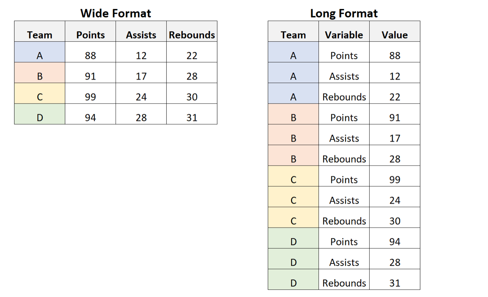

Generalmente, que hagamos con este tipo de datos depende del tipo de modelos que queramos usar. Si bien el formato wide es facil de entender, generlamente para modelos y análisi preferimos que esté en formato long. Especialmente cuando modelamos incluyendo efectos fijos También es este el que adhiere a los principios tidy de mejor manera.

Para cambiar a long, usamos `pivot_longer()`


::: {.cell}

```{.r .cell-code}
# lCargamos el paquete tidyr package. Ya está incluido en tidyverse, pero  también se puede llamar por si solo.

library("tidyr")

# make data tidy (make long)
school_data_tidy<-school_data_merged%>%
       tidyr::pivot_longer(
                            cols = starts_with("test_year"),
                            names_to = "year",
                            names_prefix = "test_year_",
                            names_transform = list(year = as.integer),
                            values_to = "test_score",
                             )

# ncol nos da el número de columnas del nuevo dataset
ncol(school_data_tidy)
```

::: {.cell-output .cell-output-stdout}
```
[1] 10
```
:::
:::


Ahora tenemos nuestros datos listos para que los inspeccionemos.

### 3.2 Selección de muestra

Ya que contamos con datos que siguen los principios de tidy data, lo siguiente es seleccionar la muestra apropiada. En este trabajo, los unicos problemas que podríamos enfrentar son relacionados con valores faltantes o missing. Para inspeccionarlos vamos a usar la función `skim()` del paquete `skimr`, esta función nos muestra los vaores faltantes en nuestro dataset de una manera global.


::: {.cell}

```{.r .cell-code}
# Cargar skimr
library("skimr")

# Usamos skim() para inspeccionar los datos
skim(school_data_tidy)
```

::: {.cell-output-display}
Table: Data summary

|                         |                 |
|:------------------------|:----------------|
|Name                     |school_data_tidy |
|Number of rows           |31419            |
|Number of columns        |10               |
|_______________________  |                 |
|Column type frequency:   |                 |
|numeric                  |10               |
|________________________ |                 |
|Group variables          |None             |


**Variable type: numeric**

|skim_variable      | n_missing| complete_rate|    mean|      sd|    p0|    p25|     p50|     p75|    p100|hist  |
|:------------------|---------:|-------------:|-------:|-------:|-----:|------:|-------:|-------:|-------:|:-----|
|person_id          |         0|             1| 1746.00| 1007.78|  1.00| 873.00| 1746.00| 2619.00| 3491.00|▇▇▇▇▇ |
|school_id          |         0|             1|   15.66|    8.67|  1.00|   8.00|   15.00|   23.00|   30.00|▇▇▇▇▇ |
|summercamp         |         0|             1|    0.46|    0.50|  0.00|   0.00|    0.00|    1.00|    1.00|▇▁▁▁▇ |
|female             |         0|             1|    0.52|    0.50|  0.00|   0.00|    1.00|    1.00|    1.00|▇▁▁▁▇ |
|parental_schooling |        45|             1|   11.32|    1.10| 10.00|  11.00|   11.00|   12.00|   23.00|▇▁▁▁▁ |
|parental_lincome   |         0|             1|   14.56|    0.69| 12.67|  14.11|   14.52|   14.95|   19.45|▂▇▁▁▁ |
|letter             |         0|             1|    0.25|    0.43|  0.00|   0.00|    0.00|    0.00|    1.00|▇▁▁▁▂ |
|learnings          |         0|             1|   10.06|    1.28|  5.39|   9.18|   10.04|   10.96|   14.62|▁▃▇▃▁ |
|year               |         0|             1|    6.00|    2.58|  2.00|   4.00|    6.00|    8.00|   10.00|▇▇▃▇▇ |
|test_score         |        11|             1|    2.37|    0.72| -0.57|   1.88|    2.33|    2.84|    5.05|▁▂▇▃▁ |
:::
:::


Con esta función podemos ver facilmente cuantas filas y comunas son, los tipos de varables y número de missing values. Además la media, desviación estándar, percentiles e incluso un histograma para cada variable.

En estos casos, para *parental_schooling* tenemos 45 missing y para *test_score* 11. Asumamos que estos valores missing son random y deseamos remover estas filas. Para esto usamos `filter()`. Esta funcion toma dos argumentos, el dataset a filtrar y la condición para que se mantenga en el dataset, en este caso que no sea na o `!is.na(partental_schoolin)`. La función `is.na()` es verdad cuando el elemento en `()` es missing y usamos `!`para mostrar que queremos lo contrario a esto condición. En otras palabras queremos que la educaión parental no esté missing.


::: {.cell}

```{.r .cell-code}
# Seleccionamos las columnas sin missing values
school_data_selected<-dplyr::filter(school_data_tidy,!is.na(parental_schooling),!is.na(test_score))

# Usamos skim() para revisar los datos nuevamente
skim(school_data_selected)
```

::: {.cell-output-display}
Table: Data summary

|                         |                     |
|:------------------------|:--------------------|
|Name                     |school_data_selected |
|Number of rows           |31363                |
|Number of columns        |10                   |
|_______________________  |                     |
|Column type frequency:   |                     |
|numeric                  |10                   |
|________________________ |                     |
|Group variables          |None                 |


**Variable type: numeric**

|skim_variable      | n_missing| complete_rate|    mean|      sd|    p0|    p25|     p50|     p75|    p100|hist  |
|:------------------|---------:|-------------:|-------:|-------:|-----:|------:|-------:|-------:|-------:|:-----|
|person_id          |         0|             1| 1746.67| 1007.89|  1.00| 873.00| 1746.00| 2620.00| 3491.00|▇▇▇▇▇ |
|school_id          |         0|             1|   15.66|    8.68|  1.00|   8.00|   15.00|   23.00|   30.00|▇▇▇▇▇ |
|summercamp         |         0|             1|    0.46|    0.50|  0.00|   0.00|    0.00|    1.00|    1.00|▇▁▁▁▇ |
|female             |         0|             1|    0.52|    0.50|  0.00|   0.00|    1.00|    1.00|    1.00|▇▁▁▁▇ |
|parental_schooling |         0|             1|   11.32|    1.10| 10.00|  11.00|   11.00|   12.00|   23.00|▇▁▁▁▁ |
|parental_lincome   |         0|             1|   14.56|    0.69| 12.67|  14.11|   14.52|   14.95|   19.45|▂▇▁▁▁ |
|letter             |         0|             1|    0.25|    0.43|  0.00|   0.00|    0.00|    0.00|    1.00|▇▁▁▁▂ |
|learnings          |         0|             1|   10.06|    1.28|  5.39|   9.18|   10.04|   10.96|   14.62|▁▃▇▃▁ |
|year               |         0|             1|    6.00|    2.58|  2.00|   4.00|    6.00|    8.00|   10.00|▇▇▃▇▇ |
|test_score         |         0|             1|    2.37|    0.72| -0.57|   1.88|    2.33|    2.84|    5.05|▁▂▇▃▁ |
:::
:::


Hemos removido todos los missing.

### 3.3 Modificar los datos

Un último paso que haremos antes de hacer estadística decsriptiva es modificar los nombres de algunas columnas para que se vean bien en la tablas.

Vambos renombrar la variable summpercap a summerschoolo. Lo hacemos con `rename()` del paquete dplyr. Esta función tiene una sintaxix similar a `filter()`


::: {.cell}

```{.r .cell-code}
# renombremos summercamp a summerschool
analysisdata<-rename(school_data_selected, summerschool=summercamp)

# usamos head para visualizar las primeras 6 observaciones
head(analysisdata)
```

::: {.cell-output .cell-output-stdout}
```
# A tibble: 6 × 10
  person_id school…¹ summe…² female paren…³ paren…⁴ letter learn…⁵  year test_…⁶
      <dbl>    <dbl>   <int>  <int>   <int>   <dbl>  <dbl>   <dbl> <int>   <dbl>
1         1        5       0      1      10    12.9      0    10.2     6    1.64
2         1        5       0      1      10    12.9      0    10.2     2    1.09
3         1        5       0      1      10    12.9      0    10.2     3    1.91
4         1        5       0      1      10    12.9      0    10.2     4    2.07
5         1        5       0      1      10    12.9      0    10.2     7    2.38
6         1        5       0      1      10    12.9      0    10.2     8    2.03
# … with abbreviated variable names ¹​school_id, ²​summerschool,
#   ³​parental_schooling, ⁴​parental_lincome, ⁵​learnings, ⁶​test_score
```
:::
:::


En un siguiente paso, vamos a transformar los puntajes en la pruebas a una variable que tenga media 0 y desviación estándar 1. Es mejor trabajar con variables estandarizadas, ya que no requieren conocer el conexto específico de la medida y es más facil de comunicar y comparar.


::: {.cell}

```{.r .cell-code}
# Estandarizamos los resultados de las pruebas
# Agrupamos analysisdata por year
analysisdata<-group_by(analysisdata,year)

# Creamos una nueva variable con mutate. Como queremos que reemplace a la anterior, usamos su mismo nombre. 
analysisdata<-mutate(analysisdata, test_score=(test_score-mean(test_score))/sd(test_score))

# mostremos la media
print(paste("Mean of test score:",mean(analysisdata$test_score)))
```

::: {.cell-output .cell-output-stdout}
```
[1] "Mean of test score: -2.16293130706176e-17"
```
:::
:::


Esto tambien podemos hacerlo dentro de un pipe:


::: {.cell}

```{.r .cell-code}
# Estandarizamos los resultados de las pruebas

analysisdata<- analysisdata %>% 
        group_by(year) %>% # Agrupamos analysisdata por year
        mutate(test_score=(test_score-mean(test_score))/sd(test_score))

# mostremos la media
print(paste("Mean of test score:",mean(analysisdata$test_score)))
```

::: {.cell-output .cell-output-stdout}
```
[1] "Mean of test score: 1.66440088479111e-17"
```
:::
:::


Podemos comprobar que efectivamente la media y desviación estándar corresponden a dichos valores:


::: {.cell}

```{.r .cell-code}
# ver la media de test_score
print(paste("Mean of test score:",mean(analysisdata$test_score)))
```

::: {.cell-output .cell-output-stdout}
```
[1] "Mean of test score: 1.66440088479111e-17"
```
:::

```{.r .cell-code}
# Ver la desviación estándar de test_score
print(paste("SD of test score:",sd(analysisdata$test_score)))
```

::: {.cell-output .cell-output-stdout}
```
[1] "SD of test score: 0.999872448979073"
```
:::
:::


Notar que si aplicamos `mean()` o `sd()` o cualquier otra función matemática a columnas que tienen valores missing, también dará un valor missing a menos que usemos la opción na.rm=FALSE.

Ya estamos bien, ahora pasamos a conocer mejor nuestros datos con estadística descriptiva.

## 4. Estadística descriptiva

Hasta ahora, cargamos datos en diversos formatos (csv, dta y xlsx) los unimos, re-estructuramos el dataset, removimos valores missing y generamos algunas transformaciones. El siguiente paso es empezar a conocer nuestros datos. Para esto haremos tablas de estadísticas descriptivas y también algunos graficos descriptivos.

### 4.1 Tablas de estadística descriptiva

Hasta ahora, ya conocemos dos maneras de calcular estadísticas resumen:

1.  `sumary()` de R base. Esta función en realidad funciona en muchos tipos de objetos de R y suele dar un bien resumen. Pero no en el formato de una tabla exportable a un documento latex, word o etc. que podamos presentar en nuestra investigación o resultados.

2.  `skim()` del paquete *skimr*

#### 4.1.1 Tabla de estadísticas descriptivas "lista para llevar"

Una forma rápida de obtener una tabla de estadísticas descriptivas es con un primo de `skim()` del paquete *modelsummary*.


::: {.cell}

```{.r .cell-code}
# cargar modelsummary
library("modelsummary")

# creamos una tabla de estádisticas descriptivas
analysisdata%>%
  filter(year==2)%>%
  select(female,starts_with("paren"),letter,summerschool,test_score)%>%
  datasummary_skim( fmt="%.2f")
```

::: {.cell-output-display}

`````{=html}
<table class="table" style="width: auto !important; margin-left: auto; margin-right: auto;">
 <thead>
  <tr>
   <th style="text-align:left;">   </th>
   <th style="text-align:right;"> Unique (#) </th>
   <th style="text-align:right;"> Missing (%) </th>
   <th style="text-align:right;"> Mean </th>
   <th style="text-align:right;"> SD </th>
   <th style="text-align:right;"> Min </th>
   <th style="text-align:right;"> Median </th>
   <th style="text-align:right;"> Max </th>
   <th style="text-align:right;">    </th>
  </tr>
 </thead>
<tbody>
  <tr>
   <td style="text-align:left;"> year </td>
   <td style="text-align:right;"> 1 </td>
   <td style="text-align:right;"> 0 </td>
   <td style="text-align:right;"> 2.00 </td>
   <td style="text-align:right;"> 0.00 </td>
   <td style="text-align:right;"> 2.00 </td>
   <td style="text-align:right;"> 2.00 </td>
   <td style="text-align:right;"> 2.00 </td>
   <td style="text-align:right;">  <svg xmlns="http://www.w3.org/2000/svg" xmlns:xlink="http://www.w3.org/1999/xlink" class="svglite" width="48.00pt" height="12.00pt" viewBox="0 0 48.00 12.00"><defs><style type="text/css">
    .svglite line, .svglite polyline, .svglite polygon, .svglite path, .svglite rect, .svglite circle {
      fill: none;
      stroke: #000000;
      stroke-linecap: round;
      stroke-linejoin: round;
      stroke-miterlimit: 10.00;
    }
    .svglite text {
      white-space: pre;
    }
  </style></defs><rect width="100%" height="100%" style="stroke: none; fill: none;"></rect><defs><clipPath id="cpMC4wMHw0OC4wMHwwLjAwfDEyLjAw"><rect x="0.00" y="0.00" width="48.00" height="12.00"></rect></clipPath></defs><g clip-path="url(#cpMC4wMHw0OC4wMHwwLjAwfDEyLjAw)">
</g><defs><clipPath id="cpMC4wMHw0OC4wMHwyLjg4fDEyLjAw"><rect x="0.00" y="2.88" width="48.00" height="9.12"></rect></clipPath></defs><g clip-path="url(#cpMC4wMHw0OC4wMHwyLjg4fDEyLjAw)"><rect x="-31.56" y="3.22" width="55.56" height="8.44" style="stroke-width: 0.38; fill: #000000;"></rect></g></svg>
</td>
  </tr>
  <tr>
   <td style="text-align:left;"> female </td>
   <td style="text-align:right;"> 2 </td>
   <td style="text-align:right;"> 0 </td>
   <td style="text-align:right;"> 0.52 </td>
   <td style="text-align:right;"> 0.50 </td>
   <td style="text-align:right;"> 0.00 </td>
   <td style="text-align:right;"> 1.00 </td>
   <td style="text-align:right;"> 1.00 </td>
   <td style="text-align:right;">  <svg xmlns="http://www.w3.org/2000/svg" xmlns:xlink="http://www.w3.org/1999/xlink" class="svglite" width="48.00pt" height="12.00pt" viewBox="0 0 48.00 12.00"><defs><style type="text/css">
    .svglite line, .svglite polyline, .svglite polygon, .svglite path, .svglite rect, .svglite circle {
      fill: none;
      stroke: #000000;
      stroke-linecap: round;
      stroke-linejoin: round;
      stroke-miterlimit: 10.00;
    }
    .svglite text {
      white-space: pre;
    }
  </style></defs><rect width="100%" height="100%" style="stroke: none; fill: none;"></rect><defs><clipPath id="cpMC4wMHw0OC4wMHwwLjAwfDEyLjAw"><rect x="0.00" y="0.00" width="48.00" height="12.00"></rect></clipPath></defs><g clip-path="url(#cpMC4wMHw0OC4wMHwwLjAwfDEyLjAw)">
</g><defs><clipPath id="cpMC4wMHw0OC4wMHwyLjg4fDEyLjAw"><rect x="0.00" y="2.88" width="48.00" height="9.12"></rect></clipPath></defs><g clip-path="url(#cpMC4wMHw0OC4wMHwyLjg4fDEyLjAw)"><rect x="1.78" y="3.73" width="4.44" height="7.94" style="stroke-width: 0.38; fill: #000000;"></rect><rect x="6.22" y="11.66" width="4.44" height="0.00" style="stroke-width: 0.38; fill: #000000;"></rect><rect x="10.67" y="11.66" width="4.44" height="0.00" style="stroke-width: 0.38; fill: #000000;"></rect><rect x="15.11" y="11.66" width="4.44" height="0.00" style="stroke-width: 0.38; fill: #000000;"></rect><rect x="19.56" y="11.66" width="4.44" height="0.00" style="stroke-width: 0.38; fill: #000000;"></rect><rect x="24.00" y="11.66" width="4.44" height="0.00" style="stroke-width: 0.38; fill: #000000;"></rect><rect x="28.44" y="11.66" width="4.44" height="0.00" style="stroke-width: 0.38; fill: #000000;"></rect><rect x="32.89" y="11.66" width="4.44" height="0.00" style="stroke-width: 0.38; fill: #000000;"></rect><rect x="37.33" y="11.66" width="4.44" height="0.00" style="stroke-width: 0.38; fill: #000000;"></rect><rect x="41.78" y="3.22" width="4.44" height="8.44" style="stroke-width: 0.38; fill: #000000;"></rect></g></svg>
</td>
  </tr>
  <tr>
   <td style="text-align:left;"> parental_schooling </td>
   <td style="text-align:right;"> 12 </td>
   <td style="text-align:right;"> 0 </td>
   <td style="text-align:right;"> 11.32 </td>
   <td style="text-align:right;"> 1.10 </td>
   <td style="text-align:right;"> 10.00 </td>
   <td style="text-align:right;"> 11.00 </td>
   <td style="text-align:right;"> 23.00 </td>
   <td style="text-align:right;">  <svg xmlns="http://www.w3.org/2000/svg" xmlns:xlink="http://www.w3.org/1999/xlink" class="svglite" width="48.00pt" height="12.00pt" viewBox="0 0 48.00 12.00"><defs><style type="text/css">
    .svglite line, .svglite polyline, .svglite polygon, .svglite path, .svglite rect, .svglite circle {
      fill: none;
      stroke: #000000;
      stroke-linecap: round;
      stroke-linejoin: round;
      stroke-miterlimit: 10.00;
    }
    .svglite text {
      white-space: pre;
    }
  </style></defs><rect width="100%" height="100%" style="stroke: none; fill: none;"></rect><defs><clipPath id="cpMC4wMHw0OC4wMHwwLjAwfDEyLjAw"><rect x="0.00" y="0.00" width="48.00" height="12.00"></rect></clipPath></defs><g clip-path="url(#cpMC4wMHw0OC4wMHwwLjAwfDEyLjAw)">
</g><defs><clipPath id="cpMC4wMHw0OC4wMHwyLjg4fDEyLjAw"><rect x="0.00" y="2.88" width="48.00" height="9.12"></rect></clipPath></defs><g clip-path="url(#cpMC4wMHw0OC4wMHwyLjg4fDEyLjAw)"><rect x="1.78" y="3.22" width="3.42" height="8.44" style="stroke-width: 0.38; fill: #000000;"></rect><rect x="5.20" y="9.46" width="3.42" height="2.20" style="stroke-width: 0.38; fill: #000000;"></rect><rect x="8.62" y="10.86" width="3.42" height="0.80" style="stroke-width: 0.38; fill: #000000;"></rect><rect x="12.03" y="11.39" width="3.42" height="0.27" style="stroke-width: 0.38; fill: #000000;"></rect><rect x="15.45" y="11.55" width="3.42" height="0.12" style="stroke-width: 0.38; fill: #000000;"></rect><rect x="18.87" y="11.60" width="3.42" height="0.065" style="stroke-width: 0.38; fill: #000000;"></rect><rect x="22.29" y="11.65" width="3.42" height="0.014" style="stroke-width: 0.38; fill: #000000;"></rect><rect x="25.71" y="11.65" width="3.42" height="0.014" style="stroke-width: 0.38; fill: #000000;"></rect><rect x="29.13" y="11.66" width="3.42" height="0.00" style="stroke-width: 0.38; fill: #000000;"></rect><rect x="32.55" y="11.66" width="3.42" height="0.0068" style="stroke-width: 0.38; fill: #000000;"></rect><rect x="35.97" y="11.66" width="3.42" height="0.00" style="stroke-width: 0.38; fill: #000000;"></rect><rect x="39.38" y="11.66" width="3.42" height="0.0034" style="stroke-width: 0.38; fill: #000000;"></rect><rect x="42.80" y="11.66" width="3.42" height="0.0034" style="stroke-width: 0.38; fill: #000000;"></rect></g></svg>
</td>
  </tr>
  <tr>
   <td style="text-align:left;"> parental_lincome </td>
   <td style="text-align:right;"> 3486 </td>
   <td style="text-align:right;"> 0 </td>
   <td style="text-align:right;"> 14.56 </td>
   <td style="text-align:right;"> 0.69 </td>
   <td style="text-align:right;"> 12.67 </td>
   <td style="text-align:right;"> 14.52 </td>
   <td style="text-align:right;"> 19.45 </td>
   <td style="text-align:right;">  <svg xmlns="http://www.w3.org/2000/svg" xmlns:xlink="http://www.w3.org/1999/xlink" class="svglite" width="48.00pt" height="12.00pt" viewBox="0 0 48.00 12.00"><defs><style type="text/css">
    .svglite line, .svglite polyline, .svglite polygon, .svglite path, .svglite rect, .svglite circle {
      fill: none;
      stroke: #000000;
      stroke-linecap: round;
      stroke-linejoin: round;
      stroke-miterlimit: 10.00;
    }
    .svglite text {
      white-space: pre;
    }
  </style></defs><rect width="100%" height="100%" style="stroke: none; fill: none;"></rect><defs><clipPath id="cpMC4wMHw0OC4wMHwwLjAwfDEyLjAw"><rect x="0.00" y="0.00" width="48.00" height="12.00"></rect></clipPath></defs><g clip-path="url(#cpMC4wMHw0OC4wMHwwLjAwfDEyLjAw)">
</g><defs><clipPath id="cpMC4wMHw0OC4wMHwyLjg4fDEyLjAw"><rect x="0.00" y="2.88" width="48.00" height="9.12"></rect></clipPath></defs><g clip-path="url(#cpMC4wMHw0OC4wMHwyLjg4fDEyLjAw)"><rect x="0.68" y="11.52" width="3.28" height="0.14" style="stroke-width: 0.38; fill: #000000;"></rect><rect x="3.96" y="10.44" width="3.28" height="1.22" style="stroke-width: 0.38; fill: #000000;"></rect><rect x="7.23" y="7.25" width="3.28" height="4.41" style="stroke-width: 0.38; fill: #000000;"></rect><rect x="10.51" y="3.29" width="3.28" height="8.37" style="stroke-width: 0.38; fill: #000000;"></rect><rect x="13.79" y="3.22" width="3.28" height="8.44" style="stroke-width: 0.38; fill: #000000;"></rect><rect x="17.06" y="7.61" width="3.28" height="4.06" style="stroke-width: 0.38; fill: #000000;"></rect><rect x="20.34" y="10.13" width="3.28" height="1.54" style="stroke-width: 0.38; fill: #000000;"></rect><rect x="23.62" y="11.14" width="3.28" height="0.53" style="stroke-width: 0.38; fill: #000000;"></rect><rect x="26.89" y="11.40" width="3.28" height="0.26" style="stroke-width: 0.38; fill: #000000;"></rect><rect x="30.17" y="11.60" width="3.28" height="0.058" style="stroke-width: 0.38; fill: #000000;"></rect><rect x="33.44" y="11.62" width="3.28" height="0.042" style="stroke-width: 0.38; fill: #000000;"></rect><rect x="36.72" y="11.66" width="3.28" height="0.00" style="stroke-width: 0.38; fill: #000000;"></rect><rect x="40.00" y="11.65" width="3.28" height="0.017" style="stroke-width: 0.38; fill: #000000;"></rect><rect x="43.27" y="11.65" width="3.28" height="0.0083" style="stroke-width: 0.38; fill: #000000;"></rect></g></svg>
</td>
  </tr>
  <tr>
   <td style="text-align:left;"> letter </td>
   <td style="text-align:right;"> 2 </td>
   <td style="text-align:right;"> 0 </td>
   <td style="text-align:right;"> 0.25 </td>
   <td style="text-align:right;"> 0.43 </td>
   <td style="text-align:right;"> 0.00 </td>
   <td style="text-align:right;"> 0.00 </td>
   <td style="text-align:right;"> 1.00 </td>
   <td style="text-align:right;">  <svg xmlns="http://www.w3.org/2000/svg" xmlns:xlink="http://www.w3.org/1999/xlink" class="svglite" width="48.00pt" height="12.00pt" viewBox="0 0 48.00 12.00"><defs><style type="text/css">
    .svglite line, .svglite polyline, .svglite polygon, .svglite path, .svglite rect, .svglite circle {
      fill: none;
      stroke: #000000;
      stroke-linecap: round;
      stroke-linejoin: round;
      stroke-miterlimit: 10.00;
    }
    .svglite text {
      white-space: pre;
    }
  </style></defs><rect width="100%" height="100%" style="stroke: none; fill: none;"></rect><defs><clipPath id="cpMC4wMHw0OC4wMHwwLjAwfDEyLjAw"><rect x="0.00" y="0.00" width="48.00" height="12.00"></rect></clipPath></defs><g clip-path="url(#cpMC4wMHw0OC4wMHwwLjAwfDEyLjAw)">
</g><defs><clipPath id="cpMC4wMHw0OC4wMHwyLjg4fDEyLjAw"><rect x="0.00" y="2.88" width="48.00" height="9.12"></rect></clipPath></defs><g clip-path="url(#cpMC4wMHw0OC4wMHwyLjg4fDEyLjAw)"><rect x="1.78" y="3.22" width="4.44" height="8.44" style="stroke-width: 0.38; fill: #000000;"></rect><rect x="6.22" y="11.66" width="4.44" height="0.00" style="stroke-width: 0.38; fill: #000000;"></rect><rect x="10.67" y="11.66" width="4.44" height="0.00" style="stroke-width: 0.38; fill: #000000;"></rect><rect x="15.11" y="11.66" width="4.44" height="0.00" style="stroke-width: 0.38; fill: #000000;"></rect><rect x="19.56" y="11.66" width="4.44" height="0.00" style="stroke-width: 0.38; fill: #000000;"></rect><rect x="24.00" y="11.66" width="4.44" height="0.00" style="stroke-width: 0.38; fill: #000000;"></rect><rect x="28.44" y="11.66" width="4.44" height="0.00" style="stroke-width: 0.38; fill: #000000;"></rect><rect x="32.89" y="11.66" width="4.44" height="0.00" style="stroke-width: 0.38; fill: #000000;"></rect><rect x="37.33" y="11.66" width="4.44" height="0.00" style="stroke-width: 0.38; fill: #000000;"></rect><rect x="41.78" y="8.89" width="4.44" height="2.77" style="stroke-width: 0.38; fill: #000000;"></rect></g></svg>
</td>
  </tr>
  <tr>
   <td style="text-align:left;"> summerschool </td>
   <td style="text-align:right;"> 2 </td>
   <td style="text-align:right;"> 0 </td>
   <td style="text-align:right;"> 0.46 </td>
   <td style="text-align:right;"> 0.50 </td>
   <td style="text-align:right;"> 0.00 </td>
   <td style="text-align:right;"> 0.00 </td>
   <td style="text-align:right;"> 1.00 </td>
   <td style="text-align:right;">  <svg xmlns="http://www.w3.org/2000/svg" xmlns:xlink="http://www.w3.org/1999/xlink" class="svglite" width="48.00pt" height="12.00pt" viewBox="0 0 48.00 12.00"><defs><style type="text/css">
    .svglite line, .svglite polyline, .svglite polygon, .svglite path, .svglite rect, .svglite circle {
      fill: none;
      stroke: #000000;
      stroke-linecap: round;
      stroke-linejoin: round;
      stroke-miterlimit: 10.00;
    }
    .svglite text {
      white-space: pre;
    }
  </style></defs><rect width="100%" height="100%" style="stroke: none; fill: none;"></rect><defs><clipPath id="cpMC4wMHw0OC4wMHwwLjAwfDEyLjAw"><rect x="0.00" y="0.00" width="48.00" height="12.00"></rect></clipPath></defs><g clip-path="url(#cpMC4wMHw0OC4wMHwwLjAwfDEyLjAw)">
</g><defs><clipPath id="cpMC4wMHw0OC4wMHwyLjg4fDEyLjAw"><rect x="0.00" y="2.88" width="48.00" height="9.12"></rect></clipPath></defs><g clip-path="url(#cpMC4wMHw0OC4wMHwyLjg4fDEyLjAw)"><rect x="1.78" y="3.22" width="4.44" height="8.44" style="stroke-width: 0.38; fill: #000000;"></rect><rect x="6.22" y="11.66" width="4.44" height="0.00" style="stroke-width: 0.38; fill: #000000;"></rect><rect x="10.67" y="11.66" width="4.44" height="0.00" style="stroke-width: 0.38; fill: #000000;"></rect><rect x="15.11" y="11.66" width="4.44" height="0.00" style="stroke-width: 0.38; fill: #000000;"></rect><rect x="19.56" y="11.66" width="4.44" height="0.00" style="stroke-width: 0.38; fill: #000000;"></rect><rect x="24.00" y="11.66" width="4.44" height="0.00" style="stroke-width: 0.38; fill: #000000;"></rect><rect x="28.44" y="11.66" width="4.44" height="0.00" style="stroke-width: 0.38; fill: #000000;"></rect><rect x="32.89" y="11.66" width="4.44" height="0.00" style="stroke-width: 0.38; fill: #000000;"></rect><rect x="37.33" y="11.66" width="4.44" height="0.00" style="stroke-width: 0.38; fill: #000000;"></rect><rect x="41.78" y="4.50" width="4.44" height="7.16" style="stroke-width: 0.38; fill: #000000;"></rect></g></svg>
</td>
  </tr>
  <tr>
   <td style="text-align:left;"> test_score </td>
   <td style="text-align:right;"> 3486 </td>
   <td style="text-align:right;"> 0 </td>
   <td style="text-align:right;"> 0.00 </td>
   <td style="text-align:right;"> 1.00 </td>
   <td style="text-align:right;"> −4.13 </td>
   <td style="text-align:right;"> 0.02 </td>
   <td style="text-align:right;"> 3.71 </td>
   <td style="text-align:right;">  <svg xmlns="http://www.w3.org/2000/svg" xmlns:xlink="http://www.w3.org/1999/xlink" class="svglite" width="48.00pt" height="12.00pt" viewBox="0 0 48.00 12.00"><defs><style type="text/css">
    .svglite line, .svglite polyline, .svglite polygon, .svglite path, .svglite rect, .svglite circle {
      fill: none;
      stroke: #000000;
      stroke-linecap: round;
      stroke-linejoin: round;
      stroke-miterlimit: 10.00;
    }
    .svglite text {
      white-space: pre;
    }
  </style></defs><rect width="100%" height="100%" style="stroke: none; fill: none;"></rect><defs><clipPath id="cpMC4wMHw0OC4wMHwwLjAwfDEyLjAw"><rect x="0.00" y="0.00" width="48.00" height="12.00"></rect></clipPath></defs><g clip-path="url(#cpMC4wMHw0OC4wMHwwLjAwfDEyLjAw)">
</g><defs><clipPath id="cpMC4wMHw0OC4wMHwyLjg4fDEyLjAw"><rect x="0.00" y="2.88" width="48.00" height="9.12"></rect></clipPath></defs><g clip-path="url(#cpMC4wMHw0OC4wMHwyLjg4fDEyLjAw)"><rect x="-0.32" y="11.65" width="2.83" height="0.012" style="stroke-width: 0.38; fill: #000000;"></rect><rect x="2.51" y="11.66" width="2.83" height="0.00" style="stroke-width: 0.38; fill: #000000;"></rect><rect x="5.35" y="11.59" width="2.83" height="0.073" style="stroke-width: 0.38; fill: #000000;"></rect><rect x="8.18" y="11.41" width="2.83" height="0.26" style="stroke-width: 0.38; fill: #000000;"></rect><rect x="11.01" y="11.07" width="2.83" height="0.60" style="stroke-width: 0.38; fill: #000000;"></rect><rect x="13.85" y="9.85" width="2.83" height="1.81" style="stroke-width: 0.38; fill: #000000;"></rect><rect x="16.68" y="7.63" width="2.83" height="4.03" style="stroke-width: 0.38; fill: #000000;"></rect><rect x="19.51" y="5.36" width="2.83" height="6.30" style="stroke-width: 0.38; fill: #000000;"></rect><rect x="22.35" y="3.95" width="2.83" height="7.71" style="stroke-width: 0.38; fill: #000000;"></rect><rect x="25.18" y="3.22" width="2.83" height="8.44" style="stroke-width: 0.38; fill: #000000;"></rect><rect x="28.01" y="4.90" width="2.83" height="6.77" style="stroke-width: 0.38; fill: #000000;"></rect><rect x="30.85" y="7.82" width="2.83" height="3.85" style="stroke-width: 0.38; fill: #000000;"></rect><rect x="33.68" y="10.10" width="2.83" height="1.56" style="stroke-width: 0.38; fill: #000000;"></rect><rect x="36.51" y="10.97" width="2.83" height="0.69" style="stroke-width: 0.38; fill: #000000;"></rect><rect x="39.35" y="11.43" width="2.83" height="0.23" style="stroke-width: 0.38; fill: #000000;"></rect><rect x="42.18" y="11.59" width="2.83" height="0.073" style="stroke-width: 0.38; fill: #000000;"></rect><rect x="45.01" y="11.65" width="2.83" height="0.012" style="stroke-width: 0.38; fill: #000000;"></rect></g></svg>
</td>
  </tr>
</tbody>
</table>

`````

:::
:::


Esta se puede exportar a varios formatos, como word o latex con el parámetro `output=["ruta donde guardar la tabla"]`. Primero hagámoslo en word:


::: {.cell}

```{.r .cell-code}
# load modelsummary
library("modelsummary")

# create a summary stat table in Latex format
analysisdata%>%
  filter(year==2)%>%
  select(female,starts_with("paren"),letter,summerschool,test_score)%>%
  datasummary_skim( fmt="%.2f",
                 histogram=FALSE, output="tab_summary_statistics.docx")
```

::: {.cell-output .cell-output-stdout}
```
[1] "tab_summary_statistics.docx"
```
:::
:::


La guardó en la carpeta por default. Si quieremos que esté en nuestra carpeta de output, podemos usar el paquete here::


::: {.cell}

```{.r .cell-code}
# load modelsummary
library("modelsummary")

# create a summary stat table in Latex format
analysisdata%>%
  filter(year==2)%>%
  select(female,starts_with("paren"),letter,summerschool,test_score)%>%
  datasummary_skim( fmt="%.2f",
                 histogram=FALSE, output=here::here("output/tab_summary_statistics.docx") )
```

::: {.cell-output .cell-output-stdout}
```
[1] "/Users/melita/Documents/GitHub/ayudantiasccs/output/tab_summary_statistics.docx"
```
:::
:::


Ahora la hacemos en formato latex:


::: {.cell}

```{.r .cell-code}
# load modelsummary
#library("modelsummary")

# create a summary stat table in Latex format
#analysisdata%>%
#  filter(year==2)%>%
#  ungroup() %>%
#  select(female,starts_with("paren"),letter,summerschool,test_score)%>%
#  datasummary_skim( fmt="%.2f", 
#                    histogram=FALSE, output=here::here("output/tab_summary_statistics.tex"))
```
:::


#### 4.1.2 Tablas customizadas

Para customizar nuestra tabla aun más, podemos usar la función `datasummary()` tambien del pquete modelsummary. Esta función perimte que definamos una *fórmula* de la estructura de la tabla.


::: {.cell}

```{.r .cell-code}
# creamos una tabla de estadísticas descriptivas resumen

datasummary(female+parental_schooling+
              letter+test_score~Factor(summerschool)*(Mean+SD),
            sparse_header = FALSE,
            data=filter(analysisdata,year==2))
```

::: {.cell-output-display}

`````{=html}
<table class="table" style="width: auto !important; margin-left: auto; margin-right: auto;">
 <thead>
<tr>
<th style="empty-cells: hide;border-bottom:hidden;" colspan="1"></th>
<th style="border-bottom:hidden;padding-bottom:0; padding-left:3px;padding-right:3px;text-align: center; " colspan="4"><div style="border-bottom: 1px solid #ddd; padding-bottom: 5px; ">summerschool</div></th>
</tr>
<tr>
<th style="empty-cells: hide;border-bottom:hidden;" colspan="1"></th>
<th style="border-bottom:hidden;padding-bottom:0; padding-left:3px;padding-right:3px;text-align: center; " colspan="2"><div style="border-bottom: 1px solid #ddd; padding-bottom: 5px; ">0</div></th>
<th style="border-bottom:hidden;padding-bottom:0; padding-left:3px;padding-right:3px;text-align: center; " colspan="2"><div style="border-bottom: 1px solid #ddd; padding-bottom: 5px; ">1</div></th>
</tr>
  <tr>
   <th style="text-align:left;">   </th>
   <th style="text-align:right;"> Mean </th>
   <th style="text-align:right;"> SD </th>
   <th style="text-align:right;"> Mean  </th>
   <th style="text-align:right;"> SD  </th>
  </tr>
 </thead>
<tbody>
  <tr>
   <td style="text-align:left;"> female </td>
   <td style="text-align:right;"> 0.51 </td>
   <td style="text-align:right;"> 0.50 </td>
   <td style="text-align:right;"> 0.52 </td>
   <td style="text-align:right;"> 0.50 </td>
  </tr>
  <tr>
   <td style="text-align:left;"> parental_schooling </td>
   <td style="text-align:right;"> 11.03 </td>
   <td style="text-align:right;"> 0.74 </td>
   <td style="text-align:right;"> 11.67 </td>
   <td style="text-align:right;"> 1.34 </td>
  </tr>
  <tr>
   <td style="text-align:left;"> letter </td>
   <td style="text-align:right;"> 0.09 </td>
   <td style="text-align:right;"> 0.29 </td>
   <td style="text-align:right;"> 0.43 </td>
   <td style="text-align:right;"> 0.49 </td>
  </tr>
  <tr>
   <td style="text-align:left;"> test_score </td>
   <td style="text-align:right;"> −0.30 </td>
   <td style="text-align:right;"> 0.85 </td>
   <td style="text-align:right;"> 0.35 </td>
   <td style="text-align:right;"> 1.05 </td>
  </tr>
</tbody>
</table>

`````

:::
:::


En este ejemplo: - Listamos las variables a incluir separadas por un + similar to in a `female+parental_schooling+pa...` - Usamos a `~` para separar la lista de variables en la fórmula - Usamos la formula `Factor(summerschool)*(Mean+SD)` para mostror la media y desviación estándar por separado para cada grupo creado por la variable *summerschool*. - Usamos `Factor()` para indicarle a R que debería considerar *summerschool* como una variable binaria.

- También podríamos haber hecho esto al limpiar y procesar la base de datos. - Podemos tambien invertir el orden `(Mean+SD)*Factor(summerschool)`, lo que entonces daría primero la media y devsicacion estándar y luego separar por los valores de la escuela de verano.

-   Usamos la opción `sparce_header=FALSE` para especificar que queremos incluir e *summerschool* como título.

#### 4.1.3 Nombres de variables

Hasta ahora hemos utilizado los nombres de variables directamente en las tablas. Estó no es muy estético, podemos cambiarle el nombre directamente con espacios y mayúsculas en el nombre para darle un emjor aspecto. También es posible asignanrle una "label" o etiqueta cuando creamos la tabla, como lo vemos en el ejemplo:


::: {.cell}

```{.r .cell-code}
# load modelsummary

library("modelsummary")
# create a summary stat table

datasummary((`Female`=female)+
            (`Parental schooling (years)`=parental_schooling)+
            (`Parental income (log)`=parental_lincome)+
            (`Received reminder letter`=letter)+
            (`Test Score`=test_score)~
            (`Attended summer school`=Factor(summerschool))*
              (Mean+SD),
            sparse_header = FALSE,
            data=filter(analysisdata,year==2))
```

::: {.cell-output-display}

`````{=html}
<table class="table" style="width: auto !important; margin-left: auto; margin-right: auto;">
 <thead>
<tr>
<th style="empty-cells: hide;border-bottom:hidden;" colspan="1"></th>
<th style="border-bottom:hidden;padding-bottom:0; padding-left:3px;padding-right:3px;text-align: center; " colspan="4"><div style="border-bottom: 1px solid #ddd; padding-bottom: 5px; ">Attended summer school</div></th>
</tr>
<tr>
<th style="empty-cells: hide;border-bottom:hidden;" colspan="1"></th>
<th style="border-bottom:hidden;padding-bottom:0; padding-left:3px;padding-right:3px;text-align: center; " colspan="2"><div style="border-bottom: 1px solid #ddd; padding-bottom: 5px; ">0</div></th>
<th style="border-bottom:hidden;padding-bottom:0; padding-left:3px;padding-right:3px;text-align: center; " colspan="2"><div style="border-bottom: 1px solid #ddd; padding-bottom: 5px; ">1</div></th>
</tr>
  <tr>
   <th style="text-align:left;">   </th>
   <th style="text-align:right;"> Mean </th>
   <th style="text-align:right;"> SD </th>
   <th style="text-align:right;"> Mean  </th>
   <th style="text-align:right;"> SD  </th>
  </tr>
 </thead>
<tbody>
  <tr>
   <td style="text-align:left;"> Female </td>
   <td style="text-align:right;"> 0.51 </td>
   <td style="text-align:right;"> 0.50 </td>
   <td style="text-align:right;"> 0.52 </td>
   <td style="text-align:right;"> 0.50 </td>
  </tr>
  <tr>
   <td style="text-align:left;"> Parental schooling (years) </td>
   <td style="text-align:right;"> 11.03 </td>
   <td style="text-align:right;"> 0.74 </td>
   <td style="text-align:right;"> 11.67 </td>
   <td style="text-align:right;"> 1.34 </td>
  </tr>
  <tr>
   <td style="text-align:left;"> Parental income (log) </td>
   <td style="text-align:right;"> 14.35 </td>
   <td style="text-align:right;"> 0.51 </td>
   <td style="text-align:right;"> 14.81 </td>
   <td style="text-align:right;"> 0.79 </td>
  </tr>
  <tr>
   <td style="text-align:left;"> Received reminder letter </td>
   <td style="text-align:right;"> 0.09 </td>
   <td style="text-align:right;"> 0.29 </td>
   <td style="text-align:right;"> 0.43 </td>
   <td style="text-align:right;"> 0.49 </td>
  </tr>
  <tr>
   <td style="text-align:left;"> Test Score </td>
   <td style="text-align:right;"> −0.30 </td>
   <td style="text-align:right;"> 0.85 </td>
   <td style="text-align:right;"> 0.35 </td>
   <td style="text-align:right;"> 1.05 </td>
  </tr>
</tbody>
</table>

`````

:::
:::


#### 4.1.4 Exportando nuestras tablas

Podemos exportar nuestras tablas a word o Latex podemos usar la expresión `output="[nombre del archivo y ruta]"`. En `datasummary()` se ve así:


::: {.cell}

```{.r .cell-code}
# load modelsummary
library("modelsummary")
# create a summary stat table

datasummary((`Female`=female)+
            (`Parental schooling (years)`=parental_schooling)+
            (`Parental income (log)`=parental_lincome)+
            (`Received reminder letter`=letter)+
            (`Test Score`=test_score)~
            (Mean+SD+P25+P50+P75),
            sparse_header = FALSE,
            data=filter(analysisdata,year==2),
            output = here::here("output/tab_descriptive_statistics.docx"))
```
:::


### 4.2 Gráficos de estadística descriptiva

Vamos a usar principalmente la librería ggplot2 para crear nuestros gráficos.

#### 4.2.1 Scatter plot (o gráfico de dispersión)

Nuestro primer grafico es un gráfico de dispersión. En este queremos ver como dos variables se relacionan en los datos. En estos podemos inlcuir curvas que describan la relación.

En este gráfico

1.  Iniciamos un objeto de grafico `ggplot()` usando los datos *analysisdata* que ya procesamos y la vamos a filtrar solo para incluir el año 5.
2.  Especificamos que *parental_income* sea el eje x y *test_score* el eje y en `aes()`
3.  Usamos `geom_point()` para incluir los puntos que describen la dispersión.
4.  Usamos `geom_smooth()` para agregar una linea que describa la relación.
5.  Usamos `theme()` para darle formato a los elementos
6.  Usamos `labs()` para incorporar etiquetas a los ejes y al título.


::: {.cell}

```{.r .cell-code}
# load ggplot2
library("ggplot2")
# creamos un scatter plot entre ingreso parental y resultados academicos en el año 5
ggplot(analysisdata%>%filter(year==5),  
       aes(x=parental_lincome,y=test_score))+
       geom_point(alpha=0.1,size=0.85,color="#63a668")+
       geom_smooth(color="#145c21") +
       theme(panel.background = element_rect(fill="#ededed",color="#ededed"),
             plot.background = element_rect(fill="#ededed",color="#ededed"),
             panel.grid.major = element_line(colour="#a3a3a3",size=0.1))+
  labs(x="Log(Parental Income)",y="Test Score (Mean=0,SD=1)", title="Test scores & Parental income")
```

::: {.cell-output-display}
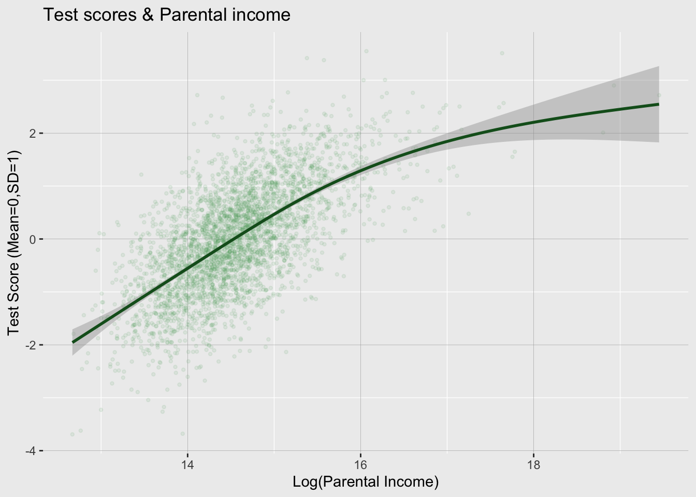{width=672}
:::
:::


#### 4.2.2 Graficos de barras y boxplot

Del grafico anteriro podemos observar que los resultados de los test se correlacionan con ingreso parental. Esto no es una sorpresa. Veamos si tambien el asistir a la escuea de verano se correlaciona con estas características individuales.

Primero, creamos un scatter plot de educación de los padres y test score en el año anterior a la escuela de verano. Usemos el mismo código de arriba pero en lugar de ingreso, usamos educación parental. Segundo, creemos un gráfico de barras que muestre que los resultados previos a la asistencia a la escuela de verano. Tercero, creamos un box plot de ingreso de los padres y si asistieron o no a la escula de verano.

Nuestro codigo ahora tiene estos elementos.

-   Creamos el objeto `ggplot()` y cargamos la data y el tema. Este objeto es llamado un *rawchart*
-   Creamos 3 gráficos basados en *rawchart*, cada uno lo guardamos con un nombre.
    -   Para el de barras, usamos `geom_bar()` y fijamos `stat="summary", fun="mean"` para decirle a R que cree un grafico de barras con la media de *test_score*\
    -   usamos `labs()` para decir los ejes y titulos.
    -   Usamos `geom_boxplot()` para crear el boxplot.
-   Usamos el paquete *patchwork* para combinar varios gráficos en uno.
-   usamos *ggsave()* para guardar el gráfico combinado como un archivo *png*


::: {.cell}

```{.r .cell-code}
# Load patchwork 
library("patchwork")
# Create raw chart element
rawchart<-ggplot(analysisdata%>%filter(year==4),x=as.factor(fill))+
          theme_classic()

# Create bar chart of pre summer school test score and summer school 
p1<-rawchart+
       geom_smooth(aes(x=parental_schooling,y=test_score)) +
       geom_point(aes(x=parental_schooling,y=test_score),alpha=0.1)+
       labs(x="Parental schooling", y="Test Score Year 5")

# Create bar chart of pre summer school test score and summer school 
p2<-rawchart+
       geom_bar(aes(x=as.factor(summerschool),y=test_score),
                    stat="summary",fun="mean")+
       labs(y="Test Score Year 5", x="Attended Summer School")

# Create bar chart of parental schooling and summer school attendance
p3<-rawchart+
              geom_boxplot(aes(x=as.factor(summerschool),y=parental_lincome))+
       labs(y="Parental Income (log)", x="Attended Summer School")

# Combine charts
p1/(p2+p3)
```

::: {.cell-output-display}
{width=672}
:::

```{.r .cell-code}
# Export chart
ggsave("fig1.png")
```
:::


Estos tres gráficos nos muestran que los puntajes en las pruebas se correlacionan con características de los padres (ambos scatters) y que aquellos que asistieron a la escuela de verano tenían mejores puntajes incluso antes de ir a la escuela de verano y que las caraterísticas de los padres se relaciona con la asistencia al éste 

Es decir, tenemos **SESGO DE SELECCIÓN**

#### 4.1.3 Histogramas y gráficos de densidad

Comaperemos la distribución de los puntajes depués de asistir a la escuela de verano por quienes fueron y los que no fueron. Creamos un histograma con una linea que muestre las densidades estimadas.


::: {.cell}

```{.r .cell-code}
# create a histogram and density chart
ggplot(filter(analysisdata,year==6),
       aes(x=test_score,fill=as.factor(summerschool)))+
       geom_histogram(aes(y=..density..),bins = 50,alpha=0.5,
                       position="identity",color="white")+
       geom_density(alpha=0.0,size=1,show.legend= FALSE)+
       theme_minimal()+
       labs(y="Densidad",x="Puntaje en prueba año 6 (estandarizado)",fill=" ")+
       scale_fill_brewer(palette="Set2",labels=c("No asistió","Asistío a la escuela de verano"))+
       theme(legend.position="top")
```

::: {.cell-output-display}
{width=672}
:::
:::


Claramente hay diferencias en sus resultados. Pero la estimación directa va a confundir cuanto de esto proviene del sesgo de selección y cuanto es el efecto real de ir a la escuela de verano.

#### 4.1.4 Correalograma

Muchas veces queremos saber que tán correlacionadas estan las variables en una muestra. Podríamos simplementa calular una tabla de correlaciones, pero el paquete \[PerformanceAnalytics\] tiene una función muy conveniente: `chart.Correlation()` que nos presenta un gráfico con las correlaciones de a pares, su significancia estadística, gráficos de dispersión y distribución.


::: {.cell}

```{.r .cell-code}
#Cargamos el paquete
library("PerformanceAnalytics")

correlations_graph <-  analysisdata %>%
            dplyr::filter(year==6) %>%
            ungroup() %>%
            dplyr::select(female, parental_schooling, parental_lincome, summerschool, letter )  #variables para el correalograma

chart.Correlation(correlations_graph, histogram=TRUE, pch=19)
```

::: {.cell-output-display}
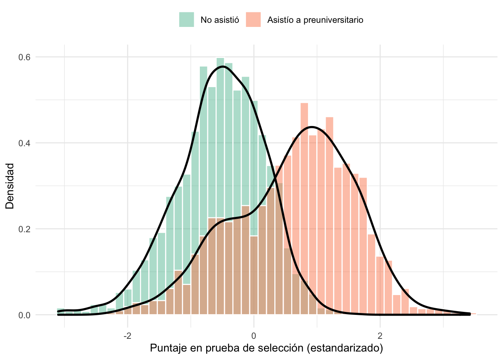{width=672}
:::
:::


# III. Estimación e identifiación

Tenemos nuestro problema base claro, ahora usemos algunas estrategias de identificaión para encontrar el efecto de asitir a una escuela de verano en esta muestra.

Para esto, partiremos del mejor caso: contamos con un experimento y luego iremos variando la información disponible y la estrategia que es factible emplear.

## 1. Regresión lineal ingenua

Nuestro objetivo es estimar la relación en los resultados académicos y asistira la escuela de verano. Para esto podríamos pensar en un modelo que directamente incluya a estos dos elementos.

$$ Resultado_i = \beta_0 + \beta_1 I(Summerschool=1)_i + u_i $$ 
El modelo estimado sería:


::: {.cell}

```{.r .cell-code}
ols <- lm ( test_score ~ summerschool, data= analysisdata )
ols
```

::: {.cell-output .cell-output-stdout}
```

Call:
lm(formula = test_score ~ summerschool, data = analysisdata)

Coefficients:
 (Intercept)  summerschool  
     -0.4273        0.9309  
```
:::
:::

::: {.cell}

```{.r .cell-code}
summary(ols)
```

::: {.cell-output .cell-output-stdout}
```

Call:
lm(formula = test_score ~ summerschool, data = analysisdata)

Residuals:
    Min      1Q  Median      3Q     Max 
-3.7025 -0.5296  0.0601  0.5993  3.2100 

Coefficients:
             Estimate Std. Error t value Pr(>|t|)    
(Intercept)  -0.42732    0.00680  -62.84   <2e-16 ***
summerschool  0.93095    0.01004   92.75   <2e-16 ***
---
Signif. codes:  0 '***' 0.001 '**' 0.01 '*' 0.05 '.' 0.1 ' ' 1

Residual standard error: 0.8858 on 31361 degrees of freedom
Multiple R-squared:  0.2153,	Adjusted R-squared:  0.2152 
F-statistic:  8603 on 1 and 31361 DF,  p-value: < 2.2e-16
```
:::
:::


Podemos hacer una mejor tabla usando el paquete *stargazer*


::: {.cell}

```{.r .cell-code}
library(stargazer)

stargazer::stargazer(ols, type = "text", out="tabla1.tex")
```

::: {.cell-output .cell-output-stdout}
```

================================================
                        Dependent variable:     
                    ----------------------------
                             test_score         
------------------------------------------------
summerschool                  0.931***          
                              (0.010)           
                                                
Constant                     -0.427***          
                              (0.007)           
                                                
------------------------------------------------
Observations                   31,363           
R2                             0.215            
Adjusted R2                    0.215            
Residual Std. Error      0.886 (df = 31361)     
F Statistic         8,603.086*** (df = 1; 31361)
================================================
Note:                *p<0.1; **p<0.05; ***p<0.01
```
:::
:::


Stargazer es util, pero esta siendo reemplazado por otros paquetes, particularmente [modelsummary](https://vincentarelbundock.github.io/modelsummary/index.html). Para una refrencia extra recomiendo revisar este [link](https://elbersb.de/public/pdf/web-7-regression-tables-graphs.pdf)


::: {.cell}

```{.r .cell-code}
# Podemos hacer un mapeo de nombres de variables


cm <- c( "test_score" = "Test Score",
         "summerschool" = "Escuela de verano" )
```
:::

::: {.cell}

```{.r .cell-code}
library(modelsummary)

modelsummary::modelsummary(ols, stars= TRUE, fmt=3, 
                           estimate = "{estimate} ({std.error}){stars}", statistic=NULL,  gof_omit = "AIC|BIC|Lik",
                             coef_map = cm)
```

::: {.cell-output-display}

`````{=html}
<table class="table" style="width: auto !important; margin-left: auto; margin-right: auto;">
 <thead>
  <tr>
   <th style="text-align:left;">   </th>
   <th style="text-align:center;"> Model 1 </th>
  </tr>
 </thead>
<tbody>
  <tr>
   <td style="text-align:left;box-shadow: 0px 1px"> Escuela de verano </td>
   <td style="text-align:center;box-shadow: 0px 1px"> 0.931 (0.010)*** </td>
  </tr>
  <tr>
   <td style="text-align:left;"> Num.Obs. </td>
   <td style="text-align:center;"> 31363 </td>
  </tr>
  <tr>
   <td style="text-align:left;"> R2 </td>
   <td style="text-align:center;"> 0.215 </td>
  </tr>
  <tr>
   <td style="text-align:left;"> R2 Adj. </td>
   <td style="text-align:center;"> 0.215 </td>
  </tr>
  <tr>
   <td style="text-align:left;"> F </td>
   <td style="text-align:center;"> 8603.086 </td>
  </tr>
  <tr>
   <td style="text-align:left;"> RMSE </td>
   <td style="text-align:center;"> 0.89 </td>
  </tr>
</tbody>
</table>

`````

:::
:::


También permite graficar:


::: {.cell}

```{.r .cell-code}
modelsummary::modelplot(ols, coef_omit = "intercept")
```

::: {.cell-output-display}
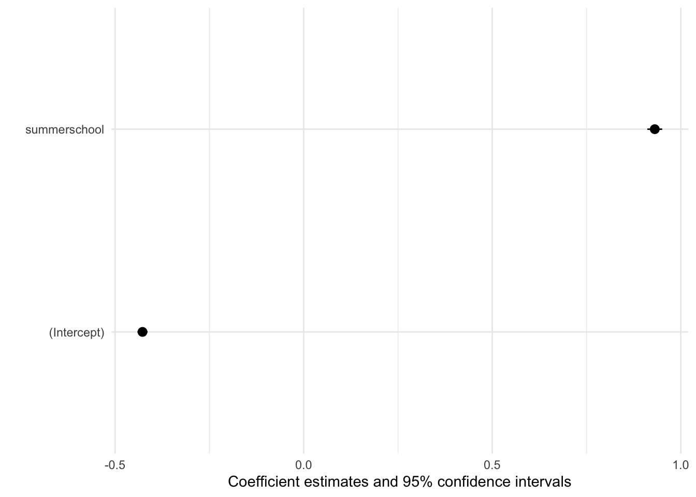{width=672}
:::
:::


No se ve muy bien para solo 1 modelo. Otra opcion es con el paquete parameters (<https://easystats.github.io/parameters/>)


::: {.cell}

```{.r .cell-code}
library(parameters)

m <- parameters::model_parameters(ols)
m
```

::: {.cell-output .cell-output-stdout}
```
Parameter    | Coefficient |       SE |         95% CI | t(31361) |      p
--------------------------------------------------------------------------
(Intercept)  |       -0.43 | 6.80e-03 | [-0.44, -0.41] |   -62.84 | < .001
summerschool |        0.93 |     0.01 | [ 0.91,  0.95] |    92.75 | < .001
```
:::
:::


Este modelo, como ya lo revisamos de la estadística descriptiva, podemos pensar que sufre de sesgo de selección. Es posible que los estudiantes con padres más involucrados, con más educación y mayor ingreso

Si solo fueran el problema la eduación de los padres y su ingreso, podríamos controlar por estos. Incluyámoslos al modelo en "cascada". Una manera de hacerlo es con varios modelos en una lista.


::: {.cell}

```{.r .cell-code}
#modelos

naive_ols_models <- list(
   " (1)" = lm( test_score ~ summerschool , data= analysisdata), 
    "(2)" = lm ( test_score ~ summerschool + parental_lincome, data= analysisdata ),
    "(3)" = lm ( test_score ~ summerschool + parental_schooling, data= analysisdata ),
    "(4)" = lm ( test_score ~ summerschool + parental_lincome + parental_schooling, data= analysisdata )      )

# Mapeo de nombre de variables

cm <- c( "test_score" = "Test Score",
         "summerschool" = "Summer school indicator",
         "parental_lincome" = "Parental Income (log)",
         "parental_schooling" = "Parental schooling" )
```
:::


Tabla con stargazer:


::: {.cell}

```{.r .cell-code}
library(stargazer)

stargazer::stargazer(naive_ols_models, type = "text", out="tabla1.tex")
```

::: {.cell-output .cell-output-stdout}
```

=========================================================================================================================================
                                                                     Dependent variable:                                                 
                    ---------------------------------------------------------------------------------------------------------------------
                                                                         test_score                                                      
                                (1)                           (2)                          (3)                           (4)             
-----------------------------------------------------------------------------------------------------------------------------------------
summerschool                  0.931***                     0.551***                      0.685***                     0.554***           
                              (0.010)                       (0.008)                      (0.009)                       (0.008)           
                                                                                                                                         
parental_lincome                                           0.824***                                                   0.889***           
                                                            (0.006)                                                    (0.010)           
                                                                                                                                         
parental_schooling                                                                       0.381***                     -0.051***          
                                                                                         (0.004)                       (0.006)           
                                                                                                                                         
Constant                     -0.427***                    -12.255***                    -4.626***                    -12.622***          
                              (0.007)                       (0.087)                      (0.047)                       (0.097)           
                                                                                                                                         
-----------------------------------------------------------------------------------------------------------------------------------------
Observations                   31,363                       31,363                        31,363                       31,363            
R2                             0.215                         0.506                        0.377                         0.507            
Adjusted R2                    0.215                         0.506                        0.377                         0.507            
Residual Std. Error      0.886 (df = 31361)           0.703 (df = 31360)            0.789 (df = 31360)           0.702 (df = 31359)      
F Statistic         8,603.086*** (df = 1; 31361) 16,082.240*** (df = 2; 31360) 9,495.218*** (df = 2; 31360) 10,769.820*** (df = 3; 31359)
=========================================================================================================================================
Note:                                                                                                         *p<0.1; **p<0.05; ***p<0.01
```
:::
:::


Tabla con modelsummary:


::: {.cell}

```{.r .cell-code}
modelsummary::modelsummary(naive_ols_models, stars= TRUE, fmt=3, 
                           estimate = "{estimate} ({std.error}){stars}", statistic=NULL,  gof_omit = "AIC|BIC|Lik",
                             coef_map = cm)
```

::: {.cell-output-display}

`````{=html}
<table class="table" style="width: auto !important; margin-left: auto; margin-right: auto;">
 <thead>
  <tr>
   <th style="text-align:left;">   </th>
   <th style="text-align:center;"> (1) </th>
   <th style="text-align:center;"> (2) </th>
   <th style="text-align:center;"> (3) </th>
   <th style="text-align:center;"> (4) </th>
  </tr>
 </thead>
<tbody>
  <tr>
   <td style="text-align:left;"> Summer school indicator </td>
   <td style="text-align:center;"> 0.931 (0.010)*** </td>
   <td style="text-align:center;"> 0.551 (0.008)*** </td>
   <td style="text-align:center;"> 0.685 (0.009)*** </td>
   <td style="text-align:center;"> 0.554 (0.008)*** </td>
  </tr>
  <tr>
   <td style="text-align:left;"> Parental Income (log) </td>
   <td style="text-align:center;">  </td>
   <td style="text-align:center;"> 0.824 (0.006)*** </td>
   <td style="text-align:center;">  </td>
   <td style="text-align:center;"> 0.889 (0.010)*** </td>
  </tr>
  <tr>
   <td style="text-align:left;box-shadow: 0px 1px"> Parental schooling </td>
   <td style="text-align:center;box-shadow: 0px 1px">  </td>
   <td style="text-align:center;box-shadow: 0px 1px">  </td>
   <td style="text-align:center;box-shadow: 0px 1px"> 0.381 (0.004)*** </td>
   <td style="text-align:center;box-shadow: 0px 1px"> −0.051 (0.006)*** </td>
  </tr>
  <tr>
   <td style="text-align:left;"> Num.Obs. </td>
   <td style="text-align:center;"> 31363 </td>
   <td style="text-align:center;"> 31363 </td>
   <td style="text-align:center;"> 31363 </td>
   <td style="text-align:center;"> 31363 </td>
  </tr>
  <tr>
   <td style="text-align:left;"> R2 </td>
   <td style="text-align:center;"> 0.215 </td>
   <td style="text-align:center;"> 0.506 </td>
   <td style="text-align:center;"> 0.377 </td>
   <td style="text-align:center;"> 0.507 </td>
  </tr>
  <tr>
   <td style="text-align:left;"> R2 Adj. </td>
   <td style="text-align:center;"> 0.215 </td>
   <td style="text-align:center;"> 0.506 </td>
   <td style="text-align:center;"> 0.377 </td>
   <td style="text-align:center;"> 0.507 </td>
  </tr>
  <tr>
   <td style="text-align:left;"> F </td>
   <td style="text-align:center;"> 8603.086 </td>
   <td style="text-align:center;"> 16082.240 </td>
   <td style="text-align:center;"> 9495.218 </td>
   <td style="text-align:center;"> 10769.815 </td>
  </tr>
  <tr>
   <td style="text-align:left;"> RMSE </td>
   <td style="text-align:center;"> 0.89 </td>
   <td style="text-align:center;"> 0.70 </td>
   <td style="text-align:center;"> 0.79 </td>
   <td style="text-align:center;"> 0.70 </td>
  </tr>
</tbody>
</table>

`````

:::
:::


Sin embargo, si creemos que lo que también correlacona es una inobservable como la preocupación / involucramiento de los padres aun preservan el problema de la autoselección, todavía tenemos presencia de sesgo por variables omitidad.

¿Qué hacer?

Vamos a revisra varias alternativas: 

- Experimental

    1. Método de diferencias (en datos experimentales)

    2. Logit y probit

 - Datos observacionales: 

    3. Variables Instrumentales

    4. Regresión Discontinua

    5. Diferencias en Diferencias

    6. Efectos fijos, aleatorios y modelos jerárquicos

    7. Matching

## 2. Método de diferencias (en datos experimentales)

Un primer caso, es que antes de asistir al curso de verano se selecciona al azar un grupo de estudiantes para enviarles una carta de invitación que recuerda sus características y detalla como participar.

¿Podría ser este un buen experimento?

-   Asignación aleatoria
-   Tratamiento: recibir la carta -\> no es directamente la escuela de verano. Nos permite ver el efecto causal de recibir la carta, pero no de asistir a la escuela de verano. Vamos a usar una técnica para enfrentar esto posteriormente.

Por ahora, supongamos que conocer el efecto de la carta en el puntaje es una pregunta lo suficientemente interesante.

$testscore_i=\beta_0+\beta_1Letter_i+u_i$.

Este tipo de modelos podemos estimarlos con el paquete *linear modelos* `lm()` o también, con `feols()` del paquete *fixtest*

### 2.1 Estimación OLS

#### 2.1.2 Usando lm()


::: {.cell}

```{.r .cell-code}
#modelos

ols_letter_experiment <- list(
   " (1)" = lm( test_score ~ letter , data= analysisdata)    )

# Mapeo de nombre de variables

cm <- c( "test_score" = "Test Score",
         "summerschool" = "Summer School",
         "parental_lincome" = "Parental Income (log)",
         "parental_schooling" = "Parental schooling" )
```
:::


Tabla con stargazer:


::: {.cell}

```{.r .cell-code}
library(stargazer)

stargazer::stargazer(ols_letter_experiment, type = "text", out=here::here("output/tabla2.tex"))
```

::: {.cell-output .cell-output-stdout}
```

===============================================
                        Dependent variable:    
                    ---------------------------
                            test_score         
-----------------------------------------------
letter                       0.136***          
                              (0.013)          
                                               
Constant                     -0.034***         
                              (0.006)          
                                               
-----------------------------------------------
Observations                  31,363           
R2                             0.003           
Adjusted R2                    0.003           
Residual Std. Error     0.998 (df = 31361)     
F Statistic         108.471*** (df = 1; 31361) 
===============================================
Note:               *p<0.1; **p<0.05; ***p<0.01
```
:::
:::


Podemos ver que los que recibieron la carta, tienen 0.13 más puntaje que los que no, manteniendo lo demás constante.

Si le creemos a la asignción aleatoria, entonces este efecto podría ser interpetado como casual.

Para saber si la signación aletaoria efectivamente separó a dos grupos comparables de tratados y controles lo que debemos hacer es probar el **balance en obbservables**. Esto quiere decir que al menos en las variables observables, efectivamente ambos grupos no son estadísticamente diferentes antes del tratamiento.

### 2.1 Balance en observables

#### 2.1 Comparación de a pares

Una primera opción es realizar una prueba t en las variables observables en ambos grupos, usamos el comando `t.tes()` . Por ejemplo podriamos comparar el ingreso de los padres con `parental_income~summerschool` para probar si la media de test_score es significantemente diferente en los dos grupos especificados por la asistencia al curso de veranp


::: {.cell}

```{.r .cell-code}
# Realizamos la prueba T
t.test(parental_lincome~summerschool,data=analysisdata)
```

::: {.cell-output .cell-output-stdout}
```

	Welch Two Sample t-test

data:  parental_lincome by summerschool
t = -60.203, df = 24016, p-value < 2.2e-16
alternative hypothesis: true difference in means between group 0 and group 1 is not equal to 0
95 percent confidence interval:
 -0.4765320 -0.4464809
sample estimates:
mean in group 0 mean in group 1 
       14.35102        14.81252 
```
:::
:::


Podemos notar que no hay diferencias significativas entre los grupos.

Esto tendríamos que realizarlo en todas las variables y se suele presentar en una **tabla de balance**

#### 2.3 Tabla de balance

Una tabla de balance presenta la diferencia de medias para grupos tratados y de control. Lo que deseamos es que no haya diferencias significativas antes del tratamiento en los grupos.

Podemos hacer una tabla que se vea bien usando `datasummary_balance()` del paquete *modelsummary*. Cargamos tambien el paquete *estimatr* porque le permite a `datasummary_balance()` calcular e inluir pruebas t de a pares directamente en la tabla.


::: {.cell}

```{.r .cell-code}
# Load libraries
library(modelsummary)
library(estimatr)
# Filter and modify data
testdata<-filter(analysisdata,year==5)
testdata<-ungroup(testdata)
testdata<-mutate(testdata,Treated=ifelse(letter==1,"Letter","No Letter"))
testdata<-select(testdata,female,parental_schooling,parental_lincome,test_score,Treated)
testdata<-rename(testdata,`Female`=female,
          `Parental schooling (years)`=parental_schooling,
          `Parental income (log)`=parental_lincome,
          `Test Score`=test_score)
     
# Table with balancing test
datasummary_balance(~Treated,
                    data = testdata,
                    title = "Balance of pre-treatment variables",
                    notes = "Notes: This is a brilliant table!",
                    fmt= '%.5f',
                    dinm_statistic = "p.value")
```

::: {.cell-output-display}

`````{=html}
<table style="NAborder-bottom: 0; width: auto !important; margin-left: auto; margin-right: auto;" class="table">
<caption>Balance of pre-treatment variables</caption>
 <thead>
<tr>
<th style="empty-cells: hide;border-bottom:hidden;" colspan="1"></th>
<th style="border-bottom:hidden;padding-bottom:0; padding-left:3px;padding-right:3px;text-align: center; " colspan="2"><div style="border-bottom: 1px solid #ddd; padding-bottom: 5px; ">Letter (N=861)</div></th>
<th style="border-bottom:hidden;padding-bottom:0; padding-left:3px;padding-right:3px;text-align: center; " colspan="2"><div style="border-bottom: 1px solid #ddd; padding-bottom: 5px; ">No Letter (N=2619)</div></th>
<th style="empty-cells: hide;border-bottom:hidden;" colspan="2"></th>
</tr>
  <tr>
   <th style="text-align:left;">   </th>
   <th style="text-align:right;"> Mean </th>
   <th style="text-align:right;"> Std. Dev. </th>
   <th style="text-align:right;"> Mean  </th>
   <th style="text-align:right;"> Std. Dev.  </th>
   <th style="text-align:right;"> Diff. in Means </th>
   <th style="text-align:right;"> p </th>
  </tr>
 </thead>
<tbody>
  <tr>
   <td style="text-align:left;"> Female </td>
   <td style="text-align:right;"> 0.52033 </td>
   <td style="text-align:right;"> 0.49988 </td>
   <td style="text-align:right;"> 0.51355 </td>
   <td style="text-align:right;"> 0.49991 </td>
   <td style="text-align:right;"> -0.00677 </td>
   <td style="text-align:right;"> 0.73032 </td>
  </tr>
  <tr>
   <td style="text-align:left;"> Parental schooling (years) </td>
   <td style="text-align:right;"> 11.31359 </td>
   <td style="text-align:right;"> 0.97129 </td>
   <td style="text-align:right;"> 11.32952 </td>
   <td style="text-align:right;"> 1.14573 </td>
   <td style="text-align:right;"> 0.01593 </td>
   <td style="text-align:right;"> 0.69028 </td>
  </tr>
  <tr>
   <td style="text-align:left;"> Parental income (log) </td>
   <td style="text-align:right;"> 14.56467 </td>
   <td style="text-align:right;"> 0.66201 </td>
   <td style="text-align:right;"> 14.56289 </td>
   <td style="text-align:right;"> 0.70338 </td>
   <td style="text-align:right;"> -0.00178 </td>
   <td style="text-align:right;"> 0.94629 </td>
  </tr>
  <tr>
   <td style="text-align:left;"> Test Score </td>
   <td style="text-align:right;"> -0.01950 </td>
   <td style="text-align:right;"> 0.99990 </td>
   <td style="text-align:right;"> 0.00641 </td>
   <td style="text-align:right;"> 1.00014 </td>
   <td style="text-align:right;"> 0.02591 </td>
   <td style="text-align:right;"> 0.50968 </td>
  </tr>
</tbody>
<tfoot><tr><td style="padding: 0; " colspan="100%">
<sup></sup> Notes: This is a brilliant table!</td></tr></tfoot>
</table>

`````

:::
:::


Los reslutados de la tabla sugieren que no hay diferencias significativas entre tratados y controles ANTES del tratamiento. ¡ Muy bien!

Y como antes, podríamos directaente agregar la opción `outpu=tab_balancing.docx` para exportarla en word (o latex). (no olvidar especificar la carperta con `here::here("output/`)

#### 2.4 Aproximación gráfica

Podemos ver el efecto causal propuesto en la siguiente gráfica. En los años antes del tratamiento son iguales y en los años posteriores, las distribuciones se empiezan a separar.


::: {.cell}

```{.r .cell-code}
# Load ggridges
library("ggridges")

# create a ggridges  chart
ggplot(analysisdata,aes(y=as.factor(year),x=test_score,fill=as.factor(letter) ))+
        geom_density_ridges(  alpha = .7, scale=1.5,color = "white", from = -2.5, to = 2.5)+
        theme_minimal()+
        theme_ridges(grid = FALSE)+
  scale_y_discrete(expand = c(0, 0)) +
  scale_x_continuous(expand = c(0, 0)) +
        scale_fill_brewer(palette="Set1",labels=c("No letter","Letter"))+
        labs(x="Test Score",y="Year",fill=" ",
            title="Test score distribution by reminder letter status  & year")+
        theme(legend.position="top",aspect.ratio=4/3,plot.title = element_text(hjust = 0.5))
```

::: {.cell-output-display}
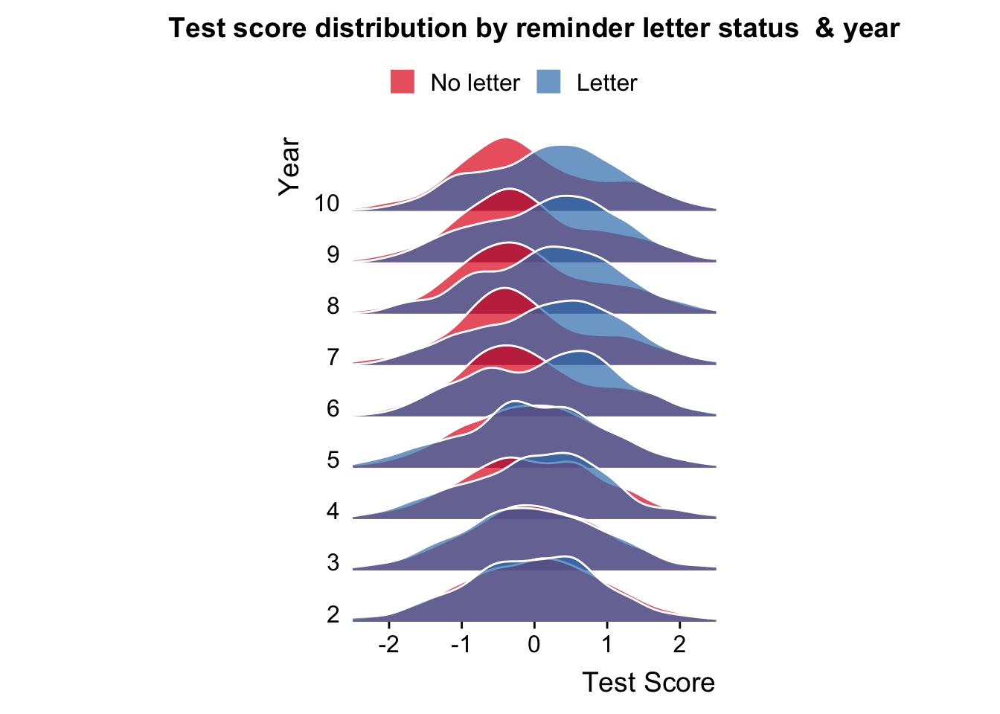{width=672}
:::
:::


## 3. Efectos fijos, aleatorios y modelos jerárquicos

Muchas veces, los datos estan agrupados en diferentes categorías o dimensiones.

En nuestro caso los estudiantes están agrupados en colegios y es esperable que dentro de un colegio los resultados de dichos estudiantes estén correlacionados. Esto también ocurre al tener datos temporales o cualquier forma de agrupación lógica de la información.

Podemos ignorar esta estructura en los datos y simplemente considerarlos como un conjunto de unidades comparables, es decir tratarlo como un **pooled cross-section**. Si las diferencias entre grupos no son sistemáticas, no deberíamos observar diferencias, sin embargo esto puede estar haciendo que caigamos en problemas como la *paradoja de Simpson* o el *Mathew effect*

Para profundizar recomiendo: https://ds4ps.org/pe4ps-textbook/docs/p-040-fixed-effects.html o el capítulo del libro

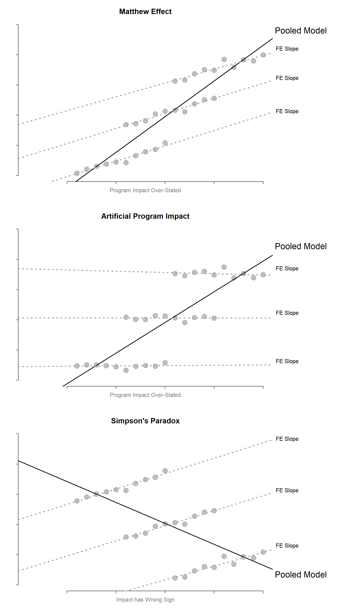

En nuestro caso, tenemos por ejemplo 30 colegios en los datos. 

Otro punto es considerar que no solo el efecto está modulado por la organziación de agrupación de la data, sino también los errores. Esto lo llamamos clusterizar.

#### 3.1.2 Estimación usando lm()

Si cada grupo está afectando los resultados, calculemos el efecto el un OLS solo del año 5, un pooled en los años hasta el 5 y en este ultimo, incluyamos un efecto fijo por colegio  y luego por año.


::: {.cell}

```{.r .cell-code}
# No siempre necesitamos hacer una lista de
OLS_year5_data <-filter(analysisdata,year==5)

OLS_year5 = lm( test_score ~ letter , data= OLS_year5_data )


# Para el pooled, usemos todos los años antes del 5

POLS_data <-filter(analysisdata,year<=5)

Pooled_OLS = lm (  test_score ~ letter , data= POLS_data )

# Fixed effect por colegio

FE = lm (  test_score ~ letter + factor(school_id), data= POLS_data )

# Usemos stargazer para la tabla esta vez

stargazer( OLS_year5, Pooled_OLS, FE,
           type = "text", 
           dep.var.labels = ("Test score"),
           column.labels = c("Cross-Sectional OLS (year 5)", "Pooled OLS", "School FE"),
          covariate.labels = c("Intercept", "letter"),
           keep =c("Intercept", "letter"),
           omit.stat = "all", 
           digits = 2, intercept.bottom = FALSE )
```

::: {.cell-output .cell-output-stdout}
```

===========================================================
                         Dependent variable:               
          -------------------------------------------------
                             Test score                    
          Cross-Sectional OLS (year 5) Pooled OLS School FE
                      (1)                 (2)        (3)   
-----------------------------------------------------------
Intercept            -0.03               -0.01      -0.02  
                     (0.04)              (0.02)    (0.02)  
                                                           
===========================================================
===========================================================
Note:                           *p<0.1; **p<0.05; ***p<0.01
```
:::
:::


#### 3.1.2 Estimación usando feols()

En el caso de que deseemos hacer un modelamiento más complejo, como opr ejemplo incluir efectos fijos (lo revisaremos al final de la sesión) o calcular los errores estándar en cluster podemos usar la función `feols()` del paquete *fixest*.

El paquete *fixest* permite la inclusión de múltiples efectos fijos y clusterización de errores es, nosotros usaremos la función `feols()`

Esta función espera una fórmula de especificación de la forma:

`y~x1+x2+..|fixed effects|IV specification,cluster=..`

Por ejemplo, en ese caso queremos clusterizar los errores a nivel de colegio:


::: {.cell}

```{.r .cell-code}
# Load packages
library(fixest)

# Select data
regdata<-filter(analysisdata,year==6)

# Regression
m1<-feols(test_score~letter+parental_lincome+female+parental_schooling, cluster="school_id",data=regdata)

# Summary of regression
summary(m1)
```

::: {.cell-output .cell-output-stdout}
```
OLS estimation, Dep. Var.: test_score
Observations: 3,481 
Standard-errors: Clustered (school_id) 
                     Estimate Std. Error    t value   Pr(>|t|)    
(Intercept)        -14.571682   0.331506 -43.955950  < 2.2e-16 ***
letter               0.206422   0.026758   7.714325 1.6593e-08 ***
parental_lincome     1.019714   0.035335  28.858689  < 2.2e-16 ***
female              -0.014779   0.020544  -0.719393 4.7766e-01    
parental_schooling  -0.028398   0.022283  -1.274430 2.1263e-01    
---
Signif. codes:  0 '***' 0.001 '**' 0.01 '*' 0.05 '.' 0.1 ' ' 1
RMSE: 0.725145   Adj. R2: 0.473408
```
:::
:::


Quisieramos compararlo con el modelo sin dicha clusterización, podriamos hacer una mejor tabla. Aprovechamos la función `modelsummary()` y:

1.  Corremos ambas regresiones y guardamos los modelos en una lista. La primera es sin ajustar los errores, la segunda con cluster, la tercera con un efecto fijo por colegio.

2.  Usamos `modelsummary()`para el output de las regresiones.

3.  Especificamos que entre paréntesis esté el error estándar y que omita la constante en la tabla.

4.  Definimos el formato de los números con `fmt=...`


::: {.cell}

```{.r .cell-code}
# Load flextable and modelsummary
library(modelsummary)
# Select data

regdata<-filter(analysisdata,year==6)

# Regressions
models<-list(
  m1<-lm(test_score~letter+parental_lincome+female+parental_schooling ,data=regdata),
  m2<-feols(test_score~letter+parental_lincome+female+parental_schooling, cluster="school_id",data=regdata),
  m3<-feols(test_score~letter+parental_lincome+female+parental_schooling|school_id, cluster="school_id",data=regdata)
  )

# Generate table
modelsummary(models, stars = TRUE, statistic = 'std.error',
             fmt= '%.4f',
              coef_omit= '(Intercept)')
```

::: {.cell-output-display}

`````{=html}
<table style="NAborder-bottom: 0; width: auto !important; margin-left: auto; margin-right: auto;" class="table">
 <thead>
  <tr>
   <th style="text-align:left;">   </th>
   <th style="text-align:center;"> Model 1 </th>
   <th style="text-align:center;"> Model 2 </th>
   <th style="text-align:center;"> Model 3 </th>
  </tr>
 </thead>
<tbody>
  <tr>
   <td style="text-align:left;"> letter </td>
   <td style="text-align:center;"> 0.2064*** </td>
   <td style="text-align:center;"> 0.2064*** </td>
   <td style="text-align:center;"> 0.2110*** </td>
  </tr>
  <tr>
   <td style="text-align:left;">  </td>
   <td style="text-align:center;"> (0.0285) </td>
   <td style="text-align:center;"> (0.0268) </td>
   <td style="text-align:center;"> (0.0276) </td>
  </tr>
  <tr>
   <td style="text-align:left;"> parental_lincome </td>
   <td style="text-align:center;"> 1.0197*** </td>
   <td style="text-align:center;"> 1.0197*** </td>
   <td style="text-align:center;"> 1.0222*** </td>
  </tr>
  <tr>
   <td style="text-align:left;">  </td>
   <td style="text-align:center;"> (0.0299) </td>
   <td style="text-align:center;"> (0.0353) </td>
   <td style="text-align:center;"> (0.0363) </td>
  </tr>
  <tr>
   <td style="text-align:left;"> female </td>
   <td style="text-align:center;"> −0.0148 </td>
   <td style="text-align:center;"> −0.0148 </td>
   <td style="text-align:center;"> −0.0100 </td>
  </tr>
  <tr>
   <td style="text-align:left;">  </td>
   <td style="text-align:center;"> (0.0246) </td>
   <td style="text-align:center;"> (0.0205) </td>
   <td style="text-align:center;"> (0.0200) </td>
  </tr>
  <tr>
   <td style="text-align:left;"> parental_schooling </td>
   <td style="text-align:center;"> −0.0284 </td>
   <td style="text-align:center;"> −0.0284 </td>
   <td style="text-align:center;"> −0.0310 </td>
  </tr>
  <tr>
   <td style="text-align:left;box-shadow: 0px 1px">  </td>
   <td style="text-align:center;box-shadow: 0px 1px"> (0.0187) </td>
   <td style="text-align:center;box-shadow: 0px 1px"> (0.0223) </td>
   <td style="text-align:center;box-shadow: 0px 1px"> (0.0227) </td>
  </tr>
  <tr>
   <td style="text-align:left;"> Num.Obs. </td>
   <td style="text-align:center;"> 3481 </td>
   <td style="text-align:center;"> 3481 </td>
   <td style="text-align:center;"> 3481 </td>
  </tr>
  <tr>
   <td style="text-align:left;"> R2 </td>
   <td style="text-align:center;"> 0.474 </td>
   <td style="text-align:center;"> 0.474 </td>
   <td style="text-align:center;"> 0.480 </td>
  </tr>
  <tr>
   <td style="text-align:left;"> R2 Adj. </td>
   <td style="text-align:center;"> 0.473 </td>
   <td style="text-align:center;"> 0.473 </td>
   <td style="text-align:center;"> 0.475 </td>
  </tr>
  <tr>
   <td style="text-align:left;"> R2 Within </td>
   <td style="text-align:center;">  </td>
   <td style="text-align:center;">  </td>
   <td style="text-align:center;"> 0.473 </td>
  </tr>
  <tr>
   <td style="text-align:left;"> R2 Pseudo </td>
   <td style="text-align:center;">  </td>
   <td style="text-align:center;">  </td>
   <td style="text-align:center;">  </td>
  </tr>
  <tr>
   <td style="text-align:left;"> AIC </td>
   <td style="text-align:center;"> 7653.2 </td>
   <td style="text-align:center;"> 7651.2 </td>
   <td style="text-align:center;"> 7669.0 </td>
  </tr>
  <tr>
   <td style="text-align:left;"> BIC </td>
   <td style="text-align:center;"> 7690.1 </td>
   <td style="text-align:center;"> 7682.0 </td>
   <td style="text-align:center;"> 7878.3 </td>
  </tr>
  <tr>
   <td style="text-align:left;"> Log.Lik. </td>
   <td style="text-align:center;"> −3820.589 </td>
   <td style="text-align:center;"> −3820.589 </td>
   <td style="text-align:center;"> −3800.520 </td>
  </tr>
  <tr>
   <td style="text-align:left;"> F </td>
   <td style="text-align:center;"> 783.133 </td>
   <td style="text-align:center;">  </td>
   <td style="text-align:center;">  </td>
  </tr>
  <tr>
   <td style="text-align:left;"> RMSE </td>
   <td style="text-align:center;"> 0.73 </td>
   <td style="text-align:center;">  </td>
   <td style="text-align:center;">  </td>
  </tr>
  <tr>
   <td style="text-align:left;"> Std.Errors </td>
   <td style="text-align:center;">  </td>
   <td style="text-align:center;"> by: school_id </td>
   <td style="text-align:center;"> by: school_id </td>
  </tr>
  <tr>
   <td style="text-align:left;"> FE: school_id </td>
   <td style="text-align:center;">  </td>
   <td style="text-align:center;">  </td>
   <td style="text-align:center;"> X </td>
  </tr>
</tbody>
<tfoot><tr><td style="padding: 0; " colspan="100%">
<sup></sup> + p &lt; 0.1, * p &lt; 0.05, ** p &lt; 0.01, *** p &lt; 0.001</td></tr></tfoot>
</table>

`````

:::
:::


Podemos obsercar que no cambian los estimadores entre el modelo 1 y 2, pero si el error. Podemos ver que en el modelo 3 también cambia el estimador.

#### 3.1.3 Elementos clave de los efectos fijos:

Los elementos centrales de efectos fijos son:

- Usar efectos fijos nos permite controlar por todas las características invariantes en la unidad de analisis.

- Asumimos que algunas de las características de la entidad que estamos estudiando afectan nuestra prediccion y necesitamos controlar por estas.  Notar que efectos fijos nos permite entonces, capturar todas las caracteristicas que no varian en el tiempo en dicha entidad reduciendo indirectamente el sesgo de variables omitidas.

- Importante saber que no podemos estudiar el efecto de estas caracter+pisticas que no varian en el tiempo usando efectos fijos. Por ejemplo, no podríamos estudiar ni el impacto del sexo, ni de la educación de los padres en este ejemplo. Como dichas variables no cambian en el tiempo, la constante que agregamos en el efecto fijo absorve dicho efecto tambien, pues son perefectaente colineares.

-  Por esto, es importante tener en cuenta que los efectos fijos estan diseñados para estudiar características  que cambian en el tiempo para una entidad.

_ finalmente. efectos fijos tambien asume que cada entidad es única, tal que el error de dicha entidad es constante y no se correlaciona con el error de otra entidad. Es decir, asume independencia entre entidades. 

### 3.2 Random vs fixed effects

CUn supuesto subyacente de la implementación de efectos fijos es que no hay correlación entre los errores de las entidades de agrucación y las constantes, es decir, que cada colegio es indepediente del otro (en nuestro caso).

Este supuesto se puede testear estadísticamente mediante un modelo aletrnativo que, si bien calcula agrupando los datos permite que los efectos sean aleatorios, es decir calculamos asumiendo que las diferencias entre las entidades afectan a la variable dependiente y que hau correlación entre el error de las entidades y sus constantes. Podemos usar la función `plm()` del paquete plm especificando model="random".

Necesitamos que el panel esté bien conformado para poder aplicar este paquete, es decir tener una observación por unidad dimensionada y variables que cambien intra y entre grupos.


::: {.cell}

```{.r .cell-code}
#regdata <- analysisdata %>%
#            group_by(school_id, year)%>%
#            dplyr::summarize( test_score = mean(test_score), summerschool= mean(letter), female= mean(female), suma=n() ) %>%
#            ungroup()

#head(regdata)
```
:::

::: {.cell}

```{.r .cell-code}
# cargamos la librería
#library(plm)

# Para especificar un modelo correctaente, necesitamos variables entre e intra entidades. EN este caso, agruparemos la data por colegio y año.

#regdata <- analysisdata %>%
#           group_by(school_id, year) %>%
#           summary( test_score = mean(test_score), summerschool=test_score ) %>%
#           ungroup()


#Fixed effects
#fixed <- plm( test_score ~ summerschool, data=regdata, index=c("school_id", "year"), model="within" )

#Random effects
#random <- plm( test_score ~ summerschool, data=regdata, index=c("school_id", "year"), model="random" )
```
:::


Podemos comparar ambos modelos mediante la prueba de Hausman para decidir que modelo es mejor. Generalmente se prefiere efecto fijo ya que es más eficiente, si ambos están correctos.

Algunos otros elementos a tener en cuenta:
- Los efectos aleatorios permiten icnluir elementos que son invariables en el tiempo dado que asume que el error de la entidad no está correlacionado con el predictor.
- Los efectos aleatorios están influenciados por sesgo de variable omitida, ya que no estamos incluyendo directamente las dummies.


## 3. Logit y probit {#logit-y-probit}

Un segundo elemento es revisar que ocurre con probabilidad de entrar al preuniversitario dado que se recibió la carta.

En este caso, el modelo a estimar tendría como outcome de interés a una variable dicotómica.

$$ summerschool_i = g(letter_i)+u_i $$

### 3.1 Probabilidad lineal

Una primera aproximación sería sencillamente estimar un modelo lineal:

$$ summerschool_i = \beta_0+ \beta_1 letter_i + \gamma' X_i+u_i $$ Ya sabemos como hacerlo, simplemente usamos lm() o felm(). Aprovechemos esta oportunidad para agregar una fila con la media de la variable dependiente, este es genralemnte un elemento importante a incluir cuando estamos rabajando con variables dicotómicas ya que pone en contexto el análisis. Esto lo hacemos con el parámetro `add_rows=...`


::: {.cell}

```{.r .cell-code}
# Estimate LPM

models<-list(
  m1<-feols(summerschool ~letter, cluster="school_id",data=regdata),
  m2<-feols(summerschool ~letter+parental_schooling+parental_lincome+female,cluster="school_id",data=regdata)
  )

# Store the mean of dependent variable in a data frame
added_stats<-tibble("Mean of Dep. ",m1=mean(regdata$summerschool),m2=mean(regdata$summerschool))

# Generate table
modelsummary(models, stars = TRUE,statistic = 'std.error',  
             fmt= '%.4f',add_rows = added_stats,
              coef_omit= '(Intercept)', output = 'flextable')
```

::: {.cell-output-display}

```{=html}
<div class="tabwid"><style>.cl-f28adb92{}.cl-f287f4a4{font-family:'Helvetica';font-size:11pt;font-weight:normal;font-style:normal;text-decoration:none;color:rgba(0, 0, 0, 1.00);background-color:transparent;}.cl-f28801ec{margin:0;text-align:left;border-bottom: 0 solid rgba(0, 0, 0, 1.00);border-top: 0 solid rgba(0, 0, 0, 1.00);border-left: 0 solid rgba(0, 0, 0, 1.00);border-right: 0 solid rgba(0, 0, 0, 1.00);padding-bottom:5pt;padding-top:5pt;padding-left:5pt;padding-right:5pt;line-height: 1;background-color:transparent;}.cl-f2881fa6{width:54pt;background-color:transparent;vertical-align: middle;border-bottom: 0 solid rgba(0, 0, 0, 1.00);border-top: 0 solid rgba(0, 0, 0, 1.00);border-left: 0 solid rgba(0, 0, 0, 1.00);border-right: 0 solid rgba(0, 0, 0, 1.00);margin-bottom:0;margin-top:0;margin-left:0;margin-right:0;}.cl-f2881fa7{width:54pt;background-color:transparent;vertical-align: middle;border-bottom: 2pt solid rgba(102, 102, 102, 1.00);border-top: 0 solid rgba(0, 0, 0, 1.00);border-left: 0 solid rgba(0, 0, 0, 1.00);border-right: 0 solid rgba(0, 0, 0, 1.00);margin-bottom:0;margin-top:0;margin-left:0;margin-right:0;}.cl-f2881fb0{width:54pt;background-color:transparent;vertical-align: middle;border-bottom: 0 solid rgba(0, 0, 0, 1.00);border-top: 1pt solid rgba(0, 0, 0, 1.00);border-left: 0 solid rgba(0, 0, 0, 1.00);border-right: 0 solid rgba(0, 0, 0, 1.00);margin-bottom:0;margin-top:0;margin-left:0;margin-right:0;}.cl-f2881fb1{width:54pt;background-color:transparent;vertical-align: middle;border-bottom: 0 solid rgba(255, 255, 255, 0.00);border-top: 0 solid rgba(255, 255, 255, 0.00);border-left: 0 solid rgba(255, 255, 255, 0.00);border-right: 0 solid rgba(255, 255, 255, 0.00);margin-bottom:0;margin-top:0;margin-left:0;margin-right:0;}.cl-f2881fba{width:54pt;background-color:transparent;vertical-align: middle;border-bottom: 2pt solid rgba(102, 102, 102, 1.00);border-top: 2pt solid rgba(102, 102, 102, 1.00);border-left: 0 solid rgba(0, 0, 0, 1.00);border-right: 0 solid rgba(0, 0, 0, 1.00);margin-bottom:0;margin-top:0;margin-left:0;margin-right:0;}</style><table class='cl-f28adb92'>
```

```{=html}
<thead><tr style="overflow-wrap:break-word;"><td class="cl-f2881fba"><p class="cl-f28801ec"><span class="cl-f287f4a4"> </span></p></td><td class="cl-f2881fba"><p class="cl-f28801ec"><span class="cl-f287f4a4">Model 1</span></p></td><td class="cl-f2881fba"><p class="cl-f28801ec"><span class="cl-f287f4a4">Model 2</span></p></td></tr></thead><tbody><tr style="overflow-wrap:break-word;"><td class="cl-f2881fa6"><p class="cl-f28801ec"><span class="cl-f287f4a4">letter</span></p></td><td class="cl-f2881fa6"><p class="cl-f28801ec"><span class="cl-f287f4a4">0.4451***</span></p></td><td class="cl-f2881fa6"><p class="cl-f28801ec"><span class="cl-f287f4a4">0.4457***</span></p></td></tr><tr style="overflow-wrap:break-word;"><td class="cl-f2881fa6"><p class="cl-f28801ec"><span class="cl-f287f4a4"></span></p></td><td class="cl-f2881fa6"><p class="cl-f28801ec"><span class="cl-f287f4a4">(0.0134)</span></p></td><td class="cl-f2881fa6"><p class="cl-f28801ec"><span class="cl-f287f4a4">(0.0134)</span></p></td></tr><tr style="overflow-wrap:break-word;"><td class="cl-f2881fa6"><p class="cl-f28801ec"><span class="cl-f287f4a4">parental_schooling</span></p></td><td class="cl-f2881fa6"><p class="cl-f28801ec"><span class="cl-f287f4a4"></span></p></td><td class="cl-f2881fa6"><p class="cl-f28801ec"><span class="cl-f287f4a4">0.0353**</span></p></td></tr><tr style="overflow-wrap:break-word;"><td class="cl-f2881fa6"><p class="cl-f28801ec"><span class="cl-f287f4a4"></span></p></td><td class="cl-f2881fa6"><p class="cl-f28801ec"><span class="cl-f287f4a4"></span></p></td><td class="cl-f2881fa6"><p class="cl-f28801ec"><span class="cl-f287f4a4">(0.0120)</span></p></td></tr><tr style="overflow-wrap:break-word;"><td class="cl-f2881fa6"><p class="cl-f28801ec"><span class="cl-f287f4a4">parental_lincome</span></p></td><td class="cl-f2881fa6"><p class="cl-f28801ec"><span class="cl-f287f4a4"></span></p></td><td class="cl-f2881fa6"><p class="cl-f28801ec"><span class="cl-f287f4a4">0.1925***</span></p></td></tr><tr style="overflow-wrap:break-word;"><td class="cl-f2881fa6"><p class="cl-f28801ec"><span class="cl-f287f4a4"></span></p></td><td class="cl-f2881fa6"><p class="cl-f28801ec"><span class="cl-f287f4a4"></span></p></td><td class="cl-f2881fa6"><p class="cl-f28801ec"><span class="cl-f287f4a4">(0.0228)</span></p></td></tr><tr style="overflow-wrap:break-word;"><td class="cl-f2881fa6"><p class="cl-f28801ec"><span class="cl-f287f4a4">female</span></p></td><td class="cl-f2881fa6"><p class="cl-f28801ec"><span class="cl-f287f4a4"></span></p></td><td class="cl-f2881fa6"><p class="cl-f28801ec"><span class="cl-f287f4a4">0.0086</span></p></td></tr><tr style="overflow-wrap:break-word;"><td class="cl-f2881fa6"><p class="cl-f28801ec"><span class="cl-f287f4a4"></span></p></td><td class="cl-f2881fa6"><p class="cl-f28801ec"><span class="cl-f287f4a4"></span></p></td><td class="cl-f2881fa6"><p class="cl-f28801ec"><span class="cl-f287f4a4">(0.0104)</span></p></td></tr><tr style="overflow-wrap:break-word;"><td class="cl-f2881fb0"><p class="cl-f28801ec"><span class="cl-f287f4a4">Num.Obs.</span></p></td><td class="cl-f2881fb0"><p class="cl-f28801ec"><span class="cl-f287f4a4">3481</span></p></td><td class="cl-f2881fb0"><p class="cl-f28801ec"><span class="cl-f287f4a4">3481</span></p></td></tr><tr style="overflow-wrap:break-word;"><td class="cl-f2881fa6"><p class="cl-f28801ec"><span class="cl-f287f4a4">R2</span></p></td><td class="cl-f2881fa6"><p class="cl-f28801ec"><span class="cl-f287f4a4">0.148</span></p></td><td class="cl-f2881fa6"><p class="cl-f28801ec"><span class="cl-f287f4a4">0.260</span></p></td></tr><tr style="overflow-wrap:break-word;"><td class="cl-f2881fa6"><p class="cl-f28801ec"><span class="cl-f287f4a4">R2 Adj.</span></p></td><td class="cl-f2881fa6"><p class="cl-f28801ec"><span class="cl-f287f4a4">0.148</span></p></td><td class="cl-f2881fa6"><p class="cl-f28801ec"><span class="cl-f287f4a4">0.260</span></p></td></tr><tr style="overflow-wrap:break-word;"><td class="cl-f2881fa6"><p class="cl-f28801ec"><span class="cl-f287f4a4">R2 Within</span></p></td><td class="cl-f2881fa6"><p class="cl-f28801ec"><span class="cl-f287f4a4"></span></p></td><td class="cl-f2881fa6"><p class="cl-f28801ec"><span class="cl-f287f4a4"></span></p></td></tr><tr style="overflow-wrap:break-word;"><td class="cl-f2881fa6"><p class="cl-f28801ec"><span class="cl-f287f4a4">R2 Pseudo</span></p></td><td class="cl-f2881fa6"><p class="cl-f28801ec"><span class="cl-f287f4a4"></span></p></td><td class="cl-f2881fa6"><p class="cl-f28801ec"><span class="cl-f287f4a4"></span></p></td></tr><tr style="overflow-wrap:break-word;"><td class="cl-f2881fa6"><p class="cl-f28801ec"><span class="cl-f287f4a4">AIC</span></p></td><td class="cl-f2881fa6"><p class="cl-f28801ec"><span class="cl-f287f4a4">4474.4</span></p></td><td class="cl-f2881fa6"><p class="cl-f28801ec"><span class="cl-f287f4a4">3989.4</span></p></td></tr><tr style="overflow-wrap:break-word;"><td class="cl-f2881fa6"><p class="cl-f28801ec"><span class="cl-f287f4a4">BIC</span></p></td><td class="cl-f2881fa6"><p class="cl-f28801ec"><span class="cl-f287f4a4">4486.7</span></p></td><td class="cl-f2881fa6"><p class="cl-f28801ec"><span class="cl-f287f4a4">4020.2</span></p></td></tr><tr style="overflow-wrap:break-word;"><td class="cl-f2881fa6"><p class="cl-f28801ec"><span class="cl-f287f4a4">Log.Lik.</span></p></td><td class="cl-f2881fa6"><p class="cl-f28801ec"><span class="cl-f287f4a4">-2235.192</span></p></td><td class="cl-f2881fa6"><p class="cl-f28801ec"><span class="cl-f287f4a4">-1989.700</span></p></td></tr><tr style="overflow-wrap:break-word;"><td class="cl-f2881fa6"><p class="cl-f28801ec"><span class="cl-f287f4a4">Std.Errors</span></p></td><td class="cl-f2881fa6"><p class="cl-f28801ec"><span class="cl-f287f4a4">by: school_id</span></p></td><td class="cl-f2881fa6"><p class="cl-f28801ec"><span class="cl-f287f4a4">by: school_id</span></p></td></tr><tr style="overflow-wrap:break-word;"><td class="cl-f2881fa7"><p class="cl-f28801ec"><span class="cl-f287f4a4">Mean of Dep. </span></p></td><td class="cl-f2881fa7"><p class="cl-f28801ec"><span class="cl-f287f4a4">0.4591</span></p></td><td class="cl-f2881fa7"><p class="cl-f28801ec"><span class="cl-f287f4a4">0.4591</span></p></td></tr></tbody><tfoot><tr style="overflow-wrap:break-word;"><td  colspan="3"class="cl-f2881fb1"><p class="cl-f28801ec"><span class="cl-f287f4a4">+ p &lt; 0.1, * p &lt; 0.05, ** p &lt; 0.01, *** p &lt; 0.001</span></p></td></tr></tfoot></table></div>
```

:::
:::


Podemos ver que recubir la carta aumenta la probabilidad de asistir a la escuela de verano en 44%, lo que es un incremento de casi un 100% considerando que la media de dicha variable era 0.46.

A pesar de su gran interpretabilidad, los modelos de probabilidad lineal tienen varios problemas: predicciones pueden salir del rango \[0,1\] y que son heterocedasticos por definición.

Una alternativa a este modelamiento es usar una forma funciónal que asegure que la predicciones estén en el rango \[0,1\] es con logit o probit.

### 3.2 Logit y probit

Para estimar logit usamos `glm()` para estimar modelos logit y probit. Espeificamos la función en `family=binomial(link="probit")` o `family=binomial(link="logit")`.

Estimemos con logit:


::: {.cell}

```{.r .cell-code}
#  Estimate a binary outcomes model using a logit
logit_results <- glm(summerschool ~letter, data = regdata, family = binomial(link="logit"))

# Print the results
summary(logit_results)
```

::: {.cell-output .cell-output-stdout}
```

Call:
glm(formula = summerschool ~ letter, family = binomial(link = "logit"), 
    data = regdata)

Deviance Residuals: 
    Min       1Q   Median       3Q      Max  
-1.7781  -0.9267  -0.9267   1.4508   1.4508  

Coefficients:
            Estimate Std. Error z value Pr(>|z|)    
(Intercept) -0.62298    0.04098  -15.20   <2e-16 ***
letter       1.97333    0.09377   21.04   <2e-16 ***
---
Signif. codes:  0 '***' 0.001 '**' 0.01 '*' 0.05 '.' 0.1 ' ' 1

(Dispersion parameter for binomial family taken to be 1)

    Null deviance: 4802.3  on 3480  degrees of freedom
Residual deviance: 4265.4  on 3479  degrees of freedom
AIC: 4269.4

Number of Fisher Scoring iterations: 4
```
:::
:::


El problema es que estos parámetros no son directamente interpretables porque son las pendientes en la función logistica. Para esto, calculamos los efectos marginales.

### 3.3 Efectos marginales

Usamos la librería margins para obtener los efectos marginales promedio. Simplemente usamos la función `margins()` en un objeto que tenga la estimación por probit o logit.


::: {.cell}

```{.r .cell-code}
# Load margins package
library("margins")

# Select data
regdata<-filter(analysisdata,year==6)

##  Estimate a binary outcomes model using a logit and probit
logit_results <- glm(summerschool ~letter+parental_lincome+female+parental_schooling, data = regdata, family = binomial(link="logit"))
probit_results <- glm(summerschool ~letter+parental_lincome+female+parental_schooling, data = regdata, family = binomial(link="probit"))

# Estimate linear probability model
lpm<-feols(summerschool ~letter+parental_schooling+parental_lincome+female, cluster="school_id",data=regdata)

#  Compute marginal effects
mfx_logit<- margins(logit_results)
mfx_probit<- margins(probit_results)

# Include in table
modelsummary(list("LPM"=lpm,"Logit"=mfx_logit,"Probit"=mfx_probit))
```

::: {.cell-output-display}

`````{=html}
<table class="table" style="width: auto !important; margin-left: auto; margin-right: auto;">
 <thead>
  <tr>
   <th style="text-align:left;">   </th>
   <th style="text-align:center;"> LPM </th>
   <th style="text-align:center;"> Logit </th>
   <th style="text-align:center;"> Probit </th>
  </tr>
 </thead>
<tbody>
  <tr>
   <td style="text-align:left;"> (Intercept) </td>
   <td style="text-align:center;"> −2.859 </td>
   <td style="text-align:center;">  </td>
   <td style="text-align:center;">  </td>
  </tr>
  <tr>
   <td style="text-align:left;">  </td>
   <td style="text-align:center;"> (0.237) </td>
   <td style="text-align:center;">  </td>
   <td style="text-align:center;">  </td>
  </tr>
  <tr>
   <td style="text-align:left;"> letter </td>
   <td style="text-align:center;"> 0.446 </td>
   <td style="text-align:center;"> 0.408 </td>
   <td style="text-align:center;"> 0.414 </td>
  </tr>
  <tr>
   <td style="text-align:left;">  </td>
   <td style="text-align:center;"> (0.013) </td>
   <td style="text-align:center;"> (0.013) </td>
   <td style="text-align:center;"> (0.013) </td>
  </tr>
  <tr>
   <td style="text-align:left;"> parental_schooling </td>
   <td style="text-align:center;"> 0.035 </td>
   <td style="text-align:center;"> 0.046 </td>
   <td style="text-align:center;"> 0.048 </td>
  </tr>
  <tr>
   <td style="text-align:left;">  </td>
   <td style="text-align:center;"> (0.012) </td>
   <td style="text-align:center;"> (0.012) </td>
   <td style="text-align:center;"> (0.012) </td>
  </tr>
  <tr>
   <td style="text-align:left;"> parental_lincome </td>
   <td style="text-align:center;"> 0.193 </td>
   <td style="text-align:center;"> 0.189 </td>
   <td style="text-align:center;"> 0.183 </td>
  </tr>
  <tr>
   <td style="text-align:left;">  </td>
   <td style="text-align:center;"> (0.023) </td>
   <td style="text-align:center;"> (0.017) </td>
   <td style="text-align:center;"> (0.017) </td>
  </tr>
  <tr>
   <td style="text-align:left;"> female </td>
   <td style="text-align:center;"> 0.009 </td>
   <td style="text-align:center;"> 0.009 </td>
   <td style="text-align:center;"> 0.009 </td>
  </tr>
  <tr>
   <td style="text-align:left;box-shadow: 0px 1px">  </td>
   <td style="text-align:center;box-shadow: 0px 1px"> (0.010) </td>
   <td style="text-align:center;box-shadow: 0px 1px"> (0.014) </td>
   <td style="text-align:center;box-shadow: 0px 1px"> (0.014) </td>
  </tr>
  <tr>
   <td style="text-align:left;"> Num.Obs. </td>
   <td style="text-align:center;"> 3481 </td>
   <td style="text-align:center;"> 3481 </td>
   <td style="text-align:center;"> 3481 </td>
  </tr>
  <tr>
   <td style="text-align:left;"> R2 </td>
   <td style="text-align:center;"> 0.260 </td>
   <td style="text-align:center;">  </td>
   <td style="text-align:center;">  </td>
  </tr>
  <tr>
   <td style="text-align:left;"> R2 Adj. </td>
   <td style="text-align:center;"> 0.260 </td>
   <td style="text-align:center;">  </td>
   <td style="text-align:center;">  </td>
  </tr>
  <tr>
   <td style="text-align:left;"> R2 Within </td>
   <td style="text-align:center;">  </td>
   <td style="text-align:center;">  </td>
   <td style="text-align:center;">  </td>
  </tr>
  <tr>
   <td style="text-align:left;"> R2 Pseudo </td>
   <td style="text-align:center;">  </td>
   <td style="text-align:center;">  </td>
   <td style="text-align:center;">  </td>
  </tr>
  <tr>
   <td style="text-align:left;"> AIC </td>
   <td style="text-align:center;"> 3989.4 </td>
   <td style="text-align:center;"> 3778.4 </td>
   <td style="text-align:center;"> 3785.3 </td>
  </tr>
  <tr>
   <td style="text-align:left;"> BIC </td>
   <td style="text-align:center;"> 4020.2 </td>
   <td style="text-align:center;"> 3809.2 </td>
   <td style="text-align:center;"> 3816.0 </td>
  </tr>
  <tr>
   <td style="text-align:left;"> Log.Lik. </td>
   <td style="text-align:center;"> −1989.700 </td>
   <td style="text-align:center;"> −1884.212 </td>
   <td style="text-align:center;"> −1887.635 </td>
  </tr>
  <tr>
   <td style="text-align:left;"> Std.Errors </td>
   <td style="text-align:center;"> by: school_id </td>
   <td style="text-align:center;">  </td>
   <td style="text-align:center;">  </td>
  </tr>
</tbody>
</table>

`````

:::
:::


Acá podemos ver una tabla con los tres modelos y compararlos.

## 4. Variables Instrumentales

Volviendo a nuestra pregunta de investigación inicial queríamos conocer elefecto de asistir a la escuela de verano en los puntajes, no de la carta.

Sin embargo, sabemos que la carta se asignó aleatoriamente y que afecta a la probabilidad de asitir a la escuela de verano. En otras palabras: **podemos usar la carta como instrumento**

Es más, podríamos no realizar ninguna estimación y recurrir a lo ya obtenido:

-   Sabemos que el estimador de la forma reducida: $$ testscore_i = \beta_0 + \beta_1 letter_i + u_i $$ es 0.2 SD.}
-   En el punto anterior calculamos la primera etapa: $$ summerschool_o = \alpha_0 + \alpha_1 letter_i + \mu_i$$ que corresponde aproximadamente a 0.4.

Entonces, el **Estimador de Wald** de variables instrumentales es: IV=0.2/0.4 =0.5

Podríamos obtener este estimador directamente ahora desde los datos. Vamos a revisar dos métodos.

### 4.2 IV usando ivreg()

Primero usemos la función del paquete AER (Applied Economics with R). La sintaxis es: - `ivreg(outcome equation| exogenous variables, data)`


::: {.cell}

```{.r .cell-code}
# Load the AER package
library(AER)

# Select data
regdata<-filter(analysisdata,year==6)

# Estimate IV specification with
summary(ivreg(test_score~summerschool+female+parental_lincome+parental_schooling|
                         female+parental_lincome+parental_schooling+letter,data=regdata))
```

::: {.cell-output .cell-output-stdout}
```

Call:
ivreg(formula = test_score ~ summerschool + female + parental_lincome + 
    parental_schooling | female + parental_lincome + parental_schooling + 
    letter, data = regdata)

Residuals:
      Min        1Q    Median        3Q       Max 
-2.334605 -0.443619  0.007695  0.435387  2.560634 

Coefficients:
                    Estimate Std. Error t value Pr(>|t|)    
(Intercept)        -13.24728    0.30615 -43.271  < 2e-16 ***
summerschool         0.46319    0.05723   8.093 7.96e-16 ***
female              -0.01878    0.02203  -0.853    0.394    
parental_lincome     0.93053    0.02898  32.107  < 2e-16 ***
parental_schooling  -0.04476    0.01687  -2.654    0.008 ** 
---
Signif. codes:  0 '***' 0.001 '**' 0.01 '*' 0.05 '.' 0.1 ' ' 1

Residual standard error: 0.649 on 3476 degrees of freedom
Multiple R-Squared: 0.5793,	Adjusted R-squared: 0.5788 
Wald test: 979.1 on 4 and 3476 DF,  p-value: < 2.2e-16 
```
:::
:::


Observamos que el estimador es cercano a 0.5.

### 4.2 IV usando feols()

Podemos usar nuevamente `feols()` e incluir variables instrumentales. Además `felm()` también permite estimar especificaciones. En este caso no incluirmos efecto fijo, así que le poneos 0.


::: {.cell}

```{.r .cell-code}
# Estimate IV specification with felm 
m1<-feols(test_score~parental_lincome+female+parental_schooling| # Outcome eq.
           0|                                                    # Fixed effects
           summerschool~letter                                   # First stage
           ,cluster="school_id"                                  # Cluster var
            ,data=regdata)
# Summary of results
summary(m1)
```

::: {.cell-output .cell-output-stdout}
```
TSLS estimation, Dep. Var.: test_score, Endo.: summerschool, Instr.: letter
Second stage: Dep. Var.: test_score
Observations: 3,481 
Standard-errors: Clustered (school_id) 
                     Estimate Std. Error    t value   Pr(>|t|)    
(Intercept)        -13.247279   0.326357 -40.591334  < 2.2e-16 ***
fit_summerschool     0.463188   0.058299   7.945045 9.2096e-09 ***
parental_lincome     0.930534   0.030648  30.362006  < 2.2e-16 ***
female              -0.018783   0.018942  -0.991616 3.2959e-01    
parental_schooling  -0.044757   0.019024  -2.352669 2.5636e-02 *  
---
Signif. codes:  0 '***' 0.001 '**' 0.01 '*' 0.05 '.' 0.1 ' ' 1
RMSE: 0.648514   Adj. R2: 0.578825
F-test (1st stage), summerschool: stat = 699.1, p < 2.2e-16 , on 1 and 3,476 DoF.
                      Wu-Hausman: stat =  40.7, p = 1.96e-10, on 1 and 3,475 DoF.
```
:::
:::


Los coeficientes son iguales que antes, pero los errores estándar cambiaron ya que los clusterizamos al nivel del colegio. Notemos que `feols()` nos indica que el F-stat del isntrumento excluido es 687 (cumpliendo la condición de relevancia del isntrumento).

### 4.3 Tabla de reporte IV

Terminemos la sección de IV con una tabla que muestre la correlación pira entre la asistencia a la escuela de verano y puntajes (ingenuo), la forma reducida, la primera etapa y la estimación de variable instrumental

Notemos que usaremos `coef_map= c( )` para renombrar las variables en la tabla, espeficicar los coeficientes a incluiry permitir que dos coeficientes con diferente nombre aparezcan en la misma fila (summerschool y fit_summerschool)


::: {.cell}

```{.r .cell-code}
# Estimate OLS
OLS<-feols(test_score~summerschool+parental_lincome+female+parental_schooling,cluster="school_id",data=regdata)
# Estimate reduced form 
RF<-feols(test_score~letter+parental_lincome+female+parental_schooling,cluster="school_id",data=regdata)
# Estimate first stage 
FS<-feols(summerschool~letter+parental_lincome+female+parental_schooling,cluster="school_id",data=regdata)
# Estimate IV specification 
IV<-feols(test_score~parental_lincome+female+parental_schooling| # Outcome eq.
           0|                                                    # Fixed effects
           summerschool~letter                                   # First stage
           ,cluster="school_id"                                  # Cluster var
            ,data=regdata)
# Combine results
IVresults<-list("OLS"=OLS,"RF"=RF,"FS"=FS,"IV"=IV)
# Coefficients
cm <- c('fit_summerschool' = 'Summer School',
        'summerschool' = 'Summer School','parental_lincome' = 'Parental Income', 
        'letter' = 'Reminder letter', "female"="Female","parental_schooling"="Parental Schooling")
# Output Table
modelsummary(IVresults, stars = TRUE,statistic = 'std.error',  
             fmt= '%.4f',coef_map=cm, output =      )
```

::: {.cell-output-display}

`````{=html}
<table style="NAborder-bottom: 0; width: auto !important; margin-left: auto; margin-right: auto;" class="table">
 <thead>
  <tr>
   <th style="text-align:left;">   </th>
   <th style="text-align:center;"> OLS </th>
   <th style="text-align:center;"> RF </th>
   <th style="text-align:center;"> FS </th>
   <th style="text-align:center;"> IV </th>
  </tr>
 </thead>
<tbody>
  <tr>
   <td style="text-align:left;"> Summer School </td>
   <td style="text-align:center;"> 0.7855*** </td>
   <td style="text-align:center;">  </td>
   <td style="text-align:center;">  </td>
   <td style="text-align:center;"> 0.4632*** </td>
  </tr>
  <tr>
   <td style="text-align:left;">  </td>
   <td style="text-align:center;"> (0.0160) </td>
   <td style="text-align:center;">  </td>
   <td style="text-align:center;">  </td>
   <td style="text-align:center;"> (0.0583) </td>
  </tr>
  <tr>
   <td style="text-align:left;"> Parental Income </td>
   <td style="text-align:center;"> 0.8671*** </td>
   <td style="text-align:center;"> 1.0197*** </td>
   <td style="text-align:center;"> 0.1925*** </td>
   <td style="text-align:center;"> 0.9305*** </td>
  </tr>
  <tr>
   <td style="text-align:left;">  </td>
   <td style="text-align:center;"> (0.0278) </td>
   <td style="text-align:center;"> (0.0353) </td>
   <td style="text-align:center;"> (0.0228) </td>
   <td style="text-align:center;"> (0.0306) </td>
  </tr>
  <tr>
   <td style="text-align:left;"> Reminder letter </td>
   <td style="text-align:center;">  </td>
   <td style="text-align:center;"> 0.2064*** </td>
   <td style="text-align:center;"> 0.4457*** </td>
   <td style="text-align:center;">  </td>
  </tr>
  <tr>
   <td style="text-align:left;">  </td>
   <td style="text-align:center;">  </td>
   <td style="text-align:center;"> (0.0268) </td>
   <td style="text-align:center;"> (0.0134) </td>
   <td style="text-align:center;">  </td>
  </tr>
  <tr>
   <td style="text-align:left;"> Female </td>
   <td style="text-align:center;"> −0.0224 </td>
   <td style="text-align:center;"> −0.0148 </td>
   <td style="text-align:center;"> 0.0086 </td>
   <td style="text-align:center;"> −0.0188 </td>
  </tr>
  <tr>
   <td style="text-align:left;">  </td>
   <td style="text-align:center;"> (0.0185) </td>
   <td style="text-align:center;"> (0.0205) </td>
   <td style="text-align:center;"> (0.0104) </td>
   <td style="text-align:center;"> (0.0189) </td>
  </tr>
  <tr>
   <td style="text-align:left;"> Parental Schooling </td>
   <td style="text-align:center;"> −0.0551** </td>
   <td style="text-align:center;"> −0.0284 </td>
   <td style="text-align:center;"> 0.0353** </td>
   <td style="text-align:center;"> −0.0448* </td>
  </tr>
  <tr>
   <td style="text-align:left;box-shadow: 0px 1px">  </td>
   <td style="text-align:center;box-shadow: 0px 1px"> (0.0164) </td>
   <td style="text-align:center;box-shadow: 0px 1px"> (0.0223) </td>
   <td style="text-align:center;box-shadow: 0px 1px"> (0.0120) </td>
   <td style="text-align:center;box-shadow: 0px 1px"> (0.0190) </td>
  </tr>
  <tr>
   <td style="text-align:left;"> Num.Obs. </td>
   <td style="text-align:center;"> 3481 </td>
   <td style="text-align:center;"> 3481 </td>
   <td style="text-align:center;"> 3481 </td>
   <td style="text-align:center;"> 3481 </td>
  </tr>
  <tr>
   <td style="text-align:left;"> R2 </td>
   <td style="text-align:center;"> 0.602 </td>
   <td style="text-align:center;"> 0.474 </td>
   <td style="text-align:center;"> 0.260 </td>
   <td style="text-align:center;"> 0.579 </td>
  </tr>
  <tr>
   <td style="text-align:left;"> R2 Adj. </td>
   <td style="text-align:center;"> 0.602 </td>
   <td style="text-align:center;"> 0.473 </td>
   <td style="text-align:center;"> 0.260 </td>
   <td style="text-align:center;"> 0.579 </td>
  </tr>
  <tr>
   <td style="text-align:left;"> R2 Within </td>
   <td style="text-align:center;">  </td>
   <td style="text-align:center;">  </td>
   <td style="text-align:center;">  </td>
   <td style="text-align:center;">  </td>
  </tr>
  <tr>
   <td style="text-align:left;"> R2 Pseudo </td>
   <td style="text-align:center;">  </td>
   <td style="text-align:center;">  </td>
   <td style="text-align:center;">  </td>
   <td style="text-align:center;">  </td>
  </tr>
  <tr>
   <td style="text-align:left;"> AIC </td>
   <td style="text-align:center;"> 6678.6 </td>
   <td style="text-align:center;"> 7651.2 </td>
   <td style="text-align:center;"> 3989.4 </td>
   <td style="text-align:center;"> 6873.6 </td>
  </tr>
  <tr>
   <td style="text-align:left;"> BIC </td>
   <td style="text-align:center;"> 6709.3 </td>
   <td style="text-align:center;"> 7682.0 </td>
   <td style="text-align:center;"> 4020.2 </td>
   <td style="text-align:center;"> 6904.4 </td>
  </tr>
  <tr>
   <td style="text-align:left;"> Log.Lik. </td>
   <td style="text-align:center;"> −3334.286 </td>
   <td style="text-align:center;"> −3820.589 </td>
   <td style="text-align:center;"> −1989.700 </td>
   <td style="text-align:center;"> −3431.801 </td>
  </tr>
  <tr>
   <td style="text-align:left;"> Std.Errors </td>
   <td style="text-align:center;"> by: school_id </td>
   <td style="text-align:center;"> by: school_id </td>
   <td style="text-align:center;"> by: school_id </td>
   <td style="text-align:center;"> by: school_id </td>
  </tr>
</tbody>
<tfoot><tr><td style="padding: 0; " colspan="100%">
<sup></sup> + p &lt; 0.1, * p &lt; 0.05, ** p &lt; 0.01, *** p &lt; 0.001</td></tr></tfoot>
</table>

`````

:::
:::


La primera columna nos muestra que si ignoramos el problema de selección y etsimamos la regresión directamente entre el puntaje y la asistencia a la escuela de verano (condicional en los controles) nos dá un efecto promedio de 0.78 SD. Como sería esperable, este efecto está **sobrestimado** pueso incluye el sesgo por selección, lo que podemos comprobar al comprarlo con el estimador de IV de 0.47SD.

Las estadísticas descriptivas que estudiamos, sugieren que quienes asistieron a la escuela de verano ya tenían mejores puntajes antes del la escuela de verano y que sus padres tenían mayores ingresos y años de educación. Entonces, el coeficiente en la primera columna no solo captura el efecto propio de la escuela de verano, sino todas estas caracteristicas inobservables correlacionadas positivamente con los puntajes y con la asistencia la escuela de verano.

## 6. Diferencias en Diferencias

La estrategia que tomamos con IV es bastante convincente, porque se basa en un exterimento aleatorio (RCT) y el coeficiente "ingenuo" era mayor que el de IV, como era esperable.

¿Pero que hacemos si no contamos con una carta? Imaginemos que no tenemos la carta, pero si contamos con mediciones antes y despues de la escuela de verano (como lo hacemos). Podemos usar la estrategia de **DiD** .

Estaría dada por la siguiente especificación:

$$test_score=\beta1+\beta_2summerschool_i+\beta_3after_i+\beta_4after_i\times summerschool+\gamma'X_i+u_i$$

en el cual after es una variable dictotómica que considera el periodo después de asistir la escuela de verano.

### 6.1 Tendencias paralelas

Un supuesto clave en la estrategia de diferencias en diferencias es que, en ausencia del tratamiento los grupos habrian estado evolucionando "en paralelo". Con esto argumentamos que la evolución en los controles son un buen contrafactual a la evolución de los tratados.


::: {.cell}

```{.r .cell-code}
# Collapse data on the year X summer school level

df<-group_by(analysisdata,year,summerschool)

# Calculate the mean test score by year
df<-summarise(df,test_score=mean(test_score))

# Create a chart
ggplot(df,aes(x=year,y=test_score,color=as.factor(summerschool)))+
  geom_line(size=1)+
  theme_classic()+
  theme(legend.position = "top")
```

::: {.cell-output-display}
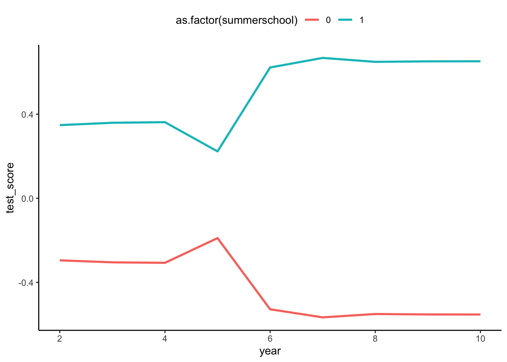{width=672}
:::
:::


Observamos que previo a la escuela de verano iban "mas o menos" en paralelo. Pero después del tratamiento, estos caen para los controles. Esto es un poco preocupante, pero fuera de eso, se ven similares.

Generalmente, no contamos con tantas mediciones para tener una evaluación empirica de las tendencias.

### 6.2 Estimación modelo de diferencias en diferencias.

Primero, en un caso más similar, usemos solo las estimaciones justo antes y una después de la escuela de verano usando la función `lm()`.

Primero, creamos la variable dummy de después usando `mutate()` y `ifelse()`.


::: {.cell}

```{.r .cell-code}
# Select  year 5 and year 6 observations
df<-analysisdata%>%filter(year%in%c(5,6))


# Generate an after indicator and the interaction between after and summer school
df<-mutate(df,after=ifelse(year==6,1,0),afterXsumerschool=after*summerschool)

# Estimate the DiD regression and save the results in an element called m1
m<-lm(test_score~summerschool+after+afterXsumerschool,data=df)

# Print the results
summary(m)
```

::: {.cell-output .cell-output-stdout}
```

Call:
lm(formula = test_score ~ summerschool + after + afterXsumerschool, 
    data = df)

Residuals:
    Min      1Q  Median      3Q     Max 
-3.5022 -0.5325  0.0603  0.6072  3.3260 

Coefficients:
                  Estimate Std. Error t value Pr(>|t|)    
(Intercept)       -0.18933    0.02081  -9.098   <2e-16 ***
summerschool       0.41230    0.03071  13.426   <2e-16 ***
after             -0.33844    0.02942 -11.502   <2e-16 ***
afterXsumerschool  0.73736    0.04343  16.980   <2e-16 ***
---
Signif. codes:  0 '***' 0.001 '**' 0.01 '*' 0.05 '.' 0.1 ' ' 1

Residual standard error: 0.9027 on 6957 degrees of freedom
Multiple R-squared:  0.1853,	Adjusted R-squared:  0.1849 
F-statistic: 527.4 on 3 and 6957 DF,  p-value: < 2.2e-16
```
:::
:::


Bien, observamos que el estiamodr de DIF es de 0.75SD. Observamos que es mayor que el que obtuvimos en IV y menor que el de OLS, pero por poco.

Veamos que ocurre si ahora usamos todos los datos disponibles. Podemos usar la función `feols()` para estimar con todos los años (también podriamos usar `lm()`). Este es el enfoque tradiciona, con una variable que indica después del tratamiento y la interacción entre después y tratamiento y una dummy por tratamiento. En el segundo modelo ponemos la otra opción, que es agregar un efecto fijo temporal en vez de la dummy de después. En el tercer modelo, agregamos controles.


::: {.cell}

```{.r .cell-code}
# Modify data
df<-mutate(analysisdata,after=ifelse(year>5,1,0),afterXsummerschool=after*summerschool)
df<-rename(df,school=summerschool)
# Estimate DiD without controls and fixed effects
m1<-feols(test_score~school+afterXsummerschool+after,cluster="school_id",data=df)
# Estimate DiD without controls
m2<-feols(test_score~school+afterXsummerschool|school_id+year,cluster="school_id",data=df)
# Estimate DiD  with controls
m3<-feols(test_score~afterXsummerschool+school+parental_lincome+female+parental_schooling
         |school_id+year,cluster="school_id",data=df)
# Leave year 5 out to avoid dip
m4<-feols(test_score~afterXsummerschool+school+parental_lincome+female+parental_schooling
         |school_id+year,cluster="school_id",data=filter(df,year!=5))

# Coefficients
cm <- c('afterXsummerschool'  = 'Summer School X After',
        'school'        = 'Summer School',
        'after'='After')
# Output Table
modelsummary(list(m1,m2,m3,m4), stars = TRUE,statistic = 'std.error',  
             statistic_override = vcov,
             fmt= '%.4f',coef_map=cm, output = 'gt'
        )
```

::: {.cell-output-display}

```{=html}
<div id="kaxfafqpjo" style="overflow-x:auto;overflow-y:auto;width:auto;height:auto;">
<style>html {
  font-family: -apple-system, BlinkMacSystemFont, 'Segoe UI', Roboto, Oxygen, Ubuntu, Cantarell, 'Helvetica Neue', 'Fira Sans', 'Droid Sans', Arial, sans-serif;
}

#kaxfafqpjo .gt_table {
  display: table;
  border-collapse: collapse;
  margin-left: auto;
  margin-right: auto;
  color: #333333;
  font-size: 16px;
  font-weight: normal;
  font-style: normal;
  background-color: #FFFFFF;
  width: auto;
  border-top-style: solid;
  border-top-width: 2px;
  border-top-color: #A8A8A8;
  border-right-style: none;
  border-right-width: 2px;
  border-right-color: #D3D3D3;
  border-bottom-style: solid;
  border-bottom-width: 2px;
  border-bottom-color: #A8A8A8;
  border-left-style: none;
  border-left-width: 2px;
  border-left-color: #D3D3D3;
}

#kaxfafqpjo .gt_heading {
  background-color: #FFFFFF;
  text-align: center;
  border-bottom-color: #FFFFFF;
  border-left-style: none;
  border-left-width: 1px;
  border-left-color: #D3D3D3;
  border-right-style: none;
  border-right-width: 1px;
  border-right-color: #D3D3D3;
}

#kaxfafqpjo .gt_title {
  color: #333333;
  font-size: 125%;
  font-weight: initial;
  padding-top: 4px;
  padding-bottom: 4px;
  padding-left: 5px;
  padding-right: 5px;
  border-bottom-color: #FFFFFF;
  border-bottom-width: 0;
}

#kaxfafqpjo .gt_subtitle {
  color: #333333;
  font-size: 85%;
  font-weight: initial;
  padding-top: 0;
  padding-bottom: 6px;
  padding-left: 5px;
  padding-right: 5px;
  border-top-color: #FFFFFF;
  border-top-width: 0;
}

#kaxfafqpjo .gt_bottom_border {
  border-bottom-style: solid;
  border-bottom-width: 2px;
  border-bottom-color: #D3D3D3;
}

#kaxfafqpjo .gt_col_headings {
  border-top-style: solid;
  border-top-width: 2px;
  border-top-color: #D3D3D3;
  border-bottom-style: solid;
  border-bottom-width: 2px;
  border-bottom-color: #D3D3D3;
  border-left-style: none;
  border-left-width: 1px;
  border-left-color: #D3D3D3;
  border-right-style: none;
  border-right-width: 1px;
  border-right-color: #D3D3D3;
}

#kaxfafqpjo .gt_col_heading {
  color: #333333;
  background-color: #FFFFFF;
  font-size: 100%;
  font-weight: normal;
  text-transform: inherit;
  border-left-style: none;
  border-left-width: 1px;
  border-left-color: #D3D3D3;
  border-right-style: none;
  border-right-width: 1px;
  border-right-color: #D3D3D3;
  vertical-align: bottom;
  padding-top: 5px;
  padding-bottom: 6px;
  padding-left: 5px;
  padding-right: 5px;
  overflow-x: hidden;
}

#kaxfafqpjo .gt_column_spanner_outer {
  color: #333333;
  background-color: #FFFFFF;
  font-size: 100%;
  font-weight: normal;
  text-transform: inherit;
  padding-top: 0;
  padding-bottom: 0;
  padding-left: 4px;
  padding-right: 4px;
}

#kaxfafqpjo .gt_column_spanner_outer:first-child {
  padding-left: 0;
}

#kaxfafqpjo .gt_column_spanner_outer:last-child {
  padding-right: 0;
}

#kaxfafqpjo .gt_column_spanner {
  border-bottom-style: solid;
  border-bottom-width: 2px;
  border-bottom-color: #D3D3D3;
  vertical-align: bottom;
  padding-top: 5px;
  padding-bottom: 5px;
  overflow-x: hidden;
  display: inline-block;
  width: 100%;
}

#kaxfafqpjo .gt_group_heading {
  padding-top: 8px;
  padding-bottom: 8px;
  padding-left: 5px;
  padding-right: 5px;
  color: #333333;
  background-color: #FFFFFF;
  font-size: 100%;
  font-weight: initial;
  text-transform: inherit;
  border-top-style: solid;
  border-top-width: 2px;
  border-top-color: #D3D3D3;
  border-bottom-style: solid;
  border-bottom-width: 2px;
  border-bottom-color: #D3D3D3;
  border-left-style: none;
  border-left-width: 1px;
  border-left-color: #D3D3D3;
  border-right-style: none;
  border-right-width: 1px;
  border-right-color: #D3D3D3;
  vertical-align: middle;
}

#kaxfafqpjo .gt_empty_group_heading {
  padding: 0.5px;
  color: #333333;
  background-color: #FFFFFF;
  font-size: 100%;
  font-weight: initial;
  border-top-style: solid;
  border-top-width: 2px;
  border-top-color: #D3D3D3;
  border-bottom-style: solid;
  border-bottom-width: 2px;
  border-bottom-color: #D3D3D3;
  vertical-align: middle;
}

#kaxfafqpjo .gt_from_md > :first-child {
  margin-top: 0;
}

#kaxfafqpjo .gt_from_md > :last-child {
  margin-bottom: 0;
}

#kaxfafqpjo .gt_row {
  padding-top: 8px;
  padding-bottom: 8px;
  padding-left: 5px;
  padding-right: 5px;
  margin: 10px;
  border-top-style: solid;
  border-top-width: 1px;
  border-top-color: #D3D3D3;
  border-left-style: none;
  border-left-width: 1px;
  border-left-color: #D3D3D3;
  border-right-style: none;
  border-right-width: 1px;
  border-right-color: #D3D3D3;
  vertical-align: middle;
  overflow-x: hidden;
}

#kaxfafqpjo .gt_stub {
  color: #333333;
  background-color: #FFFFFF;
  font-size: 100%;
  font-weight: initial;
  text-transform: inherit;
  border-right-style: solid;
  border-right-width: 2px;
  border-right-color: #D3D3D3;
  padding-left: 5px;
  padding-right: 5px;
}

#kaxfafqpjo .gt_stub_row_group {
  color: #333333;
  background-color: #FFFFFF;
  font-size: 100%;
  font-weight: initial;
  text-transform: inherit;
  border-right-style: solid;
  border-right-width: 2px;
  border-right-color: #D3D3D3;
  padding-left: 5px;
  padding-right: 5px;
  vertical-align: top;
}

#kaxfafqpjo .gt_row_group_first td {
  border-top-width: 2px;
}

#kaxfafqpjo .gt_summary_row {
  color: #333333;
  background-color: #FFFFFF;
  text-transform: inherit;
  padding-top: 8px;
  padding-bottom: 8px;
  padding-left: 5px;
  padding-right: 5px;
}

#kaxfafqpjo .gt_first_summary_row {
  border-top-style: solid;
  border-top-color: #D3D3D3;
}

#kaxfafqpjo .gt_first_summary_row.thick {
  border-top-width: 2px;
}

#kaxfafqpjo .gt_last_summary_row {
  padding-top: 8px;
  padding-bottom: 8px;
  padding-left: 5px;
  padding-right: 5px;
  border-bottom-style: solid;
  border-bottom-width: 2px;
  border-bottom-color: #D3D3D3;
}

#kaxfafqpjo .gt_grand_summary_row {
  color: #333333;
  background-color: #FFFFFF;
  text-transform: inherit;
  padding-top: 8px;
  padding-bottom: 8px;
  padding-left: 5px;
  padding-right: 5px;
}

#kaxfafqpjo .gt_first_grand_summary_row {
  padding-top: 8px;
  padding-bottom: 8px;
  padding-left: 5px;
  padding-right: 5px;
  border-top-style: double;
  border-top-width: 6px;
  border-top-color: #D3D3D3;
}

#kaxfafqpjo .gt_striped {
  background-color: rgba(128, 128, 128, 0.05);
}

#kaxfafqpjo .gt_table_body {
  border-top-style: solid;
  border-top-width: 2px;
  border-top-color: #D3D3D3;
  border-bottom-style: solid;
  border-bottom-width: 2px;
  border-bottom-color: #D3D3D3;
}

#kaxfafqpjo .gt_footnotes {
  color: #333333;
  background-color: #FFFFFF;
  border-bottom-style: none;
  border-bottom-width: 2px;
  border-bottom-color: #D3D3D3;
  border-left-style: none;
  border-left-width: 2px;
  border-left-color: #D3D3D3;
  border-right-style: none;
  border-right-width: 2px;
  border-right-color: #D3D3D3;
}

#kaxfafqpjo .gt_footnote {
  margin: 0px;
  font-size: 90%;
  padding-left: 4px;
  padding-right: 4px;
  padding-left: 5px;
  padding-right: 5px;
}

#kaxfafqpjo .gt_sourcenotes {
  color: #333333;
  background-color: #FFFFFF;
  border-bottom-style: none;
  border-bottom-width: 2px;
  border-bottom-color: #D3D3D3;
  border-left-style: none;
  border-left-width: 2px;
  border-left-color: #D3D3D3;
  border-right-style: none;
  border-right-width: 2px;
  border-right-color: #D3D3D3;
}

#kaxfafqpjo .gt_sourcenote {
  font-size: 90%;
  padding-top: 4px;
  padding-bottom: 4px;
  padding-left: 5px;
  padding-right: 5px;
}

#kaxfafqpjo .gt_left {
  text-align: left;
}

#kaxfafqpjo .gt_center {
  text-align: center;
}

#kaxfafqpjo .gt_right {
  text-align: right;
  font-variant-numeric: tabular-nums;
}

#kaxfafqpjo .gt_font_normal {
  font-weight: normal;
}

#kaxfafqpjo .gt_font_bold {
  font-weight: bold;
}

#kaxfafqpjo .gt_font_italic {
  font-style: italic;
}

#kaxfafqpjo .gt_super {
  font-size: 65%;
}

#kaxfafqpjo .gt_two_val_uncert {
  display: inline-block;
  line-height: 1em;
  text-align: right;
  font-size: 60%;
  vertical-align: -0.25em;
  margin-left: 0.1em;
}

#kaxfafqpjo .gt_footnote_marks {
  font-style: italic;
  font-weight: normal;
  font-size: 75%;
  vertical-align: 0.4em;
}

#kaxfafqpjo .gt_asterisk {
  font-size: 100%;
  vertical-align: 0;
}

#kaxfafqpjo .gt_slash_mark {
  font-size: 0.7em;
  line-height: 0.7em;
  vertical-align: 0.15em;
}

#kaxfafqpjo .gt_fraction_numerator {
  font-size: 0.6em;
  line-height: 0.6em;
  vertical-align: 0.45em;
}

#kaxfafqpjo .gt_fraction_denominator {
  font-size: 0.6em;
  line-height: 0.6em;
  vertical-align: -0.05em;
}
</style>
<table class="gt_table">
  
  <thead class="gt_col_headings">
    <tr>
      <th class="gt_col_heading gt_columns_bottom_border gt_left" rowspan="1" colspan="1"> </th>
      <th class="gt_col_heading gt_columns_bottom_border gt_center" rowspan="1" colspan="1">Model 1</th>
      <th class="gt_col_heading gt_columns_bottom_border gt_center" rowspan="1" colspan="1">Model 2</th>
      <th class="gt_col_heading gt_columns_bottom_border gt_center" rowspan="1" colspan="1">Model 3</th>
      <th class="gt_col_heading gt_columns_bottom_border gt_center" rowspan="1" colspan="1">Model 4</th>
    </tr>
  </thead>
  <tbody class="gt_table_body">
    <tr><td class="gt_row gt_left">Summer School X After</td>
<td class="gt_row gt_center">0.6010***</td>
<td class="gt_row gt_center">0.6011***</td>
<td class="gt_row gt_center">0.6010***</td>
<td class="gt_row gt_center">0.5395***</td></tr>
    <tr><td class="gt_row gt_left"></td>
<td class="gt_row gt_center">(0.0125)</td>
<td class="gt_row gt_center">(0.0125)</td>
<td class="gt_row gt_center">(0.0125)</td>
<td class="gt_row gt_center">(0.0132)</td></tr>
    <tr><td class="gt_row gt_left">Summer School</td>
<td class="gt_row gt_center">0.5970***</td>
<td class="gt_row gt_center">0.5924***</td>
<td class="gt_row gt_center">0.2153***</td>
<td class="gt_row gt_center">0.2836***</td></tr>
    <tr><td class="gt_row gt_left"></td>
<td class="gt_row gt_center">(0.0345)</td>
<td class="gt_row gt_center">(0.0344)</td>
<td class="gt_row gt_center">(0.0208)</td>
<td class="gt_row gt_center">(0.0211)</td></tr>
    <tr><td class="gt_row gt_left">After</td>
<td class="gt_row gt_center">-0.2758***</td>
<td class="gt_row gt_center"></td>
<td class="gt_row gt_center"></td>
<td class="gt_row gt_center"></td></tr>
    <tr><td class="gt_row gt_left" style="border-bottom-width: 1px; border-bottom-style: solid; border-bottom-color: #000000;"></td>
<td class="gt_row gt_center" style="border-bottom-width: 1px; border-bottom-style: solid; border-bottom-color: #000000;">(0.0077)</td>
<td class="gt_row gt_center" style="border-bottom-width: 1px; border-bottom-style: solid; border-bottom-color: #000000;"></td>
<td class="gt_row gt_center" style="border-bottom-width: 1px; border-bottom-style: solid; border-bottom-color: #000000;"></td>
<td class="gt_row gt_center" style="border-bottom-width: 1px; border-bottom-style: solid; border-bottom-color: #000000;"></td></tr>
    <tr><td class="gt_row gt_left">Num.Obs.</td>
<td class="gt_row gt_center">31363</td>
<td class="gt_row gt_center">31363</td>
<td class="gt_row gt_center">31363</td>
<td class="gt_row gt_center">27883</td></tr>
    <tr><td class="gt_row gt_left">R2</td>
<td class="gt_row gt_center">0.237</td>
<td class="gt_row gt_center">0.244</td>
<td class="gt_row gt_center">0.533</td>
<td class="gt_row gt_center">0.549</td></tr>
    <tr><td class="gt_row gt_left">R2 Adj.</td>
<td class="gt_row gt_center">0.237</td>
<td class="gt_row gt_center">0.243</td>
<td class="gt_row gt_center">0.533</td>
<td class="gt_row gt_center">0.548</td></tr>
    <tr><td class="gt_row gt_left">R2 Within</td>
<td class="gt_row gt_center"></td>
<td class="gt_row gt_center">0.236</td>
<td class="gt_row gt_center">0.528</td>
<td class="gt_row gt_center">0.544</td></tr>
    <tr><td class="gt_row gt_left">R2 Pseudo</td>
<td class="gt_row gt_center"></td>
<td class="gt_row gt_center"></td>
<td class="gt_row gt_center"></td>
<td class="gt_row gt_center"></td></tr>
    <tr><td class="gt_row gt_left">AIC</td>
<td class="gt_row gt_center">80502.3</td>
<td class="gt_row gt_center">80296.3</td>
<td class="gt_row gt_center">65185.0</td>
<td class="gt_row gt_center">56995.6</td></tr>
    <tr><td class="gt_row gt_left">BIC</td>
<td class="gt_row gt_center">80535.7</td>
<td class="gt_row gt_center">80630.5</td>
<td class="gt_row gt_center">65544.2</td>
<td class="gt_row gt_center">57341.5</td></tr>
    <tr><td class="gt_row gt_left">Log.Lik.</td>
<td class="gt_row gt_center">-40247.160</td>
<td class="gt_row gt_center">-40108.165</td>
<td class="gt_row gt_center">-32549.481</td>
<td class="gt_row gt_center">-28455.818</td></tr>
    <tr><td class="gt_row gt_left">FE: school_id</td>
<td class="gt_row gt_center"></td>
<td class="gt_row gt_center">X</td>
<td class="gt_row gt_center">X</td>
<td class="gt_row gt_center">X</td></tr>
    <tr><td class="gt_row gt_left">FE: year</td>
<td class="gt_row gt_center"></td>
<td class="gt_row gt_center">X</td>
<td class="gt_row gt_center">X</td>
<td class="gt_row gt_center">X</td></tr>
  </tbody>
  <tfoot class="gt_sourcenotes">
    <tr>
      <td class="gt_sourcenote" colspan="5">+ p &lt; 0.1, * p &lt; 0.05, ** p &lt; 0.01, *** p &lt; 0.001</td>
    </tr>
  </tfoot>
  
</table>
</div>
```

:::
:::


Podemos ver que el efecto de tratamiento es cercano a 0.6SD, lo que se acerca más al de IV y se aleja aun más que del OLS ingenuo.

La última columna (4) excluye el año 5 donde veiamos la desviación en las tendencias. Esto nos da un estimador aun más cerca del de IV.


## 7. Matching

Otra alternativa de análisis es mediante el matching. EN este caso, buscaremos para cada individuo que fue a la escuela de verano algún compañero similar en observables que no haya asisitido. 

Hay dos formas de hacerlo, buscar alguien que sea exactamente igual (exact matching) o que sean aproximadamente igual (approximate matching). Una de las formas más usadas de encontrar estos aproximadamente iguales es quela probabilidad de asistir a la escuela de verano basado en un set de observables sea igual (propensity score matching). Vamos a ver ambos tipos.

Una revisión completa de matching está acá: [ds4ps](https://ds4ps.org/pe4ps-textbook/docs/p-080-matching#matchit-function-in-r) o en [
Mixtape cap 5] (https://mixtape.scunning.com/05-matching_and_subclassification) la mayoría basados en el trabajo de [Abadie e Imbens (2006)](https://econpapers.repec.org/article/ecmemetrp/v_3a74_3ay_3a2006_3ai_3a1_3ap_3a235-267.htm)

La estrategia de matching sigue los siguientes dos pasos:
1 -  Para cada tratado encontramos a su "clon". Para esto hay dos alternativos, usamos uno (o varios) match exactos o usamos el propensity score matching.

2 -  Usando los "clones" calculamos calculamos el ATE.

Lo primero que deberíamos hacer entonces es obtener los clones. 

### 7.1 Hayando clones manualmente

Primero lo haremos manualmente. 

#### 7.1.1 Exact matching manual

Un exact match, lo que hace es identificar uno (varios) contrafactuales que se encuentren más cercanos a cada individuo tratado en la muestra.

Lo que hacemos es definir en que variables vamos a considerar el match. En nuestro caso quisieramos hacerlo por colegio, sexo, educacion de los padres e ingreso de los padres.

Para simplificar como se hace el algortmo, primero usemos una única característica en un único colegio, educación de los padres.


::: {.cell}

```{.r .cell-code}
# Realizamos un filtro de la data para ilustrar el ejemplo en un solo colegio
# Dado que la educaión de los padres la tenemos solo para un año, quedémonos con los datos del año 6 para ilustrar con el outcome de interes el test_score después del tratamiento.

exact_macth_df_treated <- analysisdata %>%
                          dplyr::filter(school_id==1&year==6&summerschool==1) %>%
                          dplyr::select(person_id, summerschool, parental_schooling, test_score)
                    
exact_macth_df_controls <- analysisdata %>%
                          dplyr::filter(school_id==1&year==6&summerschool==0) %>%
                          dplyr::select(person_id, summerschool, parental_schooling, test_score)


head(exact_macth_df_treated)
```

::: {.cell-output .cell-output-stdout}
```
# A tibble: 6 × 5
# Groups:   year [1]
   year person_id summerschool parental_schooling test_score
  <int>     <dbl>        <int>              <int>      <dbl>
1     6        66            1                 11      1.46 
2     6        78            1                 12      0.815
3     6       181            1                 14      1.23 
4     6       227            1                 11      0.633
5     6       429            1                 11      0.773
6     6       451            1                 10     -0.731
```
:::

```{.r .cell-code}
head(exact_macth_df_controls)
```

::: {.cell-output .cell-output-stdout}
```
# A tibble: 6 × 5
# Groups:   year [1]
   year person_id summerschool parental_schooling test_score
  <int>     <dbl>        <int>              <int>      <dbl>
1     6        98            0                 12      0.286
2     6       176            0                 12     -0.651
3     6       307            0                 12     -0.824
4     6       422            0                 10     -0.705
5     6       512            0                 12      0.816
6     6       646            0                 11     -1.28 
```
:::
:::


Entonces, para cada individuo tratado encontremos el control en su colegio que sería más cercano en términos de educación de sus padres.

Varias cosas que debemos decidir:

1. Como definiremos "cercano" : mediremos una distancia, una diferencia, otra cosa.
2. Cuantos matchs "más cercanos" buscaremos
    2.1 Si es solo 1, cual elegimos. (ventaja clones más similares)
    2.2 Si es más de uno: Los guardamos todos o realizamos una agregación. (permite mayor muestra)
        2.2.1: ¿Cómo agregamos?: la media, la mediana... otro?
3. Si usamos un miembro de la muestra, ¿lo podemos volver a usar?

En la [documentación del paquete](https://cran.r-project.org/web/packages/MatchIt/vignettes/matching-methods.html) `MatchIT` de Noah Greifer hay un buen listado y resumen de los diferentes métodos posibles para hacer el matching.

Hagamos un match con el más cercano en el valor absoluto de la diferencia. Esto se llama *" nearest neighbor matching"*


Si hay más de un candidato, elegimos el primero.

Pro ejemplo, calculamos la distancia para cada elemento de los controles con el individuo 1 de los tratados.


::: {.cell}

```{.r .cell-code}
exact_macth_df_controls_t1 <-  
    exact_macth_df_controls %>%
    mutate(distance_1 = abs(11-parental_schooling) )

head(exact_macth_df_controls_t1)
```

::: {.cell-output .cell-output-stdout}
```
# A tibble: 6 × 6
# Groups:   year [1]
   year person_id summerschool parental_schooling test_score distance_1
  <int>     <dbl>        <int>              <int>      <dbl>      <dbl>
1     6        98            0                 12      0.286          1
2     6       176            0                 12     -0.651          1
3     6       307            0                 12     -0.824          1
4     6       422            0                 10     -0.705          1
5     6       512            0                 12      0.816          1
6     6       646            0                 11     -1.28           0
```
:::
:::

Acá podemos elegir el que la distancia sea 0 o cualquier valor arbitrariamente pequeño. Por ejemplo, elijamos todos los que el valor es 0.


::: {.cell}

```{.r .cell-code}
exact_macth_df_controls_t1 <- exact_macth_df_controls_t1 %>%
                              dplyr::filter(distance_1==0)

head(exact_macth_df_controls_t1)
```

::: {.cell-output .cell-output-stdout}
```
# A tibble: 6 × 6
# Groups:   year [1]
   year person_id summerschool parental_schooling test_score distance_1
  <int>     <dbl>        <int>              <int>      <dbl>      <dbl>
1     6       646            0                 11     -1.28           0
2     6       839            0                 11     -0.883          0
3     6       925            0                 11     -0.477          0
4     6       966            0                 11     -0.931          0
5     6      1028            0                 11     -0.591          0
6     6      1264            0                 11     -0.755          0
```
:::

```{.r .cell-code}
dim(exact_macth_df_controls_t1)
```

::: {.cell-output .cell-output-stdout}
```
[1] 24  6
```
:::
:::


Podemos ver que hay 24 candidatos. ¿Cómo elejimos? Imaginemos que elegimos uno al azar y lo defifinimos como el clon para el individuo 1 de los tratados.


::: {.cell}

```{.r .cell-code}
set.seed(0) #para que todos tengamos el mismo resultado
slice_sample(exact_macth_df_controls_t1,n=1)
```

::: {.cell-output .cell-output-stdout}
```
# A tibble: 1 × 6
# Groups:   year [1]
   year person_id summerschool parental_schooling test_score distance_1
  <int>     <dbl>        <int>              <int>      <dbl>      <dbl>
1     6      2421            0                 11     -0.201          0
```
:::
:::


Entonces nuestro clon para el individuo 66 sería el 2421. Si recordamos su resultado era 3.571861 y del match, decimos que su contrafactual sería 2.372809, entonces su ATE sería:


::: {.cell}

```{.r .cell-code}
3.571861 - 2.372809
```

::: {.cell-output .cell-output-stdout}
```
[1] 1.199052
```
:::
:::


Luego pasamos al segundo individuo tratado. Para esto primero debemos saber si la persona 2421 estará disponible como match potencial. Una vez definido eso, replicamos los pasos anteriores.

Con esta idea es posible crear algorthmos adhoc a cada problema, pero nosotros aprovecharemos un paquete que ya los tiene implementados: `MatchIT`


#### 7.1.2 Propensity score matching

Del ejemplo anterior es facil imaginarse como sería una alternativa para multiples dimensiones, como una función con múltiples imputs que describa alguna distancia.

Una segunda manera de hacer el match es con el propensity score. Una forma comun es mediante una función logit. A cada individuo vamos a calcular su probabilididad de ser tratado dadas las covariables en las que deseamos hacer el match.


::: {.cell}

```{.r .cell-code}
# Realizamos un filtro de la data para ilustrar el ejemplo en un solo colegio
# Dado que la educaión de los padres la tenemos solo para un año, quedémonos con los datos del año 6 para ilustrar con el outcome de interes el test_score después del tratamiento.

props_macth_df<- analysisdata %>%
                          dplyr::filter(school_id==1&year==6) 
                    

head(props_macth_df)
```

::: {.cell-output .cell-output-stdout}
```
# A tibble: 6 × 10
# Groups:   year [1]
  person_id school…¹ summe…² female paren…³ paren…⁴ letter learn…⁵  year test_…⁶
      <dbl>    <dbl>   <int>  <int>   <int>   <dbl>  <dbl>   <dbl> <int>   <dbl>
1        66        1       1      0      11    15.1      0   12.3      6   1.46 
2        78        1       1      0      12    15.6      0    9.96     6   0.815
3        98        1       0      1      12    14.4      0    9.56     6   0.286
4       176        1       0      1      12    14.8      0    8.06     6  -0.651
5       181        1       1      1      14    15.7      0   10.2      6   1.23 
6       227        1       1      0      11    14.7      1   11.9      6   0.633
# … with abbreviated variable names ¹​school_id, ²​summerschool,
#   ³​parental_schooling, ⁴​parental_lincome, ⁵​learnings, ⁶​test_score
```
:::
:::


Calculamos el propensity score estimando un modelo logit y luego calculamos la probabilidad estimada.


::: {.cell}

```{.r .cell-code}
## Estimamos el logit model

log_matching = glm( summerschool ~ female + parental_schooling + parental_lincome, data = props_macth_df, family = "binomial")

## Calculate the propensity score by estimating the probability for each child to attend a private or a public school.

props_macth_df$prop_score <- predict(log_matching, newdata = props_macth_df, type = "response")

# creamos un indice para identificar alumnos más facil que su id (es muy larga)
props_macth_df <- props_macth_df %>% dplyr::mutate(number = row_number())


head(props_macth_df %>% dplyr::select(person_id, summerschool, female, parental_schooling, parental_lincome, prop_score, number ) )
```

::: {.cell-output .cell-output-stdout}
```
# A tibble: 6 × 8
# Groups:   year [1]
   year person_id summerschool female parental_schooling parent…¹ prop_…² number
  <int>     <dbl>        <int>  <int>              <int>    <dbl>   <dbl>  <int>
1     6        66            1      0                 11     15.1   0.693      1
2     6        78            1      0                 12     15.6   0.788      2
3     6        98            0      1                 12     14.4   0.328      3
4     6       176            0      1                 12     14.8   0.510      4
5     6       181            1      1                 14     15.7   0.682      5
6     6       227            1      0                 11     14.7   0.509      6
# … with abbreviated variable names ¹​parental_lincome, ²​prop_score
```
:::
:::


Podemos ver el rango en el que se mueve prop_score como referencia


::: {.cell}

```{.r .cell-code}
summary(props_macth_df$prop_score)
```

::: {.cell-output .cell-output-stdout}
```
   Min. 1st Qu.  Median    Mean 3rd Qu.    Max. 
0.09288 0.30832 0.46891 0.45882 0.58721 0.88538 
```
:::
:::


Podriamos también hacer una gráfica de cada estudiante y su propensity score


::: {.cell}

```{.r .cell-code}
palette(c("darkred", "dodgerblue1")) #azules tratados y rojos no tratados

plot(prop_score ~ number, data=subset(props_macth_df, number<20), lwd = 3, ylab = "Predicted probabilities", xlab = "Observations", xaxt = "n", col=summerschool+1 )

axis(1, at=1:20)

for (i in 1:nrow(props_macth_df)){
  segments(props_macth_df$number[i], 0, props_macth_df$number[i], props_macth_df$prop_score[i], lty = 2, col = "gray70")}
```

::: {.cell-output-display}
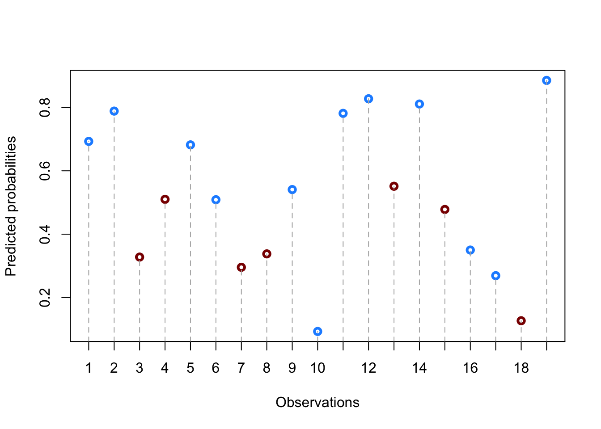{width=672}
:::
:::


Entonces, **¿cómo buscamos los clones?** 

Ordenemos nuestro dataframe por propensity score, para ver cuales son similares:


::: {.cell}

```{.r .cell-code}
## Ordenemos el data frame por propensity score 

props_macth_df = as.data.frame(props_macth_df[order(props_macth_df$prop_score), ])

## We just look at the top 5 observations
props_macth_df_2 = round(props_macth_df[5:9,], 2)
props_macth_df_2
```

::: {.cell-output .cell-output-stdout}
```
  person_id school_id summerschool female parental_schooling parental_lincome
5      1701         1            0      0                 10            13.36
6      2864         1            0      0                 10            13.38
7       780         1            0      1                 10            13.27
8      2592         1            1      0                 10            13.43
9      3180         1            0      1                 10            13.33
  letter learnings year test_score prop_score number
5      0      7.72    6      -1.66       0.12     47
6      0      9.21    6      -1.65       0.13     66
7      0      8.45    6      -0.96       0.13     18
8      1      9.04    6      -0.72       0.14     61
9      0      7.41    6      -2.34       0.14     80
```
:::
:::

Por ejemplo en este grupo todos tienen propensity score similar y solo uno de estos fue tratado.


Para elegir su match podriamos calcular la distancia y definir bajo que valor definiremos un match.


### 7.2 Clones con paquete MatchIt

Una alternatia al trabajo manual es usar el paquete [*MatchIT* ](https://kosukeimai.github.io/MatchIt/articles/MatchIt.html) (Muy recomendable revisar su documentación)


::: {.cell}

```{.r .cell-code}
#cargar el paquete

library("MatchIt")
```
:::


Partiremos con definir un proceso de matching por defecto con todas las observaciones y definiendo como covariables school_id + female + parental_schooling + parental_lincom + test_score (año 5)

Subset para matching solo con el periodo antes de la escuela de verano


::: {.cell}

```{.r .cell-code}
match_data <- school_data_1 %>%  #usamos este porque quisieramos tener en una fila el outcome del test en año 6 y del 5 para usar de control 
             dplyr::filter(!is.na(parental_schooling),!is.na(test_year_5),!is.na(test_year_6)) %>%
             dplyr::mutate(summerschool=summercamp)  
            

match_data
```

::: {.cell-output .cell-output-stdout}
```
     person_id school_id summercamp female parental_schooling parental_lincome
1            2        14          1      0                 11         14.73739
2            3         7          1      0                 14         16.08326
3            4         8          0      0                 12         14.60808
4            5         9          1      0                 11         13.75679
5            6        26          1      1                 11         14.70552
6            7        13          1      1                 11         14.35046
7            8        11          0      1                 13         14.97556
8            9        23          1      1                 11         14.34863
9           10         9          1      1                 11         13.80988
10          11        25          0      1                 11         14.56104
11          12        15          0      1                 11         15.20789
12          13         3          0      1                 10         13.49959
13          14         4          0      0                 11         14.59711
14          15        17          1      0                 12         14.78698
15          16         7          1      1                 11         14.75619
16          17        11          1      0                 14         16.13338
17          18        28          0      1                 12         14.89611
18          19        15          1      0                 11         15.11508
19          20        22          1      1                 15         16.02051
20          21         8          1      1                 12         14.78528
21          22         3          1      1                 14         16.53762
22          23         4          0      0                 11         13.88618
23          24         7          1      1                 11         14.86351
24          25        16          0      1                 11         14.57842
25          26        21          1      1                 14         15.50040
26          27         4          1      1                 11         14.85010
27          28        12          1      1                 11         14.27853
28          29        24          0      0                 11         14.42825
29          30        28          0      0                 11         13.82160
30          31         7          1      0                 12         14.32113
31          32        14          0      1                 10         13.93507
32          33         7          0      1                 13         15.32600
33          34        15          1      1                 11         13.60992
34          36        30          0      1                 11         14.41366
35          37        27          0      0                 12         14.81818
36          38        29          0      0                 11         14.32132
37          39        27          0      0                 11         14.40678
38          40        16          0      0                 11         14.41124
39          41         7          0      0                 11         14.50931
40          42         2          1      1                 11         14.86544
41          44         6          1      0                 11         14.98979
42          45         9          0      0                 12         15.05865
43          46        25          0      0                 11         14.23379
44          47         4          1      1                 10         13.87654
45          48        11          0      1                 10         13.88325
46          49        19          1      0                 12         14.34306
47          50        22          0      1                 11         14.72579
48          51        12          1      1                 11         14.26124
49          52        23          1      1                 10         12.77840
50          53        24          0      1                 11         14.27301
51          54        11          0      1                 11         14.98929
52          55         7          1      1                 12         14.53933
53          56        23          1      1                 11         14.70741
54          57        28          0      1                 11         14.64484
55          58        26          1      0                 12         14.81495
56          59        30          0      1                 11         14.25939
57          60        10          0      0                 10         14.47168
58          61        19          1      1                 11         14.55913
59          62        19          1      1                 13         15.65067
60          63         4          1      0                 11         15.08992
61          64        17          0      0                 11         14.00617
62          65        10          0      1                 11         14.11368
63          66         1          1      0                 11         15.11780
64          67        19          0      1                 11         14.22065
65          68        19          0      0                 11         14.36900
66          69        28          0      0                 10         14.36551
67          70        24          0      1                 10         14.42053
68          71         5          0      0                 11         14.45698
69          72        29          0      1                 11         14.24044
70          73        22          1      0                 11         14.13855
71          74        29          0      0                 12         14.28738
72          75        19          0      1                 11         14.21621
73          76        15          1      0                 12         14.52980
74          77        27          0      1                 10         14.25938
75          78         1          1      0                 12         15.62224
76          79        17          1      0                 10         13.54768
77          80        11          1      1                 10         13.54642
78          81         2          0      0                 12         15.00610
79          82        16          1      1                 13         15.52976
80          83         5          0      0                 10         13.55740
81          84        12          1      1                 11         14.79034
82          85         4          1      0                 13         15.62520
83          86        19          1      0                 12         15.21901
84          87         7          1      0                 11         14.70618
85          88        10          0      0                 11         14.50815
86          89        26          1      0                 14         15.47935
87          90        14          0      1                 12         14.59442
88          91        23          1      1                 10         13.47946
89          92        15          0      1                 11         13.98313
90          93        23          0      0                 11         14.70547
91          94        23          0      0                 11         13.96302
92          95        28          1      1                 12         14.74025
93          96        16          0      1                 13         15.92638
94          97         7          0      0                 10         13.93519
95          98         1          0      1                 12         14.38974
96          99         2          1      0                 12         15.24919
97         100        16          1      1                 10         13.77691
98         101        17          1      1                 11         14.07137
99         102         6          0      0                 13         15.27418
100        103        25          0      0                 11         14.23881
101        104         6          1      0                 11         14.56811
102        105         9          1      1                 12         15.09059
103        106        30          1      0                 12         15.50592
104        107        19          0      1                 10         13.35712
105        108        24          1      1                 12         15.13850
106        109        23          1      0                 12         15.43771
107        110        30          1      0                 11         14.90891
108        111        30          0      1                 11         14.32619
109        112        15          1      1                 11         13.67427
110        113        10          0      1                 10         13.76683
111        114         3          0      1                 11         14.41396
112        115         5          0      1                 10         13.66808
113        116        11          0      0                 10         13.75779
114        117        23          0      1                 11         14.87915
115        118        26          1      1                 14         15.80533
116        119        19          0      1                 11         14.88564
117        120         6          0      1                 12         15.05499
118        121         2          0      1                 11         14.47087
119        122        19          1      0                 11         14.35263
120        123        15          0      1                 10         13.17355
121        124         2          0      1                 11         14.70734
122        125         9          0      0                 10         13.46397
123        126         2          0      0                 12         14.78032
124        127        26          0      1                 11         15.27890
125        128        23          1      0                 11         14.98076
126        129        25          1      0                 11         14.57661
127        130        14          0      1                 12         14.78545
128        131         4          0      1                 11         14.67694
129        132        29          1      0                 12         14.66534
130        133        26          1      0                 11         13.80267
131        134         8          0      1                 13         14.94808
132        135         5          0      0                 12         14.63941
133        136         2          0      0                 11         14.42450
134        137        18          1      1                 11         14.38959
135        138        16          0      0                 10         13.89358
136        139         7          1      1                 11         15.25579
137        140        13          1      1                 12         15.30635
138        141        30          0      1                 13         15.13886
139        142         6          0      1                 12         14.96472
140        143         7          1      1                 12         15.77102
141        144        18          0      0                 11         14.77939
142        145        22          1      1                 12         15.35221
143        146        28          0      0                 11         14.02572
144        147         7          0      1                 11         14.26441
145        148        16          0      1                 10         13.84965
146        149        21          0      0                 10         14.16753
147        150        10          0      0                 11         14.44026
148        151         4          1      0                 14         16.33825
149        152        27          1      1                 11         14.97212
150        153        30          0      1                 12         15.26000
151        154        22          1      0                 12         14.99472
152        155         2          1      1                 13         15.43983
153        156        21          0      1                 12         14.72088
154        157        13          0      0                 11         14.06652
155        158        29          0      1                 10         13.72676
156        159        29          1      1                 11         14.71860
157        160        28          1      0                 16         17.11408
158        161         9          0      0                 12         14.93356
159        162        24          0      1                 11         14.26788
160        163        18          0      1                 13         15.36364
161        164        17          1      1                 11         14.24529
162        165         2          0      0                 11         14.34373
163        166        15          1      1                 10         14.26698
164        167        26          0      1                 11         14.07776
165        168         6          0      1                 11         14.20803
166        169        29          0      1                 11         14.12972
167        170        24          0      1                 12         15.06822
168        171         3          1      1                 15         16.33903
169        172        11          0      1                 11         14.34084
170        173        13          0      1                 10         13.94310
171        174        30          0      1                 11         13.39401
172        175        25          0      1                 11         14.41575
173        176         1          0      1                 12         14.80643
174        177        23          0      0                 10         14.59076
175        178         8          1      0                 15         17.14296
176        179         4          0      1                 11         14.17289
177        180         6          0      0                 11         13.98780
178        181         1          1      1                 14         15.66081
179        182        28          1      1                 15         16.28155
180        183        29          1      1                 11         14.08564
181        184         2          0      1                 11         14.38416
182        185        18          0      0                 11         14.14678
183        186        20          0      1                 11         14.64248
184        187        16          0      1                 10         14.13137
185        188        24          0      0                 12         14.69240
186        189        23          1      1                 10         13.18855
187        191         8          0      1                 11         14.31130
188        192        20          1      1                 13         15.55542
189        193        24          1      1                 13         14.98104
190        194        20          0      0                 12         14.05849
191        195        12          1      1                 12         15.15399
192        196         2          1      1                 12         14.63663
193        197         3          0      0                 11         14.33372
194        198         2          1      0                 11         14.10209
195        199         4          0      0                 12         15.11558
196        200        26          0      0                 10         13.40944
197        201        10          1      0                 13         15.38575
198        202         8          1      1                 22         18.92771
199        203         4          1      0                 11         14.40525
200        204        17          0      0                 11         14.92274
201        205        19          1      1                 11         15.18800
202        206        28          1      1                 11         15.10990
203        207         6          0      1                 10         13.86158
204        208        14          0      0                 11         13.76161
205        209        21          0      0                 10         14.40565
206        210        18          0      1                 11         14.68521
207        211        13          0      0                 11         14.28434
208        212        29          0      1                 10         14.32782
209        213         2          1      0                 11         14.21837
210        214         7          0      1                 11         14.48656
211        215        30          0      0                 11         14.25616
212        216        22          0      0                 11         14.07609
213        217        23          0      1                 10         13.90381
214        218        12          1      1                 11         14.54042
215        219         8          0      1                 11         14.53921
216        220         8          0      0                 11         14.97692
217        221        15          0      0                 11         14.46476
218        222        19          0      0                 11         13.90460
219        223        12          0      1                 11         14.18734
220        224        26          1      1                 12         14.56452
221        225        26          1      0                 10         13.67257
222        226        28          0      0                 10         13.63458
223        227         1          1      0                 11         14.68999
224        228        22          1      0                 13         15.58265
225        229        27          1      1                 12         15.18901
226        230        21          0      1                 11         13.97263
227        231        14          1      0                 11         14.84802
228        232         2          1      0                 11         14.59065
229        233        17          1      0                 12         14.75953
230        235         7          0      0                 12         14.75767
231        236         3          0      0                 12         14.99674
232        237        29          1      0                 11         14.74951
233        238        13          1      1                 14         15.80013
234        239        13          0      1                 12         14.94089
235        240        13          0      0                 10         14.48088
236        241        22          1      0                 11         14.75121
237        242        12          1      0                 12         15.29610
238        243         7          1      0                 11         14.60219
239        244        20          0      0                 11         13.76835
240        245         3          0      1                 10         13.28047
241        246         8          1      1                 11         14.71229
242        247        17          0      0                 11         14.19959
243        248        26          0      1                 10         14.66323
244        249         9          0      1                 10         14.27697
245        250        20          1      1                 11         14.59425
246        251         2          1      0                 12         15.14184
247        252        23          1      1                 12         15.21387
248        253        16          0      1                 11         14.42738
249        254        26          0      0                 11         14.24526
250        255        14          0      0                 12         14.71584
251        256         7          1      0                 10         13.29802
252        257        14          0      0                 11         14.12647
253        258        24          0      1                 11         13.92347
254        259        11          0      1                 11         14.69321
255        260        26          0      0                 11         13.70219
256        261        22          1      1                 11         15.23322
257        262         7          1      1                 12         14.62843
258        263        17          0      1                 11         15.00026
259        264         8          0      1                 11         15.21081
260        265        18          0      1                 12         14.64888
261        266        23          0      1                 11         14.32737
262        267        18          0      1                 12         15.17710
263        268        25          1      1                 11         15.14576
264        269         9          0      1                 10         13.60498
265        270         9          0      1                 11         14.13074
266        271         3          0      1                 11         14.72388
267        272        21          1      1                 11         14.53312
268        273        20          0      1                 11         14.63854
269        274        22          1      1                 11         13.51792
270        275         4          0      0                 12         14.96027
271        276        23          0      1                 10         13.69457
272        277        17          0      1                 13         15.07762
273        278        11          1      1                 11         14.65659
274        279        19          0      1                 11         14.82563
275        280        29          0      1                 10         13.39314
276        281        11          0      0                 11         14.41657
277        282        11          1      1                 10         14.09369
278        283         9          0      1                 10         13.92217
279        284        12          1      0                 13         15.07150
280        285        23          1      1                 11         14.43414
281        286        27          1      0                 10         13.91021
282        287        11          0      0                 12         15.36304
283        288        27          0      0                 11         13.80326
284        289        27          0      1                 12         14.82652
285        290         2          0      1                 11         14.51639
286        291        15          0      0                 11         14.59054
287        292        18          1      0                 11         14.54959
288        293        15          1      1                 11         13.80059
289        294        16          0      0                 11         14.54256
290        295        15          0      0                 11         14.67782
291        296        12          1      1                 11         13.98703
292        297        11          1      1                 11         14.82211
293        298        24          0      0                 11         14.19053
294        299        13          0      0                 11         13.73485
295        300        26          0      1                 10         13.54449
296        301        16          1      1                 12         15.81419
297        302        15          1      1                 11         14.33986
298        303         7          0      0                 10         13.52862
299        304        28          0      1                 11         13.86556
300        305        26          1      1                 12         14.89295
301        306         9          1      0                 12         14.56589
302        307         1          0      1                 12         14.30702
303        308        28          0      1                 10         12.99887
304        309         3          1      0                 11         15.14918
305        310        14          1      0                 11         13.96482
306        311        23          1      1                 12         15.57596
307        312        21          0      0                 11         14.99054
308        313        10          1      1                 15         15.60682
309        314        27          1      1                 11         14.80506
310        315        29          0      1                 10         13.36479
311        316         8          1      0                 11         14.56090
312        317        15          1      1                 15         16.57683
313        318         4          0      1                 11         14.16156
314        319        11          0      1                 11         13.91686
315        320        28          1      0                 13         15.51342
316        321         7          0      1                 11         14.30431
317        322        26          1      1                 13         15.60576
318        323        21          0      0                 11         14.44695
319        324        21          1      1                 11         14.32011
320        325         4          0      1                 12         14.59859
321        326        19          1      0                 11         14.40310
322        327        25          0      1                 12         14.80379
323        328        27          1      0                 10         13.76874
324        329         8          0      0                 11         14.29999
325        330        15          1      1                 11         14.78997
326        331         7          0      1                 11         14.30310
327        332         9          1      0                 13         15.77519
328        333        27          0      0                 10         13.99301
329        334         9          1      0                 11         14.88709
330        335        24          0      0                 11         13.93596
331        336        23          0      0                 10         14.41304
332        337        29          1      0                 12         14.92568
333        338        18          0      1                 11         15.11946
334        339         3          1      1                 11         14.75224
335        340        16          0      0                 11         14.00005
336        341        21          1      0                 11         14.02258
337        342        26          0      0                 11         15.22342
338        343        26          0      0                 10         13.79561
339        344         4          0      1                 11         14.54944
340        345        21          1      1                 13         15.58915
341        346        27          0      1                 11         14.01237
342        347         6          1      1                 11         13.88724
343        348         6          0      0                 11         14.30961
344        349        23          0      1                 12         15.41178
345        350         6          1      1                 11         13.95999
346        351        27          1      0                 12         15.40601
347        352        14          1      1                 11         14.89843
348        353        18          0      1                 11         13.80712
349        354        12          0      1                 11         14.28284
350        355        11          0      1                 11         13.84301
351        356         4          1      0                 11         14.50984
352        357        30          1      0                 11         14.36462
353        358        24          1      1                 12         15.20192
354        359        22          0      0                 11         14.07745
355        360        29          1      0                 10         13.67636
356        361        27          0      0                 11         14.18365
357        362        12          0      0                 11         14.35369
358        363        11          0      1                 10         13.29657
359        364         5          1      1                 11         13.82091
360        365        12          0      0                 11         15.07291
361        366        21          0      0                 10         13.56619
362        367        14          0      0                 11         14.59046
363        368         7          1      0                 12         14.54648
364        369        30          0      1                 11         14.29150
365        370        14          0      1                 10         13.58087
366        371        14          0      0                 10         13.81314
367        372         4          1      0                 12         14.56342
368        373         5          0      1                 11         14.84429
369        374        10          0      0                 11         14.51644
370        375        20          0      1                 10         13.79681
371        376        15          0      1                 11         13.87270
372        377        26          1      1                 12         14.70476
373        378         7          1      1                 11         13.90525
374        379         8          0      0                 11         14.19989
375        380        26          1      1                 10         13.30466
376        381        10          0      1                 11         14.66953
377        382        12          0      0                 11         13.87317
378        383        26          1      0                 10         13.80821
379        384         9          0      0                 11         14.77101
380        385        28          1      1                 11         13.78965
381        386         4          0      1                 12         14.63839
382        387        14          1      1                 10         13.12975
383        388         3          0      1                 11         14.51519
384        389         5          1      0                 11         14.62486
385        390        19          0      1                 10         13.67969
386        391        29          1      1                 12         14.54982
387        392        20          0      1                 12         14.52404
388        393        28          0      1                 11         14.07887
389        394        11          1      1                 11         14.03864
390        395        29          1      1                 12         15.42885
391        396        20          0      1                 10         13.82483
392        397        25          0      1                 12         14.75515
393        398         8          1      1                 11         14.76953
394        399        30          1      1                 12         15.33783
395        400        16          0      0                 10         14.06805
396        401        15          0      1                 11         14.35075
397        402        28          0      1                 12         15.02803
398        403         4          1      0                 12         14.78488
399        404        28          1      0                 12         15.46229
400        405        18          1      0                 11         14.63055
401        406        26          1      1                 13         15.28197
402        407        17          0      0                 10         13.26447
403        408         6          0      0                 10         14.03891
404        409        27          1      1                 13         14.80597
405        410        19          1      1                 12         15.16685
406        411        20          1      0                 10         13.43892
407        412        11          1      1                 11         13.45903
408        413        26          0      1                 10         13.82844
409        414         8          1      1                 11         14.79023
410        415        11          0      1                 11         14.77261
411        416         2          0      1                 11         14.78611
412        417        20          0      1                 11         14.59030
413        418        24          0      0                 10         13.97706
414        419        23          1      1                 10         13.94335
415        420        18          0      1                 12         15.12395
416        421        22          0      0                 11         14.62955
417        422         1          0      1                 10         13.95734
418        423        12          0      0                 10         13.39256
419        424        10          1      1                 11         13.95818
420        425        30          1      0                 11         13.85489
421        426        26          0      1                 17         16.55616
422        427        10          1      1                 11         14.05618
423        428        17          1      1                 11         14.62273
424        429         1          1      0                 11         14.76060
425        430        17          0      0                 10         14.21947
426        431        14          1      0                 13         15.88351
427        432        16          0      0                 11         14.65147
428        433         3          1      0                 12         15.68572
429        434        20          1      1                 12         15.66963
430        435         2          0      1                 11         13.95922
431        436        18          0      0                 12         14.66504
432        437        19          1      1                 12         14.92216
433        438        22          1      1                 11         13.75875
434        439        10          0      0                 10         13.90082
435        440        27          1      0                 10         13.60439
436        441        13          0      1                 12         15.35260
437        442        10          1      0                 11         14.16846
438        443         7          1      1                 13         16.00752
439        444        15          1      0                 11         14.25614
440        445        15          0      0                 12         14.23774
441        446        25          1      1                 12         15.11685
442        447        19          0      0                 13         15.15278
443        449        25          1      1                 11         15.00415
444        450        28          0      1                 11         13.48936
445        451         1          1      1                 10         13.07527
446        452        13          0      0                 11         14.37656
447        453        24          0      1                 11         13.71241
448        454        10          1      1                 13         15.09419
449        455        15          0      1                 11         14.19947
450        456        10          1      0                 11         14.55658
451        457        29          1      0                 12         14.69131
452        458        23          1      1                 12         15.04187
453        459         2          0      1                 11         14.26865
454        460        22          0      0                 11         14.83650
455        461        11          0      1                 11         14.32596
456        462        17          0      1                 11         14.04643
457        463        18          1      0                 12         14.67837
458        464         5          0      1                 11         13.81629
459        465        10          0      0                 11         14.10272
460        466        26          1      0                 13         14.71715
461        467        22          0      1                 11         14.72081
462        468         7          0      0                 10         13.69898
463        469         5          0      1                 11         14.86870
464        470         1          1      1                 14         15.94167
465        471        30          0      1                 10         14.36415
466        472        18          0      0                 12         14.43842
467        473        10          0      0                 11         13.71720
468        474        16          1      1                 12         15.08224
469        475        17          0      1                 11         14.84179
470        476         2          0      1                 11         14.31564
471        477        16          0      1                 12         15.20250
472        478        11          1      1                 11         14.22969
473        479        29          0      1                 11         14.23472
474        480        11          0      0                 11         14.47193
475        481        21          1      1                 13         15.80502
476        482        21          0      1                 11         15.00081
477        483        22          0      1                 11         14.63343
478        484         1          1      1                 11         15.41695
479        485        20          0      1                 11         13.32672
480        486         2          1      0                 11         14.18182
481        487         4          1      1                 13         15.34356
482        488        10          0      0                 12         14.40300
483        489        26          1      1                 13         15.79714
484        490        14          0      0                 12         15.03425
485        491         6          0      0                 14         14.86367
486        492        22          1      1                 12         14.97981
487        493         7          1      0                 12         15.40397
488        494        23          1      0                 10         14.10969
489        495        14          0      0                 10         13.77782
490        496        30          0      0                 11         13.42710
491        497        27          0      1                 12         15.21308
492        498        21          1      0                 13         16.19877
493        499         7          1      0                 11         13.68804
494        500        22          1      1                 11         14.41487
495        501        10          1      1                 13         15.41248
496        502         4          0      1                 10         13.23504
497        503        11          0      1                 12         15.05362
498        504        15          0      0                 11         14.53035
499        505         8          0      0                 11         14.32302
500        506        23          1      0                 11         13.89672
501        507        24          1      1                 12         14.74316
502        508        29          1      0                 12         14.96525
503        509        17          1      0                 10         13.39611
504        510         7          0      0                 11         14.25455
505        511         4          0      0                 11         14.44806
506        512         1          0      0                 12         15.01258
507        513        12          0      1                 11         14.79809
508        514         5          1      0                 11         14.85942
509        515        30          1      1                 10         13.38825
510        516         3          0      1                 11         15.01617
511        517        10          0      1                 11         14.38018
512        518        10          0      1                 11         14.51472
513        519         8          1      0                 12         15.60246
514        520        22          0      0                 12         14.70238
515        521         2          1      1                 12         15.03359
516        522        22          0      0                 11         14.08237
517        523         2          0      1                 12         14.83513
518        524         8          0      0                 12         14.67846
519        525        21          1      0                 11         14.73451
520        526        10          0      0                 11         13.56352
521        527        27          1      1                 11         15.01656
522        528        20          0      0                 11         14.36152
523        529         8          0      1                 11         14.60449
524        530        22          1      1                 11         14.73773
525        531        21          1      0                 12         15.36273
526        532        27          0      0                 10         14.35269
527        533         7          0      0                 12         15.09308
528        534        16          1      1                 11         14.18338
529        535        29          1      0                 13         15.93632
530        536        18          1      1                 13         15.06990
531        537        26          1      0                 11         15.19342
532        538        17          0      1                 11         14.59047
533        539        16          0      1                 11         13.91686
534        540         9          1      1                 11         14.88405
535        541        25          0      0                 11         14.78777
536        542        29          0      1                 11         14.68996
537        543        29          0      0                 12         15.11970
538        544        12          1      1                 16         16.31091
539        545        25          1      1                 11         14.56893
540        546        18          1      0                 11         14.15217
541        547        25          0      0                 11         14.18855
542        548         3          0      0                 11         14.59949
543        549        25          0      1                 11         15.20149
544        550         4          0      1                 11         14.92363
545        551        22          0      1                 10         14.01179
546        552        14          0      1                 10         13.12686
547        553         3          0      1                 11         14.29799
548        554         9          1      0                 10         13.42227
549        555         6          1      0                 14         15.64279
550        556        21          1      0                 11         14.90170
551        557        22          1      1                 11         14.77526
552        558        18          0      1                 11         14.57719
553        559         8          0      0                 11         14.64755
554        560        28          1      0                 12         15.52577
555        561        26          0      0                 11         13.56192
556        562        22          0      0                 10         14.34292
557        563        28          0      1                 11         14.34985
558        564        19          1      1                 14         16.27976
559        565        18          0      0                 11         14.30413
560        566         2          0      0                 12         14.82309
561        567         4          1      1                 12         14.62856
562        568        16          0      1                 11         14.61736
563        569        20          0      0                 11         14.88343
564        570         7          1      1                 11         15.06179
565        571        21          1      1                 10         13.18183
566        572         8          0      0                 11         14.16731
567        573        15          1      0                 12         14.99276
568        574        12          0      0                 12         14.71420
569        575         7          1      1                 12         15.29104
570        576        24          1      1                 12         15.30569
571        577        21          1      1                 11         14.90832
572        578        17          0      0                 10         14.36256
573        579         5          0      0                 12         14.23650
574        580         9          0      1                 11         13.98755
575        581         7          1      1                 11         15.22383
576        582        25          1      1                 12         14.91868
577        583         9          0      1                 13         14.42736
578        584        27          0      1                 11         13.39966
579        585        22          0      0                 10         13.61758
580        586        11          0      1                 10         13.18543
581        587        18          1      0                 11         14.30362
582        588         9          0      0                 12         15.01301
583        589        15          1      0                 12         15.07106
584        590         6          0      0                 11         13.82558
585        591         3          1      1                 12         14.98970
586        592        15          1      0                 11         14.72521
587        593         6          1      0                 11         14.32073
588        594         7          0      0                 11         13.96614
589        595        14          1      0                 10         13.36238
590        596         6          1      0                 17         17.60037
591        597        15          1      1                 13         15.15825
592        598        20          0      1                 11         14.50612
593        599        24          0      0                 12         14.69310
594        600        25          0      0                 10         13.87362
595        601        28          1      0                 10         13.62652
596        602        12          0      1                 11         13.98056
597        603         8          0      0                 11         13.71560
598        604        20          0      1                 12         14.72669
599        605        19          1      1                 12         15.17872
600        606        16          1      1                 11         14.18447
601        607        29          1      0                 12         14.82596
602        608         2          0      0                 10         13.82282
603        609        24          1      0                 10         12.89888
604        610         3          1      0                 12         15.33637
605        611         8          0      0                 11         14.32784
606        612         8          1      1                 11         14.61181
607        613        14          0      0                 11         15.09361
608        614         6          1      0                 11         14.98378
609        615        18          1      1                 14         16.30225
610        616        26          1      1                 10         13.79015
611        617         4          1      1                 11         14.25105
612        618         5          0      1                 11         14.82067
613        619        19          1      0                 11         15.06775
614        620        23          0      1                 10         14.10207
615        621        29          1      0                 12         14.96101
616        622        15          0      0                 11         14.38608
617        623        11          1      1                 11         13.80083
618        624        16          0      1                 12         14.38346
619        625        29          0      0                 11         14.10739
620        626        16          0      1                 11         14.42809
621        627        29          1      0                 12         14.71652
622        628         8          0      1                 11         14.44077
623        629         8          1      0                 11         14.90136
624        630        24          0      0                 11         14.34982
625        631        24          1      0                 12         15.09767
626        632        10          1      1                 12         14.81443
627        633        30          1      0                 12         14.81748
628        634        25          1      0                 13         15.46835
629        635        15          1      1                 11         14.70710
630        636        10          0      0                 11         14.79262
631        637         1          1      0                 13         15.92760
632        638        10          1      1                 10         13.94423
633        639        22          0      1                 13         14.99141
634        640        25          0      1                 11         14.74250
635        641        15          1      0                 11         14.93274
636        642         4          0      1                 11         14.43146
637        643        25          0      0                 11         14.17762
638        644        22          0      0                 11         13.58986
639        645        10          0      0                 11         14.54213
640        646         1          0      0                 11         14.62242
641        647        22          1      0                 11         13.73109
642        648         4          1      1                 11         14.53763
643        649         3          1      0                 10         13.74031
644        650        29          1      1                 11         14.85028
645        651        21          0      1                 11         14.67467
646        652        26          1      1                 12         15.29218
647        653        28          1      0                 11         14.23593
648        654        26          0      1                 11         13.74304
649        655         9          1      1                 13         16.53940
650        656        20          1      0                 14         15.80835
651        657        11          0      1                 11         14.34124
652        658         7          1      0                 11         13.81235
653        659        10          0      1                 11         14.30052
654        660        22          0      0                 10         13.03040
655        661        27          1      0                 10         13.81698
656        662        20          0      0                 13         15.39856
657        663        21          0      1                 11         13.66785
658        664        24          0      0                 10         13.08010
659        665        27          1      0                 11         13.74810
660        666         7          1      1                 13         15.35480
661        667        28          0      1                 14         15.63710
662        668         8          1      1                 13         15.74531
663        669        19          0      1                 11         14.20847
664        670        13          0      0                 11         14.22488
665        671         2          0      1                 11         14.42408
666        672        23          1      1                 11         14.09094
667        673         6          1      1                 12         15.34513
668        674        14          0      1                 11         14.46234
669        675         9          1      1                 11         14.29829
670        676        20          1      0                 10         13.72002
671        677        14          0      1                 11         14.31484
672        678         2          1      0                 13         15.38092
673        679        10          0      1                 11         14.69292
674        680         9          0      0                 10         13.50069
675        681        29          1      0                 11         14.72039
676        682        22          0      0                 11         14.19455
677        683         4          1      0                 12         14.83831
678        684        28          1      1                 11         13.70845
679        685        13          1      1                 11         14.64335
680        686        14          0      1                 10         14.07351
681        687        19          0      1                 11         14.18283
682        688        25          1      0                 10         13.99284
683        689        20          0      0                 11         14.69151
684        690        20          1      0                 13         14.98603
685        691         4          1      1                 11         14.04297
686        692        20          1      0                 13         15.07765
687        693        20          0      0                 11         14.54365
688        694        19          1      1                 12         15.23450
689        695        30          0      0                 10         13.69259
690        696         2          0      1                 10         14.07421
691        697         9          0      1                 12         14.48210
692        698        21          0      1                 10         14.19906
693        699        14          1      1                 11         14.35793
694        700        11          1      1                 12         15.22143
695        701        30          1      1                 11         15.49824
696        702         7          0      0                 11         14.51278
697        703        20          0      1                 11         13.77998
698        704         7          1      0                 13         15.72847
699        705         6          1      0                 12         14.92352
700        706        21          0      1                 11         14.79909
701        707        12          0      1                 10         12.94615
702        708        14          1      1                 13         15.94878
703        709        20          1      1                 12         15.33466
704        710        23          1      1                 10         13.49764
705        711        30          1      1                 13         15.41256
706        712        24          0      0                 10         13.71186
707        713         1          1      0                 11         14.33029
708        714         9          0      1                 10         13.99801
709        715        12          1      1                 11         14.83876
710        716        30          0      0                 10         13.77846
711        717        18          1      1                 11         14.02399
712        718         7          0      0                 11         14.92108
713        719        16          0      1                 12         14.61059
714        720        24          1      1                 11         14.10615
715        721        22          0      0                 14         15.56834
716        722        18          0      0                 11         14.68339
717        723        10          0      1                 12         15.06033
718        724        30          1      1                 10         14.01432
719        725         4          0      1                 10         13.71092
720        726         2          1      1                 12         14.36916
721        727         5          1      0                 12         15.38710
722        728        10          1      0                 12         15.23739
723        729         8          1      0                 10         13.76282
724        730        14          0      0                 10         14.11423
725        731        27          0      0                 11         14.68830
726        732         6          0      0                 12         15.14974
727        733        20          1      0                 10         14.60586
728        734         5          1      0                 10         13.92551
729        735        10          1      0                 11         15.27359
730        736        13          1      1                 12         14.83383
731        737        19          1      0                 12         15.24547
732        738        22          1      0                 11         14.09004
733        739        27          0      1                 11         14.91262
734        740         8          0      0                 11         13.37148
735        741        21          0      1                 11         14.90291
736        742        11          0      1                 12         13.73572
737        743        28          1      1                 15         16.63997
738        744        11          0      0                 10         13.60198
739        745        26          1      0                 13         15.66231
740        746         5          1      1                 10         13.69330
741        747        25          0      1                 11         14.13096
742        748        24          1      0                 13         15.58662
743        749        28          0      0                 11         13.88903
744        750         1          1      1                 10         13.77797
745        751         2          1      1                 11         14.75098
746        752        16          1      1                 13         15.59946
747        753        21          1      0                 12         14.73549
748        754         4          1      0                 11         14.33305
749        755         6          1      1                 12         14.54256
750        756        12          0      0                 10         14.36730
751        757        15          1      1                 11         14.30102
752        758        22          0      1                 11         14.28653
753        759         8          0      0                 11         14.43291
754        760        30          1      1                 12         15.54167
755        761        11          0      1                 11         14.55515
756        762         2          1      0                 11         14.56325
757        763        22          1      1                 10         13.10650
758        764        22          1      1                 11         14.70419
759        765        14          0      0                 11         13.72623
760        766        29          1      1                 13         15.46069
761        767        17          1      0                 13         15.42156
762        768        18          0      0                 11         14.18317
763        769        18          1      0                 12         14.90826
764        770         9          0      0                 11         14.73750
765        771        27          1      1                 11         14.88434
766        772        12          0      0                 11         13.59776
767        773         7          1      1                 12         14.33250
768        774        22          0      0                 10         13.10588
769        775        11          1      1                 12         15.07065
770        776        16          0      1                 12         14.53356
771        777        16          1      0                 10         13.71245
772        778         8          1      1                 11         14.69563
773        779        25          0      0                 10         13.06334
774        780         1          0      1                 10         13.26644
775        781        30          0      0                 12         15.30460
776        782         9          0      1                 10         14.09285
777        783        12          0      0                 11         13.86541
778        784         9          0      0                 10         12.96449
779        785         6          0      1                 13         15.11897
780        786        16          1      1                 13         16.77206
781        787         5          0      0                 11         14.99840
782        788        21          1      1                 11         14.91012
783        789         2          1      1                 13         15.84026
784        790        27          1      1                 11         14.50829
785        791         7          1      1                 11         14.60448
786        792        14          1      1                 14         15.87845
787        793        12          1      0                 12         15.22463
788        794         2          1      0                 14         15.67736
789        795        27          0      0                 11         14.01854
790        796         6          0      0                 11         14.41822
791        797        27          0      0                 12         14.74641
792        798        17          0      0                 12         14.62732
793        799         4          0      1                 11         14.42136
794        800         7          0      0                 10         14.29721
795        801        16          0      0                 11         14.54271
796        802        25          1      0                 13         15.85846
797        803        29          1      1                 13         15.27007
798        804        26          0      0                 11         14.51412
799        805         3          0      0                 11         14.34716
800        806         2          0      0                 11         13.97958
801        807        29          1      1                 13         15.24671
802        808         2          0      1                 11         13.57881
803        809        25          1      1                 11         13.80325
804        810         3          1      1                 12         14.23005
805        811        24          0      1                 10         13.70168
806        812        28          0      0                 11         13.68749
807        813        23          0      1                 10         14.27460
808        814        16          0      1                 12         14.55621
809        815         2          1      0                 12         14.97616
810        816         8          0      1                 11         14.44305
811        817         9          0      0                 10         14.19486
812        818        20          0      1                 11         14.56899
813        819         2          1      1                 12         15.35478
814        820         9          0      0                 12         15.06281
815        821        15          0      0                 11         14.05021
816        822        18          0      0                 11         14.55283
817        823         6          0      1                 11         14.42808
818        824        27          0      0                 11         14.10918
819        825        16          0      0                 10         13.68021
820        826        27          1      0                 12         14.91467
821        827        21          0      0                 11         14.33019
822        828        10          1      0                 14         15.48224
823        829        10          0      0                 11         13.84731
824        830         7          0      0                 11         14.47158
825        831         4          0      0                 11         13.89268
826        832         1          1      1                 12         15.90773
827        833        13          0      0                 11         14.65016
828        834         1          0      0                 13         14.76272
829        835        29          1      1                 10         13.89731
830        836         8          0      1                 12         14.91402
831        837        15          0      1                 11         14.22782
832        838         8          1      0                 11         14.31467
833        839         1          0      1                 11         14.58534
834        840         8          1      1                 13         14.95079
835        841        19          0      1                 11         14.52685
836        842        22          1      1                 12         14.61586
837        843        30          0      0                 11         14.95717
838        844        30          0      1                 11         14.99758
839        845        18          0      0                 11         13.89986
840        846         1          1      0                 11         14.94958
841        847         4          1      0                 11         14.64325
842        848         1          1      1                 11         15.31881
843        849         4          1      1                 11         14.29176
844        850        26          0      0                 11         14.47970
845        851        14          1      0                 11         14.94688
846        852         7          0      1                 11         13.84216
847        853        17          0      1                 10         13.76578
848        854        15          1      0                 11         14.41215
849        855        18          0      1                 11         14.38521
850        856        17          0      0                 11         14.24244
851        857        24          0      0                 12         15.69688
852        858        12          0      0                 11         14.50503
853        859        14          0      0                 11         13.94060
854        860        13          0      1                 11         14.42056
855        861         1          1      1                 11         14.86612
856        862         9          1      1                 11         14.89813
857        863         7          1      1                 11         13.54874
858        864        28          0      0                 11         14.19800
859        865        17          1      0                 12         14.32243
860        866        16          0      0                 12         14.88403
861        867        30          0      0                 11         15.20744
862        868        17          1      1                 11         14.79759
863        869        13          1      1                 12         14.84451
864        870         4          0      1                 10         14.47515
865        871        20          1      0                 11         14.25924
866        872        17          1      0                 12         15.16943
867        873         9          1      0                 13         15.99682
868        874         8          0      1                 11         15.05842
869        875        26          1      1                 12         14.87353
870        876        28          0      0                 10         14.13509
871        877        20          0      0                 10         13.41446
872        878        29          1      1                 11         14.58851
873        879         7          1      0                 11         14.82837
874        880        13          0      1                 11         14.44888
875        881        26          1      0                 13         14.91909
876        882        11          1      1                 11         14.72060
877        883        21          1      1                 12         15.57587
878        884        29          1      1                 14         15.92675
879        885         6          0      1                 14         15.85244
880        886        16          1      1                 12         14.62902
881        887         3          0      1                 11         14.51764
882        888        14          0      1                 12         14.99333
883        889        11          1      0                 10         13.79604
884        890         9          0      0                 11         14.24305
885        891         2          0      1                 11         14.58845
886        892        21          1      0                 11         14.74800
887        893         6          1      0                 11         13.79419
888        894        13          0      1                 11         14.80443
889        895        25          0      0                 11         14.41184
890        896        30          1      1                 18         16.95614
891        897         6          0      0                 10         13.82190
892        898         1          1      1                 12         15.86898
893        899        25          0      1                 11         14.10175
894        900         6          0      1                 10         13.03592
895        901         3          0      0                 11         14.49136
896        902        30          1      1                 11         13.89831
897        903        18          1      0                 11         14.13391
898        904        25          0      1                 10         13.69013
899        905         3          0      1                 11         14.46029
900        906        25          0      1                 11         13.52384
901        907        17          1      1                 11         15.02583
902        908        27          0      1                 10         13.46519
903        909        27          0      1                 12         14.88185
904        910        26          1      0                 10         14.06519
905        911         4          1      0                 12         15.19519
906        912        11          0      1                 11         14.45665
907        913         6          0      1                 11         13.78723
908        914         6          1      0                 12         15.30323
909        915         9          0      0                 11         14.22720
910        916        14          0      1                 11         14.80985
911        917        19          1      1                 12         14.82574
912        918        18          0      0                 10         14.75416
913        919        10          1      0                 15         16.62878
914        920         3          0      1                 11         14.71356
915        921        18          0      1                 11         14.93672
916        922         9          1      0                 11         13.81961
917        923        18          0      0                 10         14.42619
918        924        26          0      0                 11         14.30121
919        925         1          0      0                 11         14.53262
920        926        12          0      0                 10         13.76812
921        927         7          0      1                 12         14.48816
922        928         5          0      1                 13         15.56971
923        929        16          0      0                 12         14.44410
924        930        20          1      0                 12         15.49851
925        931         5          1      0                 16         16.26260
926        932        15          0      0                 11         13.92033
927        933        24          0      0                 11         14.97667
928        934         8          0      1                 10         13.93859
929        935         4          0      1                 11         14.49588
930        936        18          1      1                 13         15.46638
931        937        28          0      1                 11         14.96649
932        938         4          1      0                 12         15.46509
933        939         8          0      1                 11         14.74166
934        940        20          0      1                 11         13.84359
935        941         7          1      1                 11         13.62289
936        942        26          1      0                 11         14.27316
937        943        17          1      1                 11         14.70996
938        944         7          1      0                 12         15.03534
939        945         2          1      1                 12         14.58485
940        946         6          1      0                 12         15.12079
941        947         9          0      1                 10         12.93731
942        948        22          0      1                 10         14.31864
943        949        12          0      0                 11         14.41509
944        950        28          1      1                 11         14.64791
945        951         4          1      1                 11         14.69949
946        952         1          0      0                 12         14.57318
947        953         1          1      1                 13         15.72278
948        954        20          1      1                 10         13.52049
949        955        25          0      0                 12         15.04731
950        956        15          0      1                 11         14.35447
951        957        16          1      1                 11         14.10617
952        958        21          1      1                 11         14.89389
953        959        15          1      0                 11         13.89470
954        960        27          0      1                 11         14.03631
955        961        28          0      1                 11         15.29733
956        962        19          0      0                 12         15.26036
957        963        11          0      1                 12         15.06677
958        964        26          0      0                 13         15.41492
959        965        20          1      0                 11         14.77199
960        966         1          0      1                 11         13.95111
961        967         3          0      0                 11         14.16650
962        968         8          1      0                 13         15.84589
963        969         8          0      1                 11         14.47892
964        970        30          0      1                 10         13.93474
965        971         4          0      0                 13         15.37227
966        973         1          1      0                 12         15.00625
967        974         3          1      1                 12         14.46573
968        975        24          1      1                 12         15.19234
969        976         9          1      0                 13         15.60469
970        977        24          0      1                 11         14.75699
971        978        16          1      0                 11         14.34498
972        979        29          0      0                 10         13.89259
973        980         2          0      1                 11         15.00782
974        981        10          0      1                 10         13.72024
975        982        17          0      1                 10         13.43258
976        983        13          0      0                 12         15.18474
977        984        16          1      0                 11         15.58110
978        985        14          0      1                 11         14.52759
979        986        11          1      1                 11         14.31762
980        987        28          0      1                 13         14.92002
981        988         7          0      1                 11         14.14504
982        989        14          1      1                 12         15.12032
983        990        20          1      0                 12         14.66172
984        991        16          1      1                 12         14.94709
985        992         6          1      0                 12         14.68125
986        993        28          0      0                 10         13.67045
987        994         6          1      1                 13         15.01438
988        995        17          0      0                 10         13.82441
989        996         9          1      0                 12         15.13860
990        997        23          0      1                 11         15.35831
991        998         9          0      1                 11         14.70300
992        999        17          0      0                 14         15.31288
993       1000         4          0      0                 11         14.44527
994       1001        23          1      0                 11         14.18880
995       1002        14          1      1                 14         15.57924
996       1003         7          0      1                 11         14.25191
997       1004        12          1      1                 11         14.62273
998       1005        27          0      1                 11         14.96947
999       1006        15          0      0                 11         14.76214
1000      1007         2          1      0                 11         15.03444
1001      1008        20          1      0                 15         15.95038
1002      1009         5          1      0                 14         16.29384
1003      1010         4          1      1                 12         15.21221
1004      1011        24          1      0                 10         13.37220
1005      1012         2          1      1                 11         14.53178
1006      1013        19          1      0                 13         16.00108
1007      1014        30          1      0                 11         14.14521
1008      1015        30          1      1                 11         14.06683
1009      1016        12          0      0                 11         13.91557
1010      1017        29          1      0                 12         15.36802
1011      1018         3          1      0                 15         16.13317
1012      1019         7          0      0                 11         14.70682
1013      1020        22          0      0                 11         14.48319
1014      1021        16          0      1                 11         14.46054
1015      1022        25          0      1                 11         14.45042
1016      1023        12          1      1                 11         14.60699
1017      1024        28          1      1                 12         14.88455
1018      1025        10          0      1                 12         14.26501
1019      1026        18          0      1                 11         14.30363
1020      1027         3          1      1                 13         15.54355
1021      1028         1          0      0                 11         14.81982
1022      1029         5          1      1                 15         16.56340
1023      1030        14          0      1                 11         14.05956
1024      1031         6          0      0                 12         14.68570
1025      1032         6          1      0                 12         15.27262
1026      1033        13          1      0                 12         15.04379
1027      1034        12          0      0                 11         14.69920
1028      1035         6          0      1                 11         14.63906
1029      1036        19          1      0                 11         14.65293
1030      1037        23          0      1                 11         14.51114
1031      1038        22          1      0                 12         14.96785
1032      1039         6          0      0                 13         15.11756
1033      1040        22          1      1                 14         15.63154
1034      1041        30          1      1                 12         15.50488
1035      1042        22          1      1                 11         15.33744
1036      1043        28          1      0                 11         13.77357
1037      1044         6          1      1                 11         15.25199
1038      1045        28          0      1                 10         14.36262
1039      1046        18          0      1                 12         15.15481
1040      1047        28          1      0                 14         15.74823
1041      1048        17          1      1                 11         13.81161
1042      1049        30          0      0                 11         13.92772
1043      1050        11          0      0                 11         14.40723
1044      1051         7          0      1                 11         14.32898
1045      1052        16          1      0                 12         15.44391
1046      1053        30          0      0                 12         15.35361
1047      1054        29          1      0                 16         16.16045
1048      1055        28          1      0                 11         14.40821
1049      1056         9          0      0                 11         14.47837
1050      1057         4          1      1                 11         13.93488
1051      1058        21          1      0                 11         15.51067
1052      1059        15          1      1                 14         15.59017
1053      1060        25          0      0                 11         14.61013
1054      1061        15          0      1                 11         13.73051
1055      1062        23          0      0                 11         14.45623
1056      1063        23          0      1                 12         14.84630
1057      1064        29          1      1                 11         14.12712
1058      1065        15          0      0                 10         13.49983
1059      1066        28          1      1                 12         15.54649
1060      1067        14          0      0                 10         13.65340
1061      1068        10          0      0                 11         14.60219
1062      1069         3          0      0                 13         15.22064
1063      1070         6          0      1                 10         13.34722
1064      1071        18          0      0                 12         14.43784
1065      1072         6          1      1                 12         14.95472
1066      1073        14          0      1                 11         13.97807
1067      1074        15          0      1                 10         13.57259
1068      1075        19          1      1                 11         13.65343
1069      1076         5          0      1                 11         14.97305
1070      1077        28          0      1                 12         14.43709
1071      1078        19          0      0                 11         13.99997
1072      1079        13          1      0                 11         14.01213
1073      1080        24          1      0                 12         14.96418
1074      1081        24          0      1                 11         14.57502
1075      1082        10          0      1                 11         14.96061
1076      1083        30          1      1                 12         14.28168
1077      1084         3          1      0                 10         13.46899
1078      1085        27          0      1                 11         13.75137
1079      1086        25          0      0                 10         13.89367
1080      1087        23          0      0                 11         14.43330
1081      1088        10          0      1                 11         14.73873
1082      1089        22          0      1                 11         14.19560
1083      1090        10          0      1                 11         14.86142
1084      1091         7          1      1                 12         14.74508
1085      1092         8          0      0                 12         15.01896
1086      1093         4          0      0                 11         14.56876
1087      1094        19          0      1                 10         13.42024
1088      1095         4          0      0                 11         14.49607
1089      1096        20          1      0                 10         13.28481
1090      1097         5          0      1                 11         14.27306
1091      1098        24          0      0                 10         13.57007
1092      1099        17          1      0                 13         15.11814
1093      1100        10          0      1                 11         14.34747
1094      1101        27          1      0                 13         15.93217
1095      1102        19          1      0                 12         14.24895
1096      1103        12          1      1                 14         15.32332
1097      1104         8          0      0                 10         13.84696
1098      1105        27          1      0                 11         15.10010
1099      1106         4          0      0                 11         14.33373
1100      1107         2          1      1                 11         14.50663
1101      1108        28          1      1                 14         15.96827
1102      1109        16          1      1                 14         15.46471
1103      1110        15          0      0                 12         14.68313
1104      1111        29          0      1                 11         14.41908
1105      1112        18          1      0                 12         14.79792
1106      1113        23          1      1                 11         14.91598
1107      1114        11          0      1                 11         14.35092
1108      1115        15          1      0                 13         15.79932
1109      1116         8          1      1                 11         15.45058
1110      1117         1          1      0                 11         14.78013
1111      1118        23          1      1                 10         14.56432
1112      1119        20          0      0                 11         14.48618
1113      1120        30          1      0                 10         13.70324
1114      1121        17          1      0                 13         15.67118
1115      1122        28          0      0                 10         13.78023
1116      1123        18          1      0                 11         15.22677
1117      1124        26          0      0                 11         14.67665
1118      1125        14          0      1                 10         13.54453
1119      1126        10          0      0                 11         14.29726
1120      1127        29          1      0                 13         15.00496
1121      1128        22          1      1                 13         15.64621
1122      1129        24          1      1                 11         15.24327
1123      1130         9          1      1                 10         13.74474
1124      1131        22          0      1                 13         15.44529
1125      1132         1          0      0                 10         13.27555
1126      1133        22          0      0                 11         14.20947
1127      1134        15          0      1                 11         14.58253
1128      1135         5          1      0                 11         14.46188
1129      1136        20          0      0                 11         14.80743
1130      1137         7          0      0                 11         14.03809
1131      1138        24          0      0                 10         14.20554
1132      1139         8          0      0                 12         14.62504
1133      1140        13          0      0                 11         13.67728
1134      1141        16          1      0                 11         14.85626
1135      1142        17          0      1                 11         15.13570
1136      1143        30          1      1                 11         15.19270
1137      1144        15          1      1                 12         14.74143
1138      1145         9          0      1                 10         14.01493
1139      1146        25          1      1                 11         13.95131
1140      1147        12          1      0                 13         15.41476
1141      1148        27          1      0                 11         13.89482
1142      1149        26          1      0                 12         15.09367
1143      1150         5          0      0                 11         13.89777
1144      1151        10          0      1                 11         14.41788
1145      1152        17          0      1                 11         14.45683
1146      1153        19          1      0                 11         14.98642
1147      1154        10          1      1                 12         15.11919
1148      1155         3          0      1                 10         13.65253
1149      1156         3          1      1                 11         14.60202
1150      1157        20          0      0                 11         14.22754
1151      1158         5          0      1                 11         14.20733
1152      1159        25          0      1                 11         14.12031
1153      1160        13          0      1                 10         13.65536
1154      1161        18          1      0                 17         16.98760
1155      1162        11          1      1                 14         16.00961
1156      1163         5          0      1                 12         15.03503
1157      1164        28          0      0                 11         14.42504
1158      1165         6          0      0                 13         15.11994
1159      1166        13          1      0                 12         15.43573
1160      1167        22          0      1                 11         14.45878
1161      1168        25          0      1                 10         13.73600
1162      1169        14          1      1                 11         14.41982
1163      1170        23          1      1                 11         14.11748
1164      1171        22          0      1                 10         13.59476
1165      1172        16          0      0                 11         14.48830
1166      1173        20          0      0                 11         14.94044
1167      1174        28          0      0                 11         14.16796
1168      1175        13          0      1                 11         14.32879
1169      1176        21          0      0                 11         14.75369
1170      1177        21          0      0                 11         14.13600
1171      1178        30          0      0                 12         14.61926
1172      1179        17          0      1                 13         14.69906
1173      1180         6          0      0                 11         14.44695
1174      1181         5          1      1                 11         14.42908
1175      1182        15          1      1                 10         13.44576
1176      1183        30          1      1                 11         13.82460
1177      1184        10          1      0                 11         15.03441
1178      1185        22          1      1                 11         14.25056
1179      1186         3          0      0                 11         14.30103
1180      1187         2          0      0                 11         14.99855
1181      1188        24          1      1                 11         14.74190
1182      1189         6          0      0                 11         14.78956
1183      1190        22          1      0                 18         16.95436
1184      1191        21          0      0                 11         13.79666
1185      1192         7          0      1                 12         14.75575
1186      1193        14          0      1                 10         14.31109
1187      1194        30          1      0                 11         15.12560
1188      1195         8          0      0                 11         14.26528
1189      1196        11          1      1                 10         13.55681
1190      1197        20          0      1                 11         14.60028
1191      1198        14          0      1                 10         14.49616
1192      1199        19          0      0                 10         13.60320
1193      1200        17          1      1                 13         16.01009
1194      1201         4          0      1                 13         15.19318
1195      1202        18          0      0                 11         13.75406
1196      1203        20          0      1                 10         13.00111
1197      1204        13          0      1                 11         13.60273
1198      1205         8          1      0                 11         14.00499
1199      1206        11          0      0                 11         14.16846
1200      1207        17          0      1                 11         14.07539
1201      1208        14          1      0                 11         14.58411
1202      1209        24          0      0                 10         14.23491
1203      1210        11          0      0                 12         14.94070
1204      1211        11          0      0                 11         14.79909
1205      1212        16          0      0                 10         13.79745
1206      1213        30          0      0                 11         14.23844
1207      1214        24          0      0                 11         14.44983
1208      1215        14          1      1                 11         13.97773
1209      1216        23          1      0                 11         15.04325
1210      1217        12          1      0                 11         13.88719
1211      1218         4          0      1                 11         13.65703
1212      1219        27          1      0                 11         14.84622
1213      1220        25          0      1                 11         13.74521
1214      1221        26          0      1                 11         14.78653
1215      1222        18          0      0                 11         14.30195
1216      1223        21          0      0                 11         14.34180
1217      1224        28          1      1                 12         15.13115
1218      1225         2          1      1                 10         13.97157
1219      1226        11          1      0                 12         14.48734
1220      1227        15          0      1                 11         14.55674
1221      1228         2          0      0                 11         14.62158
1222      1229        28          1      1                 15         16.62869
1223      1230        30          0      1                 11         14.51415
1224      1231        30          0      1                 10         13.96034
1225      1232        30          1      0                 11         13.84404
1226      1233        25          1      0                 11         14.75072
1227      1234        21          0      0                 12         15.36220
1228      1235        26          0      1                 10         13.77395
1229      1236        18          0      0                 10         14.15650
1230      1237        12          1      0                 10         13.63038
1231      1238        10          0      0                 11         14.18470
1232      1239        19          0      0                 11         14.49989
1233      1240        30          0      0                 10         13.13122
1234      1241        29          1      0                 11         15.02233
1235      1242        12          1      0                 11         14.64684
1236      1243         6          1      1                 11         14.43658
1237      1244        26          0      0                 11         14.52494
1238      1245        23          1      1                 11         13.92226
1239      1246        21          0      1                 13         14.89464
1240      1247        28          0      1                 11         14.07767
1241      1248        29          0      0                 11         14.13328
1242      1249        17          0      1                 11         13.82042
1243      1250        21          0      0                 11         13.78444
1244      1251         8          1      0                 12         15.39421
1245      1252        19          1      1                 12         14.97402
1246      1253         6          1      0                 12         15.43389
1247      1254         5          0      0                 10         13.97824
1248      1255        20          0      1                 11         14.87560
1249      1256        26          0      1                 11         14.53631
1250      1257        16          0      0                 11         15.01310
1251      1258        18          0      0                 11         14.80534
1252      1259         1          1      1                 11         14.48752
1253      1260        25          0      1                 11         13.86735
1254      1261         8          1      0                 13         16.05293
1255      1262        13          0      1                 11         14.32164
1256      1263        11          0      0                 11         14.51773
1257      1264         1          0      0                 11         14.70451
1258      1265        30          1      0                 12         15.42650
1259      1266         8          0      1                 11         14.27094
1260      1267        28          1      0                 11         14.40821
1261      1268        21          0      1                 11         14.60598
1262      1269         1          1      1                 10         13.81760
1263      1270         9          0      1                 11         14.11614
1264      1271        19          0      0                 11         13.78918
1265      1272        28          0      1                 12         14.75619
1266      1273        28          1      1                 11         14.24463
1267      1274         8          0      1                 12         14.73612
1268      1275        27          1      1                 11         14.02433
1269      1276         6          0      0                 10         13.20548
1270      1277        12          0      1                 11         14.04820
1271      1278        12          1      0                 10         12.80024
1272      1279         5          1      0                 11         13.97587
1273      1280        23          1      1                 13         15.14865
1274      1281        16          1      0                 13         16.04425
1275      1282        20          0      1                 13         15.44908
1276      1283        24          1      1                 13         16.26700
1277      1284        22          0      0                 11         14.51238
1278      1285         4          1      1                 11         15.15613
1279      1286         4          0      1                 11         13.50915
1280      1287         1          0      1                 12         14.79081
1281      1288        18          1      0                 12         14.17730
1282      1289        23          0      1                 11         14.48759
1283      1290        17          0      0                 11         14.47274
1284      1291        18          0      0                 11         14.22232
1285      1292        15          0      0                 11         14.22063
1286      1293        27          1      1                 11         15.09102
1287      1294        17          1      1                 11         14.46390
1288      1295        13          1      0                 12         15.25734
1289      1296        22          0      0                 11         14.24569
1290      1297         7          1      0                 14         16.77152
1291      1298        18          1      0                 12         15.30425
1292      1299        16          1      1                 11         15.30972
1293      1300        17          0      1                 11         14.52547
1294      1301        23          1      1                 11         15.35697
1295      1302        21          0      0                 11         13.76256
1296      1303        28          0      0                 11         14.29432
1297      1304         2          0      0                 11         13.66171
1298      1305        22          1      0                 12         14.80930
1299      1306        17          1      1                 13         15.37474
1300      1307        11          1      1                 12         15.85445
1301      1308        15          1      0                 11         14.31213
1302      1309         6          1      1                 11         13.93878
1303      1310        26          0      0                 11         13.78251
1304      1311         9          0      0                 12         15.25860
1305      1312        17          0      1                 10         14.52650
1306      1313         1          1      1                 11         14.90478
1307      1314         5          0      0                 11         13.98251
1308      1315         3          0      1                 12         15.13524
1309      1316         6          1      1                 12         15.34693
1310      1317        21          1      1                 11         14.23092
1311      1318        18          0      0                 11         13.55103
1312      1319        16          0      1                 11         15.44634
1313      1320        22          0      1                 10         14.03645
1314      1321        20          0      0                 10         13.79585
1315      1322         3          1      0                 11         14.23356
1316      1323        13          1      1                 13         15.22452
1317      1324        18          1      1                 14         16.37573
1318      1325        11          1      0                 12         14.55405
1319      1326        17          1      0                 13         15.80604
1320      1327         6          1      0                 11         14.92329
1321      1328        24          0      1                 10         13.16246
1322      1329         3          1      1                 13         16.16222
1323      1330        21          0      1                 11         14.46240
1324      1331        18          1      1                 11         14.42653
1325      1332        28          1      0                 11         14.57840
1326      1333         7          0      1                 10         13.46032
1327      1334        16          0      1                 11         14.26566
1328      1335        15          0      1                 11         14.38173
1329      1336         5          1      1                 11         15.03172
1330      1337        19          1      0                 10         13.73816
1331      1338        19          0      0                 11         14.33658
1332      1339        12          0      1                 12         15.24794
1333      1340        20          0      1                 11         14.38938
1334      1341         5          1      0                 11         14.42881
1335      1342        11          1      1                 11         14.59745
1336      1343        23          1      1                 12         14.38193
1337      1344        12          1      0                 10         13.41240
1338      1345        22          1      0                 12         16.16573
1339      1346         9          1      1                 11         14.71708
1340      1347        16          1      1                 12         15.26836
1341      1348         5          0      1                 14         15.70995
1342      1349        14          0      0                 10         14.28621
1343      1350        24          1      0                 18         17.78192
1344      1351         9          0      0                 11         13.53807
1345      1352        25          0      1                 11         14.03401
1346      1353        20          0      1                 12         14.70210
1347      1354        24          0      1                 11         14.71670
1348      1355        10          1      1                 10         13.39843
1349      1356        14          1      0                 11         14.91920
1350      1357         3          0      1                 11         15.38615
1351      1358        11          1      0                 11         14.82127
1352      1359        15          0      0                 11         14.21085
1353      1360        22          0      1                 11         14.34559
1354      1361        10          1      1                 11         14.00064
1355      1362         6          1      1                 12         14.67249
1356      1363        30          0      0                 11         14.39221
1357      1364        26          1      1                 11         13.53884
1358      1365        16          1      0                 12         14.99203
1359      1366        26          0      1                 12         14.77425
1360      1367        19          1      0                 11         13.89039
1361      1368         5          1      1                 11         14.62979
1362      1369        28          0      0                 12         14.87205
1363      1370        23          0      0                 11         14.73387
1364      1371        19          1      1                 12         14.91544
1365      1372         3          1      1                 11         15.35885
1366      1373        30          1      0                 11         14.14585
1367      1374        28          0      0                 11         13.96724
1368      1375        23          1      1                 12         14.68170
1369      1376        30          0      1                 12         14.71711
1370      1377        22          1      1                 11         13.96173
1371      1378        24          0      0                 12         14.69537
1372      1379         8          1      0                 11         14.12370
1373      1380        30          0      1                 11         14.08918
1374      1381        17          0      1                 10         13.88245
1375      1382        19          1      1                 10         14.27576
1376      1383        26          1      0                 13         15.51282
1377      1384         9          0      0                 11         14.46444
1378      1385        22          0      0                 11         14.18619
1379      1386        29          1      0                 12         15.77619
1380      1387        10          0      1                 12         15.06135
1381      1388        11          1      1                 13         15.40391
1382      1389        16          1      1                 10         13.76393
1383      1390        29          0      1                 12         14.65231
1384      1391        20          0      1                 11         14.75591
1385      1392        13          0      0                 11         14.51989
1386      1393        15          0      1                 10         13.65105
1387      1394        24          0      0                 11         14.90536
1388      1395        20          0      0                 10         14.16450
1389      1396        30          1      1                 10         13.56887
1390      1397        10          1      0                 12         14.46994
1391      1398        13          0      0                 11         14.22587
1392      1399        17          0      1                 11         14.41330
1393      1400        11          0      0                 11         14.22145
1394      1401        30          0      0                 11         13.82238
1395      1402         7          1      1                 11         14.47946
1396      1403        15          1      1                 11         13.57926
1397      1404        29          0      0                 11         14.54968
1398      1405        13          0      0                 10         13.97898
1399      1406        27          1      1                 13         15.69168
1400      1407        18          1      0                 16         16.65360
1401      1408        12          1      1                 13         15.64149
1402      1409        23          0      1                 11         15.05123
1403      1410        10          0      0                 11         14.33316
1404      1411        14          1      1                 11         14.65387
1405      1412        26          0      1                 12         15.39754
1406      1413        16          0      0                 10         13.26038
1407      1414         3          1      1                 11         14.43241
1408      1415         6          1      0                 13         15.04773
1409      1416        16          1      0                 13         15.72666
1410      1417         4          0      0                 11         14.87441
1411      1418        29          0      0                 12         14.32141
1412      1420        29          0      1                 11         14.07337
1413      1421        30          0      0                 11         14.65317
1414      1422        25          1      0                 11         14.01220
1415      1423        21          0      0                 11         14.38510
1416      1424        17          1      1                 11         13.88060
1417      1425         3          1      0                 11         15.19549
1418      1426        30          0      0                 12         14.27169
1419      1427         1          1      1                 11         14.34014
1420      1428         7          0      1                 11         14.27001
1421      1429        30          1      1                 13         14.95926
1422      1430        16          0      1                 11         13.85286
1423      1431         7          1      1                 12         15.11659
1424      1432         8          1      1                 12         15.20955
1425      1433        17          0      0                 11         14.45068
1426      1434        30          1      0                 16         16.84931
1427      1435         3          1      1                 11         14.90382
1428      1436        17          0      0                 11         14.73720
1429      1437        30          1      1                 11         14.72506
1430      1438         3          1      0                 11         15.04904
1431      1439        20          0      0                 12         15.30255
1432      1440        22          0      0                 11         14.13399
1433      1441        28          0      0                 11         13.96397
1434      1442        24          1      1                 11         14.73069
1435      1443        23          0      1                 10         13.84067
1436      1444        15          0      1                 11         13.90709
1437      1445         4          0      1                 11         14.60505
1438      1446        25          0      0                 10         13.48952
1439      1447         4          1      0                 13         15.81463
1440      1448         7          1      0                 11         15.05110
1441      1449        30          0      0                 11         14.36102
1442      1450        15          0      1                 11         14.32147
1443      1451        10          1      0                 13         15.04712
1444      1452        29          0      1                 11         14.27047
1445      1453        23          1      1                 11         13.84353
1446      1454         8          0      0                 11         14.71266
1447      1455         6          0      1                 11         14.04821
1448      1456         4          1      0                 11         14.50781
1449      1457        11          0      1                 11         14.20829
1450      1458        11          1      0                 12         14.31967
1451      1459        18          0      1                 11         14.84934
1452      1460        15          0      0                 12         15.06490
1453      1461        15          1      0                 11         14.94687
1454      1462        21          0      1                 11         14.29052
1455      1463         1          0      1                 11         14.62659
1456      1464         2          1      0                 11         14.04575
1457      1465        12          0      0                 13         15.05164
1458      1466        12          1      0                 13         15.37681
1459      1467        12          0      0                 11         14.09793
1460      1468        22          0      0                 11         14.53969
1461      1469        18          1      1                 11         14.87869
1462      1470        28          0      0                 11         14.45373
1463      1471        10          1      1                 11         13.73550
1464      1472        28          0      0                 11         14.27306
1465      1473        24          0      0                 11         13.55639
1466      1474        15          0      1                 13         15.06811
1467      1475        20          0      1                 10         13.13323
1468      1476         7          0      0                 11         14.49157
1469      1477        17          1      1                 11         14.07335
1470      1478        30          0      0                 10         14.75162
1471      1479        18          0      0                 12         13.95326
1472      1480        30          0      0                 12         14.28818
1473      1481        23          0      0                 10         14.40245
1474      1482        18          0      1                 11         14.90019
1475      1483        20          1      1                 11         14.13215
1476      1484        30          0      1                 11         14.94012
1477      1485        28          0      1                 11         14.71107
1478      1486         7          0      0                 11         15.04768
1479      1487        23          1      1                 11         14.96221
1480      1488        20          0      0                 11         13.94874
1481      1489         7          1      1                 11         14.23695
1482      1490        14          1      0                 10         13.86435
1483      1491        17          0      0                 11         14.69611
1484      1492        19          1      0                 11         14.52081
1485      1493        11          1      0                 10         14.12878
1486      1494        15          0      1                 12         15.19736
1487      1495         8          1      1                 12         15.75709
1488      1496        19          1      0                 11         14.22627
1489      1497        29          0      0                 11         14.28431
1490      1498         4          0      0                 11         14.24236
1491      1499         9          1      0                 13         15.24417
1492      1500        26          0      1                 11         14.11269
1493      1501        27          1      0                 10         13.93781
1494      1502        22          0      0                 10         13.56257
1495      1503        23          0      1                 11         13.79609
1496      1504         8          1      0                 13         15.94275
1497      1505        29          0      1                 11         14.06908
1498      1506        15          1      1                 11         14.61668
1499      1507        20          1      1                 11         15.44445
1500      1508         5          1      0                 10         14.22831
1501      1509        15          0      0                 10         13.63005
1502      1510        22          1      1                 10         14.02942
1503      1511        19          0      1                 11         13.83764
1504      1512        10          1      1                 10         14.35913
1505      1513        18          1      1                 11         14.19522
1506      1514         5          1      1                 14         15.95123
1507      1515        13          1      1                 11         14.81297
1508      1516        30          0      0                 12         14.49010
1509      1517        17          1      0                 12         14.81301
1510      1518         6          0      1                 11         14.61000
1511      1519        28          1      1                 11         15.60118
1512      1520        17          0      0                 11         13.63251
1513      1521        13          1      1                 11         14.87831
1514      1522        26          1      0                 12         15.13943
1515      1523         7          1      0                 12         15.12871
1516      1524         3          0      1                 11         14.79462
1517      1525        23          0      0                 11         14.25666
1518      1526        22          1      1                 10         13.52932
1519      1527        17          1      1                 14         15.82454
1520      1528         4          0      0                 11         13.37557
1521      1529         6          1      1                 12         14.28309
1522      1530         8          0      1                 11         14.06956
1523      1531        23          0      0                 11         15.09387
1524      1532        16          0      1                 11         14.74356
1525      1533        16          1      1                 10         14.31083
1526      1534         4          1      1                 12         14.29637
1527      1535        30          0      0                 14         15.61205
1528      1536         3          1      0                 11         14.87012
1529      1537         6          0      1                 11         14.54729
1530      1538        16          0      1                 10         13.29555
1531      1539        15          0      0                 11         14.37111
1532      1540         3          1      0                 12         14.60911
1533      1541         6          1      0                 11         15.17778
1534      1542        11          0      0                 11         14.80919
1535      1543        20          1      0                 11         14.70888
1536      1544        12          0      0                 11         14.21641
1537      1545        23          0      0                 11         15.05737
1538      1546        21          0      1                 11         14.13494
1539      1547        30          0      0                 11         14.88168
1540      1548        21          1      0                 11         14.58879
1541      1549        10          1      1                 11         14.80354
1542      1550        29          0      0                 10         13.56246
1543      1551         1          0      1                 12         14.75151
1544      1552         2          1      1                 12         14.98673
1545      1553         4          0      0                 10         13.56699
1546      1554        18          1      0                 11         15.32360
1547      1555        20          0      1                 11         14.62404
1548      1556         1          1      1                 15         16.23195
1549      1557        23          0      0                 11         13.96908
1550      1558        22          0      0                 12         14.83991
1551      1559        18          0      0                 11         14.20454
1552      1560        29          0      0                 11         14.11329
1553      1561        27          0      0                 11         14.73017
1554      1562        25          0      1                 11         14.44774
1555      1563        15          1      1                 11         14.35876
1556      1564        28          1      1                 12         15.22002
1557      1565        28          0      0                 11         13.85887
1558      1566         9          0      1                 11         14.06920
1559      1567         5          0      1                 12         14.93099
1560      1568         5          0      0                 10         13.70369
1561      1569        28          1      1                 10         13.94006
1562      1570        17          0      1                 11         14.84210
1563      1571        12          1      0                 12         14.83491
1564      1572        26          0      1                 11         14.57074
1565      1573         6          1      0                 11         15.04606
1566      1574        29          0      1                 11         14.45443
1567      1575        17          1      1                 12         15.34477
1568      1576         4          1      0                 11         14.02493
1569      1577         6          0      1                 12         14.25376
1570      1578         7          0      1                 11         14.79794
1571      1579        21          1      0                 11         15.15104
1572      1580        30          0      0                 11         14.51011
1573      1581        13          0      0                 11         14.48709
1574      1582        15          0      0                 11         14.71386
1575      1583         9          0      1                 11         14.34593
1576      1584        16          1      1                 12         15.34454
1577      1585        19          1      0                 14         15.53658
1578      1586        10          0      0                 11         14.03759
1579      1587        17          0      0                 11         14.21818
1580      1588         5          1      0                 11         13.50180
1581      1589        27          0      0                 11         14.00807
1582      1590        17          1      1                 12         15.37506
1583      1591        12          1      0                 11         14.52421
1584      1592        25          1      1                 14         16.16132
1585      1593        24          1      1                 11         14.84425
1586      1594        28          1      1                 11         14.65954
1587      1595        18          0      0                 11         14.16769
1588      1596        27          0      1                 12         15.03270
1589      1597        19          0      0                 11         13.98986
1590      1598         9          1      1                 10         13.19200
1591      1599        26          1      1                 11         14.23878
1592      1600        30          1      0                 11         14.10288
1593      1601        15          1      1                 11         14.62529
1594      1602        18          1      1                 12         14.32006
1595      1603        22          0      0                 11         13.97712
1596      1604        30          1      1                 10         13.82853
1597      1605        26          0      0                 11         14.17583
1598      1606        13          0      0                 11         14.28456
1599      1607        25          1      1                 10         13.38720
1600      1608        11          0      1                 11         14.72987
1601      1609        26          1      1                 10         13.79597
1602      1610        29          0      1                 11         14.47406
1603      1611        19          1      0                 11         14.24749
1604      1612        22          0      0                 11         15.13360
1605      1613        23          1      1                 11         14.37303
1606      1614        28          1      0                 12         14.54670
1607      1615         6          0      1                 11         13.87964
1608      1616        13          0      0                 12         14.41621
1609      1617        26          1      1                 11         14.20360
1610      1618         1          1      1                 13         15.51431
1611      1619        27          1      1                 12         15.09712
1612      1620        26          1      1                 11         14.31840
1613      1621        17          0      1                 12         15.38765
1614      1622         3          1      1                 11         14.59769
1615      1623        20          1      0                 11         14.67542
1616      1624        29          0      1                 11         14.71994
1617      1625        29          0      0                 11         14.64027
1618      1626         7          0      0                 11         14.22399
1619      1627         2          1      1                 11         15.04006
1620      1628        25          1      0                 11         13.75734
1621      1629        12          0      0                 10         14.23512
1622      1630         2          0      0                 11         14.17815
1623      1631        28          0      1                 10         13.82173
1624      1632         2          1      1                 13         15.19870
1625      1633        29          1      0                 12         15.14041
1626      1634        30          0      0                 11         14.94735
1627      1635         8          1      0                 12         15.40955
1628      1636        25          1      0                 11         14.48165
1629      1637        14          0      1                 11         14.56363
1630      1638        17          0      0                 11         14.12966
1631      1639         4          0      0                 11         13.64881
1632      1640         3          1      1                 11         15.00793
1633      1641        26          1      1                 10         13.63448
1634      1642        10          0      0                 11         14.45026
1635      1643        14          0      1                 11         14.05158
1636      1644         6          0      1                 11         14.19292
1637      1645        14          0      0                 11         13.89197
1638      1646        20          0      1                 11         14.65178
1639      1647        14          1      0                 12         15.52380
1640      1648        27          1      1                 11         14.63565
1641      1649        13          1      0                 11         13.91273
1642      1650        11          1      0                 14         14.95102
1643      1651        10          1      1                 11         14.60932
1644      1652        28          1      0                 13         15.82518
1645      1653         3          0      1                 11         14.65440
1646      1654        24          0      1                 11         14.45285
1647      1655         7          0      0                 10         13.81014
1648      1656         9          0      1                 11         14.45519
1649      1657         9          0      1                 11         14.65073
1650      1658         4          0      1                 10         14.04535
1651      1659        16          0      0                 10         14.30900
1652      1660        25          0      0                 11         13.49912
1653      1661        21          1      0                 11         14.53011
1654      1662        11          0      1                 12         14.65587
1655      1663        21          1      0                 12         14.82215
1656      1664         1          0      0                 11         14.62356
1657      1665         3          1      0                 13         15.38625
1658      1666         6          1      0                 11         14.14324
1659      1667        12          0      0                 10         13.45227
1660      1668        28          0      1                 11         14.50047
1661      1669         4          1      1                 11         14.29883
1662      1670        30          1      1                 11         15.39451
1663      1671        18          1      1                 11         14.31409
1664      1672         1          1      0                 11         14.31607
1665      1673        11          0      1                 11         13.68896
1666      1674        13          1      1                 11         14.97379
1667      1675        27          0      0                 10         13.96363
1668      1676        30          0      1                 11         14.94724
1669      1677        17          0      1                 11         14.59636
1670      1678        25          0      0                 12         14.76286
1671      1679         6          0      1                 11         14.67477
1672      1680         6          1      1                 16         16.61165
1673      1681        22          0      0                 11         14.24030
1674      1682        12          0      0                 13         14.77668
1675      1683        30          0      0                 11         14.58445
1676      1684         7          0      1                 11         14.80878
1677      1685        13          1      0                 13         15.94086
1678      1686         2          0      0                 12         14.18737
1679      1687         9          1      0                 11         14.56179
1680      1688        28          0      0                 11         14.14574
1681      1689        13          1      1                 11         13.73266
1682      1690        29          0      0                 11         14.49726
1683      1691         1          0      1                 11         14.45932
1684      1692         6          0      0                 14         15.54853
1685      1693        14          0      0                 11         14.29166
1686      1694        22          1      0                 11         13.63328
1687      1695        10          0      1                 11         14.21427
1688      1696        26          0      0                 10         14.01941
1689      1697        20          0      0                 10         14.38009
1690      1698        13          0      1                 11         14.18880
1691      1699         4          1      1                 12         15.45573
1692      1700        14          0      0                 11         14.14708
1693      1701         1          0      0                 10         13.36449
1694      1702        21          0      1                 11         14.91884
1695      1703         8          1      0                 11         14.19679
1696      1704        14          0      1                 11         14.37975
1697      1705        13          1      1                 11         14.28653
1698      1706        16          1      0                 13         15.42695
1699      1707        16          0      1                 11         14.87504
1700      1708        26          0      1                 10         14.28289
1701      1709        29          1      1                 11         14.66523
1702      1710         7          1      0                 13         15.35784
1703      1711        20          0      1                 10         14.02374
1704      1712        10          1      0                 11         14.20015
1705      1713        10          1      0                 13         15.91486
1706      1714        30          0      0                 11         14.77775
1707      1715         4          1      1                 11         14.96225
1708      1716         8          1      1                 13         15.25934
1709      1717        16          1      1                 11         14.45338
1710      1718        23          0      0                 12         14.55430
1711      1719        23          0      1                 11         14.88565
1712      1720        10          1      1                 12         14.83576
1713      1721        11          1      1                 11         14.44004
1714      1722        19          0      0                 11         14.36806
1715      1723        17          0      1                 12         14.98078
1716      1724        12          0      1                 10         13.36226
1717      1725        14          1      0                 11         14.40105
1718      1726        11          1      1                 12         14.78495
1719      1727        29          1      1                 11         14.87995
1720      1728        18          0      1                 11         13.92745
1721      1729         7          1      0                 11         14.46784
1722      1730         6          1      1                 12         14.70847
1723      1731        12          0      0                 12         14.48534
1724      1732         6          0      0                 10         13.78583
1725      1733        27          0      1                 12         14.92010
1726      1734        19          0      0                 11         14.31898
1727      1735        27          0      0                 11         14.97059
1728      1736        26          0      1                 10         13.25452
1729      1737        30          1      0                 12         14.30043
1730      1738        18          0      0                 11         14.29865
1731      1739        15          1      0                 12         15.34230
1732      1740        16          0      1                 11         14.50136
1733      1741         4          0      0                 10         13.59190
1734      1742        24          0      1                 11         14.44109
1735      1743         7          1      0                 11         15.16242
1736      1744         5          0      1                 11         14.27419
1737      1745        21          1      1                 11         14.86964
1738      1746        24          1      1                 11         14.91070
1739      1747        15          1      1                 10         13.73505
1740      1748        13          1      0                 11         13.91336
1741      1749         5          0      1                 11         14.02675
1742      1750         1          0      0                 11         14.86449
1743      1751         4          1      1                 15         16.49463
1744      1752        17          1      1                 12         14.80033
1745      1753        18          1      0                 10         14.78519
1746      1754        12          0      0                 11         14.62278
1747      1755         7          0      0                 11         14.45818
1748      1756         1          0      0                 11         14.87211
1749      1757         2          0      0                 11         14.20948
1750      1758        25          1      0                 11         13.92841
1751      1759        18          0      1                 11         14.11760
1752      1760        30          1      1                 11         14.40810
1753      1761        18          0      0                 10         13.64260
1754      1762         2          0      1                 11         14.28651
1755      1763        17          1      0                 13         16.03329
1756      1764        16          0      0                 10         13.84066
1757      1765        18          1      1                 11         14.94517
1758      1766        14          0      1                 13         15.23729
1759      1767         9          0      0                 11         14.23765
1760      1768        24          0      0                 11         14.97045
1761      1769        12          0      1                 11         14.01602
1762      1770        12          0      1                 11         14.41305
1763      1771        14          0      0                 12         14.88373
1764      1772        23          0      0                 10         14.41868
1765      1773         4          0      1                 12         14.48417
1766      1774         7          1      0                 12         14.81098
1767      1776         4          1      0                 12         15.21016
1768      1777         8          1      1                 11         14.88413
1769      1778        26          0      0                 11         13.97922
1770      1779         2          1      1                 12         14.81415
1771      1780        26          0      0                 12         14.66570
1772      1781        15          1      0                 11         14.26183
1773      1782        24          0      1                 11         14.40470
1774      1783        26          0      1                 10         13.88310
1775      1784        29          1      1                 14         16.11518
1776      1785        14          0      1                 14         15.27611
1777      1786        19          0      0                 11         14.11271
1778      1787        17          1      0                 11         13.80789
1779      1788        26          0      1                 11         13.80165
1780      1789        27          0      1                 11         14.60376
1781      1790        23          0      1                 11         14.29426
1782      1791        11          0      1                 11         14.44507
1783      1792         4          1      0                 11         14.62296
1784      1793         7          0      1                 11         14.62331
1785      1794        20          0      0                 10         14.31460
1786      1795         3          1      1                 12         15.43305
1787      1796        21          1      1                 13         15.13005
1788      1797        12          1      0                 11         15.02478
1789      1798         5          1      0                 12         15.14392
1790      1799        29          1      0                 12         15.39562
1791      1800        26          1      1                 11         14.24880
1792      1801        26          1      0                 11         13.99248
1793      1802        17          0      1                 11         13.81449
1794      1803        19          1      1                 12         15.52243
1795      1804        13          1      1                 11         13.99652
1796      1805        16          0      1                 10         13.90696
1797      1806        16          0      0                 11         14.25226
1798      1807         7          1      0                 11         13.60176
1799      1808        29          1      1                 12         15.24181
1800      1809         6          1      0                 11         14.73340
1801      1810        17          1      1                 12         15.21017
1802      1811        25          0      1                 11         14.50815
1803      1812         6          0      1                 11         14.43006
1804      1813        25          1      1                 10         13.87588
1805      1814        10          1      0                 11         14.48522
1806      1815         8          1      1                 16         16.88224
1807      1816        21          1      0                 13         15.99005
1808      1817         2          0      0                 11         14.82213
1809      1818        17          0      1                 11         14.82975
1810      1819        15          0      1                 11         13.82470
1811      1820         2          0      0                 11         14.55478
1812      1821        30          0      1                 11         14.41884
1813      1822        15          1      0                 11         14.33048
1814      1823         2          1      1                 11         14.35245
1815      1824         8          0      0                 12         14.78414
1816      1825        12          0      0                 11         14.04333
1817      1826         6          1      1                 11         14.87427
1818      1827         1          1      0                 11         14.47632
1819      1828        11          1      0                 11         13.85759
1820      1829        18          0      1                 11         14.72032
1821      1830        22          1      1                 11         15.14998
1822      1831        10          1      0                 11         15.18616
1823      1832        30          1      1                 12         14.18027
1824      1833        21          0      1                 10         14.45913
1825      1834        22          0      1                 10         14.51855
1826      1835         4          0      1                 11         14.07022
1827      1836        18          0      1                 11         13.45185
1828      1837        13          0      1                 13         15.17950
1829      1838         4          1      1                 13         16.06652
1830      1839         6          1      1                 11         13.44706
1831      1840        23          0      1                 11         14.91362
1832      1841        29          1      0                 11         14.79030
1833      1842        18          1      1                 13         16.13664
1834      1843         2          1      1                 12         14.66354
1835      1844        22          0      1                 12         14.39554
1836      1845        13          0      0                 10         13.45006
1837      1846        13          1      1                 13         15.11229
1838      1847         3          1      0                 12         14.32428
1839      1848         7          0      1                 10         14.47634
1840      1849        17          1      0                 10         13.89857
1841      1850         2          1      0                 13         15.53432
1842      1851        30          1      1                 12         14.99591
1843      1852        21          0      0                 10         13.41896
1844      1853        27          0      1                 11         14.14239
1845      1854        19          1      0                 10         14.48026
1846      1855        29          0      0                 11         14.27880
1847      1856         5          0      0                 11         13.88009
1848      1857        17          0      1                 11         14.75213
1849      1858         2          0      1                 11         14.63714
1850      1859        13          0      0                 10         13.40459
1851      1860        13          0      1                 11         14.42713
1852      1861        27          1      1                 11         13.62507
1853      1862         5          0      0                 11         14.50802
1854      1863         3          0      0                 11         14.30959
1855      1864         9          1      1                 12         15.33918
1856      1865        29          1      0                 10         13.85322
1857      1866        26          1      0                 10         13.73879
1858      1867         4          0      1                 11         13.60213
1859      1868         7          1      1                 11         14.45231
1860      1869        13          0      1                 11         14.28693
1861      1870         2          1      1                 11         13.77488
1862      1871        17          1      0                 14         16.60525
1863      1872        22          1      1                 12         15.52210
1864      1873        15          0      0                 11         14.34500
1865      1874        12          0      0                 11         14.27106
1866      1875        19          0      1                 11         13.86219
1867      1876        16          1      1                 11         15.00453
1868      1877         2          1      1                 15         16.71692
1869      1878        25          1      0                 11         15.06825
1870      1879         2          1      1                 12         15.08521
1871      1880        28          0      1                 11         14.52965
1872      1881        10          0      0                 11         14.07703
1873      1882         2          0      1                 11         14.57891
1874      1883        30          0      0                 11         14.64282
1875      1884         1          1      1                 11         14.39392
1876      1885        26          0      1                 10         14.68474
1877      1886         4          1      1                 12         15.11590
1878      1887        13          0      0                 11         14.55843
1879      1888         5          1      0                 12         15.58232
1880      1889        16          0      0                 11         14.94672
1881      1890        17          1      0                 11         14.55544
1882      1891         4          0      0                 10         14.28462
1883      1892        14          1      0                 12         15.44402
1884      1893         5          0      1                 12         14.74549
1885      1894        14          1      1                 11         14.15586
1886      1895         3          1      0                 12         14.88281
1887      1896        22          0      1                 10         14.10855
1888      1897        15          0      1                 11         14.53730
1889      1898        22          1      1                 11         14.66057
1890      1899        20          1      0                 14         16.44769
1891      1900         7          0      1                 12         14.97625
1892      1901        15          0      0                 12         15.14933
1893      1902         2          0      0                 10         12.76368
1894      1903        29          0      0                 11         14.40458
1895      1904        23          1      1                 10         13.96218
1896      1905        25          0      0                 11         14.28350
1897      1906         8          1      0                 11         14.11442
1898      1907         9          0      1                 10         13.72662
1899      1908        24          0      1                 11         13.68869
1900      1909         3          0      1                 12         14.37256
1901      1910         8          0      1                 11         14.79252
1902      1911        15          0      1                 11         15.43822
1903      1912        29          0      1                 11         14.37642
1904      1913        27          1      1                 11         14.34920
1905      1914         7          0      0                 11         14.34413
1906      1915        25          0      1                 10         13.35454
1907      1916        28          1      1                 13         15.63675
1908      1917        15          1      1                 12         14.28784
1909      1918        26          1      0                 11         14.66536
1910      1919        29          0      0                 11         14.85750
1911      1920         4          0      0                 11         14.18580
1912      1921         9          0      0                 10         13.57275
1913      1922        14          1      1                 11         14.42758
1914      1923        11          0      1                 13         14.83866
1915      1924        14          1      1                 11         14.54494
1916      1925        22          1      1                 12         14.70187
1917      1926        15          0      0                 11         14.41148
1918      1927        27          0      0                 11         14.04090
1919      1928        19          1      0                 11         15.37383
1920      1929         7          0      0                 11         15.10953
1921      1930        30          0      0                 12         14.96112
1922      1931         2          1      1                 11         15.15955
1923      1932        27          1      0                 12         14.71789
1924      1933        14          1      0                 11         13.75818
1925      1934         5          0      1                 10         14.31494
1926      1935         6          0      0                 10         14.10762
1927      1936        20          0      0                 11         13.56110
1928      1937        14          0      0                 11         14.41640
1929      1938         6          1      1                 12         15.57509
1930      1939         2          1      0                 12         15.07602
1931      1940         4          0      1                 11         14.77332
1932      1941         4          1      0                 11         14.72061
1933      1942        29          0      0                 11         13.94212
1934      1943         4          1      0                 10         13.91588
1935      1944         5          1      0                 11         14.18219
1936      1945        24          0      0                 12         14.38026
1937      1946        11          1      0                 11         14.55514
1938      1947        28          0      1                 11         14.53575
1939      1948        27          0      1                 11         14.75394
1940      1949        24          0      1                 11         14.54088
1941      1950        29          1      0                 12         14.84025
1942      1951        29          0      0                 11         14.17178
1943      1952        20          1      1                 13         15.34462
1944      1953        24          0      1                 11         13.84881
1945      1954        19          1      0                 12         15.08156
1946      1955        29          1      1                 13         15.40590
1947      1956        14          0      0                 11         13.94256
1948      1957        16          0      0                 10         13.81720
1949      1958        26          1      1                 13         15.03140
1950      1959        30          0      1                 11         14.42374
1951      1960        28          1      0                 11         14.27121
1952      1961        10          0      0                 12         14.68295
1953      1962        15          0      0                 10         14.49266
1954      1963        29          0      1                 10         13.73629
1955      1964        10          0      1                 10         13.97886
1956      1965        15          1      1                 10         13.37844
1957      1966        11          1      0                 11         14.34813
1958      1967        23          0      1                 11         14.07712
1959      1968        16          0      0                 12         14.25168
1960      1969         3          0      0                 11         14.25510
1961      1970         7          0      0                 11         14.70150
1962      1971        14          0      1                 10         14.16860
1963      1972         9          1      0                 11         14.11299
1964      1973        25          1      1                 10         13.63912
1965      1974         3          1      1                 11         14.52437
1966      1975        22          1      0                 10         13.44127
1967      1976        18          1      0                 11         14.63718
1968      1977        14          0      1                 11         14.37086
1969      1978        24          1      1                 13         16.40542
1970      1979        16          1      0                 12         15.14165
1971      1980         3          1      1                 10         14.43973
1972      1981        15          0      1                 11         14.93070
1973      1982         8          0      0                 11         14.53231
1974      1983        29          0      0                 10         14.25848
1975      1984        26          1      1                 11         15.09412
1976      1985        28          1      1                 15         16.26382
1977      1986        27          1      1                 12         14.66517
1978      1987        28          1      0                 11         14.76627
1979      1988        26          0      1                 11         14.37773
1980      1989         5          1      1                 11         13.62888
1981      1990        17          0      0                 10         13.71696
1982      1991        14          1      1                 11         14.28366
1983      1992        11          1      0                 11         15.22788
1984      1993         8          1      1                 12         14.95715
1985      1994        21          1      0                 11         14.83832
1986      1995        10          0      1                 11         13.68639
1987      1996        10          0      0                 11         14.16826
1988      1997        15          0      1                 11         13.92854
1989      1998        29          0      1                 11         14.69651
1990      1999        16          1      1                 10         13.97936
1991      2000        30          1      1                 10         13.60411
1992      2001        18          0      1                 14         15.54819
1993      2002         1          0      1                 11         14.31112
1994      2003        15          0      0                 11         14.44580
1995      2004        29          0      1                 11         14.27400
1996      2005        20          0      1                 11         14.64140
1997      2006         4          0      0                 12         14.52952
1998      2007        26          1      1                 10         14.24296
1999      2008        11          1      1                 11         14.01895
2000      2009        14          0      0                 10         12.68123
2001      2010        11          1      1                 11         14.53992
2002      2011        30          0      1                 11         14.25007
2003      2012         3          0      0                 11         14.82076
2004      2013        13          1      1                 12         15.63224
2005      2014        11          0      0                 11         13.56014
2006      2015        15          0      0                 11         14.69083
2007      2016        29          0      1                 11         14.69873
2008      2017        28          1      0                 10         13.73131
2009      2018        25          0      1                 11         14.71960
2010      2019        30          1      0                 13         15.26511
2011      2020        17          0      0                 11         14.03052
2012      2021        15          0      0                 11         14.66873
2013      2022        26          1      1                 10         14.09783
2014      2023        29          0      1                 10         14.07094
2015      2024         7          1      1                 11         14.26560
2016      2025        14          1      0                 11         13.69540
2017      2026        11          1      1                 11         14.17304
2018      2027        10          1      1                 11         14.75856
2019      2028        15          0      0                 11         14.90136
2020      2029         6          0      0                 12         15.66899
2021      2030         2          0      1                 11         14.32680
2022      2031         6          1      1                 11         14.49693
2023      2032        25          1      0                 15         16.54412
2024      2033         3          1      0                 12         14.87867
2025      2034        13          0      1                 12         14.56023
2026      2035        13          1      1                 11         14.67370
2027      2036        27          1      1                 14         16.08456
2028      2037        19          1      0                 11         13.98047
2029      2038        13          0      0                 11         14.36576
2030      2039        16          0      1                 11         14.06013
2031      2040        21          0      1                 10         14.14697
2032      2041        14          0      1                 12         14.75710
2033      2042        24          0      1                 11         14.33617
2034      2043         8          0      1                 11         14.32601
2035      2044        18          0      0                 11         14.00276
2036      2045         3          0      1                 11         14.95152
2037      2046        25          1      1                 11         13.84204
2038      2047         7          0      0                 10         14.00844
2039      2048        28          1      0                 13         15.27309
2040      2049         9          1      0                 18         17.65231
2041      2050        24          1      0                 11         14.66383
2042      2051        13          1      0                 13         15.64568
2043      2052        26          1      1                 12         15.05293
2044      2053        15          1      0                 13         15.34321
2045      2054         5          0      1                 11         14.14259
2046      2055        12          0      1                 11         14.27752
2047      2056        12          0      0                 11         14.48868
2048      2057         8          0      1                 11         14.57716
2049      2058        28          0      1                 11         15.06060
2050      2059         7          0      0                 12         15.21964
2051      2060        27          0      0                 11         14.59851
2052      2061        21          0      0                 11         14.80427
2053      2062        13          1      0                 13         14.77662
2054      2063        17          0      0                 11         14.11318
2055      2064        15          0      1                 10         13.49795
2056      2065         7          1      1                 12         15.55454
2057      2066        22          0      0                 11         14.02956
2058      2067        12          0      1                 11         14.38378
2059      2068         9          0      1                 11         14.12311
2060      2069        20          1      1                 11         15.27115
2061      2070         8          1      0                 11         14.77127
2062      2071        28          0      1                 12         15.06512
2063      2072         5          0      0                 12         14.58104
2064      2073        29          0      1                 10         14.19047
2065      2074         8          1      1                 11         14.72028
2066      2076        15          0      0                 11         14.58231
2067      2077        22          1      0                 12         15.35962
2068      2078         9          0      0                 12         14.76340
2069      2079        12          1      1                 11         13.90211
2070      2080        17          0      1                 11         14.94248
2071      2081        22          1      0                 12         15.13169
2072      2082        30          0      1                 12         15.37034
2073      2083        24          0      0                 11         14.88910
2074      2084         8          0      1                 10         13.69369
2075      2085        28          0      0                 12         15.57536
2076      2086        30          0      1                 11         14.64317
2077      2087         8          1      0                 10         13.79605
2078      2088         2          0      0                 11         14.56446
2079      2089        13          0      1                 11         14.02499
2080      2090         7          1      1                 13         15.77465
2081      2091        20          0      0                 12         14.55595
2082      2092        12          1      1                 11         14.86720
2083      2093        11          1      0                 11         14.49477
2084      2094        14          0      1                 10         13.61891
2085      2095        25          1      0                 12         14.74891
2086      2096        14          0      1                 11         14.31966
2087      2097        21          0      1                 11         14.13370
2088      2098        11          0      1                 10         14.81461
2089      2099        29          1      1                 11         14.00562
2090      2100        23          1      0                 11         13.84167
2091      2101        22          1      0                 12         15.55380
2092      2102         3          0      1                 13         15.48038
2093      2103         9          0      0                 11         14.06395
2094      2104         4          0      1                 11         14.61947
2095      2105        22          0      1                 10         13.25157
2096      2106        14          1      1                 11         14.60471
2097      2107         8          1      1                 12         15.18132
2098      2108        17          0      0                 11         14.53476
2099      2109         3          1      1                 11         14.56804
2100      2110        23          0      0                 11         14.37181
2101      2111        30          0      1                 11         14.48547
2102      2112         8          0      0                 11         15.19788
2103      2113        27          0      1                 11         14.16446
2104      2114         3          1      0                 12         14.70593
2105      2115        18          1      0                 11         14.70472
2106      2116        29          1      1                 11         13.65383
2107      2117        23          1      0                 10         14.13123
2108      2118        22          0      0                 10         14.01021
2109      2119        27          0      0                 10         14.05125
2110      2120        30          1      0                 11         14.12083
2111      2121        10          1      0                 10         13.95227
2112      2122        11          0      0                 10         13.00710
2113      2123        14          1      0                 11         14.13011
2114      2124        25          1      1                 11         15.25481
2115      2125        25          1      0                 11         14.27469
2116      2126        17          1      1                 11         14.38181
2117      2127         8          1      0                 11         14.47309
2118      2128         8          1      1                 11         14.62243
2119      2129        11          0      1                 11         14.28436
2120      2130        30          1      0                 23         19.44982
2121      2131         4          0      1                 12         14.74457
2122      2132        17          1      0                 15         15.33792
2123      2133         4          1      1                 11         14.35699
2124      2134        10          0      0                 12         14.04922
2125      2135        13          0      1                 11         14.55002
2126      2136         7          1      1                 10         13.97386
2127      2137        11          0      0                 12         14.54450
2128      2138        23          0      0                 12         15.01811
2129      2139         8          0      0                 12         14.27633
2130      2140         8          0      1                 12         15.24873
2131      2141         5          0      0                 12         14.46848
2132      2142         7          1      1                 12         15.37789
2133      2143         3          0      0                 11         14.40002
2134      2144        15          0      0                 11         14.14530
2135      2145        22          1      0                 12         15.56001
2136      2146        18          0      1                 10         13.80546
2137      2147         4          1      0                 12         15.19150
2138      2148         4          0      0                 11         14.35447
2139      2149        18          1      1                 16         16.64695
2140      2150        17          1      1                 10         13.75890
2141      2151        16          0      0                 11         13.69278
2142      2152        28          0      1                 13         14.82339
2143      2153        13          0      1                 12         14.69147
2144      2154        24          0      0                 11         14.52538
2145      2155         9          1      0                 12         15.17022
2146      2156        11          1      0                 11         14.54676
2147      2157        27          0      0                 10         13.87782
2148      2158        16          0      0                 11         13.79149
2149      2159        10          0      1                 11         14.47864
2150      2160        27          0      0                 11         14.08440
2151      2161        22          1      1                 10         14.27158
2152      2162        20          0      1                 10         13.61928
2153      2163         9          0      0                 11         14.21822
2154      2164        14          0      1                 11         14.50016
2155      2165         9          1      0                 13         15.86002
2156      2166         6          1      0                 11         14.95940
2157      2167         5          1      0                 16         17.63580
2158      2168        12          0      1                 10         14.34093
2159      2169        14          1      1                 12         14.18465
2160      2170        12          0      1                 12         14.20925
2161      2171        24          0      1                 10         14.05282
2162      2172         5          0      1                 12         14.50180
2163      2173         4          0      0                 11         14.64422
2164      2174        26          1      1                 11         14.77364
2165      2175         7          0      1                 10         13.74609
2166      2176        25          1      1                 11         14.32981
2167      2177         2          1      1                 12         15.54903
2168      2178         8          1      0                 11         14.65830
2169      2179        12          1      0                 12         15.33562
2170      2180         4          1      1                 14         15.55504
2171      2181        30          1      1                 12         14.46728
2172      2182        27          1      0                 12         15.28838
2173      2183        28          1      0                 11         14.21327
2174      2184         3          1      1                 11         14.93707
2175      2185        10          0      0                 11         14.16677
2176      2186         3          1      1                 11         14.00529
2177      2187         4          1      0                 11         13.73544
2178      2188        26          1      1                 10         14.47398
2179      2189        24          0      1                 11         14.30667
2180      2190         3          1      0                 11         14.51634
2181      2191        14          0      1                 10         13.54852
2182      2192        24          1      1                 11         14.17977
2183      2193        25          0      0                 11         14.56432
2184      2194         7          1      0                 13         15.07250
2185      2195         5          1      1                 12         15.63116
2186      2196        23          0      1                 11         13.77216
2187      2197        23          0      0                 11         14.24752
2188      2198         2          1      0                 12         14.64842
2189      2199        13          0      1                 11         14.10172
2190      2200        19          0      0                 11         14.29805
2191      2201         5          1      0                 11         14.76704
2192      2202        26          1      1                 12         15.45080
2193      2203        26          1      1                 11         14.23112
2194      2204         7          0      1                 12         14.97550
2195      2205        19          0      0                 10         13.43628
2196      2206        14          1      0                 11         14.11891
2197      2207        10          0      1                 11         14.22041
2198      2208        21          0      1                 11         14.74647
2199      2209        27          0      1                 13         15.33707
2200      2210        10          0      0                 11         14.48597
2201      2211        19          1      0                 12         15.18052
2202      2212        23          1      1                 16         17.24867
2203      2213         6          1      0                 13         14.93658
2204      2214        25          0      0                 12         14.51428
2205      2215         5          1      0                 12         15.26957
2206      2216        14          1      1                 12         15.91311
2207      2217         4          0      1                 11         14.20713
2208      2218        27          1      0                 10         13.84736
2209      2219        15          0      1                 11         14.83604
2210      2220         6          1      0                 12         14.67698
2211      2221         5          0      0                 11         14.63391
2212      2222        15          1      1                 12         14.97776
2213      2223        24          0      1                 11         14.54609
2214      2224        22          1      0                 11         14.31121
2215      2225        16          0      0                 11         15.27666
2216      2226         5          0      1                 11         14.67418
2217      2227         9          1      1                 10         13.40228
2218      2228        25          0      1                 11         13.81397
2219      2229        19          1      1                 11         14.75445
2220      2230        25          0      1                 11         14.65303
2221      2231         8          0      0                 14         15.81324
2222      2232         9          1      1                 11         15.09469
2223      2233         8          1      0                 12         15.98249
2224      2234        28          0      1                 11         14.14642
2225      2235        24          0      1                 11         14.58226
2226      2236        26          0      0                 10         13.66409
2227      2237        22          1      1                 11         13.85748
2228      2238        30          0      1                 11         14.71592
2229      2239        10          0      1                 10         13.35083
2230      2240         2          1      1                 11         14.68271
2231      2241        24          0      1                 11         14.02866
2232      2242        14          0      0                 10         13.24605
2233      2243         5          0      1                 11         13.89184
2234      2244        15          0      0                 13         15.49554
2235      2245         2          1      1                 12         14.17704
2236      2246         4          1      0                 10         13.98296
2237      2247        26          1      0                 14         15.35751
2238      2248         1          1      0                 10         13.58680
2239      2250        15          0      1                 10         14.09736
2240      2251        25          0      0                 10         13.67836
2241      2252        28          1      0                 11         14.21487
2242      2253        27          0      1                 11         14.96234
2243      2254        23          0      1                 11         13.63957
2244      2255        11          0      1                 10         14.10447
2245      2256        26          0      1                 10         14.61891
2246      2257         7          0      1                 11         14.41015
2247      2258         9          0      0                 12         15.51264
2248      2259        14          0      1                 11         14.06989
2249      2260        29          0      1                 12         14.50528
2250      2261        19          1      1                 12         15.09191
2251      2262        13          1      0                 12         15.29859
2252      2263        26          0      1                 11         14.43220
2253      2264         3          0      1                 11         14.76507
2254      2265        26          0      0                 10         13.94437
2255      2266        11          1      0                 11         13.31842
2256      2267        29          1      1                 11         14.30578
2257      2268        27          1      1                 11         14.85246
2258      2269        13          1      1                 15         16.32661
2259      2270         5          0      1                 12         14.36134
2260      2271        27          1      1                 13         15.33781
2261      2272         4          1      1                 11         14.69409
2262      2273         4          1      0                 14         16.02416
2263      2274        29          0      0                 11         14.38752
2264      2275        13          1      1                 12         15.21033
2265      2276        23          1      0                 12         14.61101
2266      2277         6          1      0                 14         16.10155
2267      2278        16          0      0                 11         14.49617
2268      2279         3          1      1                 15         16.51895
2269      2280        19          0      1                 12         14.87951
2270      2281        28          0      1                 10         14.00267
2271      2282        14          1      0                 11         13.15782
2272      2283         3          0      0                 11         14.32272
2273      2284        20          1      1                 13         15.56931
2274      2285        12          1      0                 11         13.83327
2275      2286        26          1      1                 10         13.26600
2276      2287        22          0      0                 11         14.19123
2277      2288         3          1      1                 14         16.14206
2278      2289        19          1      1                 11         13.92848
2279      2290         6          1      0                 11         14.78924
2280      2291        10          1      0                 12         14.98117
2281      2292        16          0      1                 11         14.13269
2282      2293        25          1      1                 13         15.01959
2283      2294         1          0      1                 10         13.82332
2284      2295        10          0      1                 11         14.44289
2285      2296        27          1      0                 12         15.00744
2286      2297        12          1      0                 11         13.87703
2287      2298        18          0      1                 10         13.46301
2288      2299         2          0      1                 11         14.16229
2289      2300         1          0      0                 11         14.81912
2290      2301         1          0      1                 10         13.58980
2291      2302        26          0      1                 11         14.19131
2292      2303        22          1      0                 11         14.12193
2293      2304        16          0      1                 11         14.69070
2294      2305        13          1      1                 13         15.84078
2295      2306         5          1      1                 12         15.38853
2296      2307         6          0      0                 11         14.41709
2297      2308        13          1      0                 11         14.08019
2298      2309        26          0      1                 14         15.72675
2299      2310         5          1      1                 15         16.07564
2300      2311        14          1      1                 11         15.11289
2301      2312        25          1      0                 10         13.25522
2302      2313        12          0      1                 11         14.32156
2303      2314        11          0      0                 11         14.12819
2304      2315        26          0      0                 11         14.86881
2305      2316         9          1      0                 11         14.48687
2306      2317        20          1      0                 12         15.08422
2307      2318        12          1      1                 12         15.22653
2308      2319        23          1      0                 11         14.75828
2309      2320        21          1      1                 11         14.29288
2310      2321        28          0      0                 11         14.70458
2311      2322         3          0      1                 10         13.20475
2312      2323        22          0      1                 12         15.13046
2313      2324        21          1      0                 11         14.41981
2314      2326        12          1      0                 14         15.87755
2315      2327        24          0      1                 11         14.71159
2316      2328        13          0      1                 11         13.81596
2317      2329         2          0      1                 12         14.75106
2318      2330        21          0      0                 11         13.95001
2319      2331         8          0      1                 11         14.62064
2320      2332        24          0      1                 11         14.29382
2321      2333         6          0      0                 12         14.72336
2322      2334         3          0      0                 11         14.26874
2323      2335        21          0      0                 11         14.29189
2324      2336        18          0      0                 11         14.16348
2325      2337        10          0      1                 11         14.17677
2326      2338        24          0      0                 10         13.46034
2327      2339        23          1      1                 11         14.68011
2328      2340        18          0      1                 12         15.09629
2329      2341        11          1      0                 10         14.12856
2330      2342        22          0      0                 11         14.49482
2331      2343        12          0      1                 11         14.44178
2332      2344        13          0      0                 11         14.68993
2333      2345        16          0      0                 12         14.44238
2334      2346        15          0      0                 10         13.63553
2335      2347        22          0      1                 10         14.27627
2336      2348        10          1      1                 12         14.84798
2337      2349         4          0      0                 10         13.79436
2338      2350         9          0      1                 11         14.48102
2339      2351        14          1      1                 10         13.37874
2340      2352        13          0      0                 11         13.96996
2341      2353        26          1      0                 12         14.90428
2342      2354         8          1      0                 10         14.34457
2343      2355        27          0      0                 11         14.21376
2344      2356         5          0      1                 11         13.92627
2345      2357        19          1      1                 11         13.36660
2346      2358         5          0      0                 10         13.98628
2347      2359        23          0      1                 11         14.99079
2348      2360        28          0      0                 11         14.16719
2349      2361        15          1      0                 12         15.46714
2350      2362        27          0      0                 11         13.99992
2351      2363        23          1      0                 11         14.55155
2352      2364         2          0      0                 11         14.67469
2353      2365        22          1      1                 15         16.14042
2354      2366        23          1      1                 11         13.28123
2355      2367        11          1      0                 11         14.99205
2356      2368        21          1      1                 12         15.16682
2357      2369        20          1      1                 12         15.01493
2358      2370        13          0      1                 11         14.08366
2359      2371         3          0      0                 11         14.41311
2360      2372        11          1      0                 12         15.21611
2361      2373        24          1      0                 11         14.74543
2362      2374        19          0      1                 11         14.18276
2363      2375         7          0      0                 12         15.27269
2364      2376        30          1      1                 10         13.32490
2365      2377         6          1      0                 10         13.89442
2366      2378        30          1      0                 13         14.97477
2367      2379        26          0      0                 11         14.04433
2368      2380        21          1      1                 10         13.15500
2369      2381        21          0      1                 11         14.60183
2370      2382        17          1      1                 12         14.87162
2371      2383        21          0      0                 10         14.09262
2372      2384        25          1      0                 10         12.98065
2373      2385         2          0      1                 11         14.22242
2374      2386        10          0      1                 11         14.38677
2375      2387        15          1      1                 11         14.47888
2376      2388         2          1      0                 11         13.76773
2377      2389        23          0      1                 10         13.46225
2378      2390        24          0      1                 11         14.79459
2379      2391         3          1      0                 10         14.00966
2380      2392         1          0      0                 12         14.95362
2381      2393        22          0      1                 11         14.55245
2382      2394         9          0      1                 11         14.87930
2383      2395        17          0      0                 12         15.03854
2384      2396        17          0      0                 11         14.61421
2385      2397        24          0      1                 11         13.81109
2386      2398        17          1      1                 11         14.24570
2387      2399         5          0      1                 10         14.29347
2388      2400         9          1      0                 11         15.14532
2389      2401        25          0      1                 12         15.08095
2390      2402        19          0      1                 10         14.53608
2391      2403        13          0      1                 10         13.15766
2392      2404        28          1      1                 16         16.28535
2393      2405         5          1      0                 10         14.15089
2394      2406        21          1      0                 11         14.26091
2395      2407        12          1      1                 11         14.66745
2396      2408         6          1      0                 12         15.32784
2397      2409        20          1      1                 13         14.78907
2398      2410        15          1      0                 11         14.27821
2399      2412         3          1      0                 12         15.71131
2400      2413        28          0      0                 10         12.66760
2401      2414        20          1      0                 13         14.63625
2402      2415        16          1      1                 11         14.61308
2403      2416        14          1      0                 13         15.32304
2404      2417        19          1      1                 10         13.18670
2405      2418        23          0      1                 11         14.34185
2406      2419        23          1      1                 11         13.94968
2407      2420        15          1      1                 11         14.58962
2408      2421         1          0      0                 11         14.20785
2409      2422        13          0      0                 11         14.36385
2410      2423        15          0      0                 10         13.63141
2411      2424         5          0      1                 11         14.27820
2412      2425        28          1      1                 12         14.82888
2413      2426         5          0      1                 12         14.60231
2414      2427         7          0      0                 12         15.62856
2415      2428         7          1      0                 11         13.95660
2416      2429        25          1      1                 12         14.69046
2417      2430        13          0      1                 10         13.73540
2418      2431        21          0      0                 11         14.74550
2419      2432        27          1      0                 11         14.63337
2420      2433        12          0      1                 11         14.38778
2421      2434        24          0      1                 10         13.76098
2422      2435        22          1      0                 11         14.24221
2423      2436        19          0      1                 11         14.42863
2424      2437        21          1      0                 11         14.39107
2425      2438        21          1      0                 10         13.76567
2426      2439        26          1      0                 12         15.02846
2427      2440        26          0      1                 11         13.60364
2428      2441        24          0      0                 10         13.91643
2429      2442        18          1      1                 11         14.90328
2430      2443        19          0      1                 10         13.20067
2431      2444        10          1      0                 11         14.96224
2432      2445        22          0      1                 10         13.58918
2433      2446         4          1      0                 11         14.88910
2434      2447        29          1      0                 11         14.95737
2435      2448        26          0      0                 11         15.08329
2436      2449         7          0      0                 11         14.54437
2437      2450        30          0      0                 11         14.92878
2438      2451         2          0      1                 13         15.55916
2439      2452        18          0      1                 11         14.30346
2440      2453        19          0      0                 11         14.77608
2441      2454        11          0      1                 11         14.08158
2442      2455        12          0      1                 10         13.82827
2443      2456         3          0      1                 10         13.16001
2444      2457         3          0      1                 10         14.14346
2445      2458        17          1      1                 12         15.21054
2446      2459         2          1      1                 11         14.60762
2447      2460         4          1      0                 12         14.99118
2448      2461        28          0      1                 11         14.75959
2449      2462        20          0      1                 12         14.55755
2450      2463        24          0      0                 11         15.10623
2451      2464        18          0      1                 11         14.92945
2452      2465        29          1      0                 15         16.70266
2453      2466         9          0      0                 11         14.22118
2454      2467        10          0      1                 11         14.69805
2455      2468        18          0      1                 12         14.85711
2456      2469        19          0      0                 11         14.18672
2457      2470         6          1      0                 11         14.32399
2458      2471        22          1      0                 11         13.85554
2459      2472        23          1      0                 11         14.22978
2460      2473         9          0      1                 11         14.74408
2461      2474         4          0      0                 12         14.89596
2462      2475        12          0      0                 11         14.84577
2463      2476        22          0      1                 12         14.78759
2464      2477        27          0      0                 13         14.92756
2465      2478        21          1      0                 12         15.30030
2466      2479        12          1      1                 11         13.94701
2467      2480        23          1      0                 15         16.86189
2468      2481        12          0      1                 11         13.48505
2469      2482         4          0      1                 11         14.13755
2470      2483        10          1      1                 12         14.79730
2471      2484        23          1      1                 12         14.28239
2472      2485        12          1      1                 12         14.82195
2473      2486        12          0      0                 11         14.01295
2474      2487        25          1      0                 11         15.04763
2475      2488        19          0      0                 10         13.58533
2476      2489         6          0      1                 11         14.22121
2477      2490         9          0      0                 10         14.03629
2478      2491        20          0      0                 11         14.72119
2479      2492        23          1      0                 10         13.01049
2480      2493         7          0      0                 11         13.67545
2481      2494         6          0      1                 11         14.69457
2482      2495        21          1      0                 13         15.86197
2483      2496        23          1      0                 11         14.92621
2484      2497        15          0      1                 11         14.32715
2485      2498        19          1      0                 10         14.13484
2486      2499         5          0      0                 11         14.42454
2487      2500         2          1      0                 14         16.06381
2488      2501         3          0      1                 13         15.65160
2489      2502        15          1      1                 12         15.17098
2490      2503         8          0      1                 11         13.93968
2491      2504        11          0      1                 11         14.51281
2492      2505         9          0      0                 12         14.66006
2493      2506        21          0      0                 10         13.27504
2494      2507        23          1      0                 10         13.86380
2495      2508        28          0      0                 11         14.49415
2496      2509        22          0      0                 11         14.51221
2497      2510        11          0      0                 11         14.27126
2498      2511        13          0      1                 11         14.58925
2499      2512        22          0      0                 12         14.18209
2500      2513        23          1      1                 10         13.88928
2501      2514        16          1      1                 11         14.64028
2502      2515        14          0      0                 11         14.05753
2503      2516        29          0      0                 10         14.63675
2504      2517        13          0      1                 11         13.92378
2505      2518         4          0      1                 11         14.93717
2506      2519        30          0      1                 11         13.98226
2507      2520        27          0      1                 11         14.41221
2508      2521         8          0      0                 10         13.35917
2509      2522        26          1      1                 12         15.40384
2510      2523         6          1      0                 13         14.82652
2511      2524        27          0      0                 11         14.88677
2512      2525        21          1      0                 11         14.36329
2513      2526        18          1      1                 10         13.68505
2514      2527        27          1      0                 13         15.57545
2515      2528        10          0      0                 11         14.39572
2516      2529        22          0      1                 11         13.67936
2517      2530         7          0      1                 12         15.07751
2518      2531        30          1      0                 11         15.14278
2519      2532        13          1      0                 13         14.78058
2520      2533         3          1      1                 11         14.06482
2521      2534        20          0      0                 11         13.87995
2522      2535        14          0      0                 13         15.20827
2523      2536        17          1      0                 12         15.27477
2524      2537        23          1      1                 14         16.11192
2525      2538        24          1      1                 11         15.15256
2526      2539        20          1      1                 11         14.29006
2527      2540         6          0      0                 11         13.94425
2528      2541        25          1      1                 11         14.86353
2529      2542        19          1      0                 11         15.03714
2530      2543        12          0      0                 11         15.03550
2531      2544        29          1      0                 11         14.53146
2532      2545         1          0      0                 11         14.02406
2533      2546        22          1      1                 11         14.40207
2534      2547         6          1      1                 11         14.78576
2535      2548        12          0      0                 10         13.34167
2536      2549         8          0      1                 11         14.51974
2537      2550        17          0      1                 10         14.50357
2538      2551        23          0      0                 11         14.57198
2539      2552        13          1      1                 14         15.80616
2540      2553        26          1      0                 12         15.12392
2541      2554         5          0      0                 11         14.49592
2542      2555         3          0      0                 12         14.98992
2543      2556        11          1      1                 14         15.51566
2544      2557        20          0      1                 11         14.58128
2545      2558        17          1      1                 11         14.30664
2546      2559        24          0      0                 11         13.86686
2547      2560        22          0      0                 11         14.84135
2548      2561        30          0      1                 11         14.58086
2549      2562        28          1      1                 11         14.69888
2550      2563        23          0      1                 12         14.93106
2551      2564        23          0      0                 10         13.73304
2552      2565         8          1      1                 12         15.37909
2553      2566         2          0      1                 11         14.42489
2554      2567         5          0      1                 12         15.36566
2555      2568         2          0      1                 11         14.44785
2556      2569        23          0      0                 11         14.63304
2557      2570        28          0      1                 12         14.56520
2558      2571        13          0      0                 11         14.87451
2559      2572         2          0      0                 11         14.70602
2560      2573        21          1      1                 11         15.30882
2561      2574         6          1      0                 10         13.72593
2562      2575        14          0      1                 11         14.58232
2563      2576         2          0      0                 11         14.72945
2564      2577         5          1      1                 12         14.92796
2565      2578        26          0      1                 11         14.31986
2566      2579        11          0      0                 10         13.62802
2567      2580        10          1      0                 11         13.79489
2568      2581        24          0      1                 11         14.59421
2569      2582        11          0      0                 12         15.19746
2570      2583         6          0      1                 13         14.62433
2571      2584        19          1      0                 11         14.77011
2572      2585        15          1      0                 12         15.17574
2573      2586        20          0      0                 12         14.69171
2574      2587        28          1      1                 12         14.54640
2575      2588         1          0      1                 11         14.41492
2576      2589        28          1      0                 13         14.80968
2577      2590        28          0      0                 10         13.47895
2578      2591        28          0      0                 11         14.41967
2579      2592         1          1      0                 10         13.43486
2580      2593        12          1      1                 11         14.05325
2581      2594         1          0      1                 11         14.87205
2582      2595        28          0      1                 12         15.40013
2583      2596         8          1      0                 11         14.44695
2584      2597        24          0      1                 11         13.84735
2585      2598        14          1      0                 11         14.76957
2586      2599         3          0      0                 11         14.54278
2587      2600        12          0      0                 14         15.57066
2588      2601        27          1      1                 10         13.38543
2589      2602        16          0      1                 11         14.52228
2590      2603        22          0      0                 11         14.92998
2591      2604        22          0      1                 11         14.41312
2592      2605        10          1      0                 13         15.70143
2593      2606         3          0      0                 12         14.30691
2594      2607        20          1      1                 11         14.29117
2595      2608         7          0      0                 12         14.96911
2596      2609        12          0      0                 12         15.16783
2597      2610        10          0      0                 11         14.69399
2598      2611         9          0      0                 11         14.13997
2599      2612        21          0      0                 10         13.60142
2600      2613        13          0      1                 11         14.51276
2601      2614         1          1      0                 11         14.78737
2602      2615        22          1      0                 12         15.50672
2603      2616        16          0      1                 11         14.41621
2604      2617         9          1      1                 12         14.94726
2605      2618        14          0      1                 11         13.86927
2606      2619         9          1      1                 10         14.06309
2607      2620        25          1      1                 11         14.07956
2608      2621         9          1      0                 11         14.60346
2609      2622        10          1      0                 11         14.54072
2610      2623        20          0      0                 11         14.36090
2611      2624        20          1      1                 11         14.41243
2612      2625        29          0      1                 10         14.45882
2613      2626        21          1      1                 11         14.47974
2614      2627        27          1      1                 13         15.48710
2615      2628        29          0      0                 11         13.91673
2616      2629        16          1      1                 10         13.91757
2617      2630        18          0      1                 11         14.59053
2618      2631         7          1      0                 13         15.71219
2619      2632         8          1      0                 12         15.09959
2620      2633        27          0      0                 11         13.90592
2621      2634        16          0      0                 11         13.99964
2622      2635         3          1      1                 11         14.98991
2623      2636        29          1      0                 12         14.57221
2624      2637        27          0      0                 11         14.11439
2625      2638         9          0      0                 11         14.21249
2626      2639        24          0      1                 11         14.27965
2627      2640        11          0      1                 11         14.87555
2628      2641         3          1      0                 14         16.08221
2629      2642         7          0      1                 11         14.42177
2630      2643         6          1      0                 12         15.49789
2631      2644         2          0      0                 11         14.17850
2632      2645        30          0      1                 11         13.35525
2633      2646        19          0      0                 10         13.32185
2634      2647        20          1      0                 11         14.09039
2635      2648         2          1      0                 11         14.78463
2636      2649        27          0      1                 10         12.83399
2637      2650        17          1      1                 13         15.26267
2638      2651         8          1      1                 10         13.26070
2639      2652        13          0      1                 11         14.24069
2640      2653         7          1      0                 13         16.13002
2641      2654         4          1      0                 11         14.38618
2642      2655        25          1      0                 11         14.65680
2643      2656        24          0      1                 11         13.93047
2644      2657        29          0      1                 10         13.90511
2645      2658        15          1      1                 14         15.22913
2646      2659        20          1      0                 10         14.20642
2647      2660        19          0      0                 12         14.63703
2648      2661         7          1      0                 11         14.11760
2649      2662        14          1      1                 13         15.50516
2650      2663        22          0      1                 11         14.45327
2651      2665        12          1      1                 12         14.53356
2652      2666        22          1      0                 12         15.10435
2653      2667        27          0      1                 11         14.01153
2654      2668        21          1      0                 12         14.89154
2655      2669         3          0      0                 11         14.77475
2656      2670         8          1      0                 11         14.94602
2657      2671        14          0      0                 11         14.10541
2658      2672        18          1      1                 11         15.58101
2659      2673         1          0      0                 11         14.22699
2660      2674         3          0      0                 12         15.13493
2661      2675        12          0      0                 11         14.49786
2662      2676         2          0      0                 10         13.67446
2663      2677        10          0      0                 11         14.53332
2664      2678        27          0      1                 11         14.40399
2665      2679        12          1      0                 10         12.93461
2666      2680        27          0      0                 10         14.05350
2667      2681        12          0      1                 13         15.81000
2668      2682        25          1      1                 10         14.38264
2669      2683        20          0      1                 11         14.67632
2670      2684        26          0      0                 10         13.50108
2671      2685        19          0      0                 11         13.96609
2672      2686         5          1      1                 11         14.71702
2673      2687        11          0      0                 12         14.77989
2674      2688        18          0      0                 11         13.34639
2675      2689        14          1      0                 12         15.04532
2676      2690        30          1      0                 10         14.16390
2677      2691        17          1      0                 11         15.09823
2678      2692        11          0      1                 11         14.14700
2679      2693         2          1      1                 10         13.53079
2680      2694        17          0      1                 10         14.55817
2681      2695        13          0      0                 11         14.42854
2682      2696        30          1      1                 10         13.45037
2683      2697        27          1      1                 13         15.78645
2684      2698        18          0      0                 11         14.17489
2685      2699         5          0      1                 11         14.10338
2686      2700        23          1      1                 12         14.67372
2687      2701         7          1      1                 12         14.75935
2688      2702         6          1      1                 13         15.36237
2689      2703        12          0      1                 11         14.32075
2690      2704         8          1      1                 13         15.54567
2691      2705         9          1      1                 14         15.88653
2692      2706        25          1      0                 11         14.83331
2693      2707        19          1      1                 11         13.85794
2694      2708         9          1      1                 12         15.42802
2695      2709         7          0      1                 11         14.38320
2696      2710        11          1      0                 11         14.37687
2697      2711        12          0      0                 12         15.25425
2698      2712        17          0      1                 11         15.04227
2699      2713        16          1      0                 11         14.23305
2700      2714        20          0      0                 11         13.89833
2701      2715        26          0      1                 11         14.12241
2702      2716         4          1      0                 12         15.00487
2703      2717        14          0      1                 11         14.05809
2704      2718        19          0      0                 11         14.34124
2705      2719        18          1      1                 12         14.65863
2706      2720         5          0      0                 12         15.06903
2707      2721        11          0      1                 11         14.65474
2708      2722         6          1      0                 13         15.51755
2709      2723         8          1      0                 11         14.89342
2710      2724         9          1      1                 12         15.17144
2711      2725        10          1      1                 12         14.55939
2712      2726        25          0      0                 11         13.90727
2713      2727        20          1      0                 11         14.86932
2714      2728         6          0      1                 11         14.28413
2715      2729        27          1      0                 11         14.67058
2716      2730        29          1      1                 11         15.00589
2717      2731        27          0      0                 10         14.95189
2718      2732        13          0      0                 10         13.33504
2719      2733         4          0      1                 11         14.73913
2720      2734         2          0      1                 11         13.66150
2721      2735        13          1      1                 11         14.13737
2722      2736         3          0      0                 10         13.49696
2723      2737         9          0      0                 11         14.13624
2724      2738        28          0      0                 12         14.31652
2725      2739        25          1      0                 12         14.68870
2726      2740        29          0      1                 11         15.09719
2727      2741        29          0      0                 11         14.46102
2728      2742         2          0      0                 11         14.61589
2729      2743        24          1      1                 11         14.58894
2730      2744        29          0      0                 10         12.96278
2731      2745        21          1      1                 13         15.48330
2732      2746        26          0      0                 11         13.81966
2733      2747         4          0      0                 11         14.64979
2734      2748         6          0      0                 11         13.87227
2735      2749         1          1      0                 15         16.10113
2736      2750        22          0      1                 11         14.43197
2737      2751        23          1      0                 11         14.10845
2738      2752        22          1      0                 11         14.96744
2739      2753        18          0      1                 10         14.06372
2740      2754        30          0      1                 11         14.11027
2741      2755        17          1      1                 11         14.57504
2742      2756        22          0      0                 10         13.71026
2743      2757        16          1      0                 11         14.26623
2744      2758        16          1      0                 12         14.73192
2745      2759        28          1      1                 11         13.81386
2746      2760        29          0      0                 11         14.70946
2747      2761        25          0      0                 11         13.83507
2748      2762         6          0      0                 11         14.78218
2749      2763        16          1      0                 11         14.68331
2750      2764         9          0      1                 11         14.43019
2751      2765         9          0      1                 11         15.09628
2752      2766        21          1      1                 10         13.83998
2753      2767         5          1      0                 13         15.76499
2754      2768        29          1      0                 11         13.99974
2755      2769        27          0      0                 11         14.04600
2756      2770         8          0      1                 11         14.20319
2757      2771        10          0      0                 12         15.06872
2758      2772        11          0      0                 12         15.41944
2759      2773        27          1      1                 11         14.45875
2760      2774         2          1      0                 12         15.49785
2761      2775         7          0      0                 11         13.84485
2762      2776        23          0      1                 11         14.50316
2763      2777        28          0      0                 11         14.37401
2764      2778        18          0      0                 11         14.68312
2765      2779        16          0      1                 11         14.64409
2766      2780         7          1      1                 13         15.59581
2767      2781        10          0      0                 14         15.36290
2768      2782        30          0      0                 11         14.61835
2769      2783         3          0      1                 11         14.89133
2770      2784        29          1      0                 11         14.40223
2771      2785        27          1      0                 11         14.20954
2772      2786         3          1      1                 12         14.92522
2773      2787        19          0      1                 11         13.91349
2774      2788         9          0      0                 12         14.81163
2775      2789        14          0      0                 12         14.68890
2776      2790        12          1      1                 10         13.63274
2777      2791        16          1      0                 13         15.18403
2778      2792         4          1      0                 11         14.56070
2779      2793         5          1      0                 11         14.57735
2780      2794        22          1      1                 12         15.63837
2781      2795        23          1      1                 10         13.86014
2782      2796        17          0      1                 11         14.56143
2783      2797        15          1      0                 12         14.61547
2784      2798        12          0      0                 10         13.87206
2785      2799        13          1      1                 11         14.89272
2786      2800        17          0      0                 10         14.25301
2787      2801        14          0      1                 12         14.51159
2788      2802        11          1      0                 10         13.60289
2789      2803        22          1      0                 10         14.39454
2790      2804        17          1      0                 13         16.06677
2791      2805         4          0      1                 10         13.61028
2792      2806         9          1      1                 11         14.05160
2793      2807        22          1      1                 12         14.72060
2794      2808        22          1      0                 10         14.55307
2795      2809        29          0      0                 12         14.58929
2796      2810        19          0      1                 11         14.14103
2797      2811         3          1      1                 13         15.37173
2798      2812        30          1      0                 12         15.43751
2799      2813         5          1      1                 13         15.43225
2800      2814        27          0      0                 11         13.60470
2801      2815        23          1      0                 14         16.28494
2802      2816         3          1      1                 15         16.60307
2803      2817         3          1      1                 12         14.96019
2804      2818         8          1      0                 14         16.21592
2805      2819        21          0      0                 10         13.68446
2806      2820         3          1      1                 10         14.24718
2807      2821        26          0      0                 11         14.16614
2808      2822        25          1      1                 14         15.86147
2809      2823        10          1      1                 15         16.03897
2810      2824         4          1      0                 10         12.96559
2811      2825        18          1      0                 12         14.57566
2812      2826         6          1      1                 11         14.87794
2813      2827        12          0      1                 11         13.98742
2814      2828        23          0      1                 11         14.72716
2815      2829         9          0      1                 12         14.85905
2816      2830        22          1      1                 11         14.55722
2817      2831         7          0      1                 12         15.17237
2818      2832         9          0      1                 10         13.98904
2819      2833        19          1      1                 12         15.37189
2820      2834        26          1      1                 11         13.97089
2821      2835        20          0      1                 10         14.59373
2822      2836         3          0      1                 11         14.17357
2823      2837        16          0      0                 11         14.46975
2824      2838        23          0      0                 11         14.65720
2825      2839        30          1      0                 11         14.95612
2826      2840        30          0      1                 11         14.05083
2827      2841        25          1      0                 11         14.39783
2828      2842         6          1      0                 11         14.99120
2829      2844        16          0      1                 11         14.84812
2830      2845        26          1      0                 11         14.40183
2831      2846        19          1      0                 14         16.24624
2832      2847         4          0      0                 11         15.08398
2833      2848        23          1      0                 12         15.17993
2834      2849        22          1      1                 12         15.03333
2835      2850        21          1      1                 11         15.38462
2836      2851        16          0      0                 12         14.55295
2837      2852         8          0      0                 11         14.60244
2838      2853         3          0      0                 10         13.90862
2839      2854        21          1      1                 12         15.01288
2840      2855        11          0      1                 11         14.16640
2841      2856        19          0      0                 11         14.01335
2842      2857        10          0      1                 10         13.52722
2843      2858        14          0      0                 12         15.18265
2844      2859         4          0      0                 12         14.63436
2845      2860        13          0      0                 11         14.56177
2846      2861         3          0      0                 11         14.17015
2847      2862        25          0      0                 10         13.25670
2848      2863        27          1      0                 13         15.59340
2849      2864         1          0      0                 10         13.37903
2850      2865        11          1      0                 11         14.72504
2851      2866        28          0      0                 11         14.61680
2852      2867        28          1      1                 11         14.79457
2853      2868         1          1      1                 11         14.21719
2854      2869        21          0      0                 11         14.38201
2855      2870        14          0      1                 12         14.59406
2856      2871        14          1      1                 11         14.77634
2857      2872        18          1      0                 12         15.02994
2858      2873        23          0      0                 11         14.46735
2859      2874         5          0      1                 11         14.65231
2860      2875         6          0      1                 11         14.96078
2861      2876        21          1      0                 13         15.44147
2862      2877        19          1      1                 11         14.85951
2863      2878         6          0      1                 10         13.72640
2864      2879        20          0      1                 10         14.37288
2865      2880         9          1      1                 20         17.75458
2866      2881        22          0      0                 11         14.23059
2867      2882         7          0      1                 11         14.91248
2868      2883        28          0      0                 11         14.62491
2869      2884        28          0      0                 11         14.16615
2870      2885        26          0      0                 12         14.79183
2871      2886         3          0      1                 11         13.49305
2872      2887         3          1      1                 13         15.60115
2873      2888         8          1      1                 13         15.17185
2874      2889        28          0      1                 11         14.05104
2875      2890        24          1      0                 11         14.65173
2876      2891        29          1      1                 11         15.29890
2877      2892        14          1      1                 12         15.51169
2878      2893        30          0      1                 11         14.56377
2879      2894        10          1      1                 11         15.09342
2880      2895         1          0      0                 11         14.77121
2881      2896        25          1      1                 12         15.13485
2882      2897         3          1      0                 11         14.13450
2883      2898        24          1      1                 15         16.63801
2884      2899        29          0      0                 11         13.77622
2885      2900        16          1      1                 13         16.11638
2886      2901         7          0      0                 11         14.01513
2887      2902        16          1      0                 12         15.23998
2888      2903        29          1      0                 12         14.57748
2889      2904         3          0      1                 10         13.68722
2890      2905        26          1      1                 12         15.79270
2891      2906         4          1      1                 12         15.16884
2892      2907        30          0      1                 12         14.99535
2893      2908        25          1      1                 12         15.42781
2894      2909         3          0      1                 11         14.45737
2895      2910         3          1      0                 16         17.01976
2896      2911        21          0      1                 11         13.85967
2897      2912        28          0      0                 11         14.67626
2898      2913        28          0      1                 11         14.05014
2899      2914        10          1      0                 11         14.93405
2900      2915        15          0      1                 10         13.49818
2901      2916        13          0      0                 11         14.32842
2902      2917        11          0      1                 11         14.05088
2903      2918         3          1      1                 10         14.11169
2904      2919        20          0      1                 10         14.00085
2905      2920        19          1      0                 10         13.48691
2906      2921        30          0      0                 10         13.87001
2907      2922        18          1      0                 11         14.22054
2908      2923        26          1      0                 12         15.52409
2909      2924         1          0      0                 11         14.20100
2910      2925        30          1      1                 11         13.92184
2911      2926         7          0      0                 12         15.21579
2912      2927        28          1      1                 12         14.36275
2913      2928        29          0      0                 11         13.96281
2914      2929         3          0      1                 11         14.41032
2915      2930        12          1      0                 11         15.01290
2916      2931         7          1      1                 13         15.91303
2917      2932         3          0      0                 10         13.66663
2918      2933         1          0      1                 10         13.61662
2919      2934         7          1      0                 11         14.43595
2920      2935        28          0      1                 11         14.02174
2921      2936         4          1      1                 13         15.28658
2922      2937         2          1      0                 11         14.02755
2923      2938         5          1      1                 12         15.77161
2924      2939        10          0      1                 11         14.78732
2925      2940        17          1      0                 11         14.87915
2926      2941        28          0      1                 11         14.30022
2927      2942        12          1      1                 13         15.52983
2928      2943         5          1      0                 11         15.18264
2929      2944        30          1      0                 11         13.86461
2930      2945        11          0      0                 11         14.81980
2931      2946        15          0      1                 11         14.29090
2932      2947        18          1      1                 14         15.97167
2933      2948         2          0      0                 11         13.96283
2934      2949         6          0      0                 11         14.87665
2935      2950        25          1      1                 11         14.59111
2936      2951        25          1      1                 11         14.92838
2937      2952        24          1      1                 12         15.52080
2938      2953         9          1      0                 11         14.31261
2939      2954        22          1      0                 11         14.00812
2940      2955        30          1      0                 12         15.13106
2941      2956        13          0      0                 10         14.28041
2942      2957        20          0      0                 11         13.82404
2943      2958         3          1      1                 13         15.20560
2944      2959         9          0      1                 10         13.99969
2945      2960        25          1      0                 10         13.66355
2946      2961        21          1      1                 11         14.90643
2947      2962         7          1      0                 15         16.45848
2948      2963         6          1      0                 12         15.23706
2949      2964        12          0      1                 11         14.10318
2950      2965        22          0      1                 11         13.94878
2951      2966         4          1      1                 10         14.60459
2952      2967         3          0      0                 10         13.57898
2953      2968        14          0      1                 11         14.67180
2954      2969        23          0      1                 11         14.44401
2955      2970        26          0      0                 11         14.96076
2956      2971        12          0      0                 11         14.61251
2957      2972        15          0      0                 10         13.71852
2958      2973        25          1      1                 12         15.52095
2959      2974        12          1      1                 12         14.09708
2960      2975        15          0      1                 11         14.25954
2961      2976        25          1      1                 10         13.52164
2962      2977        22          0      1                 11         14.27076
2963      2978        20          1      0                 11         14.63385
2964      2979        23          0      1                 11         14.35378
2965      2980        14          0      1                 11         14.71900
2966      2981         2          0      1                 12         14.84391
2967      2982        12          1      0                 11         15.12090
2968      2983        16          0      1                 10         13.66784
2969      2984        15          0      1                 10         13.70613
2970      2985        13          1      1                 11         14.28541
2971      2986        24          0      0                 13         15.10465
2972      2987         1          0      1                 13         14.65216
2973      2988        14          0      1                 10         13.69113
2974      2989         8          0      1                 12         14.74917
2975      2990        15          1      0                 13         14.79406
2976      2991        22          1      0                 11         14.66059
2977      2992        11          0      0                 11         14.37216
2978      2993        10          0      1                 11         14.96888
2979      2994        25          0      1                 11         13.46453
2980      2995        21          0      1                 11         14.71250
2981      2996        26          1      1                 13         15.36844
2982      2997         4          1      0                 10         13.59808
2983      2998        27          1      1                 11         13.82359
2984      2999         1          0      1                 11         14.37065
2985      3000         6          1      1                 13         15.39567
2986      3001         8          1      1                 11         14.49958
2987      3002        19          1      0                 11         14.89551
2988      3003        23          0      0                 11         14.66236
2989      3004        15          0      1                 11         13.90188
2990      3005        12          0      0                 11         14.16114
2991      3006         5          1      0                 15         16.49683
2992      3007        14          1      1                 11         15.00855
2993      3008        28          1      0                 11         14.45883
2994      3009        11          1      1                 11         14.82869
2995      3010         5          0      0                 12         14.41813
2996      3011        22          0      1                 11         14.20728
2997      3012         6          1      0                 11         14.84599
2998      3013         4          1      1                 11         14.78841
2999      3014         8          0      1                 10         13.57104
3000      3015         6          1      0                 12         14.60121
3001      3016         5          0      1                 12         15.26674
3002      3017        26          1      0                 11         14.44116
3003      3018        12          1      1                 11         14.72656
3004      3019        16          1      0                 15         16.91402
3005      3020         4          1      1                 11         14.90844
3006      3021        24          0      1                 11         13.76288
3007      3022        15          0      0                 11         14.21288
3008      3023        13          1      1                 11         14.64897
3009      3024        17          1      1                 15         16.51299
3010      3025        28          1      0                 13         15.96387
3011      3026        18          1      0                 11         14.74584
3012      3027        26          0      0                 14         16.10260
3013      3028        26          0      1                 10         14.56060
3014      3029        12          0      1                 12         15.19422
3015      3030        23          0      1                 11         14.05681
3016      3031        30          1      0                 14         16.04366
3017      3032         7          1      0                 11         14.54464
3018      3033         9          0      0                 11         14.55652
3019      3034        15          0      1                 11         13.64038
3020      3035         1          0      1                 11         14.57460
3021      3036        15          1      0                 11         14.32564
3022      3037         6          1      1                 11         14.05313
3023      3038        10          0      0                 10         13.21360
3024      3039        23          1      1                 13         15.73113
3025      3040        28          1      0                 12         15.22184
3026      3041        27          1      1                 12         14.61512
3027      3042         7          1      0                 10         13.50513
3028      3043        25          1      0                 11         14.12392
3029      3044        25          0      1                 11         14.31742
3030      3045        12          0      0                 11         14.43531
3031      3046        25          1      1                 11         14.29274
3032      3047        29          0      0                 10         13.72537
3033      3048         7          1      0                 14         15.59051
3034      3049        11          0      0                 12         13.95680
3035      3050         1          0      0                 10         13.24580
3036      3051        21          0      1                 11         14.72570
3037      3052        28          0      1                 11         14.29953
3038      3053         5          0      0                 10         13.87262
3039      3054        22          0      1                 10         14.36036
3040      3055        17          1      0                 11         14.24552
3041      3056        19          1      0                 11         14.71685
3042      3057        28          1      0                 11         14.73422
3043      3058         4          0      1                 12         15.06438
3044      3059        24          1      0                 13         15.50049
3045      3060        27          0      0                 10         13.74698
3046      3061        26          0      0                 11         14.67127
3047      3062        15          0      1                 11         14.22723
3048      3063        16          0      1                 10         13.77814
3049      3064         6          1      0                 11         14.00387
3050      3065         4          0      1                 11         14.79052
3051      3066        26          0      0                 11         14.92116
3052      3067        11          0      0                 12         15.15545
3053      3068         8          1      1                 10         14.67506
3054      3069        18          0      1                 11         14.89789
3055      3070        19          1      0                 13         14.74925
3056      3071        26          0      0                 11         14.54378
3057      3072        18          0      0                 11         13.80952
3058      3073        16          0      1                 13         15.41869
3059      3074        27          1      0                 11         14.65121
3060      3075        29          0      0                 11         14.61515
3061      3076        20          1      0                 11         14.15650
3062      3077         5          1      0                 11         14.75527
3063      3078        13          1      1                 10         14.06309
3064      3079         7          0      1                 12         14.82999
3065      3080        12          1      1                 11         14.75986
3066      3081        20          0      0                 10         14.26850
3067      3082         5          0      0                 11         13.98552
3068      3083        14          1      1                 12         15.14847
3069      3084        30          0      1                 11         15.12167
3070      3085        10          0      1                 11         14.96188
3071      3086        10          0      0                 11         14.81549
3072      3087        24          0      0                 11         14.57294
3073      3088        28          0      1                 11         14.06384
3074      3089        20          0      0                 11         13.67401
3075      3090        12          0      1                 11         14.82195
3076      3091        24          1      1                 13         15.24050
3077      3092        20          0      1                 11         14.73138
3078      3093        15          1      1                 11         14.34664
3079      3094         1          1      0                 13         15.16496
3080      3095        12          1      0                 11         15.16419
3081      3096        16          0      1                 10         13.99402
3082      3097        13          0      1                 11         13.89025
3083      3098        20          0      0                 11         14.61040
3084      3099         5          0      1                 11         14.56024
3085      3100        21          1      1                 14         14.71354
3086      3101        12          0      0                 10         13.91110
3087      3102         3          1      0                 10         13.58880
3088      3103        11          0      0                 11         14.94706
3089      3104        20          0      1                 10         13.47898
3090      3105        17          0      0                 12         14.67087
3091      3106        28          1      1                 12         14.50928
3092      3107        10          0      0                 11         14.27566
3093      3108        24          1      0                 11         14.22013
3094      3109        12          1      0                 13         15.28708
3095      3110        21          1      0                 11         14.95625
3096      3111         4          0      0                 11         14.35885
3097      3112         6          1      1                 13         16.15521
3098      3113         6          1      1                 12         15.67704
3099      3114        20          0      0                 12         14.83317
3100      3115         2          1      1                 12         14.55989
3101      3116         7          0      0                 11         14.05074
3102      3117         4          1      1                 11         15.30699
3103      3118         4          0      0                 10         13.02152
3104      3119        20          1      1                 15         16.21378
3105      3120        30          0      1                 11         14.14322
3106      3121        30          0      1                 12         14.70321
3107      3122        30          1      0                 11         14.59905
3108      3123        11          1      0                 11         13.82896
3109      3124        20          1      1                 12         14.93382
3110      3125        10          0      0                 12         14.91113
3111      3126         7          0      0                 11         14.66561
3112      3127        18          0      1                 11         14.41253
3113      3128        29          1      1                 11         14.40567
3114      3129         3          0      0                 11         14.37625
3115      3130        13          0      1                 11         14.17784
3116      3131        10          1      1                 11         13.52810
3117      3132        20          1      0                 11         14.92165
3118      3133        30          0      0                 12         14.39982
3119      3134        18          0      1                 11         14.58742
3120      3135        25          1      1                 13         15.91416
3121      3136         7          1      1                 12         14.53218
3122      3137        10          0      1                 11         14.78859
3123      3138        27          1      1                 11         14.92516
3124      3139         3          1      0                 14         15.74412
3125      3140         1          1      1                 11         15.50079
3126      3141        19          0      1                 12         14.82127
3127      3142        25          1      0                 16         16.92041
3128      3143        25          1      1                 11         15.16111
3129      3144        29          0      0                 12         14.46606
3130      3145         1          0      0                 12         14.54428
3131      3146        23          0      1                 11         14.13249
3132      3147        11          0      0                 11         14.52143
3133      3148         4          0      1                 12         14.85108
3134      3149         2          0      1                 11         13.28043
3135      3150         1          0      0                 12         14.59937
3136      3151        29          1      1                 11         14.37112
3137      3152        28          0      0                 10         13.66128
3138      3153        18          0      1                 11         14.85437
3139      3154         5          1      0                 13         16.04972
3140      3155        24          1      0                 11         14.80762
3141      3156        20          0      0                 11         14.08849
3142      3157        12          0      1                 10         13.45407
3143      3158         8          0      1                 10         13.40539
3144      3159        22          0      1                 10         13.85388
3145      3160        20          0      0                 11         14.49699
3146      3161         1          1      0                 10         13.53539
3147      3162         2          1      1                 10         13.39029
3148      3163        10          1      0                 10         13.76940
3149      3164         8          0      0                 10         14.37435
3150      3165        21          0      1                 11         14.33398
3151      3166        14          1      0                 12         15.32414
3152      3167         3          1      1                 11         15.23331
3153      3168        18          0      0                 11         14.28532
3154      3169        25          1      1                 12         15.20863
3155      3170        23          1      0                 11         14.62165
3156      3171         5          0      0                 11         14.42549
3157      3172        28          0      1                 11         13.85707
3158      3173        18          0      1                 11         14.37237
3159      3174         9          1      1                 12         15.28645
3160      3175        12          0      1                 12         15.00709
3161      3176        27          1      0                 11         13.56057
3162      3177         7          0      1                 11         13.46024
3163      3178         3          1      1                 12         14.37033
3164      3179        10          1      0                 11         14.42970
3165      3180         1          0      1                 10         13.32952
3166      3181        26          1      0                 13         15.61652
3167      3182        24          0      0                 10         14.30847
3168      3183        18          1      0                 11         14.55092
3169      3184        30          1      0                 10         13.63492
3170      3185        19          0      0                 11         13.36706
3171      3186         2          1      1                 11         15.53380
3172      3187         5          1      1                 13         15.29215
3173      3188        11          0      0                 11         14.33722
3174      3189        14          0      0                 11         14.33718
3175      3190        24          1      0                 11         15.09346
3176      3191         9          1      0                 12         15.66382
3177      3192        21          1      1                 14         15.98026
3178      3193         4          0      1                 11         14.48627
3179      3194        21          0      0                 11         13.76544
3180      3195        27          0      1                 10         13.17729
3181      3196        23          0      1                 11         14.22701
3182      3197         2          1      1                 10         13.90268
3183      3198         4          1      0                 10         13.78026
3184      3199         6          0      1                 10         14.40339
3185      3200        16          0      1                 10         13.79214
3186      3201        29          1      1                 11         14.06340
3187      3202        22          1      1                 11         14.46530
3188      3203        14          0      0                 12         15.40119
3189      3204         5          0      1                 11         14.52748
3190      3205        13          1      0                 16         16.67755
3191      3206        18          0      0                 11         13.99207
3192      3207        13          0      0                 11         13.78137
3193      3208        17          0      1                 11         14.40055
3194      3209        13          0      0                 11         14.16494
3195      3210         1          1      1                 13         15.62743
3196      3211        20          1      1                 11         14.44757
3197      3212        21          1      1                 11         14.32887
3198      3213        16          1      0                 14         15.79640
3199      3214        12          1      0                 12         14.96196
3200      3215         5          0      1                 11         14.08736
3201      3216        16          0      1                 11         14.11560
3202      3217         8          0      1                 11         14.74263
3203      3218        15          0      0                 11         14.40731
3204      3219        24          0      1                 11         14.40132
3205      3220        21          1      0                 11         14.31555
3206      3221        14          1      0                 11         14.82082
3207      3222        19          1      1                 13         15.35684
3208      3223         4          0      1                 11         14.07517
3209      3224        13          1      1                 11         14.22606
3210      3225        25          1      0                 13         14.97183
3211      3226         3          1      1                 10         14.20322
3212      3227         9          0      0                 11         14.49908
3213      3228        11          0      1                 10         13.66449
3214      3229         7          0      0                 11         14.36282
3215      3230         4          1      1                 11         14.63939
3216      3231        14          1      1                 14         15.35012
3217      3232        12          1      1                 11         14.31293
3218      3233        23          0      0                 10         13.85546
3219      3234         6          1      0                 11         14.75257
3220      3235        15          0      1                 11         13.99304
3221      3236        16          1      0                 12         14.92565
3222      3237         2          1      0                 11         14.68367
3223      3238        22          0      0                 12         14.94900
3224      3239         9          0      1                 11         14.88614
3225      3240         3          1      0                 13         15.99744
3226      3241        27          0      1                 11         15.11342
3227      3242         5          1      0                 12         14.87795
3228      3243        27          1      1                 11         15.03753
3229      3244        24          1      1                 11         13.77031
3230      3245        11          0      1                 11         14.25626
3231      3246         8          0      0                 11         14.63602
3232      3247        28          0      0                 11         14.74447
3233      3248        24          0      1                 12         14.52076
3234      3249        14          1      0                 11         14.34433
3235      3250         5          1      1                 11         14.42781
3236      3251        28          0      1                 10         14.14713
3237      3252        14          0      1                 12         14.72062
3238      3253        28          0      0                 11         14.42817
3239      3254         7          1      0                 11         14.05480
3240      3255        21          0      1                 10         14.08684
3241      3256         8          0      0                 11         14.91053
3242      3257        20          1      0                 11         14.82912
3243      3258        18          0      0                 11         14.33182
3244      3259         4          0      0                 11         14.10847
3245      3260        21          0      1                 11         14.12015
3246      3261         9          1      0                 12         15.98032
3247      3262        10          0      1                 12         14.56226
3248      3263        19          0      1                 11         14.53472
3249      3264        10          0      1                 11         14.22634
3250      3265        21          1      0                 13         15.49220
3251      3266        16          1      0                 10         13.68854
3252      3267        12          0      0                 10         13.64363
3253      3268        17          0      0                 10         14.06546
3254      3269         8          0      0                 10         13.69847
3255      3270         3          0      0                 11         13.82735
3256      3271        27          0      1                 11         14.26735
3257      3272         6          1      0                 12         15.25154
3258      3273         8          1      0                 12         14.60672
3259      3274         2          0      1                 11         14.60248
3260      3275        26          1      0                 16         16.85578
3261      3276        17          1      0                 10         13.97619
3262      3277        25          0      0                 11         14.01218
3263      3278         5          0      0                 11         14.22695
3264      3279        26          0      1                 13         14.88266
3265      3280         2          1      0                 10         13.18401
3266      3281         2          0      0                 12         14.47171
3267      3282        13          0      1                 11         15.11806
3268      3283         2          0      0                 11         14.27550
3269      3284         2          1      0                 13         15.31807
3270      3285        17          1      0                 10         13.25228
3271      3286         2          1      0                 11         14.53205
3272      3287        28          1      0                 11         14.51065
3273      3288        15          1      1                 10         13.01403
3274      3289        26          0      1                 11         15.38673
3275      3290        13          0      1                 10         13.11893
3276      3291        12          1      1                 13         15.43879
3277      3292        19          0      0                 12         14.83957
3278      3293        16          0      1                 10         13.82037
3279      3294        20          0      0                 11         14.24848
3280      3295         3          1      0                 12         15.44814
3281      3296         7          1      1                 11         14.44886
3282      3297        30          0      1                 12         14.27380
3283      3298        24          1      1                 11         14.77245
3284      3299        28          1      1                 11         15.14512
3285      3300        11          1      1                 11         14.17692
3286      3301         3          0      1                 11         14.67960
3287      3302        25          0      0                 11         14.60444
3288      3303         3          1      1                 14         15.29694
3289      3304        28          0      1                 10         14.28949
3290      3305        11          1      0                 12         15.96769
3291      3306        27          1      1                 10         13.82721
3292      3307        29          0      1                 11         13.77547
3293      3308        18          0      0                 11         14.75147
3294      3309         5          1      1                 11         14.68455
3295      3310        10          0      1                 11         14.38123
3296      3311        15          1      0                 12         14.81653
3297      3312        26          0      0                 15         15.53868
3298      3313         8          0      1                 11         14.78766
3299      3314         1          0      0                 11         13.54732
3300      3315        21          0      1                 11         14.20114
3301      3316        29          1      1                 12         15.46364
3302      3317         5          0      0                 11         14.72272
3303      3318        29          0      1                 11         14.62545
3304      3319        13          0      0                 10         14.01804
3305      3320        26          0      0                 11         14.23748
3306      3321        19          1      0                 11         14.84436
3307      3322         9          1      0                 13         15.93261
3308      3323        26          1      1                 11         15.30807
3309      3324        28          0      1                 10         12.84885
3310      3325         9          0      1                 11         14.57621
3311      3326        15          0      1                 11         14.98947
3312      3327        13          1      0                 11         15.31237
3313      3328        27          1      1                 20         18.80241
3314      3329        10          1      0                 12         15.06469
3315      3330        18          0      1                 11         14.06403
3316      3331        11          1      1                 12         15.11578
3317      3332        26          0      1                 11         14.83882
3318      3333        13          0      0                 11         14.58787
3319      3334         5          1      0                 11         13.66447
3320      3335        25          0      0                 11         13.79105
3321      3336        13          0      0                 11         14.24237
3322      3337         6          1      1                 13         15.64317
3323      3338         5          1      1                 11         15.06201
3324      3339        12          0      1                 11         14.36891
3325      3340        15          1      0                 11         15.27233
3326      3341        17          0      1                 11         13.74347
3327      3342        14          0      0                 12         14.50546
3328      3343         3          1      1                 12         14.98270
3329      3344        15          1      1                 12         14.66298
3330      3345         7          0      0                 11         14.67775
3331      3346        30          1      0                 11         14.76374
3332      3347        29          1      1                 10         14.51058
3333      3348        13          1      0                 11         15.31233
3334      3349         2          0      1                 13         15.16573
3335      3350        12          0      1                 11         14.02987
3336      3351        24          0      0                 11         13.66720
3337      3352        26          0      1                 11         15.40456
3338      3353        25          1      0                 11         14.23880
3339      3354         2          0      1                 12         15.17943
3340      3355        21          1      0                 11         14.61928
3341      3356         2          0      0                 10         13.94816
3342      3357         9          0      1                 10         13.78620
3343      3358        19          1      1                 12         14.37747
3344      3359         9          1      0                 12         14.56559
3345      3360        21          0      0                 11         14.12698
3346      3361        18          1      1                 11         13.77302
3347      3362        20          1      1                 11         14.61433
3348      3363         4          1      1                 11         14.68457
3349      3364        13          1      1                 11         14.27154
3350      3365        28          1      0                 11         14.39971
3351      3366        20          1      1                 11         13.84033
3352      3367         5          0      0                 11         13.42944
3353      3368        23          1      0                 11         14.22579
3354      3369         5          0      0                 12         14.60667
3355      3370        14          1      1                 11         14.22221
3356      3371        17          1      1                 11         14.05691
3357      3372         4          1      0                 13         15.51510
3358      3373         5          1      1                 11         14.24728
3359      3374        12          1      0                 11         14.83399
3360      3375        17          1      1                 12         15.56161
3361      3376        10          0      1                 11         14.51948
3362      3377         9          1      1                 14         16.44016
3363      3378        30          1      1                 16         17.07341
3364      3379        12          0      0                 12         14.35953
3365      3380        13          1      1                 13         15.58543
3366      3381        16          0      1                 11         14.33126
3367      3382         8          0      0                 10         13.60101
3368      3383         8          0      0                 11         14.31659
3369      3384        26          1      1                 11         14.19840
3370      3385        29          1      1                 11         13.66293
3371      3386        16          1      0                 12         14.96788
3372      3387        21          1      1                 11         14.00963
3373      3388         4          0      1                 11         14.24455
3374      3389        25          0      0                 11         14.20860
3375      3390        11          1      1                 11         13.87039
3376      3391        23          0      0                 11         14.57741
3377      3392        25          1      1                 11         14.68938
3378      3393        20          1      1                 11         14.62538
3379      3394         9          0      0                 11         15.03508
3380      3395        13          1      1                 10         14.79764
3381      3396        11          0      1                 10         14.17524
3382      3397        12          0      1                 11         14.29650
3383      3398        29          0      0                 11         15.00765
3384      3399         5          0      1                 11         14.47884
3385      3400        24          1      1                 11         14.39096
3386      3401         3          0      0                 11         14.07108
3387      3402        28          1      1                 11         14.25505
3388      3403        28          0      0                 11         14.04307
3389      3404         1          1      0                 13         15.36201
3390      3405        21          1      1                 11         15.16159
3391      3406         3          0      0                 11         14.26186
3392      3407        26          1      1                 11         14.48635
3393      3408        19          0      0                 12         14.98670
3394      3409        26          0      1                 11         14.13457
3395      3410        10          1      1                 11         14.50651
3396      3411        29          0      1                 11         14.24055
3397      3412        26          0      0                 10         13.69625
3398      3413        11          0      0                 12         14.70025
3399      3414        30          1      1                 11         14.31530
3400      3415        15          0      1                 11         14.88724
3401      3416        15          0      1                 11         13.86904
3402      3417        27          0      1                 11         14.27668
3403      3418        13          1      1                 12         15.82438
3404      3419        25          0      0                 12         14.80603
3405      3420        13          0      0                 11         14.05900
3406      3421        16          0      1                 11         14.84744
3407      3422        14          0      1                 10         13.78876
3408      3423         2          0      0                 11         13.49143
3409      3424        28          0      0                 12         14.72797
3410      3425        14          0      0                 11         14.47091
3411      3426        13          1      1                 11         15.05144
3412      3427        18          1      1                 10         14.47923
3413      3428        26          1      0                 11         14.16803
3414      3429         3          1      0                 11         14.70671
3415      3430        10          1      1                 12         15.71141
3416      3431        20          0      0                 11         14.16628
3417      3432        14          0      0                 11         14.15412
3418      3433        29          1      1                 11         14.21726
3419      3434        30          0      1                 11         14.55157
3420      3435        17          1      0                 11         14.45919
3421      3436        30          1      0                 11         15.15001
3422      3437         3          1      1                 11         14.01682
3423      3438        26          1      1                 13         15.10015
3424      3439        18          0      0                 11         14.57172
3425      3440        12          1      0                 10         13.37420
3426      3441        30          1      0                 10         13.92393
3427      3442        23          1      0                 11         14.81374
3428      3443         2          0      1                 11         14.71395
3429      3444        23          0      0                 10         13.45712
3430      3445        10          1      1                 12         15.52419
3431      3446        21          1      1                 12         15.61545
3432      3447        21          0      0                 11         14.36240
3433      3448        10          1      1                 12         14.51604
3434      3449         7          0      1                 11         14.23551
3435      3450        27          0      1                 11         14.57076
3436      3451        24          0      1                 11         14.84669
3437      3452        28          0      1                 10         13.87616
3438      3453         4          0      0                 11         13.78299
3439      3454         4          1      1                 17         17.16790
3440      3455        20          0      0                 12         14.42051
3441      3456        26          1      1                 11         15.11397
3442      3457        27          1      0                 12         14.97070
3443      3458        24          0      1                 11         14.62602
3444      3459        28          1      1                 16         17.16552
3445      3460        19          0      0                 11         14.41200
3446      3461         1          1      1                 12         14.40016
3447      3462        15          0      1                 11         14.91001
3448      3463        22          1      1                 11         15.16345
3449      3464        24          1      1                 11         14.34479
3450      3465         6          1      0                 12         15.13988
3451      3466        19          1      1                 11         14.10056
3452      3467        13          1      1                 11         14.40892
3453      3468        29          0      0                 11         14.11693
3454      3469         4          0      1                 11         13.97709
3455      3470        23          1      0                 13         15.84809
3456      3471        18          1      1                 11         15.13584
3457      3472        25          0      0                 11         14.50188
3458      3473        30          1      1                 12         15.14876
3459      3474        22          1      0                 11         14.46482
3460      3475        26          1      0                 12         14.72644
3461      3476        11          0      1                 11         14.88795
3462      3477        20          1      1                 13         15.60458
3463      3478        12          0      1                 11         14.58798
3464      3479         7          0      0                 11         14.03568
3465      3480        27          1      1                 11         14.81737
3466      3481        10          0      1                 12         14.61770
3467      3482        13          1      1                 11         14.00878
3468      3483        14          1      0                 13         16.01138
3469      3484         1          0      1                 11         14.35954
3470      3485        11          0      1                 11         14.69954
3471      3486        21          1      1                 11         14.61192
3472      3487         7          0      1                 11         14.32667
3473      3488         2          1      0                 12         14.52551
3474      3490        19          0      0                 16         16.25537
3475      3491        30          0      0                 10         13.34783
     test_year_5 test_year_6 summerschool
1     1.29703614   2.5614491            1
2     2.76190804   3.5260022            1
3     1.77291263   2.3810623            0
4     1.18035605   1.9598179            1
5     2.43980153   2.8105711            1
6     2.22978299   2.4823115            1
7     2.46024885   2.6910604            0
8     2.29114019   2.5577926            1
9     2.43016604   2.9239268            1
10    3.16868948   2.5852073            0
11    2.87564814   2.7408584            0
12    1.81086724   2.0153087            0
13    2.97593464   2.3350165            0
14    3.15546698   3.1899308            1
15    2.63555711   3.4127530            1
16    2.88477042   3.8801238            1
17    2.15734830   2.9421127            0
18    2.88932993   3.9341008            1
19    3.03633996   3.3844621            1
20    2.97858589   2.7337725            1
21    3.06817572   4.0628774            1
22    2.37259815   1.8717000            0
23    1.46250596   2.0910655            1
24    2.48352347   2.4453038            0
25    3.20763176   3.2717605            1
26    3.09727709   2.9116102            1
27    2.12770893   2.9994842            1
28    2.18644384   1.9364956            0
29    2.06869897   1.5852852            0
30    2.40274538   3.6756622            1
31    1.82019346   1.7303045            0
32    3.06595359   2.2006777            0
33    1.03078665   1.9099769            1
34    2.22160593   1.9556282            0
35    2.10509175   1.9223728            0
36    2.23508168   1.9822429            0
37    1.87035043   2.3994562            0
38    1.93965867   2.7615730            0
39    2.10845980   1.6359460            0
40    3.40697896   3.6996195            1
41    2.83944059   3.4035618            1
42    2.30993605   3.0778012            0
43    1.50841141   1.6527781            0
44    0.77981765   1.9206604            1
45    1.63549117   2.2624868            0
46    1.49397134   2.2799284            1
47    2.26798458   2.7712518            0
48    2.29885894   2.9323446            1
49    0.57611518   1.1207326            1
50    1.73690064   2.0583020            0
51    2.65288380   2.1127835            0
52    3.06500620   3.2249148            1
53    2.67815157   2.6171559            1
54    1.72541332   1.6154657            0
55    2.73955561   3.0156562            1
56    1.72642408   1.9269034            0
57    2.02648409   2.4385235            0
58    3.18474179   3.5137127            1
59    3.30614160   4.3815645            1
60    2.63043711   3.3283273            1
61    1.52275597   1.1465378            0
62    2.02366900   2.0676542            0
63    3.28547139   3.5718612            1
64    2.38870563   2.0413474            0
65    1.91657467   2.3646288            0
66    2.23748736   1.6590635            0
67    1.74438187   1.3145299            0
68    1.94830422   2.4060757            0
69    1.78932187   2.1575744            0
70    2.93751138   3.3778606            1
71    1.86598026   1.1282738            0
72    2.26316559   1.9672092            0
73    1.12370697   2.3546893            1
74    2.18076581   2.6776008            0
75    3.66511062   3.1055731            1
76    0.81917315   1.8009577            1
77    1.16489359   2.7159215            1
78    2.09221632   2.6647666            0
79    2.59163407   3.0847547            1
80    1.56075627   1.7798903            0
81    1.98542663   2.4405566            1
82    2.66077788   3.2709032            1
83    2.97030922   3.9672130            1
84    1.88925756   3.1454856            1
85    2.41449327   2.3918917            0
86    2.33138320   2.8109238            1
87    2.49315436   2.8129171            0
88    1.49627810   1.9088208            1
89    2.32957564   2.8579693            0
90    2.40777475   2.3979008            0
91    2.24893382   2.1839949            0
92    2.76159739   3.0815252            1
93    2.91194949   2.5643373            0
94    2.05083786   1.4053442            0
95    2.47833773   2.7238882            0
96    2.44314476   3.4057781            1
97    1.48467213   2.5746679            1
98    1.30240871   1.9939996            1
99    2.60112104   2.8771678            0
100   2.31839542   2.6555011            0
101   2.63423305   2.7739756            1
102   3.49280416   3.9054527            1
103   3.73149397   4.0882969            1
104   1.96776821   2.5352000            0
105   3.18339425   2.9031666            1
106   1.49214895   2.7036708            1
107   2.32041666   2.8065126            1
108   2.14342726   2.0915805            0
109   1.39481347   1.9414400            1
110   0.92275755   1.4049981            0
111   1.70820417   1.9587615            0
112   1.28150626   1.1552770            0
113   1.74019465   1.9382956            0
114   2.47129891   2.4523865            0
115   2.70513118   3.6163738            1
116   2.54904636   2.5873688            0
117   2.53060800   2.6638445            0
118   2.42974274   2.4154461            0
119   1.95771817   2.7220009            1
120   1.73245154   1.4271248            0
121   2.77058780   2.2602595            0
122   2.13809754   1.2767559            0
123   2.27356924   2.5770330            0
124   1.61850473   2.1944890            0
125   2.70226970   2.5362376            1
126   2.22343970   3.2660918            1
127   2.71714151   2.7906433            0
128   1.90627374   3.2248083            0
129   3.52371431   3.3691992            1
130   1.29563708   2.5504497            1
131   1.75300078   2.8102611            0
132   2.57124031   2.6126797            0
133   1.53194665   1.7876513            0
134   1.46587325   1.9162641            1
135   2.05890911   1.2545581            0
136   2.76869223   3.0063752            1
137   2.51087008   3.2973127            1
138   2.31430350   3.0908481            0
139   2.34505454   2.6887214            0
140   2.72838395   3.0787796            1
141   2.69017134   2.0906790            0
142   2.94635528   3.3605931            1
143   2.65267627   2.4246453            0
144   2.27375033   1.9741351            0
145   2.24211974   1.8346276            0
146   2.36998084   3.1457705            0
147   2.20785280   2.0178752            0
148   3.90364839   4.0918604            1
149   2.99581212   3.3847397            1
150   2.44399059   2.8442097            0
151   3.16674014   3.1847173            1
152   3.33666153   3.1061649            1
153   1.90151668   2.4231215            0
154   1.67665104   1.9618366            0
155   1.79114075   1.5985030            0
156   2.95174263   4.0125391            1
157   3.07695979   3.8209863            1
158   2.59254003   2.0673391            0
159   2.80262484   1.3304091            0
160   2.20393931   2.1899484            0
161   0.88867602   1.8511210            1
162   2.62264754   2.4426608            0
163   1.30097211   1.8434835            1
164   1.86800632   1.4232221            0
165   2.43144434   2.2388484            0
166   1.89684144   2.0864197            0
167   2.09563232   3.1420488            0
168   3.28830537   3.7851122            1
169   1.71999325   1.8251818            0
170   2.03088523   2.2065821            0
171   1.71986244   1.4187162            0
172   1.76558337   1.7602988            0
173   2.08778126   2.0479953            0
174   2.55991604   2.4334856            0
175   3.97330506   3.8810380            1
176   1.58846271   1.5516708            0
177   1.71529938   1.8101145            0
178   2.71797743   3.4030465            1
179   4.31761554   4.1420482            1
180   1.49193451   2.3647473            1
181   1.58161106   1.5429012            0
182   1.90385980   2.3021121            0
183   2.19708584   1.8551279            0
184   1.57431797   1.8529363            0
185   1.76188479   2.0969762            0
186   1.10401510   1.2531073            1
187   1.97604162   1.7910488            0
188   2.78895150   2.2845782            1
189   2.46855187   3.6107024            1
190   1.73230342   2.0775247            0
191   2.59750969   3.2884454            1
192   2.86824842   3.4289057            1
193   1.97964741   1.9066200            0
194   1.48985246   2.1811268            1
195   2.27118418   2.6310687            0
196   1.19213752   2.2098921            0
197   2.35440973   3.4276798            1
198   4.24533167   4.9830783            1
199   2.37256902   3.1861172            1
200   1.80098472   1.8285056            0
201   2.30839667   2.8244139            1
202   1.90343578   2.6446847            1
203   1.67427092   1.3398060            0
204   1.86764805   1.1517310            0
205   2.48904161   1.6810891            0
206   2.30382212   2.7849359            0
207   2.46301498   2.2412727            0
208   2.00998661   1.7510069            0
209   2.32445687   3.1623409            1
210   1.85064989   2.1643380            0
211   2.50466158   2.0339317            0
212   1.91050731   2.4405418            0
213   1.60143147   1.5911475            0
214   0.98694017   1.8820955            1
215   2.35223641   2.4886208            0
216   2.30661361   2.5627765            0
217   2.42709382   2.3205882            0
218   1.91581477   2.7912263            0
219   1.91904894   2.1606653            0
220   2.54554069   3.1853023            1
221   1.24314045   1.3504237            1
222   1.56989577   2.1948390            0
223   2.58708329   2.9739989            1
224   3.08220068   3.2318911            1
225   2.98731943   3.4396028            1
226   2.31542523   2.3664521            0
227   1.65454239   3.1432632            1
228   2.62826768   2.8434217            1
229   2.78859959   3.7120394            1
230   2.28600862   1.9578450            0
231   2.29081927   2.3126934            0
232   2.49185989   2.8303718            1
233   3.17842862   3.1537758            1
234   2.17161140   2.6489535            0
235   2.04579133   1.2545361            0
236   3.11369085   3.1506079            1
237   2.67480295   3.4532531            1
238   2.23943556   2.9114851            1
239   1.93715313   1.7994561            0
240   1.64019418   0.9576468            0
241   2.76173529   3.1625292            1
242   2.79566126   1.9223626            0
243   2.73082782   2.7532520            0
244   2.64726038   2.1785756            0
245   2.53804421   2.8734491            1
246   2.81630132   3.2274971            1
247   2.26839457   3.0955803            1
248   1.86450571   1.7392314            0
249   2.03251901   2.0135197            0
250   1.98173149   2.3434439            0
251   1.36859568   1.6096896            1
252   2.19421111   2.0520342            0
253   1.75192254   1.8800424            0
254   2.12828830   2.6150871            0
255   2.46945005   2.1613019            0
256   3.70364219   3.3894821            1
257   3.28171450   3.4750867            1
258   1.75277652   2.1568902            0
259   2.47597574   2.4458575            0
260   1.98801472   2.6961805            0
261   2.43348799   2.3281144            0
262   1.92292559   1.7921140            0
263   3.13446225   2.8205689            1
264   1.60125277   0.9821373            0
265   1.81210699   2.2093753            0
266   2.19978154   2.4398086            0
267   2.48903684   2.5576497            1
268   1.81358532   2.2375128            0
269   1.28376013   1.4020516            1
270   2.35581262   1.8536372            0
271   1.91926055   1.4745889            0
272   2.53811367   2.8113847            0
273   1.39605367   1.8671892            1
274   2.46639572   2.4509702            0
275   1.73840673   1.6145747            0
276   2.68009146   1.6491357            0
277   1.32947073   2.3223632            1
278   1.98820231   2.4312862            0
279   2.69016734   2.6061716            1
280   2.62058116   3.4946799            1
281   0.94036021   2.2229139            1
282   1.71669920   2.5352412            0
283   2.33160337   2.1049488            0
284   1.93832160   2.2806449            0
285   2.96117292   2.8124971            0
286   2.16392986   2.7956430            0
287   1.25624379   1.8792202            1
288   2.92950782   3.6534996            1
289   2.09353800   2.2120515            0
290   2.44798372   2.4557861            0
291   1.33267106   2.2409186            1
292   1.42392772   2.5796785            1
293   2.46110895   3.1650980            0
294   1.63891737   1.1932577            0
295   0.17514137   1.0425018            0
296   2.55633832   2.7817476            1
297   2.26178135   2.9510900            1
298   1.91304756   2.0980255            0
299   2.15576689   2.5183041            0
300   2.45357680   3.3011727            1
301   2.71893188   3.8772930            1
302   1.63003033   1.9237339            0
303   0.04791945   1.4203590            0
304   2.72496632   2.9892958            1
305   1.94114050   2.2695473            1
306   3.59648764   3.7894933            1
307   1.93942320   2.1037985            0
308   3.44280332   3.3898895            1
309   2.52173481   2.6834085            1
310   1.12913592   0.9134050            0
311   2.70945732   2.7741077            1
312   3.22829676   4.2126406            1
313   2.47906104   2.4367085            0
314   1.87034429   2.1814957            0
315   3.07611851   3.7831435            1
316   1.43223364   1.6437258            0
317   2.52927166   3.1996504            1
318   2.68024955   2.2427052            0
319   2.48336434   3.4410919            1
320   1.96714615   2.2392449            0
321   2.04600546   2.7543808            1
322   2.08676815   2.0121263            0
323   1.23304083   1.9238352            1
324   2.77444094   2.5591109            0
325   3.12808228   3.5521132            1
326   2.68635298   2.3184548            0
327   2.02228451   4.0651002            1
328   2.00415560   1.8886127            0
329   2.54076120   3.2039418            1
330   1.92303995   2.2051421            0
331   1.67899513   2.2733760            0
332   2.86030839   2.9761089            1
333   2.88192205   2.8262653            0
334   2.60730185   3.8037499            1
335   1.43166507   1.1646353            0
336   1.49667820   1.7391331            1
337   1.89600716   2.2037247            0
338   2.06889969   1.8545888            0
339   2.40052991   2.0029080            0
340   3.14446414   3.7757105            1
341   1.76588846   2.7153456            0
342   1.22491052   1.7228463            1
343   1.58076992   1.9217782            0
344   1.78208813   2.2016257            0
345   1.33094974   2.3399952            1
346   3.31220088   3.6694241            1
347   1.95141378   3.2858567            1
348   2.05083332   2.1667443            0
349   2.60570786   2.3251860            0
350   1.90658813   2.3435482            0
351   1.14293090   2.4366801            1
352   1.27522740   2.2777864            1
353   3.38727133   3.4527916            1
354   1.65209726   2.4729189            0
355   1.05141583   1.3446889            1
356   2.14663123   2.2677923            0
357   2.11219134   2.3728971            0
358   1.58546605   1.4373776            0
359   1.02849995   2.0016527            1
360   1.87703744   2.1672447            0
361   2.08584890   2.1394606            0
362   1.71069602   2.5511282            0
363   2.63649681   3.2025674            1
364   1.67047401   2.2859420            0
365   1.04078148   0.9791771            0
366   1.08031114   0.9611306            0
367   1.59409645   2.8515574            1
368   2.65017634   2.6482300            0
369   1.65864998   1.5002842            0
370   1.89753664   2.3793390            0
371   1.52702020   1.5998454            0
372   2.65858425   3.7721672            1
373   1.74631021   2.1829284            1
374   2.76288606   2.6939408            0
375   1.17572498   1.1779223            1
376   1.96312952   2.0929156            0
377   1.85322351   1.9157915            0
378   1.19716023   2.0064965            1
379   1.94780989   2.1115830            0
380   1.45931968   2.3636755            1
381   1.75824235   2.3034254            0
382   1.23886811   1.7635622            1
383   2.78690560   2.4778818            0
384   1.44131680   2.9245687            1
385   1.53838709   1.8782342            0
386   1.28842966   2.1669014            1
387   2.99199061   2.5652761            0
388   1.70320019   1.9272141            0
389   1.10503783   2.1755163            1
390   3.01280223   3.0020427            1
391   1.51262226   1.6174026            0
392   2.02553293   2.8865315            0
393   3.04328649   2.7840540            1
394   3.27775931   3.6879796            1
395   2.48407190   2.6044832            0
396   2.48416065   2.1665433            0
397   1.94567469   2.0982316            0
398   1.92526586   2.5148942            1
399   3.42932587   3.8549238            1
400   2.37927199   2.9431702            1
401   2.74072343   3.1117779            1
402   0.54262592   0.7249692            0
403   2.27141322   1.8369233            0
404   2.43074170   3.5328390            1
405   2.22727666   3.5785106            1
406   1.16003797   2.2782233            1
407   0.93466408   0.9604029            1
408   1.60344006   1.5793932            0
409   1.72934168   2.9276085            1
410   2.29762874   1.7138538            0
411   2.45035385   2.6468747            0
412   3.10792001   3.1947636            0
413   2.54511383   2.4993161            0
414   2.87646065   2.7026029            1
415   3.13195157   2.6217281            0
416   2.27248210   2.3749979            0
417   1.99059905   2.0090995            0
418   1.07123906   1.0710349            0
419   1.35888368   1.7892184            1
420   1.06320813   1.8828698            1
421   2.65401619   2.5418511            0
422   1.26269676   2.2572089            1
423   2.14740122   2.8405018            1
424   2.81101740   3.0750969            1
425   2.36157391   2.5317124            0
426   3.85699171   3.2979985            1
427   2.04903146   2.3104768            0
428   2.51736077   3.3263309            1
429   2.88423218   3.7922851            1
430   2.28794018   2.2804433            0
431   2.40424122   2.0377771            0
432   2.21863968   2.7095394            1
433   2.65547622   3.2708028            1
434   1.91070893   1.8595176            0
435   0.50758552   1.2206268            1
436   1.93161184   1.7376893            0
437   2.63798744   3.1845789            1
438   3.31793747   3.1132881            1
439   1.43151373   2.8461010            1
440   2.08854467   1.8517678            0
441   3.67560287   3.2505721            1
442   2.68329355   2.6202381            0
443   3.15896696   3.2416187            1
444   1.66098287   2.1797351            0
445   1.25097514   1.9907190            1
446   2.53529038   2.5551880            0
447   1.51440755   1.8952602            0
448   2.43034008   3.3783650            1
449   1.53400661   1.5265347            0
450   2.03834467   2.8701312            1
451   1.89645985   3.1846308            1
452   3.30569643   2.7762760            1
453   2.82799272   2.8665696            0
454   2.22774176   2.5251724            0
455   2.18472881   1.6887698            0
456   1.51471288   1.9881226            0
457   1.40819185   2.2930035            1
458   1.74306915   1.5077950            0
459   2.14453834   1.7017790            0
460   0.80979547   2.4435796            1
461   2.53316095   2.6133974            0
462   1.77315186   2.5043415            0
463   2.78900465   1.9776585            0
464   3.34008329   4.0556889            1
465   2.56552452   1.9004862            0
466   2.30071992   2.8572873            0
467   1.84148214   1.6489123            0
468   2.50823526   3.4833681            1
469   1.77851645   2.2041254            0
470   1.59192551   1.6777210            0
471   2.58333719   2.5005960            0
472   2.56641143   3.7885672            1
473   2.59117882   2.2164282            0
474   1.76442729   1.7245022            0
475   1.77777312   3.2958215            1
476   2.43461705   1.9167375            0
477   3.17080245   2.6353618            0
478   3.16946241   3.8591483            1
479   1.46433058   1.1690595            0
480   1.44491463   2.3154753            1
481   3.04245013   3.4921463            1
482   1.64000137   1.8329135            0
483   3.03032406   3.8252175            1
484   1.85653318   1.6693718            0
485   2.06950053   1.6649170            0
486   2.98434765   3.2887083            1
487   2.96598516   3.7396144            1
488   1.22678206   2.6042122            1
489   1.55652349   1.6070499            0
490   1.64609520   1.5395648            0
491   2.28465818   2.2394522            0
492   3.12166636   3.6428587            1
493   1.18501769   2.4330284            1
494   2.02864179   2.7818822            1
495   2.90127810   3.1443800            1
496   1.71486264   1.2255569            0
497   1.82636562   2.3678404            0
498   2.18630527   1.7725704            0
499   2.13828367   1.8849490            0
500   1.48841233   2.4223249            1
501   3.98485386   3.0565871            1
502   2.90533128   3.7560364            1
503   1.25928668   2.0876813            1
504   1.77172074   2.5313288            0
505   2.01068531   2.3966851            0
506   2.36316640   3.1058540            0
507   2.49977575   2.3150981            0
508   3.62072076   2.9773403            1
509   1.14952177   2.1569536            1
510   2.97710494   2.7046017            0
511   1.89747352   2.0202610            0
512   1.72461843   1.9441209            0
513   2.74003304   3.5601687            1
514   2.63352585   3.3550359            0
515   2.07890096   3.3603609            1
516   2.02403401   1.2690505            0
517   3.56064207   2.8938452            0
518   1.80889634   2.5162419            0
519   2.85029023   3.1056718            1
520   1.89105730   2.6086331            0
521   2.51133455   2.7658390            1
522   2.35308009   2.6180669            0
523   2.39438465   2.3240370            0
524   1.43678269   2.6127515            1
525   3.66966631   3.0060932            1
526   2.23638994   2.4583916            0
527   2.21523328   2.7145444            0
528   1.38143974   2.5146540            1
529   2.70283443   3.4320454            1
530   2.75117527   3.4883842            1
531   2.87586021   2.6127055            1
532   2.27183750   2.6599313            0
533   2.10021631   2.0771544            0
534   3.00193936   2.8229035            1
535   2.85007790   2.6772281            0
536   1.59566469   1.3495376            0
537   2.68894566   2.3912983            0
538   3.78884167   3.3200807            1
539   1.60273764   2.6822994            1
540   0.60884817   2.0037400            1
541   2.47234045   2.1220639            0
542   2.85610244   3.0811576            0
543   2.76218544   2.4036825            0
544   2.32606189   1.5519384            0
545   1.80199925   2.0362730            0
546   0.38966632   1.2992783            0
547   1.52451716   2.1132727            0
548   0.27785459   0.9453803            1
549   3.65461830   3.6661895            1
550   0.86169119   2.7145165            1
551   2.91275067   2.7145064            1
552   2.77973657   3.1195875            0
553   1.98167630   2.2235074            0
554   3.56122686   4.1741778            1
555   1.92678284   1.6824089            0
556   1.87067546   1.6971087            0
557   1.95589060   1.6189452            0
558   3.15725325   3.7302025            1
559   2.07518192   2.4691132            0
560   2.35211530   2.7888342            0
561   3.37007211   3.4609600            1
562   1.91909896   2.3486440            0
563   2.66119646   2.3799432            0
564   3.21010006   3.3048721            1
565   0.97554885   1.3336280            1
566   2.38467037   2.6164984            0
567   2.83848289   3.6602988            1
568   1.58227738   1.8137577            0
569   3.26556832   2.9724031            1
570   2.00820435   2.7384832            1
571   2.66458705   3.4131695            1
572   2.40263445   2.1247081            0
573   1.76902012   1.9441055            0
574   2.62846166   3.0103347            0
575   3.09069833   3.6504340            1
576   2.43757420   2.9339457            1
577   1.74781183   1.9910983            0
578   1.97564967   1.6707943            0
579   2.02007328   1.9500771            0
580   2.47666272   2.0667423            0
581   3.60288383   3.9908935            1
582   2.92690527   2.9272850            0
583   2.64021855   2.5808225            1
584   1.57396540   1.9672192            0
585   1.52742178   3.1968199            1
586   2.55022933   2.8408121            1
587   1.44640988   2.7517378            1
588   2.32255064   2.4677961            0
589   1.22406967   1.7887981            1
590   3.96312421   3.6733121            1
591   2.06239101   3.6133434            1
592   2.61786650   2.1958425            0
593   2.44050644   2.0610937            0
594   1.96842394   1.9832468            0
595   1.30375579   2.3116147            1
596   1.91448899   1.3458494            0
597   2.05256014   2.3661681            0
598   2.05745825   2.4935070            0
599   3.01878776   3.5696624            1
600   1.86624789   2.0059807            1
601   3.54302797   3.2267248            1
602   1.99235492   2.0086398            0
603   1.34331635   2.3697284            1
604   3.04066707   3.7641083            1
605   2.12660144   1.5079107            0
606   3.02213518   3.4559740            1
607   1.65417864   1.9730909            0
608   4.04666245   4.8445357            1
609   4.14717247   3.9802065            1
610   1.11595880   1.6239798            1
611   1.79581527   2.9953425            1
612   2.50580881   1.9978881            0
613   2.51627768   3.1807623            1
614   1.91059130   1.6264315            0
615   2.79075912   3.2303644            1
616   1.75291097   2.5507617            0
617   1.36726899   1.9568202            1
618   2.29991431   2.4676895            0
619   2.16876576   1.7634301            0
620   2.45250058   2.5276458            0
621   1.97354179   3.0347951            1
622   1.67734119   2.0274275            0
623   3.20210566   3.4057155            1
624   2.79841026   1.9190974            0
625   1.31979325   2.8899542            1
626   2.91640498   3.1229052            1
627   2.50523066   2.6208592            1
628   3.24829485   3.8580661            1
629   2.20982227   2.2830932            1
630   2.38994428   2.7057576            0
631   2.69499615   3.4654682            1
632   1.10930627   1.9503060            1
633   1.55054937   2.7876511            0
634   1.66207366   1.8597400            0
635   2.35938599   2.8714302            1
636   2.28760266   2.2369279            0
637   2.80952426   2.6505191            0
638   1.72479719   1.7706363            0
639   2.49941976   2.9639615            0
640   1.59562836   1.5961103            0
641   1.38904675   2.0457735            1
642   3.41212216   2.9890303            1
643   1.28241656   1.6673049            1
644   1.37843672   2.0391670            1
645   2.56039162   1.5037417            0
646   2.89426518   3.1715763            1
647   1.24336681   2.5237660            1
648   1.50496753   1.9468260            0
649   3.56025907   4.0868663            1
650   3.48442168   3.5469945            1
651   2.10779647   1.7311928            0
652   0.92296635   1.9390655            1
653   1.98634578   1.8573431            0
654   2.32141333   1.8625686            0
655   0.92105786   1.5736701            1
656   2.77814809   3.1154973            0
657   1.64040458   1.5611217            0
658   1.24705733   2.0139095            0
659   1.41874521   1.8149909            1
660   3.69066683   3.6958951            1
661   2.33065069   2.6405158            0
662   2.69467442   3.4822307            1
663   1.91760003   2.5454480            0
664   1.88484182   2.2423009            0
665   2.75581177   2.2190418            0
666   2.61306659   2.9156600            1
667   2.94079657   3.2030375            1
668   2.15560519   1.8652066            0
669   1.29148399   2.7669040            1
670   1.23711165   2.1567145            1
671   1.76606273   2.2787874            0
672   2.93471231   3.3652612            1
673   2.10752428   1.7573508            0
674   1.61680914   1.8994867            0
675   2.11208444   2.6821326            1
676   1.56115093   2.3322709            0
677   1.59794139   2.5998507            1
678   1.28324046   2.4680378            1
679   2.38482726   3.4133074            1
680   1.87106390   2.4755901            0
681   1.85625582   1.5033236            0
682   1.11753270   2.7007543            1
683   2.18322531   2.8988297            0
684   3.36129391   3.3645783            1
685   2.13535481   2.9569757            1
686   2.44260720   2.9854179            1
687   2.07390013   2.1125524            0
688   2.07872203   2.9164657            1
689   1.24326585   1.1674949            0
690   2.15379695   1.3170970            0
691   2.23881997   2.0154558            0
692   0.42582880   1.4416719            0
693   0.67357464   2.3313735            1
694   3.00056547   3.6185812            1
695   2.86684309   2.8474432            1
696   2.78567936   2.6458903            0
697   1.68593691   1.6725097            0
698   3.44239622   3.5766782            1
699   2.33899164   2.5431705            1
700   2.54878236   2.2360590            0
701   1.10047047   1.3303905            0
702   3.61246164   3.8840564            1
703   2.64291451   3.1596568            1
704   1.24967908   1.8008025            1
705   2.39986332   3.2282452            1
706   1.96139136   1.7922239            0
707   2.75043638   3.2556772            1
708   1.89390091   2.1534635            0
709   2.46355355   3.6686246            1
710   1.64999728   1.9491784            0
711   2.86343698   3.2324501            1
712   2.84430291   1.7466072            0
713   2.76508376   2.2751160            0
714   2.44839478   3.5720706            1
715   3.07290873   2.8568923            0
716   2.37091301   2.2039447            0
717   1.83496106   2.6852091            0
718   1.14800052   2.7285206            1
719   1.55483484   1.3531344            0
720   2.07477117   3.0600539            1
721   3.49166224   4.1299606            1
722   2.92013742   3.1879939            1
723   1.13318116   1.5805011            1
724   2.90083313   2.1760245            0
725   1.71897214   1.5931757            0
726   2.43421771   2.5509832            0
727   2.27174794   2.6836645            1
728   1.38547493   1.4601829            1
729   2.97731529   3.5377331            1
730   3.09096831   3.3450442            1
731   2.88239093   4.0484422            1
732   2.27197082   2.4314974            1
733   1.59898802   2.4786874            0
734   1.50285986   1.5174950            0
735   1.89402200   2.1049840            0
736   2.09809229   1.4471710            0
737   3.44201148   3.7165229            1
738   2.67920017   2.1140752            0
739   3.84938158   3.0563712            1
740   1.41864231   2.0949956            1
741   2.31214907   2.4374728            0
742   2.32526369   3.3831239            1
743   2.26823920   2.7564099            0
744   2.71634017   2.5529142            1
745   2.79784906   3.5086577            1
746   3.70950370   3.5453853            1
747   3.20933465   3.2900865            1
748   1.87723745   3.1186902            1
749   2.40931356   3.6461315            1
750   1.98458467   2.2502091            0
751   2.44203903   2.6561260            1
752   1.95885079   2.1839631            0
753   2.03996480   2.2642327            0
754   3.03922868   3.4485833            1
755   1.66956831   2.1744521            0
756   2.56924497   2.8336035            1
757   0.63750430   1.4908352            1
758   2.73760945   2.9085060            1
759   1.88733217   1.8089461            0
760   2.43524725   2.9666864            1
761   3.20442884   3.7583019            1
762   2.53130195   2.8228106            0
763   1.28792167   1.8091618            1
764   3.06963274   2.2651038            0
765   2.77061669   3.3371671            1
766   2.42402950   1.3040442            0
767   2.42089396   2.6817747            1
768   0.60662439   0.9699163            0
769   2.14711475   2.6109109            1
770   1.94515616   1.8288935            0
771   1.12803472   1.9026594            1
772   2.30664663   2.6809556            1
773   1.22592392   1.3465274            0
774   1.52354692   1.8250422            0
775   2.53726576   2.5737909            0
776   2.15732644   1.7176043            0
777   1.99604537   2.2132711            0
778   0.97432112   1.0691561            0
779   3.19241459   2.2261356            0
780   3.39897910   3.6234478            1
781   2.78846345   2.6594169            0
782   2.83491278   2.4329538            1
783   3.16914195   3.7858601            1
784   2.86444474   3.8490790            1
785   2.65301718   3.0446182            1
786   3.08280475   3.7586962            1
787   3.02879296   3.6032977            1
788   3.13505728   3.5748173            1
789   2.02746984   2.1217764            0
790   3.24654172   2.7392762            0
791   2.45256652   3.0891604            0
792   1.61803560   2.5247342            0
793   2.55448087   2.4483966            0
794   2.34613139   1.6088710            0
795   2.08918688   2.4798724            0
796   3.58509467   4.3970808            1
797   3.33715400   3.1437396            1
798   2.89867378   3.0353294            0
799   2.16924313   2.3806505            0
800   1.52604001   1.6572746            0
801   2.05343071   3.3153109            1
802   1.89327546   1.6319982            0
803   1.04177865   2.1527647            1
804   2.16269973   3.1371847            1
805   2.74125217   1.9708594            0
806   2.15762749   2.4161547            0
807   1.92971578   2.5052111            0
808   2.50451639   2.4352203            0
809   3.12287870   3.4185236            1
810   2.92691586   1.8167804            0
811   2.43202966   2.7030256            0
812   1.85267804   1.8119984            0
813   2.41095343   3.1833516            1
814   1.53321278   1.2951979            0
815   2.79436179   2.7819772            0
816   2.70453055   2.6497467            0
817   1.54971105   2.0318797            0
818   1.90825585   1.8042689            0
819   1.03510313   1.4591176            0
820   2.72903545   3.1578741            1
821   1.76847955   2.0598826            0
822   1.48162471   2.1688299            1
823   2.72122724   2.3232422            0
824   2.07374762   2.2838441            0
825   2.12609654   1.5289195            0
826   3.32302117   3.8509319            1
827   2.80511664   2.3296345            0
828   2.32654494   1.3763325            0
829   1.38210541   2.0850876            1
830   2.87809823   2.2135266            0
831   2.50672208   2.6468144            0
832   1.08342771   2.1255833            1
833   2.28187874   1.8806989            0
834   2.83913276   2.8721525            1
835   1.60053690   1.9690211            0
836   2.97858136   3.2134216            1
837   2.08871056   1.9362615            0
838   2.30113412   2.8624592            0
839   1.72851607   1.7896935            0
840   2.17146480   2.7967040            1
841   2.62858953   3.2755656            1
842   3.16307552   3.4862370            1
843   3.03182725   3.1749375            1
844   2.64179288   2.0530583            0
845   1.49686287   2.8871123            1
846   2.18853341   1.6276300            0
847   1.64679959   2.1492770            0
848   2.26946715   2.7773100            1
849   2.39380867   1.8423501            0
850   2.13589096   2.6629999            0
851   2.20587498   2.4666933            0
852   2.63867293   2.5393948            0
853   1.55537381   1.3514252            0
854   2.02252979   2.1825239            0
855   2.57511457   3.2925137            1
856   3.36713947   3.7779346            1
857   1.38746652   2.2891369            1
858   2.37264657   2.5215696            0
859   2.21819465   2.3389826            1
860   2.32613352   2.7819032            0
861   2.81592874   2.4610837            0
862   3.61901579   3.4819501            1
863   1.79653827   2.8884413            1
864   1.62622052   2.2043492            0
865   1.48062360   2.0387693            1
866   3.19962337   3.3015107            1
867   2.61689389   2.7153970            1
868   1.80992066   2.3580231            0
869   3.42303753   3.4785736            1
870   2.12563926   2.0881174            0
871   1.88795123   1.7184241            0
872   2.75499064   3.2889381            1
873   2.43809798   2.6497099            1
874   2.54868632   1.9903917            0
875   3.18722685   3.0502339            1
876   1.73560025   2.2877249            1
877   3.01998798   3.5160111            1
878   3.07807181   3.7361755            1
879   2.88247413   2.3618825            0
880   1.27435674   2.0967840            1
881   1.99789142   2.4869384            0
882   2.74505850   2.6947296            0
883   1.46239851   2.0010897            1
884   1.68146888   2.0563138            0
885   1.94848370   2.2413170            0
886   3.39282152   3.5384405            1
887   2.03182749   3.4527412            1
888   1.94112726   1.8208168            0
889   1.50520623   1.9800199            0
890   3.95280357   3.8927449            1
891   1.94478809   2.1434002            0
892   2.57227504   4.3772457            1
893   1.97028571   2.0797085            0
894   1.23039182   1.4980483            0
895   2.40862314   2.8716544            0
896   1.21030886   2.3117254            1
897   1.09554160   2.1547729            1
898   1.60901258   1.9546929            0
899   1.79953394   1.9426340            0
900   1.80910364   1.6151724            0
901   2.98374240   3.0260103            1
902   1.93464663   1.5333014            0
903   2.50726437   2.5306488            0
904   1.44249690   2.1240167            1
905   2.44700987   3.2797930            1
906   1.86546886   2.1562540            0
907   2.02307908   2.3590850            0
908   3.47501164   3.4880770            1
909   2.72564888   2.1631701            0
910   2.17759708   2.0319113            0
911   3.40538838   3.5279104            1
912   2.57257457   2.3817156            0
913   3.34210068   3.1906677            1
914   2.24199632   3.1698509            0
915   2.67195226   2.4845140            0
916   1.28129148   2.0482340            1
917   2.69291459   2.6543823            0
918   1.93196260   2.1833739            0
919   2.19872870   2.1739734            0
920   2.54154251   2.7278370            0
921   2.30495948   2.2871016            0
922   2.38942785   2.6865371            0
923   2.01124322   2.0116425            0
924   1.93733067   3.2850224            1
925   3.20026516   3.3116030            1
926   2.12032981   1.9283282            0
927   1.81516898   1.8598358            0
928   1.84316726   1.3400102            0
929   2.13687675   2.1165102            0
930   2.99453729   3.6082133            1
931   2.26080328   2.0737172            0
932   2.47554679   3.4443565            1
933   2.09082854   2.0400499            0
934   2.36060855   2.2421325            0
935   1.44102817   1.7375666            1
936   1.14386710   2.6213453            1
937   2.58556668   2.9063442            1
938   2.53463921   3.0088158            1
939   2.66899948   3.3045680            1
940   2.15090233   3.3218102            1
941   1.84836071   1.6109855            0
942   2.41654167   1.8460004            0
943   2.60016279   2.7857149            0
944   2.05641092   2.8893401            1
945   1.92863685   2.3687386            1
946   2.88144405   2.5995565            0
947   3.34871270   3.5306023            1
948   1.11760317   2.0819968            1
949   1.78571258   2.7489822            0
950   2.23269134   2.3882875            0
951   0.80180188   1.8151483            1
952   2.96474240   3.6010055            1
953   1.11882160   1.7112264            1
954   2.15471764   1.3131475            0
955   2.90318077   2.3817580            0
956   2.47255554   1.9107196            0
957   2.58404856   2.6825854            0
958   2.96950082   2.7364905            0
959   2.60822574   3.5192730            1
960   1.76835216   1.8465613            0
961   1.93886131   2.0365066            0
962   3.00392356   3.2340638            1
963   2.73761830   2.9379998            0
964   3.11606932   2.4172709            0
965   2.55389613   2.4028234            0
966   3.32315424   3.7362241            1
967   3.05758404   3.1718178            1
968   3.05873296   3.1921365            1
969   2.63566445   3.6416933            1
970   3.00903331   2.4931565            0
971   1.39186246   2.0558961            1
972   2.04604677   2.4690857            0
973   2.94138006   1.8757764            0
974   0.94314449   1.0011446            0
975   1.76152376   1.4716514            0
976   1.85843724   1.7084808            0
977   3.14735410   3.5051122            1
978   2.15575909   2.3996808            0
979   2.86866753   3.7369099            1
980   1.95465709   2.5160730            0
981   2.06931162   2.7892388            0
982   3.60813463   3.2948439            1
983   1.38309124   2.5295300            1
984   2.49283579   3.1175643            1
985   3.03993730   3.0567574            1
986   1.62030993   1.7306209            0
987   2.99873793   3.0954612            1
988   2.34529717   1.9034375            0
989   0.79623858   2.1812057            1
990   2.05133317   1.8904850            0
991   2.02008342   1.4571524            0
992   2.65513531   2.3472710            0
993   1.80048563   1.7546631            0
994   2.55561285   2.5652529            1
995   3.88011334   3.7755547            1
996   2.20704783   2.2872461            0
997   2.71352689   2.3550990            1
998   3.18148705   2.2122079            0
999   2.92096438   1.8059452            0
1000  2.44535520   3.4380176            1
1001  3.55020593   3.6030574            1
1002  3.87715585   3.6272438            1
1003  2.39808122   2.5403212            1
1004  1.14621361   1.5557945            1
1005  2.87508131   3.2510089            1
1006  3.41702960   4.1377850            1
1007  1.49538888   2.3519502            1
1008  3.17289820   3.6353499            1
1009  1.82070649   3.1086475            0
1010  2.63764688   3.6481017            1
1011  3.52828838   3.8223350            1
1012  2.17738746   3.0496213            0
1013  2.26201232   2.5528846            0
1014  2.77599243   2.8054821            0
1015  2.83257524   1.8721691            0
1016  2.39202102   3.1364883            1
1017  1.98240401   2.6414971            1
1018  2.86292923   2.8833686            0
1019  2.70244235   2.6599079            0
1020  3.11436394   3.0664914            1
1021  1.97255357   2.0914697            0
1022  3.64766640   4.5726233            1
1023  1.68569693   1.6890395            0
1024  2.68433947   2.4416236            0
1025  3.17733609   3.1885764            1
1026  2.97487201   3.1818478            1
1027  2.53360236   2.1753176            0
1028  2.52270704   2.3449146            0
1029  2.71511362   2.7847458            1
1030  1.97260876   1.5695407            0
1031  3.10498090   2.9298995            1
1032  2.07990934   2.5035843            0
1033  2.71108120   2.9136757            1
1034  3.30893402   3.9005898            1
1035  3.62249385   3.7682792            1
1036  1.37028392   1.7080435            1
1037  3.12231193   3.2377708            1
1038  2.53851425   2.0705101            0
1039  3.51218781   2.2389788            0
1040  3.21254294   2.8550545            1
1041  2.87039624   2.8182962            1
1042  2.03977484   1.6500152            0
1043  1.81163286   2.3571785            0
1044  1.77201460   2.1132089            0
1045  3.11585985   3.5244926            1
1046  2.14650157   2.2323305            0
1047  2.79576714   3.0877532            1
1048  1.94699936   2.7304500            1
1049  2.36742684   2.2739967            0
1050  1.95762035   3.2630181            1
1051  2.72867001   3.2136371            1
1052  2.96817917   3.3673850            1
1053  2.04263926   1.5135853            0
1054  1.69232509   1.7580259            0
1055  2.38468306   2.2459335            0
1056  1.95044985   2.7933772            0
1057  2.43209455   3.1835547            1
1058  2.56391350   1.9445137            0
1059  3.61917878   2.8535984            1
1060  2.32350051   2.0861239            0
1061  2.80518430   2.2883465            0
1062  3.06260525   2.6365388            0
1063  2.21526311   1.6460509            0
1064  2.04492858   2.2649952            0
1065  2.01961735   3.1033872            1
1066  1.83222379   1.6672046            0
1067  1.68318494   1.3842295            0
1068  0.90930709   2.2199874            1
1069  3.50864683   2.4497788            0
1070  1.83503094   1.8361687            0
1071  1.85070548   1.8439944            0
1072  1.48546742   1.5477458            1
1073  2.53205978   2.7823308            1
1074  2.68563537   2.7018046            0
1075  1.79009720   1.9836644            0
1076  2.51603295   2.1465904            1
1077  1.40299273   1.5571337            1
1078  2.35792729   2.2994283            0
1079  2.43267142   2.5095297            0
1080  2.56611326   2.5041874            0
1081  2.08433634   2.3861169            0
1082  1.63941553   2.0666232            0
1083  2.50058732   2.9243887            0
1084  2.61363920   2.8558700            1
1085  2.26094453   2.4668318            0
1086  2.26696326   2.4534034            0
1087  1.01646331   1.1184929            0
1088  2.38023861   1.4510053            0
1089  0.92414773   1.9027701            1
1090  1.84911812   1.2352117            0
1091  2.08259463   2.1111616            0
1092  1.98140467   2.2392338            1
1093  2.03773166   1.5670661            0
1094  3.05883909   3.1629966            1
1095  1.35674581   2.3975169            1
1096  2.23205602   3.9303973            1
1097  1.62996426   1.0332974            0
1098  2.51248038   3.5497348            1
1099  1.92838836   2.3095698            0
1100  2.25565059   3.1106495            1
1101  2.94343689   3.5495692            1
1102  2.10788867   2.2339936            1
1103  2.31919209   2.5309096            0
1104  1.72373207   2.3135355            0
1105  2.56811594   3.4020792            1
1106  2.93192890   3.7892573            1
1107  3.09647118   3.1539143            0
1108  3.36896106   3.0939189            1
1109  2.65494152   3.6904771            1
1110  3.04932506   3.5202651            1
1111  3.33569589   3.6115126            1
1112  2.61146034   2.3663730            0
1113  0.94162327   2.1910040            1
1114  3.54696826   4.0410846            1
1115  1.97390641   1.3842431            0
1116  2.25828728   3.3511818            1
1117  2.93017110   2.4659920            0
1118  1.70304649   1.8435858            0
1119  2.05794272   1.7170598            0
1120  2.84572444   3.1046997            1
1121  3.52265198   3.2556466            1
1122  3.02228278   3.6118777            1
1123  0.80874004   2.0881671            1
1124  2.53585061   1.9895059            0
1125  1.53370085   1.5017585            0
1126  2.48774531   2.0390002            0
1127  1.50209967   2.0475014            0
1128  1.39200108   2.1629412            1
1129  1.65769550   2.4542417            0
1130  2.18756500   1.9953078            0
1131  2.09321983   1.9884576            0
1132  2.47147502   2.1350123            0
1133  0.66428469   0.7859010            0
1134  2.65167036   3.0158731            1
1135  2.56512543   2.1699691            0
1136  2.43202559   3.1419560            1
1137  2.34279586   2.9703194            1
1138  1.74398334   1.1435266            0
1139  0.56722210   1.7842240            1
1140  2.75547548   2.7061056            1
1141  1.39150563   2.4142054            1
1142  2.31511129   3.3951852            1
1143  2.12607956   1.5950519            0
1144  1.82746506   2.2261072            0
1145  2.56913881   2.4157987            0
1146  3.39845562   3.6734675            1
1147  2.56266941   3.2132300            1
1148  1.85254138   2.0489057            0
1149  2.35803442   2.9025826            1
1150  1.91787985   1.8955536            0
1151  2.07677694   2.3112698            0
1152  2.04256500   1.2511882            0
1153  2.09516643   2.1741367            0
1154  3.99082181   4.5957574            1
1155  3.68825748   4.0427780            1
1156  2.29715150   1.9606759            0
1157  2.00100400   1.4241920            0
1158  1.97704607   2.0707515            0
1159  3.20942292   3.9525534            1
1160  2.41716771   1.9043347            0
1161  1.59362985   1.6642730            0
1162  2.54380739   3.4425712            1
1163  1.93392704   2.8806126            1
1164  2.47272460   1.9365295            0
1165  2.09764755   1.9002757            0
1166  2.07179476   2.5334707            0
1167  1.55643478   1.2564053            0
1168  2.28187258   2.1022304            0
1169  2.38215105   2.5802456            0
1170  2.18088386   1.8689516            0
1171  2.29168136   2.9547679            0
1172  2.15450040   2.2966984            0
1173  2.23448080   2.2006283            0
1174  2.55955803   2.4482534            1
1175  2.07160530   2.2206766            1
1176  2.86291752   2.8730423            1
1177  2.58280367   2.9742182            1
1178  2.38600801   2.6998861            1
1179  2.60941653   1.4745754            0
1180  2.26967114   2.3136497            0
1181  2.45808983   2.7643695            1
1182  2.49264322   2.9984006            0
1183  2.42288480   3.0413213            1
1184  1.54636328   1.4787579            0
1185  2.36113751   2.6564498            0
1186  2.65267652   2.5064664            0
1187  2.98631772   3.5647883            1
1188  1.55658641   2.1213578            0
1189  0.94173589   1.6649994            1
1190  2.64167474   2.6424395            0
1191  2.49472647   2.6097470            0
1192  1.61558878   1.5742324            0
1193  2.81935237   3.3844840            1
1194  3.19534965   2.7404254            0
1195  2.84922808   2.2837360            0
1196  1.23538816   1.2723951            0
1197  2.52014106   1.9728931            0
1198  2.14715317   2.4504929            1
1199  2.37581692   2.2606938            0
1200  2.25307042   2.3830977            0
1201  2.56862911   2.5870473            1
1202  1.72512158   1.5841907            0
1203  1.84931977   1.6121599            0
1204  2.32935814   2.8527053            0
1205  1.57712341   1.3182214            0
1206  1.85442374   2.7116387            0
1207  1.67122483   2.4998078            0
1208  1.35781348   2.8118474            1
1209  2.92573357   3.4212047            1
1210  1.30770807   1.6091804            1
1211  2.36733855   2.4020354            0
1212  2.12079234   3.1193014            1
1213  1.96447067   1.8497614            0
1214  2.43000109   2.4811418            0
1215  1.61308144   1.8998539            0
1216  1.90936218   2.1223831            0
1217  3.46315556   3.7204349            1
1218  1.04970994   2.2554718            1
1219  2.10675908   2.7639995            1
1220  1.83251386   1.7602055            0
1221  1.69461499   2.1182437            0
1222  2.51710938   3.2651165            1
1223  2.19996941   1.7080381            0
1224  1.80934399   2.3441486            0
1225  1.29807294   1.9297980            1
1226  2.47349658   3.0506906            1
1227  2.48438164   2.3203546            0
1228  1.61981142   1.9783650            0
1229  2.74958776   1.5309976            0
1230  1.39569354   1.4041467            1
1231  2.08809243   2.1036229            0
1232  2.72718828   2.7920978            0
1233  1.69316806   1.5198967            0
1234  2.92361144   3.1946746            1
1235  2.73380439   2.7245426            1
1236  1.11648742   1.9570731            1
1237  2.30296432   2.0966772            0
1238  1.76159305   1.8351805            1
1239  2.21177179   2.7480412            0
1240  2.00094945   2.2665603            0
1241  2.17090389   2.6733276            0
1242  1.51019173   1.9086543            0
1243  1.94438464   1.1018885            0
1244  3.36730941   3.1878398            1
1245  2.98536896   3.3003540            1
1246  1.98758898   3.0000789            1
1247  1.53593706   1.8843687            0
1248  2.51846947   2.2372559            0
1249  2.30582550   2.2268373            0
1250  2.78622259   2.5835731            0
1251  2.68523471   1.5321594            0
1252  2.09329097   2.3937834            1
1253  1.55233136   1.3162090            0
1254  3.23832132   4.0882298            1
1255  2.15843508   2.2522893            0
1256  1.92517133   2.0699279            0
1257  2.69219724   1.9733143            0
1258  3.48140590   3.3425931            1
1259  1.82757333   2.2983073            0
1260  3.12132342   3.5158728            1
1261  2.20849512   2.3203843            0
1262  1.23812453   2.1606858            1
1263  2.35920104   2.3229197            0
1264  1.54765702   1.9700499            0
1265  2.62624066   2.4838097            0
1266  1.23507352   1.9719882            1
1267  2.67904386   1.9839914            0
1268  1.25341120   2.4300773            1
1269  1.22845804   1.2427177            0
1270  2.04550115   1.9104130            0
1271  1.27299094   1.6265392            1
1272  1.37223668   2.0520080            1
1273  2.51572364   2.2933108            1
1274  3.46021456   3.5627346            1
1275  2.29317717   2.4770515            0
1276  3.84181749   4.0752843            1
1277  1.92211215   1.9431267            0
1278  2.03511503   3.1243194            1
1279  2.03122380   1.7057965            0
1280  1.65703545   2.0066216            0
1281  1.64383000   2.0848903            1
1282  2.79730757   2.8315635            0
1283  1.78831700   2.1878587            0
1284  2.13055239   2.0006656            0
1285  1.99049594   1.7833438            0
1286  2.80055720   3.2686863            1
1287  3.10812707   3.1362426            1
1288  2.32804645   2.9888163            1
1289  2.20703602   2.3887162            0
1290  3.13707152   3.8013519            1
1291  2.16747820   2.6178724            1
1292  3.36581261   3.6331617            1
1293  2.62921339   2.1321878            0
1294  3.22249721   3.7576249            1
1295  1.81294200   2.2777896            0
1296  1.50722797   2.4444577            0
1297  1.88015985   2.0444618            0
1298  1.40550954   2.0362281            1
1299  2.55066837   3.5598181            1
1300  3.08369109   3.5921943            1
1301  1.42598301   2.2887567            1
1302  2.43674307   2.1459857            1
1303  1.59316099   1.1217544            0
1304  2.52054110   2.6987032            0
1305  2.24343972   2.1544828            0
1306  2.50250082   2.3245092            1
1307  3.12265081   2.8289672            0
1308  2.00899599   2.5318440            0
1309  2.93540451   2.7638718            1
1310  2.55493511   2.9224756            1
1311  2.06017945   2.2296405            0
1312  1.89744427   2.3268980            0
1313  1.77552010   2.2154787            0
1314  1.66416158   2.0446445            0
1315  1.41027781   2.9792662            1
1316  2.86089712   3.3956304            1
1317  2.86613922   3.1622664            1
1318  2.56389678   2.3701368            1
1319  2.93883380   3.3386054            1
1320  2.98737727   2.7150616            1
1321  0.55379110   0.4654332            0
1322  2.45909535   3.4827542            1
1323  2.54977301   2.1390396            0
1324  2.55823138   2.9313221            1
1325  1.47977595   3.0601633            1
1326  2.16034085   1.6122398            0
1327  1.85470100   1.8743709            0
1328  2.26850211   2.7400028            0
1329  2.84938303   3.3462909            1
1330  1.39235968   2.1392328            1
1331  2.03403684   2.2265700            0
1332  2.29454922   2.3010090            0
1333  1.79333712   2.1943382            0
1334  2.13237397   2.9888277            1
1335  1.90371751   3.0977851            1
1336  3.00003506   3.0545124            1
1337  1.25195586   2.6834347            1
1338  3.75768021   4.1459744            1
1339  1.97218732   2.7421621            1
1340  2.66498061   2.9409445            1
1341  2.49649122   2.7006585            0
1342  2.69645118   2.5333638            0
1343  3.38816438   3.8629160            1
1344  2.33694539   1.9708474            0
1345  2.09845723   2.0295489            0
1346  2.41042297   2.2640860            0
1347  1.57262846   2.4327780            0
1348  1.06391671   0.8745004            1
1349  2.15609018   2.9377943            1
1350  2.62309550   1.9750763            0
1351  2.37519198   2.8556406            1
1352  2.05843073   2.8044067            0
1353  1.80949421   2.3089253            0
1354  0.47513303   1.1728196            1
1355  2.51330533   2.7120304            1
1356  2.00194683   1.5576759            0
1357  1.14250909   1.2954818            1
1358  2.85318935   3.1529785            1
1359  2.43798163   1.8650429            0
1360  2.82918677   3.7001142            1
1361  2.64778669   3.1087744            1
1362  2.08632347   2.6735687            0
1363  1.59386304   2.2507544            0
1364  1.47581319   2.2220119            1
1365  3.35016046   3.6812291            1
1366  1.46816517   2.1232103            1
1367  1.59902432   1.3962960            0
1368  2.39439482   3.7687399            1
1369  2.43382900   2.5317047            0
1370  1.51266188   2.4383420            1
1371  2.73298122   2.8887214            0
1372  1.91942438   3.0348159            1
1373  2.34245017   2.1491768            0
1374  1.91471846   2.0107700            0
1375  1.26946062   1.9924215            1
1376  2.89717399   3.0318716            1
1377  1.91912556   2.2692789            0
1378  1.69528270   1.7038884            0
1379  2.71496868   2.8780800            1
1380  2.74203746   2.1968724            0
1381  2.99555994   3.3841330            1
1382  0.95974182   2.0341325            1
1383  1.71101404   1.6606929            0
1384  2.08607213   2.0848824            0
1385  2.88246945   1.9673740            0
1386  0.88157773   1.4827240            0
1387  1.60042835   1.7393167            0
1388  2.63098752   2.2967024            0
1389  1.47116648   1.8324390            1
1390  2.37682117   2.5808150            1
1391  2.26028656   1.7930064            0
1392  3.19041186   3.0795775            0
1393  1.81895916   2.1649858            0
1394  2.13785756   2.2010131            0
1395  2.52082341   3.1070284            1
1396  2.14739443   2.7978505            1
1397  1.61347594   2.0922222            0
1398  2.65969468   2.6080795            0
1399  2.54299217   3.1698285            1
1400  3.21957618   3.7569541            1
1401  3.22543140   3.4423391            1
1402  2.73738845   2.9762002            0
1403  2.10926737   2.1507392            0
1404  1.42719401   1.9925972            1
1405  2.23871518   2.4269282            0
1406  1.39143727   1.5300130            0
1407  2.84477007   3.0815085            1
1408  2.64459314   3.3281134            1
1409  3.50253809   3.6319011            1
1410  2.60071504   2.5667537            0
1411  2.42282796   2.1764798            0
1412  2.32323501   2.5847449            0
1413  2.29801032   2.4965411            0
1414  1.37045836   2.2139624            1
1415  2.89671091   2.2718662            0
1416  1.43919507   2.5602475            1
1417  2.27096801   2.3388225            1
1418  1.78728069   1.7060317            0
1419  1.32390751   2.2049471            1
1420  2.60811900   2.3721548            0
1421  2.46616759   2.9932418            1
1422  2.25150103   2.0535743            0
1423  2.71459549   3.3461969            1
1424  2.78508934   3.5532765            1
1425  2.14093868   1.8500351            0
1426  3.67667568   4.7273499            1
1427  2.74775897   3.9128981            1
1428  2.96861137   2.6202658            0
1429  2.44324835   3.5507571            1
1430  3.24205739   3.8458373            1
1431  2.06893265   2.3137621            0
1432  3.05760182   2.4477189            0
1433  2.21400861   1.7753734            0
1434  3.00733140   3.7760383            1
1435  2.24565121   1.3802287            0
1436  2.86844716   2.5375093            0
1437  2.15516106   1.9419154            0
1438  1.68775457   1.7337355            0
1439  3.20079621   3.4058744            1
1440  2.72837314   2.9388443            1
1441  2.70961804   2.4554466            0
1442  2.22709590   2.2118791            0
1443  3.32213844   4.0405369            1
1444  3.85473911   2.5566003            0
1445  1.06368079   1.1668685            1
1446  2.86872356   2.3192420            0
1447  1.63207334   1.9827283            0
1448  1.45732953   2.3176686            1
1449  1.80503632   1.1949848            0
1450  2.05668188   2.0918047            1
1451  2.30705655   1.9415746            0
1452  2.81479355   2.8775443            0
1453  2.11586627   2.9321811            1
1454  1.54885834   2.4827452            0
1455  1.93278210   2.3494277            0
1456  2.22980384   3.5411599            1
1457  2.12359200   2.3609617            0
1458  3.43604345   3.5772748            1
1459  2.35488643   2.1420599            0
1460  2.33253629   2.4917569            0
1461  2.50833161   3.3832616            1
1462  2.15275965   2.2843941            0
1463  1.30535812   2.3013510            1
1464  1.97654776   2.6414036            0
1465  2.31764234   2.5222113            0
1466  2.18400563   2.5166326            0
1467  0.69969905   0.6471847            0
1468  2.54429314   2.5431755            0
1469  3.74730901   3.4837104            1
1470  2.00982525   2.1668239            0
1471  2.34253999   1.6463450            0
1472  1.53873863   2.2176880            0
1473  2.35728285   2.2132568            0
1474  2.49189288   2.3281721            0
1475  1.89116440   2.3828958            1
1476  2.26753579   2.3067558            0
1477  2.84408837   2.9811324            0
1478  2.41643831   2.9472990            0
1479  2.90489888   2.9815167            1
1480  1.88949937   1.6935473            0
1481  2.53440549   3.5170571            1
1482  0.52689152   2.7162727            1
1483  2.17659210   2.6065989            0
1484  2.30791238   3.0532557            1
1485  2.65136447   2.7890755            1
1486  1.99952166   2.7892321            0
1487  3.33611358   3.7100652            1
1488  2.19978353   3.2591454            1
1489  1.72101940   1.8472861            0
1490  1.96329985   1.4061477            0
1491  3.42860972   3.1998172            1
1492  1.77026603   1.3486140            0
1493  1.21189326   2.0708096            1
1494  1.24909125   1.1275335            0
1495  1.87988227   1.4297725            0
1496  3.44978417   3.4001188            1
1497  2.56747952   2.9830114            0
1498  2.18164894   2.3854749            1
1499  2.59625661   3.1571200            1
1500  1.21663022   2.6376190            1
1501  1.95540552   2.3648411            0
1502  1.67871888   3.0373378            1
1503  2.21735088   2.0073074            0
1504  2.10794550   2.7773644            1
1505  0.97657748   1.8344768            1
1506  3.27288774   3.2861619            1
1507  2.64831891   2.8365743            1
1508  2.09921304   1.9320953            0
1509  2.29001458   2.5467337            1
1510  1.87515760   2.3983110            0
1511  3.07872513   3.3088327            1
1512  2.44788223   2.1064014            0
1513  2.63846778   4.0483882            1
1514  2.75958446   2.8604926            1
1515  2.34874546   3.4655152            1
1516  3.29639219   3.1077285            0
1517  2.16932982   2.4635566            0
1518  1.14565891   1.6555665            1
1519  3.66599945   3.2543960            1
1520  1.93012076   1.8644950            0
1521  3.23561789   3.5364891            1
1522  2.09129840   2.5179136            0
1523  2.62071989   3.4219092            0
1524  1.71246419   2.1816218            0
1525  1.86568379   2.4627724            1
1526  1.08771675   2.7195637            1
1527  2.71542586   2.7449338            0
1528  2.10044301   3.2269492            1
1529  2.02937477   2.2418899            0
1530  1.57683494   1.5796564            0
1531  2.52694828   3.0173845            0
1532  2.27948196   3.5933696            1
1533  3.42560556   3.7536548            1
1534  1.96285672   2.2911145            0
1535  1.09977939   2.2248081            1
1536  2.12394452   2.2175173            0
1537  2.52858841   3.0292716            0
1538  1.52276798   1.4730488            0
1539  2.04887668   2.7514005            0
1540  2.75421613   3.0927860            1
1541  1.83766280   2.6737217            1
1542  2.21747519   2.3490787            0
1543  2.90864603   2.3789534            0
1544  2.27003735   2.8723905            1
1545  2.07473121   1.9690197            0
1546  2.85515662   2.9209203            1
1547  2.32488904   2.2879487            0
1548  3.59829600   4.0499590            1
1549  2.11747104   1.4419858            0
1550  2.39050735   2.3027923            0
1551  2.07448959   1.6977999            0
1552  1.65812616   1.5195844            0
1553  1.99343622   2.0056347            0
1554  2.05662750   1.8872580            0
1555  1.48231706   1.9518067            1
1556  2.83674382   4.0751547            1
1557  2.26837624   2.0253120            0
1558  2.10480120   2.6940591            0
1559  1.50449019   2.2201441            0
1560  2.35854238   2.6500297            0
1561  1.49114004   2.1560027            1
1562  2.29062436   2.8033495            0
1563  3.13668072   2.9643710            1
1564  2.18691851   2.5683638            0
1565  2.99064823   3.1174040            1
1566  2.02638525   2.0896060            0
1567  3.26050095   3.0205427            1
1568  1.98011372   2.4979225            1
1569  2.21107913   2.5414760            0
1570  1.93261206   2.2027975            0
1571  2.72067997   3.4648102            1
1572  1.85756693   2.0838153            0
1573  2.16673792   2.8139585            0
1574  2.12522095   2.7572541            0
1575  2.22228724   1.5232579            0
1576  2.51746007   2.7887402            1
1577  3.60153981   3.8109832            1
1578  2.17043060   1.6599846            0
1579  2.41905084   3.1366621            0
1580  1.06450068   1.6089599            1
1581  1.89146405   2.3212005            0
1582  2.83566495   3.3351512            1
1583  2.49647891   3.1348384            1
1584  3.11997845   3.7579845            1
1585  2.65419968   3.0704248            1
1586  2.72305119   2.4585459            1
1587  2.18747268   1.9576996            0
1588  2.48190301   1.8671701            0
1589  1.91169913   2.3533151            0
1590  0.64384323   1.9907489            1
1591  2.82100744   3.1266692            1
1592  0.59103857   1.6147538            1
1593  2.14210230   3.3579504            1
1594  2.79519782   2.5413096            1
1595  1.92154635   1.7947111            0
1596  2.21892667   3.4517456            1
1597  1.60283554   1.7576904            0
1598  1.62992692   1.7680722            0
1599  1.42743185   1.7527477            1
1600  2.88074329   2.1121298            0
1601  0.74858097   1.5446312            1
1602  1.94265037   1.8825334            0
1603  3.24769401   3.1541364            1
1604  2.45793027   2.6150829            0
1605  2.52070359   2.5153723            1
1606  2.50461771   3.3935489            1
1607  1.56589347   1.4325419            0
1608  1.56828621   2.1905355            0
1609  2.52350541   3.0305446            1
1610  3.16344235   3.7831993            1
1611  3.17964319   3.9526586            1
1612  2.33059190   2.7375661            1
1613  2.27774145   2.7652766            0
1614  1.42528027   2.7647109            1
1615  2.89584307   2.8538691            1
1616  1.58314589   2.0784739            0
1617  2.79055137   2.6623498            0
1618  2.42707822   1.7479478            0
1619  2.08452847   2.0062153            1
1620  1.33878360   2.2209585            1
1621  1.67195261   2.5000048            0
1622  1.50335471   2.0589481            0
1623  1.60429149   2.1154937            0
1624  1.92283731   3.1260396            1
1625  2.71061588   3.0783485            1
1626  2.95051007   2.6103720            0
1627  2.79445577   2.6247701            1
1628  0.96298347   2.2018229            1
1629  1.73049828   1.6849832            0
1630  2.02086511   3.0831016            0
1631  1.57784793   2.4475172            0
1632  2.98809971   3.6564352            1
1633  1.48006825   2.2587574            1
1634  2.52928459   1.9554453            0
1635  1.71719147   1.7172310            0
1636  2.38280790   1.8084133            0
1637  2.67327753   1.9870418            0
1638  2.57273624   2.2758146            0
1639  2.77164684   3.6787548            1
1640  2.73095383   3.0541432            1
1641  1.85906051   2.4173334            1
1642  2.95690810   3.2506555            1
1643  1.47052760   2.5486788            1
1644  3.18462483   3.6997946            1
1645  3.12187156   2.7778031            0
1646  1.61167327   1.8522243            0
1647  0.72611171   0.5446717            0
1648  2.07741390   1.6148018            0
1649  1.76920383   1.7191935            0
1650  1.54906797   1.4230338            0
1651  2.01142719   1.8130862            0
1652  1.56659561   2.2954142            0
1653  2.60298581   2.8850359            1
1654  2.56935319   2.4862468            0
1655  1.75281037   2.9072646            1
1656  2.32539613   2.4424452            0
1657  2.09735487   2.6863285            1
1658  1.91759678   2.5797682            1
1659  2.25339239   1.9659389            0
1660  1.98779507   1.7081956            0
1661  2.96310949   2.4730365            1
1662  2.51665731   3.7667238            1
1663  1.29242793   2.5702039            1
1664  1.38444739   2.5183758            1
1665  2.44584635   1.9882430            0
1666  2.50569901   3.5129051            1
1667  1.61800077   2.4220522            0
1668  1.90774166   2.1162850            0
1669  2.18904208   3.0129778            0
1670  1.54059296   1.9598713            0
1671  2.08020714   1.9010627            0
1672  2.77193503   3.5387804            1
1673  2.44412392   1.6896315            0
1674  2.23680339   2.0350574            0
1675  2.33688485   2.8313673            0
1676  1.98187358   2.4970087            0
1677  3.23551345   3.8044199            1
1678  1.67523023   1.7646529            0
1679  2.54475055   3.0382423            1
1680  2.01230199   1.6180782            0
1681  1.43648921   1.3061955            1
1682  1.77673782   1.7040771            0
1683  1.85375302   2.5819251            0
1684  1.86928942   2.2961182            0
1685  2.55741639   2.3637645            0
1686  1.13016687   2.0304976            1
1687  2.11310608   1.2546548            0
1688  2.18888227   2.1476823            0
1689  2.52188658   2.0111602            0
1690  1.97307893   2.8928253            0
1691  2.77400292   3.4656477            1
1692  1.51366223   1.5295807            0
1693  0.96415023   1.3182483            0
1694  2.58841414   2.5530056            0
1695  1.19672726   1.9347710            1
1696  2.02924586   2.5562825            0
1697  2.59242429   2.8896119            1
1698  1.50891277   3.2547699            1
1699  1.98869859   1.8910614            0
1700  1.89815364   1.3916281            0
1701  2.82469597   2.6323080            1
1702  2.50204220   3.6412081            1
1703  2.42664336   2.6903688            0
1704  1.42942631   1.9700705            1
1705  3.21112990   3.7626550            1
1706  2.45868065   1.9623226            0
1707  2.42663147   2.6923063            1
1708  2.41005665   3.2693126            1
1709  3.31076531   3.1708367            1
1710  1.78355323   1.8328036            0
1711  2.39511282   2.7117944            0
1712  2.56734681   2.9497433            1
1713  1.85471264   2.7346457            1
1714  2.01959795   2.1779549            0
1715  2.00720900   2.3398117            0
1716  0.88583129   1.0943683            0
1717  3.29548104   3.3350287            1
1718  2.42786988   3.0630960            1
1719  3.02404954   3.1792905            1
1720  2.30196231   2.3502991            0
1721  1.46108674   2.6743077            1
1722  1.49525698   2.2529602            1
1723  2.55503496   1.7869012            0
1724  1.99151076   2.3527064            0
1725  2.36252485   2.9132633            0
1726  2.24168121   2.1590242            0
1727  2.51924093   2.4716795            0
1728  0.46431863   1.2847525            0
1729  2.33766484   3.2146182            1
1730  2.36209420   2.3919334            0
1731  2.54743319   3.5630702            1
1732  1.75482956   1.9604756            0
1733  2.03011733   1.9839647            0
1734  1.66645268   1.6811165            0
1735  3.53539605   4.1134433            1
1736  1.86031541   1.7539008            0
1737  3.27642085   2.9258817            1
1738  2.52150875   2.2611405            1
1739  1.21293215   1.9801045            1
1740  1.46098078   2.6755761            1
1741  1.91937878   1.9535152            0
1742  2.59105278   2.2421599            0
1743  3.04752996   3.6268968            1
1744  2.67899088   2.9052404            1
1745  2.25405736   3.3228160            1
1746  1.71244699   2.5665694            0
1747  2.10340551   2.2449791            0
1748  2.29069962   2.4726210            0
1749  2.88333621   2.6100250            0
1750  1.41207542   2.1298912            1
1751  1.69640705   2.3095334            0
1752  2.97190020   3.0530566            1
1753  1.98270530   2.4175374            0
1754  2.03295014   2.1211133            0
1755  4.31437214   4.1990147            1
1756  2.00237784   2.0229217            0
1757  2.75718623   3.6555969            1
1758  2.49996683   2.7050379            0
1759  2.52146281   2.0317869            0
1760  3.12982446   2.7698147            0
1761  2.39551080   2.7402320            0
1762  1.68000444   1.4039003            0
1763  2.15400685   2.5796958            0
1764  2.25513803   1.8209706            0
1765  2.29844002   2.7278638            0
1766  2.51952292   3.6917717            1
1767  2.87262719   3.7343705            1
1768  2.95191270   2.7342160            1
1769  1.62747531   1.8566986            0
1770  2.37940214   3.3090188            1
1771  1.64883440   2.2546658            0
1772  0.77043664   2.0815558            1
1773  2.24387687   1.8054354            0
1774  1.07879154   0.7555629            0
1775  2.92162910   3.3013316            1
1776  1.78460600   1.9298161            0
1777  2.24171135   2.5180217            0
1778  1.95519006   2.3439658            1
1779  1.83294095   2.4732623            0
1780  2.53296129   1.9467653            0
1781  2.71060743   2.5135338            0
1782  2.51728767   2.5425024            0
1783  2.67114684   3.5038478            1
1784  2.38210026   2.6114803            0
1785  1.91191497   2.2295615            0
1786  2.94242417   3.6634739            1
1787  2.35840662   3.3278447            1
1788  3.39075231   3.3706965            1
1789  3.24738541   3.5678286            1
1790  3.41712267   4.2310207            1
1791  0.87837188   2.0544795            1
1792  1.87567941   2.3165083            1
1793  2.51978639   2.0706963            0
1794  2.85668597   3.3907838            1
1795  2.34583025   2.8753120            1
1796  1.70995357   1.4019760            0
1797  2.75309525   2.8736144            0
1798  1.04119051   2.1238980            1
1799  3.23406446   3.6685887            1
1800  2.82362520   3.5619687            1
1801  2.79289738   3.0632937            1
1802  2.21289611   2.0998059            0
1803  2.64511579   2.0649369            0
1804  1.64607214   2.3858337            1
1805  2.02190934   2.5516776            1
1806  3.70497429   3.6568852            1
1807  3.43536729   4.1658691            1
1808  2.38479551   2.6761324            0
1809  2.44216462   2.5553466            0
1810  1.30944230   1.4416336            0
1811  2.59346654   2.2189186            0
1812  2.20181014   1.8178500            0
1813  2.74106866   2.9733631            1
1814  3.58281500   3.3822828            1
1815  1.58237539   2.1254720            0
1816  2.04275298   2.2274147            0
1817  2.89798163   3.4620775            1
1818  2.20168508   2.3843695            1
1819  1.23069322   2.4779047            1
1820  2.65187820   2.2470912            0
1821  3.40598848   3.9309967            1
1822  3.71973581   3.0664927            1
1823  1.72835582   2.9661689            1
1824  1.77087302   1.6167422            0
1825  2.24778400   2.5939819            0
1826  1.75848515   1.3158069            0
1827  1.85775066   1.8021004            0
1828  2.59847648   2.2836381            0
1829  4.68965171   4.0934678            1
1830  1.20397464   2.0004976            1
1831  2.22341293   2.6847154            0
1832  2.18646781   2.4396049            1
1833  3.80568551   4.4070015            1
1834  3.16963284   2.9642884            1
1835  3.16881526   2.2295528            0
1836  2.24635190   1.9078878            0
1837  3.42974324   3.1370502            1
1838  1.16514547   1.9193975            1
1839  2.24732232   1.9542935            0
1840  1.16690948   1.8298639            1
1841  2.98393212   3.5966023            1
1842  2.28844356   3.3418979            1
1843  2.14629176   1.6127289            0
1844  1.70332603   1.9473897            0
1845  2.42810577   2.8757956            1
1846  2.36131903   2.9182681            0
1847  1.53769089   0.9075494            0
1848  2.48622179   2.5622383            0
1849  2.37738544   2.2124428            0
1850  2.32788775   1.6925039            0
1851  1.86634321   2.1509151            0
1852  2.73925096   3.0449724            1
1853  1.69109709   1.9383483            0
1854  1.87039983   2.6839712            0
1855  2.97907800   4.2410326            1
1856  2.80436397   3.0239126            1
1857  1.29421128   2.3887989            1
1858  1.89391504   1.5815848            0
1859  2.34840174   3.2614594            1
1860  1.81281134   1.7381647            0
1861  1.38857782   2.2578642            1
1862  3.43025830   3.0622324            1
1863  2.52134526   3.8417272            1
1864  2.21911217   1.8176516            0
1865  1.70879613   2.1638761            0
1866  1.82165435   1.6794110            0
1867  2.67177320   3.9168184            1
1868  3.97210801   4.7637099            1
1869  2.88171040   3.1935507            1
1870  3.27277128   3.3621127            1
1871  2.77798890   2.7736857            0
1872  1.70797333   1.8252860            0
1873  2.31370675   2.5136536            0
1874  1.95597534   1.4099118            0
1875  3.35364969   3.2759386            1
1876  2.52388880   2.1210318            0
1877  1.98276763   2.4539138            1
1878  2.58177056   1.7840208            0
1879  3.58738898   3.9112070            1
1880  2.49677334   2.8329754            0
1881  2.93783584   3.6691556            1
1882  1.87869690   1.6119006            0
1883  3.42864427   4.0762076            1
1884  2.03482987   2.4361756            0
1885  1.33407417   1.7868519            1
1886  3.86410573   3.0997774            1
1887  1.88470655   1.5070287            0
1888  2.57614879   2.3847333            0
1889  3.23881882   3.6602420            1
1890  3.15860966   3.2911671            1
1891  2.98941021   2.8130458            0
1892  1.82826475   2.7224804            0
1893 -0.22160476   0.5312558            0
1894  2.63307066   2.4080077            0
1895  1.31264610   2.3915997            1
1896  1.67087979   2.5850538            0
1897  2.69975095   3.2527021            1
1898  0.08449030   0.9353448            0
1899  2.32254752   1.9848465            0
1900  2.68484175   2.9571524            0
1901  2.12348910   2.7897446            0
1902  2.77826010   2.3933962            0
1903  1.64771121   2.0242074            0
1904  2.73065387   3.0942827            1
1905  2.92918417   2.7280401            0
1906  2.10151450   1.1358816            0
1907  2.66611200   2.9166901            1
1908  3.08022393   2.9115606            1
1909  1.17507753   2.4259103            1
1910  2.53952428   2.6946021            0
1911  1.56702075   1.7537760            0
1912  1.97749160   1.4573152            0
1913  2.31936666   3.1776095            1
1914  3.51198210   2.7306789            0
1915  2.90121436   3.8848174            1
1916  2.85268286   3.3586287            1
1917  2.28059070   2.3290434            0
1918  2.86307662   2.3480308            0
1919  2.79813604   3.4232360            1
1920  2.82453257   2.9000571            0
1921  2.03231129   2.1274298            0
1922  4.15621068   3.2822947            1
1923  2.81714646   3.6204890            1
1924  1.07595706   1.8611259            1
1925  3.28533387   2.6214542            0
1926  1.78443593   1.6453477            0
1927  2.58349614   2.1797153            0
1928  1.72782754   1.7579836            0
1929  2.52199505   2.5932156            1
1930  3.90333830   3.9879484            1
1931  1.74929333   2.3378765            0
1932  2.03122783   3.2300597            1
1933  2.29359545   2.3723910            0
1934  1.46914600   2.0640712            1
1935  0.92319781   2.1827798            1
1936  1.98192153   2.3724397            0
1937  3.12285073   3.0327952            1
1938  2.07344227   2.1892883            0
1939  2.56982146   2.7231257            0
1940  2.48280884   2.5487695            0
1941  2.10318426   2.9853697            1
1942  1.83485890   2.0076638            0
1943  3.28181540   3.6559773            1
1944  2.42054532   2.6322592            0
1945  3.16259009   3.8071033            1
1946  2.69170794   3.9658783            1
1947 -0.26144031   0.2824109            0
1948  1.91424358   1.3787608            0
1949  2.10366065   3.4192583            1
1950  2.21994032   2.3346515            0
1951  2.25281110   3.1098940            1
1952  2.27513628   2.0685588            0
1953  2.63573912   2.5886969            0
1954  1.78907062   2.0041726            0
1955  1.73540481   1.1161250            0
1956  0.98602365   1.6961008            1
1957  2.29393454   2.8804101            1
1958  1.65750546   2.3011317            0
1959  1.78792896   1.4941084            0
1960  2.47375785   1.9662123            0
1961  2.53452798   2.1902765            0
1962  1.73334481   2.0657538            0
1963  2.55513949   2.9631261            1
1964  1.13076534   1.9450118            1
1965  1.47063842   2.3805398            1
1966  1.14828299   2.1892498            1
1967  2.38165064   3.4038969            1
1968  2.78199998   2.6359887            0
1969  3.59511593   4.2022700            1
1970  3.09737400   3.0923043            1
1971  1.45220513   2.2826460            1
1972  2.74940961   2.2950861            0
1973  1.85418724   2.3805380            0
1974  1.88570416   1.3740270            0
1975  2.09232915   3.1738338            1
1976  2.62319888   3.2218596            1
1977  2.88453954   2.9798336            1
1978  2.22744356   3.5858834            1
1979  1.81950215   2.0223652            0
1980  1.37189520   1.9873671            1
1981  2.12913927   1.7192352            0
1982  1.15226762   2.5972251            1
1983  2.52154661   3.9449328            1
1984  3.96136132   3.7801787            1
1985  2.04778469   2.7370215            1
1986  1.67267526   1.8399546            0
1987  1.91525606   1.3786104            0
1988  2.16629296   1.5242421            0
1989  3.31913780   2.4933615            0
1990  1.33328980   1.7410297            1
1991  1.15009265   1.8966132            1
1992  2.20569286   2.4070791            0
1993  2.41444345   2.3163894            0
1994  1.88092730   2.1344066            0
1995  2.01146652   1.7867798            0
1996  1.73346609   2.2088011            0
1997  2.76271215   1.9047874            0
1998  1.03998426   2.4692618            1
1999  1.44272192   2.0768910            1
2000  1.03165438   0.6823873            0
2001  0.73880336   2.1554835            1
2002  2.13818391   1.9526842            0
2003  2.58797261   3.0120621            0
2004  3.04268185   2.9719978            1
2005  0.77967743   1.3625455            0
2006  2.42763216   1.5318965            0
2007  2.81266483   2.0953952            0
2008  1.36270376   2.0689452            1
2009  2.32793440   2.5672414            0
2010  3.19063079   3.0893663            1
2011  2.73501609   2.5456461            0
2012  1.56177624   1.7527188            0
2013  0.87477274   1.0755546            1
2014  1.59443867   2.2722709            0
2015  2.76506063   2.7507797            1
2016  1.29322090   2.0402760            1
2017  1.13395367   1.4578513            1
2018  3.06413852   3.5654524            1
2019  1.59201535   2.4825520            0
2020  3.02813327   3.5208165            0
2021  2.94466627   2.8338741            0
2022  1.95809573   2.9382819            1
2023  3.89877046   4.1046545            1
2024  2.91859804   3.6820383            1
2025  2.53056549   1.9809663            0
2026  2.96988456   2.9845236            1
2027  2.68806262   3.7269589            1
2028  1.46850462   2.0787861            1
2029  2.11832139   2.6381479            0
2030  2.32903444   2.1899989            0
2031  1.90354687   1.8236870            0
2032  2.58819018   2.8897726            0
2033  2.29684671   2.4341022            0
2034  2.20468585   1.5963858            0
2035  1.50602992   1.2728620            0
2036  2.24853597   2.1207217            0
2037  1.06016074   2.4946194            1
2038  0.67541883   1.3482104            0
2039  2.11948812   3.0398408            1
2040  4.01784373   3.8744697            1
2041  2.04055566   2.8965310            1
2042  3.45822872   2.7820565            1
2043  2.77995482   3.7299369            1
2044  2.24795236   2.9034341            1
2045  2.04597255   1.4566387            0
2046  1.99643926   2.0723026            0
2047  1.92685472   2.0142339            0
2048  2.07720216   2.0123061            0
2049  2.18338468   1.8459226            0
2050  2.16946200   2.1384879            0
2051  1.99928177   1.7384852            0
2052  2.80245988   2.2509237            0
2053  2.48237416   3.3034484            1
2054  1.61428828   1.1430162            0
2055  1.30034257   0.6137722            0
2056  2.08241200   3.3004065            1
2057  1.92506501   2.1379439            0
2058  1.86098413   1.5984991            0
2059  2.19196607   2.4386705            0
2060  2.16513393   2.6537029            1
2061  2.09677928   3.0279086            1
2062  3.33087412   2.2294792            0
2063  2.96307863   2.6457535            0
2064  2.28977442   2.2591851            0
2065  1.99486635   3.1248310            1
2066  2.29871787   3.1619652            0
2067  1.47468018   2.5663440            1
2068  3.26160039   2.4837211            0
2069  2.10581124   2.5742970            1
2070  2.49671300   2.7236093            0
2071  3.20477409   3.5393983            1
2072  2.18814747   2.4393266            0
2073  2.57923978   1.9588087            0
2074  2.28907691   1.8098156            0
2075  2.76810817   2.7337244            0
2076  2.55481231   1.9729686            0
2077  0.92483896   1.4934089            1
2078  2.49895613   2.0394996            0
2079  1.78753611   1.9762029            0
2080  2.78301046   3.4635021            1
2081  1.87026954   2.4123281            0
2082  2.81414774   3.2474796            1
2083  2.63503212   2.6237213            1
2084  1.84154180   2.1199265            0
2085  2.12991949   2.4118662            1
2086  2.15101101   1.9540242            0
2087  3.00668046   2.8588715            0
2088  2.99108574   2.5964477            0
2089  1.49531126   2.2922603            1
2090  1.29747900   2.2034548            1
2091  3.30124104   4.0692599            1
2092  1.88109433   2.2736855            0
2093  1.71016119   1.5213932            0
2094  2.12771932   2.4813844            0
2095  2.05191638   1.6873210            0
2096  0.81007251   2.0999925            1
2097  2.56320888   3.1629952            1
2098  1.77732244   1.8703167            0
2099  1.48938155   2.1868431            1
2100  2.33006148   2.6293509            0
2101  2.04180818   2.1195123            0
2102  1.69768337   2.1624582            0
2103  2.63528971   3.0961362            0
2104  1.87673014   2.1717696            1
2105  2.50371715   2.7622461            1
2106  0.85600496   1.8844927            1
2107  1.30051019   2.2296834            1
2108  1.85075945   1.5150724            0
2109  1.83319358   2.1733274            0
2110  3.10115140   3.8753433            1
2111  2.09157295   2.5767826            1
2112  1.55236113   1.6654463            0
2113  1.97352488   3.1267777            1
2114  3.37436007   3.8165595            1
2115  0.85825018   1.6223298            1
2116  1.46175756   1.8494411            1
2117  2.39043709   2.0313007            1
2118  2.55097411   3.2737099            1
2119  1.66473419   2.0306244            0
2120  4.11964409   4.2717544            1
2121  3.10640719   2.3154952            0
2122  2.47878270   3.8910792            1
2123  2.88519379   3.5974027            1
2124  2.19064841   2.4817254            0
2125  1.76527908   2.5520768            0
2126  1.39730986   2.1010782            1
2127  2.03488538   2.3390838            0
2128  2.27096364   2.2662428            0
2129  1.55884942   1.6031663            0
2130  2.83727617   2.0959600            0
2131  2.06911221   2.2330015            0
2132  3.02351803   3.6043703            1
2133  2.26553811   2.7674902            0
2134  2.74606692   1.9983884            0
2135  2.61246960   3.6562857            1
2136  0.67710130   0.4142905            0
2137  3.34204233   3.7454598            1
2138  3.35478037   2.9216361            0
2139  2.78640955   3.8073238            1
2140  1.39958475   2.2090608            1
2141  1.25421676   0.7303690            0
2142  2.43153151   2.6956107            0
2143  2.01890345   2.4902267            0
2144  2.13470124   2.3810956            0
2145  3.35556839   2.8230237            1
2146  1.46053740   2.0769966            1
2147  2.08080327   1.3637849            0
2148  1.52174586   1.0809423            0
2149  2.01504333   2.1510129            0
2150  1.98210336   2.1954643            0
2151  1.04803909   2.7757434            1
2152  1.92500719   1.2436447            0
2153  1.90129099   1.3814234            0
2154  2.16948175   2.0956545            0
2155  2.79223975   3.7163022            1
2156  2.35408742   2.5832641            1
2157  4.66309657   4.6071566            1
2158  1.60187455   1.5578998            0
2159  1.06814585   2.2003482            1
2160  2.75674733   1.9255734            0
2161  1.10478696   1.3443511            0
2162  1.66232786   2.3839767            0
2163  2.12469888   2.0621488            0
2164  2.30543098   2.3791236            1
2165  1.05830094   1.3411024            0
2166  2.30595461   2.3614223            1
2167  2.80864094   3.5265681            1
2168  1.59180092   2.7407498            1
2169  2.43398258   3.9383417            1
2170  3.16487354   3.4101375            1
2171  2.97649655   3.2424500            1
2172  2.45107097   3.6563863            1
2173  1.50579091   2.7033779            1
2174  2.48085225   3.4751393            1
2175  1.65068057   2.3684305            0
2176  2.62232967   3.0038120            1
2177  1.06199062   1.4093284            1
2178  2.86503024   2.9287298            1
2179  1.86635460   2.0407919            0
2180  2.59369890   3.4250381            1
2181  0.62620024   0.7486969            0
2182  1.47191365   1.8272519            1
2183  2.03626215   2.4443780            0
2184  2.05230709   2.7394703            1
2185  3.44413122   3.7977072            1
2186  1.51935761   1.8861207            0
2187  2.35152542   2.7771200            0
2188  1.49316955   2.5032328            1
2189  1.77883031   2.1514161            0
2190  1.75645964   1.7440790            0
2191  2.57336618   3.2012841            1
2192  3.13915434   3.3250362            1
2193  2.18787899   2.9576088            1
2194  2.92496332   2.7604142            0
2195  1.65755352   2.0712816            0
2196  3.39739577   3.3957196            1
2197  1.96050048   1.9750165            0
2198  2.11879774   2.6868613            0
2199  3.03609154   2.8257199            0
2200  2.08818576   1.9461980            0
2201  3.27538701   3.2939611            1
2202  2.58552189   3.5219639            1
2203  2.21351725   3.1427313            1
2204  2.63322804   1.9019636            0
2205  2.94071400   3.6055263            1
2206  2.64277090   3.6703836            1
2207  2.45016941   2.3211659            0
2208  1.40718335   2.0493072            1
2209  2.73353537   3.3104623            0
2210  2.79821057   3.3723742            1
2211  2.41295598   2.0993374            0
2212  3.61595255   3.3763824            1
2213  2.30489125   2.2029982            0
2214  1.47890414   2.1441031            1
2215  2.55849542   2.4143908            0
2216  2.69376087   1.9076250            0
2217  1.49438002   1.9569329            1
2218  2.16979786   1.6728720            0
2219  2.88415560   3.8611329            1
2220  2.09668019   2.1560425            0
2221  2.61205183   2.7947370            0
2222  2.96748771   2.6246457            1
2223  3.24298709   3.9787156            1
2224  3.07481194   1.6026859            0
2225  2.11804110   2.4357152            0
2226  1.60587340   2.2881110            0
2227  0.60317983   1.5895127            1
2228  2.39666856   2.7711842            0
2229  0.30953845   0.9762286            0
2230  2.93104754   3.1112562            1
2231  1.63396082   1.3017829            0
2232  1.91224738   1.7823354            0
2233  1.56970786   1.3889551            0
2234  1.98547566   2.2501922            0
2235  1.41372670   1.9610099            1
2236  1.47498126   2.1053808            1
2237  2.47209430   3.3863282            1
2238  1.16944318   1.6609114            1
2239  3.25495863   2.4060643            0
2240  1.65306346   1.4787309            0
2241  2.51083067   2.6854116            1
2242  2.43972971   2.3928018            0
2243  2.71368059   2.0767774            0
2244  1.68464587   1.3852696            0
2245  1.91190313   1.5318171            0
2246  3.02533047   2.2834583            0
2247  3.25217248   2.8720920            0
2248  2.19148415   2.7803709            0
2249  2.44211577   2.4995362            0
2250  3.51815120   3.6000647            1
2251  3.12926355   3.4621058            1
2252  1.88759673   2.1247452            0
2253  2.88413740   2.3646671            0
2254  2.31556231   2.1783088            0
2255  1.03172970   1.2924514            1
2256  1.77889298   2.9784512            1
2257  2.41021256   2.8512310            1
2258  2.66924923   2.5826304            1
2259  3.09304468   2.8100930            0
2260  2.48479760   3.2186244            1
2261  2.66801079   3.3330941            1
2262  3.25841864   3.4244964            1
2263  2.59490854   1.8765800            0
2264  2.76574834   3.5000280            1
2265  2.85656402   2.9742437            1
2266  2.80331875   3.4616627            1
2267  2.02861089   2.1650108            0
2268  3.55709540   4.1029857            1
2269  2.78140815   2.5222045            0
2270  2.01340871   2.1811988            0
2271  0.79318727   1.8255531            1
2272  2.51301388   2.4313244            0
2273  3.62460448   3.8509673            1
2274  1.08172905   2.2555465            1
2275  1.35750127   2.4276616            1
2276  2.33274652   2.0859627            0
2277  2.24755793   3.0009676            1
2278  1.41452630   2.9977905            1
2279  2.98867607   3.7467590            1
2280  3.11017992   2.9015392            1
2281  2.11956282   2.5126913            0
2282  2.96412986   2.9336651            1
2283  1.90764681   2.0679909            0
2284  1.74939254   2.0897430            0
2285  3.38532957   3.0187279            1
2286  2.32162646   2.4788677            1
2287  2.29034120   1.9716069            0
2288  1.83757762   1.3917687            0
2289  2.46198037   2.7603177            0
2290  1.61236274   1.0212733            0
2291  1.74534549   2.5310254            0
2292  2.63761437   2.7036756            1
2293  1.56101137   2.1102595            0
2294  3.48405891   3.7010593            1
2295  2.80629859   3.0039070            1
2296  2.30539143   2.0215587            0
2297  1.07308257   2.0448121            1
2298  1.80106969   2.0886852            0
2299  3.10411761   3.2110598            1
2300  2.85319607   2.8523037            1
2301  0.98117843   1.1620113            1
2302  2.13779883   1.9323362            0
2303  1.54670544   1.7573387            0
2304  1.92159045   2.7875139            0
2305  2.54963123   2.4174654            1
2306  2.55939948   2.6530949            1
2307  3.06356247   3.3202237            1
2308  1.78690384   2.6248259            1
2309  1.14504574   2.0011725            1
2310  2.45631464   2.2533704            0
2311  0.55705119   0.6123837            0
2312  2.81424087   2.1440529            0
2313  2.59816264   2.8224623            1
2314  3.36760911   3.7261360            1
2315  1.97694649   2.4344511            0
2316  2.28406805   1.9253769            0
2317  2.48735910   2.3418171            0
2318  2.65467679   2.4091332            0
2319  1.99711733   2.3541745            0
2320  2.37822006   2.6838999            0
2321  2.14081176   3.1366980            0
2322  1.78492236   1.9421749            0
2323  2.27083417   1.4210318            0
2324  1.74232077   1.6158369            0
2325  2.01768012   2.0175402            0
2326  2.10683627   1.6060279            0
2327  2.24035753   2.6786612            1
2328  1.78323188   2.4134565            0
2329  1.49320006   2.0262593            1
2330  2.14263940   2.7157582            0
2331  2.34701996   2.5941616            0
2332  2.01753531   1.8508273            0
2333  2.43242466   2.3825536            0
2334  1.54881731   1.6526103            0
2335  1.61516042   2.5301555            0
2336  2.99748564   3.7550843            1
2337  1.54958982   0.8554063            0
2338  2.17464211   1.8271195            0
2339  1.14783992   1.3044195            1
2340  2.13615785   2.1182056            0
2341  2.72166745   3.2574611            1
2342  1.56160722   2.4635734            1
2343  1.81905350   2.3903937            0
2344  2.28770075   1.9805067            0
2345  1.42529869   2.1570732            1
2346  2.43111733   1.9055553            0
2347  2.06901734   2.3622869            0
2348  1.72010642   1.7420083            0
2349  3.17549116   4.2657079            1
2350  1.76890312   2.7156076            0
2351  3.37929090   3.7565532            1
2352  2.41315250   2.6070522            0
2353  3.48029229   3.6159565            1
2354  1.01213412   1.7598594            1
2355  2.86674860   3.3608203            1
2356  2.97649182   3.4825487            1
2357  2.66315251   2.7403242            1
2358  2.24814955   2.0295336            0
2359  2.24343734   2.0990553            0
2360  2.57828780   3.3082110            1
2361  1.32028113   2.2924059            1
2362  2.14611090   1.9060107            0
2363  2.72582700   3.0004646            0
2364  1.47959058   1.7715145            1
2365  1.45650825   1.9226524            1
2366  2.94843558   3.1190942            1
2367  2.10472669   2.1628230            0
2368  1.15893671   1.6824941            1
2369  2.62402853   1.1692217            0
2370  2.84034951   3.0659041            1
2371  1.88471676   1.9885239            0
2372  2.33387201   3.0124161            1
2373  1.96842561   1.8619255            0
2374  2.06687690   1.9590209            0
2375  1.76415390   3.5811653            1
2376  1.46019742   1.9760066            1
2377  0.85335034   1.0725284            0
2378  2.06736189   1.9214621            0
2379  1.68106960   2.4327939            1
2380  2.45691157   2.6156778            0
2381  2.88314632   2.0070174            0
2382  2.35233109   2.3768165            0
2383  2.95698710   2.6200026            0
2384  2.08962238   2.1323239            0
2385  2.13268154   1.6973257            0
2386  2.68512901   2.8598427            1
2387  2.25514327   1.7989630            0
2388  2.11688511   3.4142534            1
2389  3.07250462   2.9656118            0
2390  2.10209649   2.5575070            0
2391  1.41311062   1.4345447            0
2392  3.10344572   3.4518657            1
2393  1.26020297   1.5154902            1
2394  1.76384989   2.6593712            1
2395  2.41023234   2.8020670            1
2396  3.08518018   3.6374203            1
2397  2.56880073   2.6174992            1
2398  1.13890879   1.5888990            1
2399  3.58447567   4.3832449            1
2400 -0.26961563   0.3738344            0
2401  2.47864916   2.2344355            1
2402  0.97051921   1.6372322            1
2403  3.00498451   3.1119771            1
2404  0.96854647   1.6648826            1
2405  1.84307048   2.1355817            0
2406  1.27932411   2.2752289            1
2407  2.03996859   2.8494834            1
2408  2.29493131   2.3728086            0
2409  1.55333320   2.1952272            0
2410  1.69615290   1.0995607            0
2411  2.71967531   2.9814458            0
2412  2.70875671   2.7085834            1
2413  2.22393385   2.6188550            0
2414  2.74991678   2.7240987            0
2415  2.17639866   2.8341301            1
2416  2.31934946   2.5931530            1
2417  1.79301366   1.8664427            0
2418  2.75513927   2.3822091            0
2419  2.15912886   2.9577278            1
2420  1.63554337   2.2538041            0
2421  2.30368480   2.0627360            0
2422  2.10238541   2.3933021            1
2423  2.35926100   2.2015188            0
2424  2.59993079   3.1276736            1
2425  0.91746260   1.5081658            1
2426  2.81055262   3.1370529            1
2427  2.21161178   2.4599151            0
2428  1.81044734   1.3088599            0
2429  3.72533016   3.3625820            1
2430  2.43886737   1.8165066            0
2431  2.59295181   3.1100154            1
2432  1.81390259   0.8868225            0
2433  2.94720995   3.1048248            1
2434  2.54193782   3.3586234            1
2435  1.76853249   2.2788139            0
2436  2.16341022   1.8584884            0
2437  2.48026228   2.7234760            0
2438  2.32963734   2.3941461            0
2439  2.02487729   2.6016110            0
2440  2.06435274   2.0184689            0
2441  2.50426974   2.0876256            0
2442  2.54734916   2.0113653            0
2443  1.94076312   1.3763696            0
2444  1.96394625   2.4434028            0
2445  3.07978889   3.0693653            1
2446  1.80420884   2.0444240            1
2447  2.32809044   2.9750777            1
2448  2.29649790   2.0270416            0
2449  1.61405134   2.6507719            0
2450  2.06805903   2.6689691            0
2451  1.89804093   2.3372361            0
2452  2.75104297   3.7409453            1
2453  1.73943372   1.9894401            0
2454  1.99447422   2.8952902            0
2455  2.55053704   2.4489423            0
2456  1.62865869   2.1246992            0
2457  2.45164588   3.0520146            1
2458  0.78217967   2.3376746            1
2459  1.23226971   1.9695773            1
2460  2.67589790   2.1961412            0
2461  2.11160073   2.5373220            0
2462  1.92864157   2.5290840            0
2463  3.12867043   2.7196362            0
2464  2.35273669   2.3809389            0
2465  2.99077302   3.9930788            1
2466  2.88335911   4.0648546            1
2467  3.51352021   3.3781483            1
2468  2.31927529   2.4983506            0
2469  2.01430112   2.5629765            0
2470  3.46046030   3.8243832            1
2471  3.26680850   3.9636106            1
2472  2.48029030   3.5514839            1
2473  3.07321637   2.7436298            0
2474  3.59599385   3.4445248            1
2475  0.89229141   1.0184864            0
2476  1.96822486   2.9286356            0
2477  2.27349577   2.8421108            0
2478  2.01887630   2.4888002            0
2479  1.43871982   1.8527145            1
2480  1.92914272   2.0756533            0
2481  1.56704727   2.5786534            0
2482  2.82636908   3.2261888            1
2483  3.86512790   3.9046848            1
2484  2.02167232   2.4275621            0
2485  1.29787055   1.8810972            1
2486  2.29427439   2.1427987            0
2487  3.72637856   4.4900870            1
2488  2.27802924   2.7814979            0
2489  2.65823832   3.2240348            1
2490  1.66641944   2.0329389            0
2491  2.91757116   3.0101085            0
2492  2.67770316   2.8428154            0
2493  1.34443781   1.4020081            0
2494  1.27124756   2.0034334            1
2495  1.93973267   1.8156684            0
2496  3.18219803   2.5849837            0
2497  1.93062219   1.5864503            0
2498  2.53833926   2.0315349            0
2499  1.76263525   1.7415025            0
2500  0.82428955   2.3924878            1
2501  3.30918175   3.7062305            1
2502  3.13839722   2.5613241            0
2503  2.35386770   2.0681891            0
2504  1.62727183   0.8301738            0
2505  3.21979044   2.9193952            0
2506  2.32700829   2.7399509            0
2507  2.42864627   1.8924087            0
2508  1.40410967   1.2620512            0
2509  3.73384052   4.0220117            1
2510  2.77310634   3.1333152            1
2511  1.98100470   2.3832371            0
2512  2.78892810   2.2487992            1
2513  0.65633539   1.7310074            1
2514  4.57347462   4.2518359            1
2515  2.49800821   2.2417756            0
2516  2.02722577   1.8756220            0
2517  1.61022920   1.9755587            0
2518  2.18526442   2.6709917            1
2519  1.99360265   2.7491648            1
2520  1.24222319   2.1737295            1
2521  1.75188154   2.3604180            0
2522  1.63453134   2.2807060            0
2523  2.79972224   3.7404432            1
2524  2.90322772   3.5259214            1
2525  2.41258174   3.0453453            1
2526  1.66806933   2.8158353            1
2527  1.76127837   1.8009611            0
2528  2.51835617   2.9614833            1
2529  3.48481872   3.6009872            1
2530  2.51800529   2.1963051            0
2531  2.39256270   2.6194798            1
2532  2.02162423   1.9988013            0
2533  2.13648636   2.9042775            1
2534  2.79065904   3.1074335            1
2535  1.52484894   1.2001450            0
2536  2.07284426   2.5667482            0
2537  1.86567823   1.6690600            0
2538  2.33071302   2.4422202            0
2539  4.10095398   3.5674190            1
2540  2.16048544   3.0001943            1
2541  2.33387237   2.1240260            0
2542  2.72096359   2.1898749            0
2543  1.87846825   2.5482689            1
2544  1.54448382   2.1753903            0
2545  0.81722120   1.6167404            1
2546  2.34854592   2.3957417            0
2547  2.05860814   1.4800851            0
2548  1.51980724   2.6202375            0
2549  2.63020959   3.1613047            1
2550  3.11610399   2.6873152            0
2551  2.63748153   1.9887019            0
2552  4.60006851   3.8790431            1
2553  2.11788735   2.6497686            0
2554  2.68710309   2.8470275            0
2555  2.47081798   2.1683633            0
2556  1.59922312   2.0565425            0
2557  2.31556166   2.2156538            0
2558  1.60068748   1.6436584            0
2559  2.60255025   2.9522068            0
2560  3.43381197   3.5555423            1
2561  1.43168933   1.9530612            1
2562  3.02506927   2.9845997            0
2563  1.95826429   2.3240460            0
2564  2.70362904   3.0613155            1
2565  2.04094045   1.7210884            0
2566  1.96986453   1.4603819            0
2567  1.43879587   2.8640361            1
2568  1.72764158   2.0794983            0
2569  3.23085994   2.6590761            0
2570  2.24043376   2.1887892            0
2571  2.64496960   3.7311396            1
2572  2.64427703   3.4373352            1
2573  1.96704729   1.8724845            0
2574  2.00193022   3.6544691            1
2575  1.85926578   2.5071389            0
2576  2.68431825   2.7918009            1
2577  1.52345034   1.2571539            0
2578  1.96734879   1.4103704            0
2579  0.98361970   2.0009725            1
2580  1.22110999   2.1309397            1
2581  2.06197069   1.6095604            0
2582  2.11872662   2.9458744            0
2583  2.56161136   3.3586639            1
2584  2.49133917   1.8289587            0
2585  2.70348648   3.1841955            1
2586  2.25167376   2.0823667            0
2587  2.57186769   3.0798431            0
2588  1.05379953   1.9713308            1
2589  2.19789796   2.5313100            0
2590  2.39624136   2.5138433            0
2591  1.63260085   1.9179946            0
2592  3.52901244   3.6684997            1
2593  2.41160637   2.5910787            0
2594  2.56791321   3.1396694            1
2595  3.13446751   2.6560248            0
2596  1.82598498   2.0759081            0
2597  2.50214751   1.9953703            0
2598  2.95604304   2.8444887            0
2599  1.55537957   1.8955226            0
2600  2.07742182   2.3808161            0
2601  2.80400004   3.4199900            1
2602  2.97519620   3.2001327            1
2603  2.36009687   2.7097941            0
2604  2.63347787   3.2930443            1
2605  2.51023126   1.5004110            0
2606  2.34888354   2.7297334            1
2607  1.20262812   1.8014665            1
2608  3.21516981   3.6452676            1
2609  2.09815077   2.3699077            1
2610  2.76359645   2.6214510            0
2611  2.89622863   3.7684492            1
2612  2.00526503   1.7730558            0
2613  2.02961808   2.5773145            1
2614  2.40284254   2.0900128            1
2615  1.63782310   1.4005214            0
2616  1.10576638   2.4008680            1
2617  2.39834574   2.7114547            0
2618  3.37267199   3.4131058            1
2619  2.83504403   3.8082609            1
2620  2.16513258   2.4137732            0
2621  1.65148901   2.1773003            0
2622  2.75183291   3.0445123            1
2623  3.56714492   3.1220236            1
2624  2.03437272   1.7252901            0
2625  2.11628264   2.7737351            0
2626  2.30339712   2.8247112            0
2627  1.63800165   1.6956994            0
2628  2.23571556   2.9352432            1
2629  1.72929097   1.6908674            0
2630  3.17017469   4.3270451            1
2631  2.40362647   2.3516832            0
2632  0.67210335   0.3445409            0
2633  1.41623388   1.0701838            0
2634  1.42499476   2.6853274            1
2635  2.78722373   2.9401326            1
2636  0.66150353   0.7296844            0
2637  2.73944899   3.3484322            1
2638  1.44829483   2.1271556            1
2639  1.43697176   2.0643589            0
2640  3.22143271   3.4006956            1
2641  1.49087987   2.4352649            1
2642  2.10676575   3.3028537            1
2643  2.62476097   2.4930989            0
2644  0.37393789   1.5386462            0
2645  2.53413204   3.3842629            1
2646  1.15973311   2.2452702            1
2647  1.90575451   2.1098439            0
2648  3.04648504   2.6027640            1
2649  2.91909541   2.8219844            1
2650  3.11794733   2.8787729            0
2651  1.33446470   2.0686678            1
2652  3.04985875   3.3935129            1
2653  1.80282182   2.0021094            0
2654  2.45097609   3.2025493            1
2655  2.26952938   2.8068203            0
2656  3.05548000   3.9790481            1
2657  1.84043013   1.9055430            0
2658  2.19038078   3.1384409            1
2659  1.87991477   1.9084934            0
2660  2.41964659   2.8081205            0
2661  2.39822069   2.6089374            0
2662  2.05797881   2.4228398            0
2663  1.86147090   2.5163876            0
2664  2.09717467   2.3016702            0
2665  1.39880917   2.4444185            1
2666  2.22249598   2.4627404            0
2667  2.05416861   1.8160642            0
2668  1.38415208   2.6573172            1
2669  2.15856100   2.3340826            0
2670  1.58938761   1.5068941            0
2671  1.90157155   1.6510303            0
2672  2.85640600   2.8140695            1
2673  2.59868080   2.4790325            0
2674  1.66936801   1.9482277            0
2675  2.88113915   3.4040034            1
2676  1.26868117   2.3405015            1
2677  2.50126100   2.9112955            1
2678  2.97423433   2.5941957            0
2679  0.82579404   1.1113359            1
2680  2.67757598   1.9096957            0
2681  2.23093166   2.3213861            0
2682  1.33150975   1.9842501            1
2683  2.00556589   3.1446141            1
2684  2.34577099   2.0896358            0
2685  2.10138548   1.5734334            0
2686  2.54304321   3.5009829            1
2687  3.01924889   3.3475965            1
2688  3.71056172   3.7390173            1
2689  1.89410528   1.5467689            0
2690  2.99350902   3.9353712            1
2691  3.59545979   3.9552463            1
2692  2.67823097   2.8790268            1
2693  1.49782562   1.4146830            1
2694  2.97571336   2.4455269            1
2695  1.93629294   1.6165125            0
2696  2.27237200   2.8582523            1
2697  2.93274559   2.7439640            0
2698  1.54048948   1.7589388            0
2699  2.32439966   2.8018151            1
2700  1.69224599   1.4893112            0
2701  2.72382054   1.5362514            0
2702  1.77590273   2.2991818            1
2703  1.74569330   1.8298011            0
2704  2.02569886   2.6287054            0
2705  2.82043380   2.6375251            1
2706  2.63103085   2.8252460            0
2707  1.50287476   1.7452779            0
2708  1.86354260   2.8583142            1
2709  2.84947141   2.9285965            1
2710  2.42270110   3.7952105            1
2711  3.10144662   3.2824393            1
2712  2.55431932   2.2317766            0
2713  2.91867569   3.8030739            1
2714  2.16139841   2.1025812            0
2715  2.47936719   2.4486019            1
2716  2.96627301   3.1080713            1
2717  2.28483219   2.6178487            0
2718  1.66942840   1.5536022            0
2719  2.19846932   2.0585082            0
2720  2.60042583   2.6434213            0
2721  0.59609645   2.1500939            1
2722  2.47535410   2.2722712            0
2723  2.77430937   2.2239849            0
2724  2.12032559   2.8323055            0
2725  2.55329743   3.2958376            1
2726  2.65264026   2.7343132            0
2727  1.75633919   1.9413328            0
2728  2.62788891   2.5894055            0
2729  2.56615565   3.1769247            1
2730  2.11846804   1.9984606            0
2731  2.98828334   3.3275985            1
2732  2.05607886   2.3342408            0
2733  1.91002266   1.6619070            0
2734  2.07306515   1.9437857            0
2735  2.82151968   3.4364837            1
2736  2.17210614   2.1485327            0
2737  2.06867860   3.0586142            1
2738  2.16448450   3.2058626            1
2739  0.79843990   1.2823208            0
2740  2.15083693   2.2217902            0
2741  2.24799608   2.8002405            1
2742  0.02340137   0.9961050            0
2743  2.06901747   2.7862385            1
2744  3.03033708   2.6750485            1
2745  1.37589006   2.3275842            1
2746  3.02668231   2.4050682            0
2747  2.09137544   1.5883193            0
2748  1.74290678   1.4993399            0
2749  2.74441655   3.0025638            1
2750  1.64623772   1.8859964            0
2751  3.07700925   2.3594674            0
2752  1.87924779   2.1895191            1
2753  3.28974593   3.3393653            1
2754  1.15187543   1.9890537            1
2755  2.20696870   2.3336790            0
2756  2.37125056   2.2326366            0
2757  2.41393373   2.4997445            0
2758  3.17478072   2.4976045            0
2759  2.24036603   2.7272243            1
2760  2.26165895   3.7615677            1
2761  2.54512500   2.6560935            0
2762  1.95765473   2.0514887            0
2763  1.66962805   2.2731422            0
2764  2.42029471   2.1630466            0
2765  2.40281051   2.6336330            0
2766  3.86253944   4.2867742            1
2767  2.75310154   2.8483117            0
2768  2.14410124   2.0359111            0
2769  2.51405167   2.6740429            0
2770  1.30653953   2.0988643            1
2771  1.34542504   1.9874238            1
2772  3.04491400   4.0661200            1
2773  1.97222677   1.1837202            0
2774  1.90144659   2.3967389            0
2775  1.99698649   3.0333289            0
2776  1.29440814   2.4044274            1
2777  3.20235941   2.9612321            1
2778  1.43046118   3.0037203            1
2779  2.29351972   2.4876004            1
2780  3.67824111   4.2373450            1
2781  0.86844011   1.8117890            1
2782  1.55804286   2.0450377            0
2783  0.95593409   2.6988008            1
2784  2.41688415   2.2743156            0
2785  2.79135858   2.6271616            1
2786  1.54253882   1.5161350            0
2787  2.25664136   2.7504227            0
2788  0.98876479   2.1274234            1
2789  1.47651056   2.2759861            1
2790  3.30163853   3.6645675            1
2791  1.72591054   1.2428127            0
2792  1.42403982   2.5745976            1
2793  3.87363665   2.7900452            1
2794  1.99007157   2.1547125            1
2795  2.61634510   2.0838577            0
2796  2.43009747   1.5267174            0
2797  2.86113337   3.5174521            1
2798  3.20361163   3.6761115            1
2799  3.19027414   3.4325037            1
2800  1.65948862   2.0314794            0
2801  3.29349739   3.1945069            1
2802  4.15072580   4.6711654            1
2803  3.40370855   3.1614761            1
2804  3.66556337   3.7399204            1
2805  1.70114532   1.7329808            0
2806  1.62286073   2.5066823            1
2807  2.12463776   2.4259650            0
2808  3.93746088   3.3883546            1
2809  2.44996426   3.5858050            1
2810  0.58494830   1.1956264            1
2811  2.41607659   3.0081916            1
2812  1.42870460   1.8770555            1
2813  1.53287787   1.8888967            0
2814  2.52713890   2.3036435            0
2815  1.79098187   1.9585867            0
2816  2.86438316   2.5323413            1
2817  3.68464157   3.6801308            0
2818  1.71093621   2.1643276            0
2819  3.91712970   3.6631674            1
2820  0.94430128   2.1309181            1
2821  2.71063982   2.4094882            0
2822  1.97527080   2.4985653            0
2823  2.25884037   2.8278065            0
2824  2.12803613   1.7820749            0
2825  3.22499470   3.0055884            1
2826  1.88255129   2.1963271            0
2827  3.82965566   3.1914707            1
2828  3.18939256   3.2999837            1
2829  1.95082151   2.2698109            0
2830  2.00065173   3.2827708            1
2831  4.09720675   3.9070197            1
2832  2.17738466   2.3594944            0
2833  3.71286463   2.6925159            1
2834  1.22750570   3.0055116            1
2835  2.23371711   3.3285225            1
2836  2.55366410   2.2476053            0
2837  2.27845559   2.5157075            0
2838  1.84572669   2.0086867            0
2839  3.10625270   3.3815056            1
2840  1.84012138   2.1450298            0
2841  2.03769494   2.5515503            0
2842  2.02764792   1.5937731            0
2843  2.64773403   2.1458042            0
2844  2.39898789   1.8060741            0
2845  1.55905659   2.8000254            0
2846  2.34304184   2.3895251            0
2847  0.87229650   0.3396396            0
2848  2.76521381   3.6844413            1
2849  1.57358754   1.3257616            0
2850  2.91017938   2.8449139            1
2851  2.11155330   1.9671880            0
2852  2.24259603   3.0721707            1
2853  0.82402933   1.5686421            1
2854  1.53518666   1.6006945            0
2855  2.80334895   2.1139480            0
2856  2.60593595   3.8461650            1
2857  2.00729686   2.1716191            1
2858  1.54462186   1.9789199            0
2859  1.96427092   2.0596086            0
2860  1.62517216   1.6145029            0
2861  3.18939444   3.3830622            1
2862  2.57996608   2.5479809            1
2863  1.77109967   2.1312716            0
2864  1.51037547   1.5515342            0
2865  3.32167641   3.6210401            1
2866  2.55680526   2.6351780            0
2867  2.05225533   2.2454977            0
2868  3.07246517   2.5016709            0
2869  2.08039911   2.0172146            0
2870  2.63741982   2.5824953            0
2871  1.60487795   1.2862304            0
2872  3.48776131   3.6465939            1
2873  2.45019663   2.8498728            1
2874  2.62988772   2.8941322            0
2875  2.67815220   3.2932267            1
2876  2.88006330   3.2449904            1
2877  3.56141127   3.7955963            1
2878  2.97305385   2.8461314            0
2879  2.77054568   3.4588967            1
2880  2.28466865   3.0111720            0
2881  3.37371633   3.5992379            1
2882  1.00064446   2.0448943            1
2883  3.38988824   4.5769334            1
2884  2.03745748   2.4522185            0
2885  3.71012858   4.2198954            1
2886  2.91534881   2.9591369            0
2887  3.35990827   3.9255122            1
2888  2.44599378   2.4778304            1
2889  0.98027866   0.7016773            0
2890  2.34294391   3.0266360            1
2891  3.34807144   3.2654089            1
2892  3.58727780   2.7102512            0
2893  3.60136788   4.0135017            1
2894  3.02126582   2.7834738            0
2895  3.17294751   3.9963654            1
2896  1.77483115   1.9500780            0
2897  3.16288204   3.1233774            0
2898  2.04566343   2.1781898            0
2899  0.95971314   2.1592868            1
2900  1.62978134   1.8390339            0
2901  2.07104490   2.5123784            0
2902  2.36951852   2.0558725            0
2903  4.12075804   3.2424538            1
2904  1.91212108   1.9723680            0
2905  0.80887640   1.9847758            1
2906  1.68545187   1.2167402            0
2907  3.76700645   3.3711141            1
2908  2.89565040   3.5845193            1
2909  1.82240995   1.8127941            0
2910  2.58960326   2.9054016            1
2911  2.96807597   2.4530756            0
2912  2.34859896   3.1364079            1
2913  1.55887329   1.0486474            0
2914  1.27545090   1.1959449            0
2915  3.14257798   3.4633564            1
2916  2.99729315   4.0997564            1
2917  1.53466916   1.8593850            0
2918  1.30554045   1.5420661            0
2919  3.05174615   3.3501317            1
2920  1.93994371   1.9955215            0
2921  3.10436422   2.9658970            1
2922  2.17379180   3.0419651            1
2923  3.61013875   3.8752673            1
2924  2.01171760   1.9950154            0
2925  1.47119735   2.7754610            1
2926  2.45283059   2.0552722            0
2927  2.97285586   3.7420096            1
2928  2.23054098   3.5607423            1
2929  1.38380683   1.8761614            1
2930  2.00638515   2.7215832            0
2931  2.15137058   2.5298356            0
2932  3.58056539   3.4146841            1
2933  2.15125772   2.4562729            0
2934  2.68070305   1.7487096            0
2935  2.00567716   2.6789426            1
2936  3.19224834   3.4426791            1
2937  3.00666008   3.9681042            1
2938  1.78796716   2.7601712            1
2939  0.79846904   1.4161230            1
2940  2.06310849   3.0389368            1
2941  1.62682022   1.8516862            0
2942  2.15606629   2.1450556            0
2943  2.83017219   3.2464651            1
2944  2.58215250   2.1183091            0
2945  1.47979361   2.0216563            1
2946  2.58824813   3.0735838            1
2947  3.53285301   3.3941464            1
2948  3.05734760   3.7690370            1
2949  1.76215379   1.1948397            0
2950  2.08861444   1.4767060            0
2951  2.05497653   3.1910821            1
2952  1.29035680   1.5864957            0
2953  2.44012761   2.1283764            0
2954  3.24884308   2.5199369            0
2955  2.54273647   2.7776839            0
2956  1.97140673   2.4191146            0
2957  1.85253601   1.4051801            0
2958  3.27899111   3.1011536            1
2959  2.36028696   2.3902521            1
2960  2.09128007   2.2436981            0
2961  1.19075159   1.4039400            1
2962  2.71315531   3.3191653            0
2963  2.99828804   2.7969358            1
2964  1.51808219   1.9949958            0
2965  2.27708164   2.1431063            0
2966  2.50170492   2.4565750            0
2967  2.45913337   3.7539078            1
2968  1.89731589   1.6339286            0
2969  1.84624546   0.9445261            0
2970  2.75882448   3.0698226            1
2971  2.02901707   1.7634895            0
2972  1.81757427   2.4976722            0
2973  2.07162906   1.8859577            0
2974  2.38370043   2.5145769            0
2975  3.12415447   3.0071059            1
2976  2.09064054   2.9623792            1
2977  2.72621450   2.4060192            0
2978  2.90156037   2.5959471            0
2979  3.09221065   2.1226225            0
2980  2.50537965   2.4762104            0
2981  3.37628924   3.3138237            1
2982  0.68177938   1.6094290            1
2983  2.01706256   2.5674144            1
2984  2.45502661   2.4209037            0
2985  2.55655796   3.3715248            1
2986  2.49540539   3.0177776            1
2987  3.18160619   2.5945598            1
2988  2.43830833   2.6323039            0
2989  1.91063644   1.9467284            0
2990  2.13656833   2.9760843            0
2991  2.65781221   3.4690342            1
2992  2.27171441   3.0540941            1
2993  2.63959147   3.4540634            1
2994  2.57826433   3.3768370            1
2995  1.75297100   2.2287294            0
2996  2.90446044   2.5722844            0
2997  2.29653283   3.3212372            1
2998  3.39724683   2.9893348            1
2999  1.65462312   1.3590028            0
3000  2.57121241   3.1166159            1
3001  1.79970813   2.3576530            0
3002  2.18483938   2.2702951            1
3003  2.63117425   3.5235858            1
3004  3.89382015   3.5619543            1
3005  2.97509596   3.5525758            1
3006  1.97605670   1.7890885            0
3007  2.11664218   1.9274471            0
3008  2.47271646   3.8057308            1
3009  2.36237480   2.8513066            1
3010  3.16004211   3.2607788            1
3011  3.51782396   3.8982975            1
3012  2.51278610   2.8314522            0
3013  2.21819832   2.7372704            0
3014  2.74133739   2.7611086            0
3015  1.55754081   1.1314809            0
3016  3.04405707   3.9846162            1
3017  1.46653995   2.4986317            1
3018  2.56911962   3.0636377            0
3019  1.55499986   1.4905958            0
3020  1.85766978   2.6723438            0
3021  2.85136692   2.7983594            1
3022  2.37792225   2.6864266            1
3023  1.88545064   1.7138928            0
3024  3.18937452   3.3980850            1
3025  2.86650154   3.4915784            1
3026  2.45500217   3.0681133            1
3027  0.76902537   1.6003214            1
3028  2.45416538   2.8056201            1
3029  2.30414530   2.7450433            0
3030  1.84248041   2.3276662            0
3031  1.88202366   2.4114913            1
3032  2.29547230   1.3726903            0
3033  3.08699667   3.7764513            1
3034  1.65699971   2.7482345            0
3035  1.56683565   1.5697034            0
3036  2.27466088   1.8914881            0
3037  2.11038132   2.0540288            0
3038  1.51270659   1.9316906            0
3039  2.02549091   1.9688998            0
3040  2.55903380   2.6332061            1
3041  2.85750408   3.5996672            1
3042  2.89111816   3.4333149            1
3043  1.89226300   2.3875475            0
3044  3.54615059   3.6191794            1
3045  2.09991990   1.5884390            0
3046  1.79443917   2.2623469            0
3047  1.91744907   2.2514036            0
3048  0.79843694   2.0066862            0
3049  1.18953138   2.4389145            1
3050  2.15168479   2.2409337            0
3051  2.75845448   3.1027863            0
3052  2.07673682   1.6027521            0
3053  2.51768574   2.8345409            1
3054  2.34130199   2.6769196            0
3055  2.27180960   2.7620005            1
3056  2.85641918   2.4074271            0
3057  2.01856376   1.9045056            0
3058  2.69283151   2.4924257            0
3059  1.29319612   2.2872065            1
3060  3.23705716   1.9903455            0
3061  2.75839417   3.8694609            1
3062  2.81621841   3.4948045            1
3063  1.43176504   2.3371838            1
3064  2.50843650   1.9581033            0
3065  3.91505011   3.9686497            1
3066  2.46309636   2.3161900            0
3067  2.35282755   1.5159465            0
3068  2.78988951   2.8848641            1
3069  1.62955849   2.6014317            0
3070  2.18798779   1.8285570            0
3071  1.70410989   2.5491924            0
3072  2.50140137   2.4051966            0
3073  1.64839274   1.9802265            0
3074  1.52449856   1.7391896            0
3075  2.55242198   2.9063353            0
3076  2.40812128   3.3600445            1
3077  2.36427387   2.3998151            0
3078  2.26653931   2.6450668            1
3079  3.12137613   3.3153249            1
3080  2.53230757   3.6259521            1
3081  1.67112340   2.0758319            0
3082  1.52198429   1.7040066            0
3083  1.88871282   2.7821270            0
3084  1.62537294   3.2107962            0
3085  2.42590509   2.9042166            1
3086  2.79336190   2.2058509            0
3087  1.03353414   2.4091062            1
3088  2.98534407   3.1154679            0
3089  1.74681284   1.8118556            0
3090  2.43492346   2.1840253            0
3091  2.51181842   2.6675761            1
3092  2.29562175   1.7471703            0
3093  0.89611334   1.5163532            1
3094  3.08403812   3.0562750            1
3095  2.68072270   2.9414082            1
3096  2.67748591   2.8442151            0
3097  3.68477691   4.2557958            1
3098  3.99292491   3.8869597            1
3099  2.11661722   3.2293644            0
3100  3.14727569   3.3486327            1
3101  2.32869410   1.7364414            0
3102  2.76614996   3.2887489            1
3103  1.44018075   1.5422122            0
3104  3.49327543   4.1206882            1
3105  1.74012108   1.4611400            0
3106  2.26957202   2.2197455            0
3107  2.25760690   2.9247959            1
3108  1.41353838   2.3540212            1
3109  2.22150301   2.8056993            1
3110  2.65036529   2.3044200            0
3111  2.55289590   3.1747808            0
3112  2.22696443   2.5932486            0
3113  4.08752368   3.6447463            1
3114  2.76334333   2.5736096            0
3115  1.78740222   2.1628290            0
3116  1.28155433   2.2075814            1
3117  3.24183453   3.5586379            1
3118  2.24269302   2.1737277            0
3119  2.11970150   2.1592099            0
3120  3.05028718   3.0501562            1
3121  2.96657648   3.1023446            1
3122  2.23512371   2.5856887            0
3123  2.81157477   3.2255605            1
3124  2.76761847   3.5957249            1
3125  3.15853138   4.2793854            1
3126  2.52848294   2.3100854            0
3127  3.01618394   3.7032469            1
3128  2.95468775   3.1281325            1
3129  1.94903827   2.3108834            0
3130  1.66119064   2.1832577            0
3131  2.30706722   2.4085052            0
3132  2.19780694   2.2130047            0
3133  2.49623170   2.8198531            0
3134  1.76494788   2.9451390            0
3135  1.98871685   2.6466690            0
3136  2.18096617   2.8292461            1
3137  1.17572019   1.1197925            0
3138  2.11657944   2.2555413            0
3139  2.82648888   3.8672837            1
3140  2.21464904   3.3389340            1
3141  1.90158338   2.3467898            0
3142  1.53287440   1.6390344            0
3143  1.27807598   1.8518867            0
3144  2.26684312   1.9569072            0
3145  2.65232263   2.4460400            0
3146  1.20744677   1.9281851            1
3147  1.14686425   1.8950931            1
3148  1.40500603   2.3498570            1
3149  1.95579486   1.4935378            0
3150  2.32397300   2.3370738            0
3151  3.22182827   3.8726709            1
3152  2.72558622   3.3397014            1
3153  2.37356771   2.4022649            0
3154  2.94276731   4.0935701            1
3155  1.23381882   2.0870774            1
3156  2.74672682   2.7604420            0
3157  1.62411058   1.8754872            0
3158  2.37354624   2.6087717            0
3159  2.97705264   3.6890452            1
3160  2.46230682   2.1907447            0
3161  1.02607560   1.6521277            1
3162  2.55321124   1.9533832            0
3163  1.94101678   2.1979295            1
3164  1.15916943   2.3803049            1
3165  1.96015585   0.8278940            0
3166  3.12988698   3.3256653            1
3167  1.93439010   2.1526032            0
3168  3.14666590   2.9927966            1
3169  1.29032599   1.9273329            1
3170  2.22138232   1.5483399            0
3171  3.18574899   3.8539711            1
3172  2.89641267   2.9758502            1
3173  1.89368945   1.8303173            0
3174  2.62466381   2.6625613            0
3175  2.06674569   2.8471655            1
3176  3.22611532   3.3604485            1
3177  3.62496826   3.4640563            1
3178  2.09244298   2.0207112            0
3179  0.30913572   1.1390905            0
3180  1.84206418   1.6219817            0
3181  2.11822217   1.8898825            0
3182  1.33306913   1.5736630            1
3183  1.22490087   2.5111885            1
3184  1.99115948   2.2132611            0
3185  2.15877512   2.7331255            0
3186  0.96028876   1.8692548            1
3187  2.38971346   3.0104324            1
3188  2.80118198   2.1071766            0
3189  2.39900481   2.5987162            0
3190  3.65227343   3.7215779            1
3191  1.67260983   1.6083974            0
3192  2.69615278   2.6019441            0
3193  2.04955811   1.9699993            0
3194  2.41704575   1.9847178            0
3195  3.71344485   3.5589407            1
3196  2.15371904   2.9617129            1
3197  2.83367888   3.5156195            1
3198  2.36844599   2.8698544            1
3199  2.27093598   3.3960498            1
3200  2.23175319   2.3555231            0
3201  2.06131577   1.7981727            0
3202  3.22636568   3.2080744            0
3203  1.95903292   2.6884492            0
3204  2.60186400   1.6410833            0
3205  1.48476395   2.3038363            1
3206  1.47299117   2.6730219            1
3207  3.29169461   3.1247303            1
3208  1.76352841   0.8078906            0
3209  1.26966168   2.2910250            1
3210  3.37840311   3.6289738            1
3211  2.93547548   2.2753998            1
3212  2.67237979   2.5331560            0
3213  0.59715125   1.4169504            0
3214  2.58003062   2.7629287            0
3215  2.64616487   2.8866616            1
3216  3.29904846   3.3418702            1
3217  1.44502048   2.0181434            1
3218  1.99786699   1.5508118            0
3219  2.94534183   3.4640192            1
3220  2.05733603   2.0177485            0
3221  2.60012308   3.1810492            1
3222  2.58173971   3.2267818            1
3223  2.12272153   2.1018602            0
3224  2.24998737   2.2666242            0
3225  3.22256146   4.0095655            1
3226  2.66667966   2.2225160            0
3227  3.31484074   3.7027942            1
3228  3.26116557   3.6588802            1
3229  1.20062132   2.5135205            1
3230  2.28882036   2.4046898            0
3231  2.31649880   2.4381396            0
3232  2.18805896   2.0416644            0
3233  1.68843616   2.0903344            0
3234  1.43940181   2.3878321            1
3235  1.46387471   2.4524609            1
3236  1.83534109   1.7649727            0
3237  2.72520362   2.7156878            0
3238  1.56402770   2.0267015            0
3239  1.15828067   2.3364221            1
3240  1.54296499   1.5640268            0
3241  2.99550767   2.7950672            0
3242  3.42261720   3.4213544            1
3243  1.98842294   2.2792252            0
3244  2.84371227   2.2246132            0
3245  2.01992874   2.1531170            0
3246  3.17263120   3.5964523            1
3247  1.91103456   2.2671868            0
3248  2.43321582   2.8392251            0
3249  1.55365991   1.7412498            0
3250  3.49050544   3.9144881            1
3251  1.37988118   2.2151108            1
3252  1.94317671   1.9221079            0
3253  1.53439778   1.1717368            0
3254  1.52357015   0.9700573            0
3255  1.76723812   1.5122698            0
3256  1.98669650   1.4056088            0
3257  2.17149907   3.0471489            1
3258  2.31547326   2.7061030            1
3259  2.04716500   1.8889722            0
3260  2.36520895   2.7732523            1
3261  2.24748515   3.0711485            1
3262  2.05450519   1.1987610            0
3263  2.45894703   2.3356357            0
3264  2.46881143   2.3748362            0
3265  1.00173950   1.8782708            1
3266  2.21101285   2.6605102            0
3267  2.65426823   2.4494946            0
3268  2.04918054   2.3021208            0
3269  2.84245516   2.9737206            1
3270  1.40239658   1.6519593            1
3271  2.52164769   3.2579096            1
3272  2.35366390   2.9139328            1
3273  1.32194451   2.1753389            1
3274  2.54449516   3.4517371            0
3275  1.04325431   1.1928757            0
3276  2.83414137   3.6675256            1
3277  1.68058501   2.7716216            0
3278  1.95717755   1.8268661            0
3279  2.49266492   2.8802221            0
3280  3.08156682   3.6134596            1
3281  1.26319871   2.0175009            1
3282  2.73784421   2.4155646            0
3283  2.38508062   2.7990992            1
3284  2.56096755   3.2121526            1
3285  2.41201368   3.1117961            1
3286  2.30109913   2.0079419            0
3287  2.45571100   2.5619982            0
3288  3.29258469   3.1779711            1
3289  1.52002213   1.9188673            0
3290  3.70612960   3.4539378            1
3291  1.28813314   2.7803027            1
3292  1.64860762   1.9516151            0
3293  2.33494099   2.6907777            0
3294  1.86751354   3.8454428            1
3295  1.61415915   2.4605293            0
3296  3.06662308   3.0113356            1
3297  2.73114417   2.0380882            0
3298  2.85125676   2.8729412            0
3299  1.63880221   1.5802562            0
3300  2.31746774   2.5047629            0
3301  3.21825489   3.3689534            1
3302  1.75246877   2.2832955            0
3303  3.04087040   3.3385909            0
3304  1.59978025   2.1694846            0
3305  2.11335660   2.0164375            0
3306  1.84856989   3.2689814            1
3307  3.10466541   3.1880817            1
3308  3.80533180   3.4367672            1
3309  0.77913497   0.3011805            0
3310  2.80193941   2.2985233            0
3311  2.52458105   2.0665113            0
3312  3.20487926   3.4276522            1
3313  3.63584395   4.4495454            1
3314  2.57032808   3.2406844            1
3315  2.25421673   3.0029895            0
3316  2.61288362   3.1975594            1
3317  3.20345797   2.5048087            0
3318  2.71440431   2.8178263            0
3319  1.49248701   2.4645595            1
3320  2.10803275   1.5312744            0
3321  2.56709394   2.2326854            0
3322  2.91846830   3.2102622            1
3323  1.82605360   2.8345951            1
3324  2.48388146   1.9791151            0
3325  2.90257115   4.0882791            1
3326  1.59788046   2.1534256            0
3327  1.85350496   2.4204882            0
3328  2.79050062   3.2591871            1
3329  3.23960234   3.2899988            1
3330  2.67157013   3.3192645            0
3331  2.76296816   3.3503352            1
3332  1.29209616   1.9345967            1
3333  3.42579734   3.9446294            1
3334  2.95492044   2.5337026            0
3335  1.93856276   2.3641240            0
3336  1.66264273   1.6691990            0
3337  3.03770887   3.2665933            0
3338  2.08192957   3.2457248            1
3339  1.92082786   1.8151940            0
3340  3.11440050   2.9864083            1
3341  1.80442577   2.4702441            0
3342  1.74392350   1.8278449            0
3343  1.31774339   2.0320975            1
3344  2.45461646   3.0763170            1
3345  1.62597180   1.7540024            0
3346  1.28675564   2.5925815            1
3347  2.68571815   3.6858192            1
3348  1.72077375   2.9054904            1
3349  1.92706117   3.6732130            1
3350  1.38403176   2.2133813            1
3351  1.19811541   2.2018193            1
3352  1.68058902   1.3392365            0
3353  2.04661927   2.4575559            1
3354  2.09199359   2.2843887            0
3355  1.03712654   1.6116062            1
3356  1.82818685   2.4382052            1
3357  3.09054153   3.4443046            1
3358  1.28532364   2.5664780            1
3359  2.05842837   2.9250769            1
3360  3.38011658   3.0848273            1
3361  3.04296008   2.1276887            0
3362  3.23853320   3.6723802            1
3363  3.19373550   3.8403195            1
3364  2.09605857   2.4663052            0
3365  3.05567929   2.7917471            1
3366  1.83656184   2.6298467            0
3367  2.00614433   1.7379442            0
3368  2.18571364   2.4383194            0
3369  1.26446190   2.1120958            1
3370  1.37613343   2.4570534            1
3371  2.03768799   3.4621483            1
3372  1.28798297   2.6682091            1
3373  2.47246911   2.4523257            0
3374  2.19749512   2.0792104            0
3375  1.87246054   1.9028585            1
3376  2.15502423   2.4324756            0
3377  2.62156575   3.0587918            1
3378  2.95535262   3.0724499            1
3379  2.65297575   2.6442036            0
3380  1.39542458   2.3625369            1
3381  1.51769571   1.1810437            0
3382  1.60361933   1.9638733            0
3383  3.09560930   2.7476667            0
3384  2.55606837   1.9199119            0
3385  2.50624949   3.1072435            1
3386  1.93152626   2.4849227            0
3387  0.95673276   2.5331570            1
3388  2.16964600   2.6365220            0
3389  2.48907083   3.9253847            1
3390  3.41998805   3.1954907            1
3391  2.65891833   1.6598358            0
3392  2.65147734   3.0232005            1
3393  2.26786878   2.2758632            0
3394  1.66373333   2.1887468            0
3395  1.19575204   1.8656486            1
3396  2.76649373   2.6015095            0
3397  1.41924151   1.1578125            0
3398  2.17373930   2.5008294            0
3399  1.23413280   1.6859709            1
3400  2.24005503   1.8817390            0
3401  2.34593224   1.6740642            0
3402  1.88824269   1.9762083            0
3403  2.37110968   3.1286473            1
3404  2.08418316   2.2270370            0
3405  2.25395467   2.3320412            0
3406  2.42500438   1.5602316            0
3407  2.18284224   1.9474339            0
3408  1.33641001   1.3228236            0
3409  2.62410805   2.2300380            0
3410  2.99184968   2.7713430            0
3411  2.35918585   3.3505406            1
3412  2.30120326   3.1376605            1
3413  1.16923656   2.2437950            1
3414  3.04737359   3.3080139            1
3415  2.90262314   3.8039066            1
3416  2.09646299   2.2448585            0
3417  2.78943697   2.5318268            0
3418  1.17841510   2.5291224            1
3419  1.99144431   2.3449159            0
3420  2.49072840   3.0570703            1
3421  2.40194964   2.9721921            1
3422  3.30609955   3.4721497            1
3423  3.29801117   3.8037842            1
3424  2.75572331   1.7425665            0
3425  0.93559159   1.6082973            1
3426  1.15297904   2.3219173            1
3427  2.63963620   2.6181966            1
3428  3.19028390   2.3583573            0
3429  1.75298815   1.7313072            0
3430  2.57280750   2.7903620            1
3431  2.65116802   2.5737179            1
3432  2.23646242   2.4693193            0
3433  1.91652891   3.0961561            1
3434  2.15636336   2.2821467            0
3435  1.94716935   2.0470379            0
3436  3.06616496   2.3788393            0
3437  1.92410857   2.1607647            0
3438  2.24227508   1.9391153            0
3439  3.56223844   3.6915634            1
3440  2.05391834   2.1270323            0
3441  3.21398531   3.3187161            1
3442  2.99866524   3.5705298            1
3443  1.51671456   1.9400259            0
3444  3.67408584   3.5399877            1
3445  2.22221443   2.1312777            0
3446  2.90025333   3.0785060            1
3447  2.35994051   2.2560222            0
3448  2.14225759   3.8262016            1
3449  1.43484690   2.2174326            1
3450  3.13565873   3.7865701            1
3451  1.16745723   2.5127363            1
3452  1.40267637   2.0329810            1
3453  1.73158110   1.4628994            0
3454  2.35111824   2.3854123            0
3455  3.06845505   3.7067276            1
3456  3.01174691   3.5587118            1
3457  1.53551149   1.9918849            0
3458  2.10844585   3.1237961            1
3459  2.03295188   2.1642122            1
3460  2.26206986   2.9287158            1
3461  2.70087077   2.9486388            0
3462  3.46101888   3.7393642            1
3463  2.14522800   2.1738846            0
3464  2.51250667   2.6719563            0
3465  2.47029228   1.8703397            1
3466  1.64879843   2.6454325            0
3467  2.43058811   2.9450672            1
3468  3.19484241   3.3863317            1
3469  1.74490179   2.6063990            0
3470  2.61738220   2.1312532            0
3471  2.69896760   2.2021346            1
3472  2.67354790   2.1674990            0
3473  2.47524436   2.6829025            1
3474  2.44317174   2.3413647            0
3475  2.16483094   2.1417298            0
```
:::
:::


De estos, en total 1598 individuos son tratados.


::: {.cell}

```{.r .cell-code}
mean(match_data$summerschool)
```

::: {.cell-output .cell-output-stdout}
```
[1] 0.4592806
```
:::

```{.r .cell-code}
sum(match_data$summerschool)
```

::: {.cell-output .cell-output-stdout}
```
[1] 1596
```
:::
:::

Recordemos que los grupos tratados y tratamiento eran bastante diferentes:


En ingreso de los padres


::: {.cell}

```{.r .cell-code}
ggplot(filter(match_data),
       aes(x=parental_lincome,fill=as.factor(summerschool)))+
       geom_histogram(aes(y=..density..),bins = 50,alpha=0.5,
                       position="identity",color="white")+
       geom_density(alpha=0.0,size=1,show.legend= FALSE)+
       theme_minimal()+
       labs(y="Densidad",x="Ingreso de los padres (log)",fill=" ")+
       scale_fill_brewer(palette="Set2",labels=c("No asistió","Asistío a la escuela de verano"))+
       theme(legend.position="top")
```

::: {.cell-output-display}
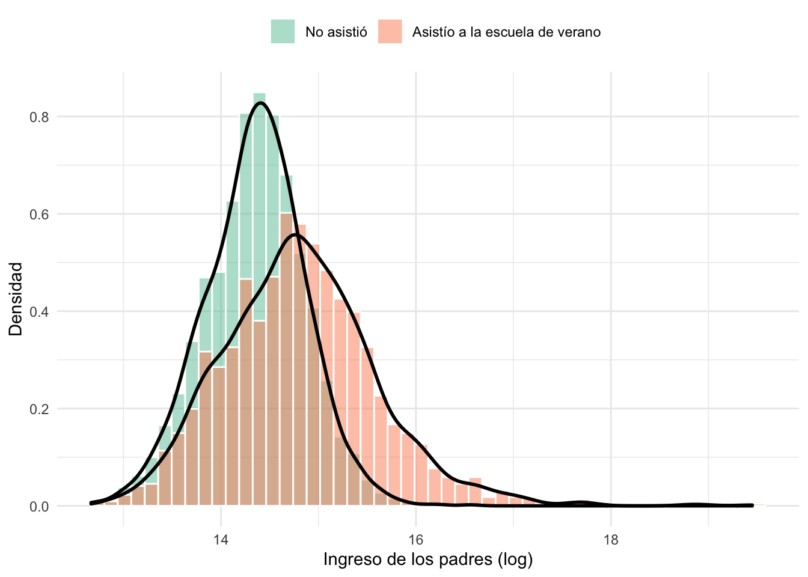{width=672}
:::
:::


En la educación de los padres


::: {.cell}

```{.r .cell-code}
t.test(match_data$parental_schooling[match_data$summerschool==1],match_data$parental_schooling[match_data$summerschool==0], paried=T)  
```

::: {.cell-output .cell-output-stdout}
```

	Welch Two Sample t-test

data:  match_data$parental_schooling[match_data$summerschool == 1] and match_data$parental_schooling[match_data$summerschool == 0]
t = 17.228, df = 2389.2, p-value < 2.2e-16
alternative hypothesis: true difference in means is not equal to 0
95 percent confidence interval:
 0.5741167 0.7216007
sample estimates:
mean of x mean of y 
 11.67607  11.02821 
```
:::
:::


En los resultados previos


::: {.cell}

```{.r .cell-code}
ggplot(filter(match_data),
       aes(x=test_year_5, fill=as.factor(summerschool)))+
       geom_histogram(aes(y=..density..),bins = 50,alpha=0.5,
                       position="identity",color="white")+
       geom_density(alpha=0.0,size=1,show.legend= FALSE)+
       theme_minimal()+
       labs(y="Densidad",x="Resultados año 5",fill=" ")+
       scale_fill_brewer(palette="Set2",labels=c("No asistió","Asistío a la escuela de verano"))+
       theme(legend.position="top")
```

::: {.cell-output-display}
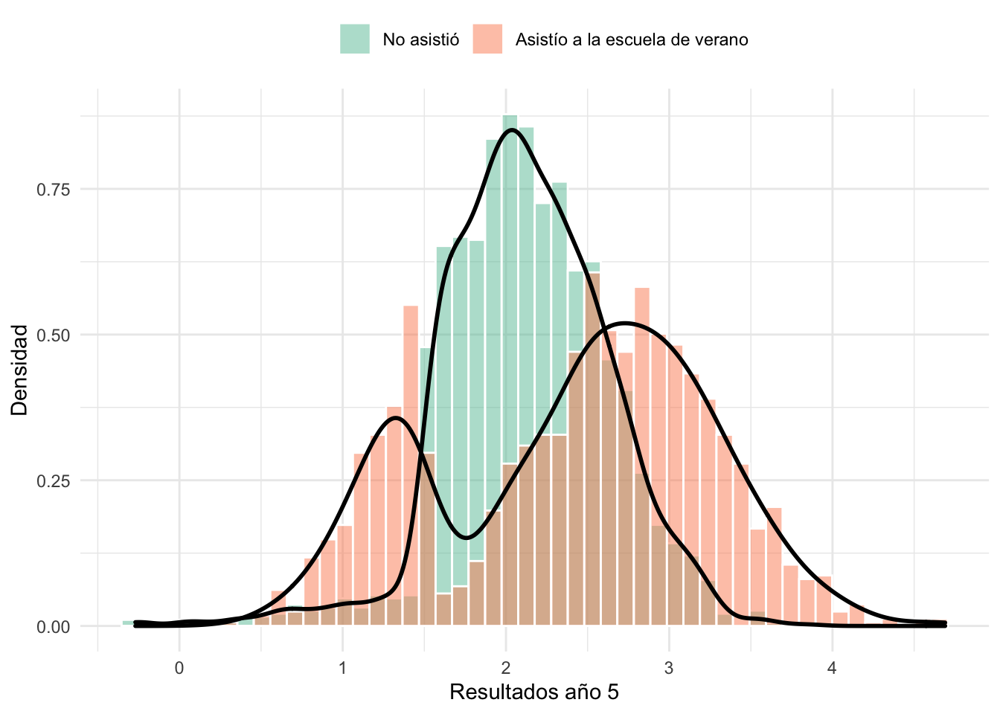{width=672}
:::
:::


Usemos ahora la función `matchit()`:esta crea el propensity score y asigna los clones segun las especificaciones que le demos.

Notar el código de la función: primero especificamos el modelo logit en base al cual se calcularán los propensity scores. Luego especificamos el método para emparejar los scores. Nosotros usaremos vecino más cercano y por defecto trabaja sin reemplazo.


::: {.cell}

```{.r .cell-code}
# Definamos un matching con todo por defecto.

match<- MatchIt::matchit( summerschool ~ as.factor(school_id) + female + parental_schooling + parental_lincome+ test_year_5,  method = "nearest", data= match_data )

match
```

::: {.cell-output .cell-output-stdout}
```
A matchit object
 - method: 1:1 nearest neighbor matching without replacement
 - distance: Propensity score
             - estimated with logistic regression
 - number of obs.: 3475 (original), 3192 (matched)
 - target estimand: ATT
 - covariates: as.factor(school_id), female, parental_schooling, parental_lincome, test_year_5
```
:::
:::


Observemos que lo que obtenemos es un objeto de matchit usando por defecto el vecino más cercano 1:1 y sin reemplazo.

Nos ha obtenido 3196 matchs del total de 3480 filas. 

Una vez el agortmo ha calculado los propensity scores, podemos crear un nuevo dataset que contenga las observaciones con matching usando la función `match.data()` donde ahora tenemos una medida de distancia, subclass que indica los pares.


::: {.cell}

```{.r .cell-code}
matched_data <- match.data(match)

head(matched_data)
```

::: {.cell-output .cell-output-stdout}
```
  person_id school_id summercamp female parental_schooling parental_lincome
1         2        14          1      0                 11         14.73739
2         3         7          1      0                 14         16.08326
3         4         8          0      0                 12         14.60808
4         5         9          1      0                 11         13.75679
5         6        26          1      1                 11         14.70552
6         7        13          1      1                 11         14.35046
  test_year_5 test_year_6 summerschool  distance weights subclass
1    1.297036    2.561449            1 0.4696657       1        1
2    2.761908    3.526002            1 0.8625584       1      503
3    1.772913    2.381062            0 0.4909706       1     1440
4    1.180356    1.959818            1 0.2415371       1     1282
5    2.439802    2.810571            1 0.5107862       1     1335
6    2.229783    2.482312            1 0.3696727       1     1386
```
:::
:::


Los elementos clave que agrega este proceso son weights (pesos computados), subclass (que indica los pares de match), distance (el propensity score estimador) y match.matrix (una matriz de maching).

###7.3 Evaluando la calidad del match

Matching suele ser un proceso efectivo para eliminar las diferencias entre grupo tratado y de control para alcanzar el balance en las covariables, su desemepeño debe ser evaluado.

Si las covariables siguen desvalanceadas después de emparejar, el matching no fue exitoso y se deben probar diferentes especificaciones. 

Lo primero es revisar si hay diferencias significativas entre tratados y controles:


::: {.cell}

```{.r .cell-code}
t.test(matched_data$parental_schooling[matched_data$summerschool==1],matched_data$parental_schooling[matched_data$summerschool==0], paried=T)  
```

::: {.cell-output .cell-output-stdout}
```

	Welch Two Sample t-test

data:  matched_data$parental_schooling[matched_data$summerschool == 1] and matched_data$parental_schooling[matched_data$summerschool == 0]
t = 14.058, df = 2438, p-value < 2.2e-16
alternative hypothesis: true difference in means is not equal to 0
95 percent confidence interval:
 0.4599086 0.6090137
sample estimates:
mean of x mean of y 
 11.67607  11.14160 
```
:::
:::


Y vemos que efectivamente hay...

**Otras opciones en `matchit()`:

La función matchit tiene varias opciones que pueden explorar mejir en su [documentación](https://r.iq.harvard.edu/docs/matchit/2.4-15/User_s_Guide_to.html). Algunas de las más importantes son:

- replace: perimte que se realice el procedimiento con y sin reemplzao. Si deseas que sea con reemplazo se espcifica replace=TRUE
- ratio: si el matching se realiza con reempzalo, se puede especificar el número de controles para caso tratado (uno a muchos). Por ejemplo, ratio=5
- caliper: Se puede identificar una distancia espcifica para el match especificando las desviaciones etsándar en la distancia que son aceptadas. Tambien se puede indicar que, si no hay matches dentro de la distancia especificada, se use el vecino más cercano usando calclosest=TRUE


**Otra opción del matching:**


::: {.cell}

```{.r .cell-code}
# Definamos un matching con todo por defecto.

match<- MatchIt::matchit( summerschool ~ as.factor(school_id) + female + parental_schooling + parental_lincome+ test_year_5,  method = "nearest", data= match_data, replace=TRUE, ratio=5 )

match
```

::: {.cell-output .cell-output-stdout}
```
A matchit object
 - method: 5:1 nearest neighbor matching with replacement
 - distance: Propensity score
             - estimated with logistic regression
 - number of obs.: 3475 (original), 3335 (matched)
 - target estimand: ATT
 - covariates: as.factor(school_id), female, parental_schooling, parental_lincome, test_year_5
```
:::
:::

::: {.cell}

```{.r .cell-code}
matched_data2 <- match.data(match)

head(matched_data2)
```

::: {.cell-output .cell-output-stdout}
```
  person_id school_id summercamp female parental_schooling parental_lincome
1         2        14          1      0                 11         14.73739
2         3         7          1      0                 14         16.08326
3         4         8          0      0                 12         14.60808
4         5         9          1      0                 11         13.75679
5         6        26          1      1                 11         14.70552
6         7        13          1      1                 11         14.35046
  test_year_5 test_year_6 summerschool  distance  weights
1    1.297036    2.561449            1 0.4696657 1.000000
2    2.761908    3.526002            1 0.8625584 1.000000
3    1.772913    2.381062            0 0.4909706 1.307519
4    1.180356    1.959818            1 0.2415371 1.000000
5    2.439802    2.810571            1 0.5107862 1.000000
6    2.229783    2.482312            1 0.3696727 1.000000
```
:::
:::


Chequemos que pasó ahora:


::: {.cell}

```{.r .cell-code}
t.test(matched_data2$parental_schooling[matched_data2$summerschool==1],matched_data2$parental_schooling[matched_data2$summerschool==0], paried=T)  
```

::: {.cell-output .cell-output-stdout}
```

	Welch Two Sample t-test

data:  matched_data2$parental_schooling[matched_data2$summerschool == 1] and matched_data2$parental_schooling[matched_data2$summerschool == 0]
t = 16.542, df = 2459.4, p-value < 2.2e-16
alternative hypothesis: true difference in means is not equal to 0
95 percent confidence interval:
 0.5548659 0.7041074
sample estimates:
mean of x mean of y 
 11.67607  11.04658 
```
:::
:::


Podemos ver que todavia hay diferencias significativas entre tratados y controles.

El paquete ofrece varias herramientas para evaluar el balance después del match.

Podemos inpeccionar mejor este objeto con summary. Esta nos entrega la tabla de balance para los datos y mayores datos del match:


::: {.cell}

```{.r .cell-code}
summary(match)
```

::: {.cell-output .cell-output-stdout}
```

Call:
MatchIt::matchit(formula = summerschool ~ as.factor(school_id) + 
    female + parental_schooling + parental_lincome + test_year_5, 
    data = match_data, method = "nearest", replace = TRUE, ratio = 5)

Summary of Balance for All Data:
                         Means Treated Means Control Std. Mean Diff. Var. Ratio
distance                        0.5273        0.4015          0.6572     1.9333
`as.factor(school_id)`1         0.0244        0.0245         -0.0003          .
`as.factor(school_id)`2         0.0351        0.0314          0.0200          .
`as.factor(school_id)`3         0.0407        0.0314          0.0472          .
`as.factor(school_id)`4         0.0395        0.0357          0.0196          .
`as.factor(school_id)`5         0.0288        0.0314         -0.0154          .
`as.factor(school_id)`6         0.0407        0.0271          0.0687          .
`as.factor(school_id)`7         0.0388        0.0357          0.0165          .
`as.factor(school_id)`8         0.0326        0.0314          0.0067          .
`as.factor(school_id)`9         0.0276        0.0330         -0.0331          .
`as.factor(school_id)`10        0.0313        0.0367         -0.0310          .
`as.factor(school_id)`11        0.0313        0.0362         -0.0279          .
`as.factor(school_id)`12        0.0326        0.0373         -0.0263          .
`as.factor(school_id)`13        0.0301        0.0346         -0.0265          .
`as.factor(school_id)`14        0.0313        0.0373         -0.0340          .
`as.factor(school_id)`15        0.0326        0.0383         -0.0323          .
`as.factor(school_id)`16        0.0282        0.0351         -0.0419          .
`as.factor(school_id)`17        0.0332        0.0298          0.0190          .
`as.factor(school_id)`18        0.0276        0.0357         -0.0494          .
`as.factor(school_id)`19        0.0345        0.0261          0.0460          .
`as.factor(school_id)`20        0.0288        0.0362         -0.0440          .
`as.factor(school_id)`21        0.0357        0.0282          0.0405          .
`as.factor(school_id)`22        0.0382        0.0357          0.0134          .
`as.factor(school_id)`23        0.0357        0.0303          0.0290          .
`as.factor(school_id)`24        0.0232        0.0357         -0.0829          .
`as.factor(school_id)`25        0.0351        0.0277          0.0403          .
`as.factor(school_id)`26        0.0414        0.0357          0.0286          .
`as.factor(school_id)`27        0.0332        0.0309          0.0131          .
`as.factor(school_id)`28        0.0351        0.0415         -0.0349          .
`as.factor(school_id)`29        0.0357        0.0335          0.0118          .
`as.factor(school_id)`30        0.0370        0.0362          0.0041          .
female                          0.5257        0.5072          0.0371          .
parental_schooling             11.6761       11.0282          0.4837     3.2919
parental_lincome               14.8130       14.3513          0.5856     2.3555
test_year_5                     2.4119        2.1291          0.3403     2.8238
                         eCDF Mean eCDF Max
distance                    0.1941   0.3222
`as.factor(school_id)`1     0.0000   0.0000
`as.factor(school_id)`2     0.0037   0.0037
`as.factor(school_id)`3     0.0093   0.0093
`as.factor(school_id)`4     0.0038   0.0038
`as.factor(school_id)`5     0.0026   0.0026
`as.factor(school_id)`6     0.0136   0.0136
`as.factor(school_id)`7     0.0032   0.0032
`as.factor(school_id)`8     0.0012   0.0012
`as.factor(school_id)`9     0.0054   0.0054
`as.factor(school_id)`10    0.0054   0.0054
`as.factor(school_id)`11    0.0049   0.0049
`as.factor(school_id)`12    0.0047   0.0047
`as.factor(school_id)`13    0.0045   0.0045
`as.factor(school_id)`14    0.0059   0.0059
`as.factor(school_id)`15    0.0057   0.0057
`as.factor(school_id)`16    0.0069   0.0069
`as.factor(school_id)`17    0.0034   0.0034
`as.factor(school_id)`18    0.0081   0.0081
`as.factor(school_id)`19    0.0084   0.0084
`as.factor(school_id)`20    0.0074   0.0074
`as.factor(school_id)`21    0.0075   0.0075
`as.factor(school_id)`22    0.0026   0.0026
`as.factor(school_id)`23    0.0054   0.0054
`as.factor(school_id)`24    0.0125   0.0125
`as.factor(school_id)`25    0.0074   0.0074
`as.factor(school_id)`26    0.0057   0.0057
`as.factor(school_id)`27    0.0023   0.0023
`as.factor(school_id)`28    0.0064   0.0064
`as.factor(school_id)`29    0.0022   0.0022
`as.factor(school_id)`30    0.0008   0.0008
female                      0.0185   0.0185
parental_schooling          0.0537   0.2589
parental_lincome            0.1850   0.3131
test_year_5                 0.1751   0.3128

Summary of Balance for Matched Data:
                         Means Treated Means Control Std. Mean Diff. Var. Ratio
distance                        0.5273        0.5255          0.0092     1.0358
`as.factor(school_id)`1         0.0244        0.0209          0.0227          .
`as.factor(school_id)`2         0.0351        0.0298          0.0286          .
`as.factor(school_id)`3         0.0407        0.0356          0.0260          .
`as.factor(school_id)`4         0.0395        0.0370          0.0129          .
`as.factor(school_id)`5         0.0288        0.0272          0.0097          .
`as.factor(school_id)`6         0.0407        0.0625         -0.1103          .
`as.factor(school_id)`7         0.0388        0.0393         -0.0026          .
`as.factor(school_id)`8         0.0326        0.0298          0.0155          .
`as.factor(school_id)`9         0.0276        0.0247          0.0176          .
`as.factor(school_id)`10        0.0313        0.0264          0.0281          .
`as.factor(school_id)`11        0.0313        0.0321         -0.0043          .
`as.factor(school_id)`12        0.0326        0.0347         -0.0120          .
`as.factor(school_id)`13        0.0301        0.0261          0.0235          .
`as.factor(school_id)`14        0.0313        0.0342         -0.0165          .
`as.factor(school_id)`15        0.0326        0.0335         -0.0049          .
`as.factor(school_id)`16        0.0282        0.0248          0.0204          .
`as.factor(school_id)`17        0.0332        0.0318          0.0077          .
`as.factor(school_id)`18        0.0276        0.0263          0.0077          .
`as.factor(school_id)`19        0.0345        0.0372         -0.0151          .
`as.factor(school_id)`20        0.0288        0.0247          0.0247          .
`as.factor(school_id)`21        0.0357        0.0281          0.0412          .
`as.factor(school_id)`22        0.0382        0.0387         -0.0026          .
`as.factor(school_id)`23        0.0357        0.0347          0.0054          .
`as.factor(school_id)`24        0.0232        0.0184          0.0316          .
`as.factor(school_id)`25        0.0351        0.0298          0.0286          .
`as.factor(school_id)`26        0.0414        0.0743         -0.1655          .
`as.factor(school_id)`27        0.0332        0.0366         -0.0189          .
`as.factor(school_id)`28        0.0351        0.0325          0.0143          .
`as.factor(school_id)`29        0.0357        0.0262          0.0513          .
`as.factor(school_id)`30        0.0370        0.0420         -0.0266          .
female                          0.5257        0.5256          0.0003          .
parental_schooling             11.6761       11.7152         -0.0292     1.1247
parental_lincome               14.8130       14.7436          0.0880     1.5306
test_year_5                     2.4119        2.2396          0.2074     2.9590
                         eCDF Mean eCDF Max Std. Pair Dist.
distance                    0.0011   0.0289          0.0194
`as.factor(school_id)`1     0.0035   0.0035          0.2906
`as.factor(school_id)`2     0.0053   0.0053          0.3460
`as.factor(school_id)`3     0.0051   0.0051          0.3709
`as.factor(school_id)`4     0.0025   0.0025          0.3836
`as.factor(school_id)`5     0.0016   0.0016          0.3243
`as.factor(school_id)`6     0.0218   0.0218          0.4945
`as.factor(school_id)`7     0.0005   0.0005          0.3930
`as.factor(school_id)`8     0.0028   0.0028          0.3416
`as.factor(school_id)`9     0.0029   0.0029          0.3084
`as.factor(school_id)`10    0.0049   0.0049          0.3230
`as.factor(school_id)`11    0.0008   0.0008          0.3554
`as.factor(school_id)`12    0.0021   0.0021          0.3621
`as.factor(school_id)`13    0.0040   0.0040          0.3184
`as.factor(school_id)`14    0.0029   0.0029          0.3676
`as.factor(school_id)`15    0.0009   0.0009          0.3550
`as.factor(school_id)`16    0.0034   0.0034          0.3081
`as.factor(school_id)`17    0.0014   0.0014          0.3546
`as.factor(school_id)`18    0.0013   0.0013          0.3199
`as.factor(school_id)`19    0.0028   0.0028          0.3778
`as.factor(school_id)`20    0.0041   0.0041          0.3153
`as.factor(school_id)`21    0.0076   0.0076          0.3329
`as.factor(school_id)`22    0.0005   0.0005          0.3909
`as.factor(school_id)`23    0.0010   0.0010          0.3646
`as.factor(school_id)`24    0.0048   0.0048          0.2698
`as.factor(school_id)`25    0.0053   0.0053          0.3419
`as.factor(school_id)`26    0.0330   0.0330          0.5583
`as.factor(school_id)`27    0.0034   0.0034          0.3770
`as.factor(school_id)`28    0.0026   0.0026          0.3562
`as.factor(school_id)`29    0.0095   0.0095          0.3268
`as.factor(school_id)`30    0.0050   0.0050          0.3879
female                      0.0001   0.0001          1.0036
parental_schooling          0.0085   0.0301          0.3675
parental_lincome            0.0245   0.0605          0.3349
test_year_5                 0.1409   0.2607          0.8596

Sample Sizes:
              Control Treated
All           1879.      1596
Matched (ESS)  542.08    1596
Matched       1739.      1596
Unmatched      140.         0
Discarded        0.         0
```
:::
:::


Tambien podemos graficar el balance:


::: {.cell}

```{.r .cell-code}
plot(summary(match))
```

::: {.cell-output-display}
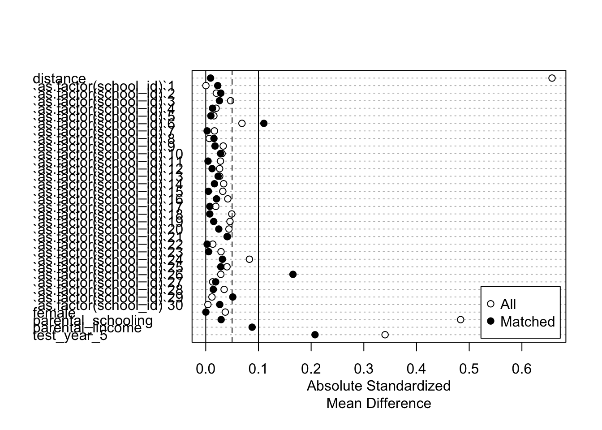{width=672}
:::
:::


Otro elemento a considerar es que ocurre con el tamaño de muestra después del match, si se descartan demasiado unidades puede ser que reduzcamos las estimaciones y pasen a ser imprecisas, esto porque hay un trade off entre balance y tamaño de muestra resultante.


::: {.cell}

```{.r .cell-code}
plot(match, type = "jitter", interactive = FALSE)
```

::: {.cell-output-display}
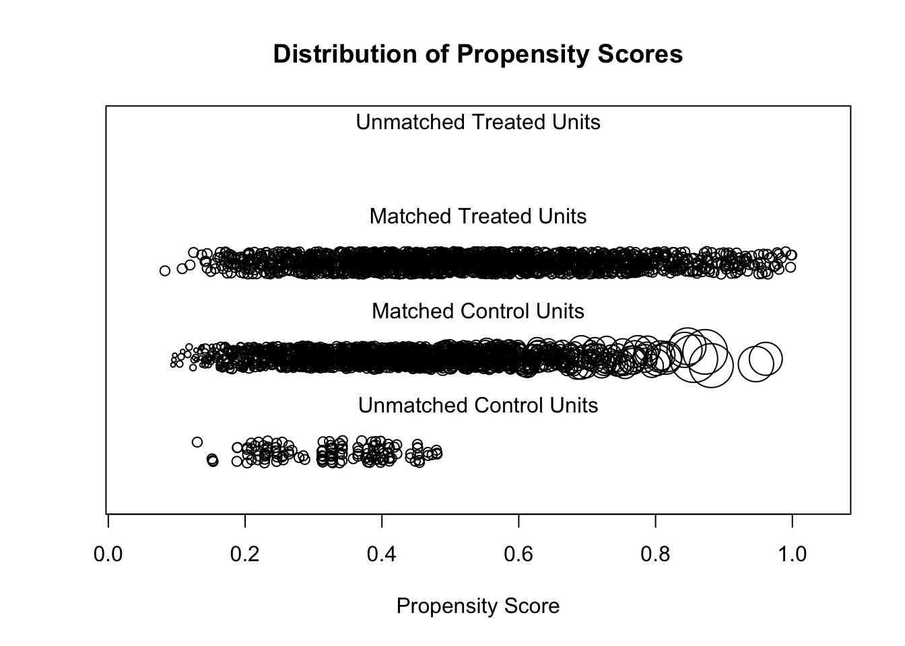{width=672}
:::
:::


Tambien podemos examinar bvisualmente usando gráficos de densidad.


::: {.cell}

```{.r .cell-code}
plot(match, type = "density", interactive = FALSE,
     which.xs = ~female + parental_schooling + parental_lincome)
```

::: {.cell-output-display}
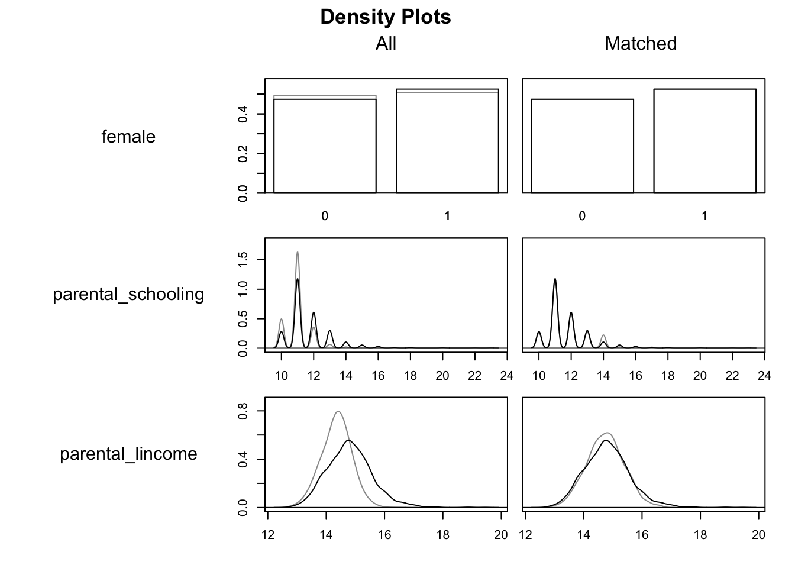{width=672}
:::
:::


### 7.4 Efecto tratamiento de matching

Ahora que tenemos un dataset emparejado el dataset podemos calcular el efecto del tratamiento. 

Una opción es estimar una regression, teniendo cuidado de incluir los pesos de los pares.


::: {.cell}

```{.r .cell-code}
# Estimate LPM

models<-list(
regression_match_nocontrols <-lm (test_year_6 ~ summerschool, data=matched_data ),
regression_match_controls  <- lm (test_year_6 ~ summerschool + as.factor(school_id) + female + parental_schooling + parental_lincome+ test_year_5, data=matched_data, weights=weights )
  )


# Generate table
modelsummary(models, stars = TRUE,statistic = 'std.error',  
             fmt= '%.4f',add_rows = added_stats,
              coef_omit= '(Intercept)', output = 'flextable')
```

::: {.cell-output-display}

```{=html}
<div class="tabwid"><style>.cl-f440ca82{}.cl-f43cfd4e{font-family:'Helvetica';font-size:11pt;font-weight:normal;font-style:normal;text-decoration:none;color:rgba(0, 0, 0, 1.00);background-color:transparent;}.cl-f43d04e2{margin:0;text-align:left;border-bottom: 0 solid rgba(0, 0, 0, 1.00);border-top: 0 solid rgba(0, 0, 0, 1.00);border-left: 0 solid rgba(0, 0, 0, 1.00);border-right: 0 solid rgba(0, 0, 0, 1.00);padding-bottom:5pt;padding-top:5pt;padding-left:5pt;padding-right:5pt;line-height: 1;background-color:transparent;}.cl-f43e0996{width:54pt;background-color:transparent;vertical-align: middle;border-bottom: 0 solid rgba(0, 0, 0, 1.00);border-top: 0 solid rgba(0, 0, 0, 1.00);border-left: 0 solid rgba(0, 0, 0, 1.00);border-right: 0 solid rgba(0, 0, 0, 1.00);margin-bottom:0;margin-top:0;margin-left:0;margin-right:0;}.cl-f43e0997{width:54pt;background-color:transparent;vertical-align: middle;border-bottom: 0 solid rgba(0, 0, 0, 1.00);border-top: 1pt solid rgba(0, 0, 0, 1.00);border-left: 0 solid rgba(0, 0, 0, 1.00);border-right: 0 solid rgba(0, 0, 0, 1.00);margin-bottom:0;margin-top:0;margin-left:0;margin-right:0;}.cl-f43e09a0{width:54pt;background-color:transparent;vertical-align: middle;border-bottom: 2pt solid rgba(102, 102, 102, 1.00);border-top: 0 solid rgba(0, 0, 0, 1.00);border-left: 0 solid rgba(0, 0, 0, 1.00);border-right: 0 solid rgba(0, 0, 0, 1.00);margin-bottom:0;margin-top:0;margin-left:0;margin-right:0;}.cl-f43e09a1{width:54pt;background-color:transparent;vertical-align: middle;border-bottom: 0 solid rgba(255, 255, 255, 0.00);border-top: 0 solid rgba(255, 255, 255, 0.00);border-left: 0 solid rgba(255, 255, 255, 0.00);border-right: 0 solid rgba(255, 255, 255, 0.00);margin-bottom:0;margin-top:0;margin-left:0;margin-right:0;}.cl-f43e09a2{width:54pt;background-color:transparent;vertical-align: middle;border-bottom: 2pt solid rgba(102, 102, 102, 1.00);border-top: 2pt solid rgba(102, 102, 102, 1.00);border-left: 0 solid rgba(0, 0, 0, 1.00);border-right: 0 solid rgba(0, 0, 0, 1.00);margin-bottom:0;margin-top:0;margin-left:0;margin-right:0;}</style><table class='cl-f440ca82'>
```

```{=html}
<thead><tr style="overflow-wrap:break-word;"><td class="cl-f43e09a2"><p class="cl-f43d04e2"><span class="cl-f43cfd4e"> </span></p></td><td class="cl-f43e09a2"><p class="cl-f43d04e2"><span class="cl-f43cfd4e">Model 1</span></p></td><td class="cl-f43e09a2"><p class="cl-f43d04e2"><span class="cl-f43cfd4e">Model 2</span></p></td></tr></thead><tbody><tr style="overflow-wrap:break-word;"><td class="cl-f43e0996"><p class="cl-f43d04e2"><span class="cl-f43cfd4e">summerschool</span></p></td><td class="cl-f43e0996"><p class="cl-f43d04e2"><span class="cl-f43cfd4e">0.7727***</span></p></td><td class="cl-f43e0996"><p class="cl-f43d04e2"><span class="cl-f43cfd4e">0.5702***</span></p></td></tr><tr style="overflow-wrap:break-word;"><td class="cl-f43e0996"><p class="cl-f43d04e2"><span class="cl-f43cfd4e"></span></p></td><td class="cl-f43e0996"><p class="cl-f43d04e2"><span class="cl-f43cfd4e">(0.0207)</span></p></td><td class="cl-f43e0996"><p class="cl-f43d04e2"><span class="cl-f43cfd4e">(0.0137)</span></p></td></tr><tr style="overflow-wrap:break-word;"><td class="cl-f43e0996"><p class="cl-f43d04e2"><span class="cl-f43cfd4e">as.factor(school_id)2</span></p></td><td class="cl-f43e0996"><p class="cl-f43d04e2"><span class="cl-f43cfd4e"></span></p></td><td class="cl-f43e0996"><p class="cl-f43d04e2"><span class="cl-f43cfd4e">-0.0074</span></p></td></tr><tr style="overflow-wrap:break-word;"><td class="cl-f43e0996"><p class="cl-f43d04e2"><span class="cl-f43cfd4e"></span></p></td><td class="cl-f43e0996"><p class="cl-f43d04e2"><span class="cl-f43cfd4e"></span></p></td><td class="cl-f43e0996"><p class="cl-f43d04e2"><span class="cl-f43cfd4e">(0.0554)</span></p></td></tr><tr style="overflow-wrap:break-word;"><td class="cl-f43e0996"><p class="cl-f43d04e2"><span class="cl-f43cfd4e">as.factor(school_id)3</span></p></td><td class="cl-f43e0996"><p class="cl-f43d04e2"><span class="cl-f43cfd4e"></span></p></td><td class="cl-f43e0996"><p class="cl-f43d04e2"><span class="cl-f43cfd4e">0.0164</span></p></td></tr><tr style="overflow-wrap:break-word;"><td class="cl-f43e0996"><p class="cl-f43d04e2"><span class="cl-f43cfd4e"></span></p></td><td class="cl-f43e0996"><p class="cl-f43d04e2"><span class="cl-f43cfd4e"></span></p></td><td class="cl-f43e0996"><p class="cl-f43d04e2"><span class="cl-f43cfd4e">(0.0544)</span></p></td></tr><tr style="overflow-wrap:break-word;"><td class="cl-f43e0996"><p class="cl-f43d04e2"><span class="cl-f43cfd4e">as.factor(school_id)4</span></p></td><td class="cl-f43e0996"><p class="cl-f43d04e2"><span class="cl-f43cfd4e"></span></p></td><td class="cl-f43e0996"><p class="cl-f43d04e2"><span class="cl-f43cfd4e">-0.0746</span></p></td></tr><tr style="overflow-wrap:break-word;"><td class="cl-f43e0996"><p class="cl-f43d04e2"><span class="cl-f43cfd4e"></span></p></td><td class="cl-f43e0996"><p class="cl-f43d04e2"><span class="cl-f43cfd4e"></span></p></td><td class="cl-f43e0996"><p class="cl-f43d04e2"><span class="cl-f43cfd4e">(0.0539)</span></p></td></tr><tr style="overflow-wrap:break-word;"><td class="cl-f43e0996"><p class="cl-f43d04e2"><span class="cl-f43cfd4e">as.factor(school_id)5</span></p></td><td class="cl-f43e0996"><p class="cl-f43d04e2"><span class="cl-f43cfd4e"></span></p></td><td class="cl-f43e0996"><p class="cl-f43d04e2"><span class="cl-f43cfd4e">-0.0555</span></p></td></tr><tr style="overflow-wrap:break-word;"><td class="cl-f43e0996"><p class="cl-f43d04e2"><span class="cl-f43cfd4e"></span></p></td><td class="cl-f43e0996"><p class="cl-f43d04e2"><span class="cl-f43cfd4e"></span></p></td><td class="cl-f43e0996"><p class="cl-f43d04e2"><span class="cl-f43cfd4e">(0.0568)</span></p></td></tr><tr style="overflow-wrap:break-word;"><td class="cl-f43e0996"><p class="cl-f43d04e2"><span class="cl-f43cfd4e">as.factor(school_id)6</span></p></td><td class="cl-f43e0996"><p class="cl-f43d04e2"><span class="cl-f43cfd4e"></span></p></td><td class="cl-f43e0996"><p class="cl-f43d04e2"><span class="cl-f43cfd4e">-0.0207</span></p></td></tr><tr style="overflow-wrap:break-word;"><td class="cl-f43e0996"><p class="cl-f43d04e2"><span class="cl-f43cfd4e"></span></p></td><td class="cl-f43e0996"><p class="cl-f43d04e2"><span class="cl-f43cfd4e"></span></p></td><td class="cl-f43e0996"><p class="cl-f43d04e2"><span class="cl-f43cfd4e">(0.0549)</span></p></td></tr><tr style="overflow-wrap:break-word;"><td class="cl-f43e0996"><p class="cl-f43d04e2"><span class="cl-f43cfd4e">as.factor(school_id)7</span></p></td><td class="cl-f43e0996"><p class="cl-f43d04e2"><span class="cl-f43cfd4e"></span></p></td><td class="cl-f43e0996"><p class="cl-f43d04e2"><span class="cl-f43cfd4e">-0.0141</span></p></td></tr><tr style="overflow-wrap:break-word;"><td class="cl-f43e0996"><p class="cl-f43d04e2"><span class="cl-f43cfd4e"></span></p></td><td class="cl-f43e0996"><p class="cl-f43d04e2"><span class="cl-f43cfd4e"></span></p></td><td class="cl-f43e0996"><p class="cl-f43d04e2"><span class="cl-f43cfd4e">(0.0541)</span></p></td></tr><tr style="overflow-wrap:break-word;"><td class="cl-f43e0996"><p class="cl-f43d04e2"><span class="cl-f43cfd4e">as.factor(school_id)8</span></p></td><td class="cl-f43e0996"><p class="cl-f43d04e2"><span class="cl-f43cfd4e"></span></p></td><td class="cl-f43e0996"><p class="cl-f43d04e2"><span class="cl-f43cfd4e">-0.0418</span></p></td></tr><tr style="overflow-wrap:break-word;"><td class="cl-f43e0996"><p class="cl-f43d04e2"><span class="cl-f43cfd4e"></span></p></td><td class="cl-f43e0996"><p class="cl-f43d04e2"><span class="cl-f43cfd4e"></span></p></td><td class="cl-f43e0996"><p class="cl-f43d04e2"><span class="cl-f43cfd4e">(0.0559)</span></p></td></tr><tr style="overflow-wrap:break-word;"><td class="cl-f43e0996"><p class="cl-f43d04e2"><span class="cl-f43cfd4e">as.factor(school_id)9</span></p></td><td class="cl-f43e0996"><p class="cl-f43d04e2"><span class="cl-f43cfd4e"></span></p></td><td class="cl-f43e0996"><p class="cl-f43d04e2"><span class="cl-f43cfd4e">-0.0935</span></p></td></tr><tr style="overflow-wrap:break-word;"><td class="cl-f43e0996"><p class="cl-f43d04e2"><span class="cl-f43cfd4e"></span></p></td><td class="cl-f43e0996"><p class="cl-f43d04e2"><span class="cl-f43cfd4e"></span></p></td><td class="cl-f43e0996"><p class="cl-f43d04e2"><span class="cl-f43cfd4e">(0.0581)</span></p></td></tr><tr style="overflow-wrap:break-word;"><td class="cl-f43e0996"><p class="cl-f43d04e2"><span class="cl-f43cfd4e">as.factor(school_id)10</span></p></td><td class="cl-f43e0996"><p class="cl-f43d04e2"><span class="cl-f43cfd4e"></span></p></td><td class="cl-f43e0996"><p class="cl-f43d04e2"><span class="cl-f43cfd4e">-0.0624</span></p></td></tr><tr style="overflow-wrap:break-word;"><td class="cl-f43e0996"><p class="cl-f43d04e2"><span class="cl-f43cfd4e"></span></p></td><td class="cl-f43e0996"><p class="cl-f43d04e2"><span class="cl-f43cfd4e"></span></p></td><td class="cl-f43e0996"><p class="cl-f43d04e2"><span class="cl-f43cfd4e">(0.0554)</span></p></td></tr><tr style="overflow-wrap:break-word;"><td class="cl-f43e0996"><p class="cl-f43d04e2"><span class="cl-f43cfd4e">as.factor(school_id)11</span></p></td><td class="cl-f43e0996"><p class="cl-f43d04e2"><span class="cl-f43cfd4e"></span></p></td><td class="cl-f43e0996"><p class="cl-f43d04e2"><span class="cl-f43cfd4e">-0.0809</span></p></td></tr><tr style="overflow-wrap:break-word;"><td class="cl-f43e0996"><p class="cl-f43d04e2"><span class="cl-f43cfd4e"></span></p></td><td class="cl-f43e0996"><p class="cl-f43d04e2"><span class="cl-f43cfd4e"></span></p></td><td class="cl-f43e0996"><p class="cl-f43d04e2"><span class="cl-f43cfd4e">(0.0553)</span></p></td></tr><tr style="overflow-wrap:break-word;"><td class="cl-f43e0996"><p class="cl-f43d04e2"><span class="cl-f43cfd4e">as.factor(school_id)12</span></p></td><td class="cl-f43e0996"><p class="cl-f43d04e2"><span class="cl-f43cfd4e"></span></p></td><td class="cl-f43e0996"><p class="cl-f43d04e2"><span class="cl-f43cfd4e">-0.0186</span></p></td></tr><tr style="overflow-wrap:break-word;"><td class="cl-f43e0996"><p class="cl-f43d04e2"><span class="cl-f43cfd4e"></span></p></td><td class="cl-f43e0996"><p class="cl-f43d04e2"><span class="cl-f43cfd4e"></span></p></td><td class="cl-f43e0996"><p class="cl-f43d04e2"><span class="cl-f43cfd4e">(0.0554)</span></p></td></tr><tr style="overflow-wrap:break-word;"><td class="cl-f43e0996"><p class="cl-f43d04e2"><span class="cl-f43cfd4e">as.factor(school_id)13</span></p></td><td class="cl-f43e0996"><p class="cl-f43d04e2"><span class="cl-f43cfd4e"></span></p></td><td class="cl-f43e0996"><p class="cl-f43d04e2"><span class="cl-f43cfd4e">-0.0704</span></p></td></tr><tr style="overflow-wrap:break-word;"><td class="cl-f43e0996"><p class="cl-f43d04e2"><span class="cl-f43cfd4e"></span></p></td><td class="cl-f43e0996"><p class="cl-f43d04e2"><span class="cl-f43cfd4e"></span></p></td><td class="cl-f43e0996"><p class="cl-f43d04e2"><span class="cl-f43cfd4e">(0.0560)</span></p></td></tr><tr style="overflow-wrap:break-word;"><td class="cl-f43e0996"><p class="cl-f43d04e2"><span class="cl-f43cfd4e">as.factor(school_id)14</span></p></td><td class="cl-f43e0996"><p class="cl-f43d04e2"><span class="cl-f43cfd4e"></span></p></td><td class="cl-f43e0996"><p class="cl-f43d04e2"><span class="cl-f43cfd4e">-0.0141</span></p></td></tr><tr style="overflow-wrap:break-word;"><td class="cl-f43e0996"><p class="cl-f43d04e2"><span class="cl-f43cfd4e"></span></p></td><td class="cl-f43e0996"><p class="cl-f43d04e2"><span class="cl-f43cfd4e"></span></p></td><td class="cl-f43e0996"><p class="cl-f43d04e2"><span class="cl-f43cfd4e">(0.0560)</span></p></td></tr><tr style="overflow-wrap:break-word;"><td class="cl-f43e0996"><p class="cl-f43d04e2"><span class="cl-f43cfd4e">as.factor(school_id)15</span></p></td><td class="cl-f43e0996"><p class="cl-f43d04e2"><span class="cl-f43cfd4e"></span></p></td><td class="cl-f43e0996"><p class="cl-f43d04e2"><span class="cl-f43cfd4e">-0.0054</span></p></td></tr><tr style="overflow-wrap:break-word;"><td class="cl-f43e0996"><p class="cl-f43d04e2"><span class="cl-f43cfd4e"></span></p></td><td class="cl-f43e0996"><p class="cl-f43d04e2"><span class="cl-f43cfd4e"></span></p></td><td class="cl-f43e0996"><p class="cl-f43d04e2"><span class="cl-f43cfd4e">(0.0545)</span></p></td></tr><tr style="overflow-wrap:break-word;"><td class="cl-f43e0996"><p class="cl-f43d04e2"><span class="cl-f43cfd4e">as.factor(school_id)16</span></p></td><td class="cl-f43e0996"><p class="cl-f43d04e2"><span class="cl-f43cfd4e"></span></p></td><td class="cl-f43e0996"><p class="cl-f43d04e2"><span class="cl-f43cfd4e">-0.0707</span></p></td></tr><tr style="overflow-wrap:break-word;"><td class="cl-f43e0996"><p class="cl-f43d04e2"><span class="cl-f43cfd4e"></span></p></td><td class="cl-f43e0996"><p class="cl-f43d04e2"><span class="cl-f43cfd4e"></span></p></td><td class="cl-f43e0996"><p class="cl-f43d04e2"><span class="cl-f43cfd4e">(0.0568)</span></p></td></tr><tr style="overflow-wrap:break-word;"><td class="cl-f43e0996"><p class="cl-f43d04e2"><span class="cl-f43cfd4e">as.factor(school_id)17</span></p></td><td class="cl-f43e0996"><p class="cl-f43d04e2"><span class="cl-f43cfd4e"></span></p></td><td class="cl-f43e0996"><p class="cl-f43d04e2"><span class="cl-f43cfd4e">-0.0701</span></p></td></tr><tr style="overflow-wrap:break-word;"><td class="cl-f43e0996"><p class="cl-f43d04e2"><span class="cl-f43cfd4e"></span></p></td><td class="cl-f43e0996"><p class="cl-f43d04e2"><span class="cl-f43cfd4e"></span></p></td><td class="cl-f43e0996"><p class="cl-f43d04e2"><span class="cl-f43cfd4e">(0.0557)</span></p></td></tr><tr style="overflow-wrap:break-word;"><td class="cl-f43e0996"><p class="cl-f43d04e2"><span class="cl-f43cfd4e">as.factor(school_id)18</span></p></td><td class="cl-f43e0996"><p class="cl-f43d04e2"><span class="cl-f43cfd4e"></span></p></td><td class="cl-f43e0996"><p class="cl-f43d04e2"><span class="cl-f43cfd4e">-0.0575</span></p></td></tr><tr style="overflow-wrap:break-word;"><td class="cl-f43e0996"><p class="cl-f43d04e2"><span class="cl-f43cfd4e"></span></p></td><td class="cl-f43e0996"><p class="cl-f43d04e2"><span class="cl-f43cfd4e"></span></p></td><td class="cl-f43e0996"><p class="cl-f43d04e2"><span class="cl-f43cfd4e">(0.0568)</span></p></td></tr><tr style="overflow-wrap:break-word;"><td class="cl-f43e0996"><p class="cl-f43d04e2"><span class="cl-f43cfd4e">as.factor(school_id)19</span></p></td><td class="cl-f43e0996"><p class="cl-f43d04e2"><span class="cl-f43cfd4e"></span></p></td><td class="cl-f43e0996"><p class="cl-f43d04e2"><span class="cl-f43cfd4e">0.0136</span></p></td></tr><tr style="overflow-wrap:break-word;"><td class="cl-f43e0996"><p class="cl-f43d04e2"><span class="cl-f43cfd4e"></span></p></td><td class="cl-f43e0996"><p class="cl-f43d04e2"><span class="cl-f43cfd4e"></span></p></td><td class="cl-f43e0996"><p class="cl-f43d04e2"><span class="cl-f43cfd4e">(0.0563)</span></p></td></tr><tr style="overflow-wrap:break-word;"><td class="cl-f43e0996"><p class="cl-f43d04e2"><span class="cl-f43cfd4e">as.factor(school_id)20</span></p></td><td class="cl-f43e0996"><p class="cl-f43d04e2"><span class="cl-f43cfd4e"></span></p></td><td class="cl-f43e0996"><p class="cl-f43d04e2"><span class="cl-f43cfd4e">0.0069</span></p></td></tr><tr style="overflow-wrap:break-word;"><td class="cl-f43e0996"><p class="cl-f43d04e2"><span class="cl-f43cfd4e"></span></p></td><td class="cl-f43e0996"><p class="cl-f43d04e2"><span class="cl-f43cfd4e"></span></p></td><td class="cl-f43e0996"><p class="cl-f43d04e2"><span class="cl-f43cfd4e">(0.0568)</span></p></td></tr><tr style="overflow-wrap:break-word;"><td class="cl-f43e0996"><p class="cl-f43d04e2"><span class="cl-f43cfd4e">as.factor(school_id)21</span></p></td><td class="cl-f43e0996"><p class="cl-f43d04e2"><span class="cl-f43cfd4e"></span></p></td><td class="cl-f43e0996"><p class="cl-f43d04e2"><span class="cl-f43cfd4e">-0.1180*</span></p></td></tr><tr style="overflow-wrap:break-word;"><td class="cl-f43e0996"><p class="cl-f43d04e2"><span class="cl-f43cfd4e"></span></p></td><td class="cl-f43e0996"><p class="cl-f43d04e2"><span class="cl-f43cfd4e"></span></p></td><td class="cl-f43e0996"><p class="cl-f43d04e2"><span class="cl-f43cfd4e">(0.0555)</span></p></td></tr><tr style="overflow-wrap:break-word;"><td class="cl-f43e0996"><p class="cl-f43d04e2"><span class="cl-f43cfd4e">as.factor(school_id)22</span></p></td><td class="cl-f43e0996"><p class="cl-f43d04e2"><span class="cl-f43cfd4e"></span></p></td><td class="cl-f43e0996"><p class="cl-f43d04e2"><span class="cl-f43cfd4e">-0.0682</span></p></td></tr><tr style="overflow-wrap:break-word;"><td class="cl-f43e0996"><p class="cl-f43d04e2"><span class="cl-f43cfd4e"></span></p></td><td class="cl-f43e0996"><p class="cl-f43d04e2"><span class="cl-f43cfd4e"></span></p></td><td class="cl-f43e0996"><p class="cl-f43d04e2"><span class="cl-f43cfd4e">(0.0538)</span></p></td></tr><tr style="overflow-wrap:break-word;"><td class="cl-f43e0996"><p class="cl-f43d04e2"><span class="cl-f43cfd4e">as.factor(school_id)23</span></p></td><td class="cl-f43e0996"><p class="cl-f43d04e2"><span class="cl-f43cfd4e"></span></p></td><td class="cl-f43e0996"><p class="cl-f43d04e2"><span class="cl-f43cfd4e">-0.0736</span></p></td></tr><tr style="overflow-wrap:break-word;"><td class="cl-f43e0996"><p class="cl-f43d04e2"><span class="cl-f43cfd4e"></span></p></td><td class="cl-f43e0996"><p class="cl-f43d04e2"><span class="cl-f43cfd4e"></span></p></td><td class="cl-f43e0996"><p class="cl-f43d04e2"><span class="cl-f43cfd4e">(0.0554)</span></p></td></tr><tr style="overflow-wrap:break-word;"><td class="cl-f43e0996"><p class="cl-f43d04e2"><span class="cl-f43cfd4e">as.factor(school_id)24</span></p></td><td class="cl-f43e0996"><p class="cl-f43d04e2"><span class="cl-f43cfd4e"></span></p></td><td class="cl-f43e0996"><p class="cl-f43d04e2"><span class="cl-f43cfd4e">-0.0402</span></p></td></tr><tr style="overflow-wrap:break-word;"><td class="cl-f43e0996"><p class="cl-f43d04e2"><span class="cl-f43cfd4e"></span></p></td><td class="cl-f43e0996"><p class="cl-f43d04e2"><span class="cl-f43cfd4e"></span></p></td><td class="cl-f43e0996"><p class="cl-f43d04e2"><span class="cl-f43cfd4e">(0.0589)</span></p></td></tr><tr style="overflow-wrap:break-word;"><td class="cl-f43e0996"><p class="cl-f43d04e2"><span class="cl-f43cfd4e">as.factor(school_id)25</span></p></td><td class="cl-f43e0996"><p class="cl-f43d04e2"><span class="cl-f43cfd4e"></span></p></td><td class="cl-f43e0996"><p class="cl-f43d04e2"><span class="cl-f43cfd4e">-0.0933+</span></p></td></tr><tr style="overflow-wrap:break-word;"><td class="cl-f43e0996"><p class="cl-f43d04e2"><span class="cl-f43cfd4e"></span></p></td><td class="cl-f43e0996"><p class="cl-f43d04e2"><span class="cl-f43cfd4e"></span></p></td><td class="cl-f43e0996"><p class="cl-f43d04e2"><span class="cl-f43cfd4e">(0.0556)</span></p></td></tr><tr style="overflow-wrap:break-word;"><td class="cl-f43e0996"><p class="cl-f43d04e2"><span class="cl-f43cfd4e">as.factor(school_id)26</span></p></td><td class="cl-f43e0996"><p class="cl-f43d04e2"><span class="cl-f43cfd4e"></span></p></td><td class="cl-f43e0996"><p class="cl-f43d04e2"><span class="cl-f43cfd4e">-0.0641</span></p></td></tr><tr style="overflow-wrap:break-word;"><td class="cl-f43e0996"><p class="cl-f43d04e2"><span class="cl-f43cfd4e"></span></p></td><td class="cl-f43e0996"><p class="cl-f43d04e2"><span class="cl-f43cfd4e"></span></p></td><td class="cl-f43e0996"><p class="cl-f43d04e2"><span class="cl-f43cfd4e">(0.0541)</span></p></td></tr><tr style="overflow-wrap:break-word;"><td class="cl-f43e0996"><p class="cl-f43d04e2"><span class="cl-f43cfd4e">as.factor(school_id)27</span></p></td><td class="cl-f43e0996"><p class="cl-f43d04e2"><span class="cl-f43cfd4e"></span></p></td><td class="cl-f43e0996"><p class="cl-f43d04e2"><span class="cl-f43cfd4e">-0.0285</span></p></td></tr><tr style="overflow-wrap:break-word;"><td class="cl-f43e0996"><p class="cl-f43d04e2"><span class="cl-f43cfd4e"></span></p></td><td class="cl-f43e0996"><p class="cl-f43d04e2"><span class="cl-f43cfd4e"></span></p></td><td class="cl-f43e0996"><p class="cl-f43d04e2"><span class="cl-f43cfd4e">(0.0558)</span></p></td></tr><tr style="overflow-wrap:break-word;"><td class="cl-f43e0996"><p class="cl-f43d04e2"><span class="cl-f43cfd4e">as.factor(school_id)28</span></p></td><td class="cl-f43e0996"><p class="cl-f43d04e2"><span class="cl-f43cfd4e"></span></p></td><td class="cl-f43e0996"><p class="cl-f43d04e2"><span class="cl-f43cfd4e">-0.0400</span></p></td></tr><tr style="overflow-wrap:break-word;"><td class="cl-f43e0996"><p class="cl-f43d04e2"><span class="cl-f43cfd4e"></span></p></td><td class="cl-f43e0996"><p class="cl-f43d04e2"><span class="cl-f43cfd4e"></span></p></td><td class="cl-f43e0996"><p class="cl-f43d04e2"><span class="cl-f43cfd4e">(0.0544)</span></p></td></tr><tr style="overflow-wrap:break-word;"><td class="cl-f43e0996"><p class="cl-f43d04e2"><span class="cl-f43cfd4e">as.factor(school_id)29</span></p></td><td class="cl-f43e0996"><p class="cl-f43d04e2"><span class="cl-f43cfd4e"></span></p></td><td class="cl-f43e0996"><p class="cl-f43d04e2"><span class="cl-f43cfd4e">-0.1007+</span></p></td></tr><tr style="overflow-wrap:break-word;"><td class="cl-f43e0996"><p class="cl-f43d04e2"><span class="cl-f43cfd4e"></span></p></td><td class="cl-f43e0996"><p class="cl-f43d04e2"><span class="cl-f43cfd4e"></span></p></td><td class="cl-f43e0996"><p class="cl-f43d04e2"><span class="cl-f43cfd4e">(0.0546)</span></p></td></tr><tr style="overflow-wrap:break-word;"><td class="cl-f43e0996"><p class="cl-f43d04e2"><span class="cl-f43cfd4e">as.factor(school_id)30</span></p></td><td class="cl-f43e0996"><p class="cl-f43d04e2"><span class="cl-f43cfd4e"></span></p></td><td class="cl-f43e0996"><p class="cl-f43d04e2"><span class="cl-f43cfd4e">-0.0286</span></p></td></tr><tr style="overflow-wrap:break-word;"><td class="cl-f43e0996"><p class="cl-f43d04e2"><span class="cl-f43cfd4e"></span></p></td><td class="cl-f43e0996"><p class="cl-f43d04e2"><span class="cl-f43cfd4e"></span></p></td><td class="cl-f43e0996"><p class="cl-f43d04e2"><span class="cl-f43cfd4e">(0.0540)</span></p></td></tr><tr style="overflow-wrap:break-word;"><td class="cl-f43e0996"><p class="cl-f43d04e2"><span class="cl-f43cfd4e">female</span></p></td><td class="cl-f43e0996"><p class="cl-f43d04e2"><span class="cl-f43cfd4e"></span></p></td><td class="cl-f43e0996"><p class="cl-f43d04e2"><span class="cl-f43cfd4e">-0.0210</span></p></td></tr><tr style="overflow-wrap:break-word;"><td class="cl-f43e0996"><p class="cl-f43d04e2"><span class="cl-f43cfd4e"></span></p></td><td class="cl-f43e0996"><p class="cl-f43d04e2"><span class="cl-f43cfd4e"></span></p></td><td class="cl-f43e0996"><p class="cl-f43d04e2"><span class="cl-f43cfd4e">(0.0132)</span></p></td></tr><tr style="overflow-wrap:break-word;"><td class="cl-f43e0996"><p class="cl-f43d04e2"><span class="cl-f43cfd4e">parental_schooling</span></p></td><td class="cl-f43e0996"><p class="cl-f43d04e2"><span class="cl-f43cfd4e"></span></p></td><td class="cl-f43e0996"><p class="cl-f43d04e2"><span class="cl-f43cfd4e">-0.0283**</span></p></td></tr><tr style="overflow-wrap:break-word;"><td class="cl-f43e0996"><p class="cl-f43d04e2"><span class="cl-f43cfd4e"></span></p></td><td class="cl-f43e0996"><p class="cl-f43d04e2"><span class="cl-f43cfd4e"></span></p></td><td class="cl-f43e0996"><p class="cl-f43d04e2"><span class="cl-f43cfd4e">(0.0100)</span></p></td></tr><tr style="overflow-wrap:break-word;"><td class="cl-f43e0996"><p class="cl-f43d04e2"><span class="cl-f43cfd4e">parental_lincome</span></p></td><td class="cl-f43e0996"><p class="cl-f43d04e2"><span class="cl-f43cfd4e"></span></p></td><td class="cl-f43e0996"><p class="cl-f43d04e2"><span class="cl-f43cfd4e">0.2875***</span></p></td></tr><tr style="overflow-wrap:break-word;"><td class="cl-f43e0996"><p class="cl-f43d04e2"><span class="cl-f43cfd4e"></span></p></td><td class="cl-f43e0996"><p class="cl-f43d04e2"><span class="cl-f43cfd4e"></span></p></td><td class="cl-f43e0996"><p class="cl-f43d04e2"><span class="cl-f43cfd4e">(0.0189)</span></p></td></tr><tr style="overflow-wrap:break-word;"><td class="cl-f43e0996"><p class="cl-f43d04e2"><span class="cl-f43cfd4e">test_year_5</span></p></td><td class="cl-f43e0996"><p class="cl-f43d04e2"><span class="cl-f43cfd4e"></span></p></td><td class="cl-f43e0996"><p class="cl-f43d04e2"><span class="cl-f43cfd4e">0.4893***</span></p></td></tr><tr style="overflow-wrap:break-word;"><td class="cl-f43e0996"><p class="cl-f43d04e2"><span class="cl-f43cfd4e"></span></p></td><td class="cl-f43e0996"><p class="cl-f43d04e2"><span class="cl-f43cfd4e"></span></p></td><td class="cl-f43e0996"><p class="cl-f43d04e2"><span class="cl-f43cfd4e">(0.0127)</span></p></td></tr><tr style="overflow-wrap:break-word;"><td class="cl-f43e0997"><p class="cl-f43d04e2"><span class="cl-f43cfd4e">Num.Obs.</span></p></td><td class="cl-f43e0997"><p class="cl-f43d04e2"><span class="cl-f43cfd4e">3192</span></p></td><td class="cl-f43e0997"><p class="cl-f43d04e2"><span class="cl-f43cfd4e">3192</span></p></td></tr><tr style="overflow-wrap:break-word;"><td class="cl-f43e0996"><p class="cl-f43d04e2"><span class="cl-f43cfd4e">R2</span></p></td><td class="cl-f43e0996"><p class="cl-f43d04e2"><span class="cl-f43cfd4e">0.304</span></p></td><td class="cl-f43e0996"><p class="cl-f43d04e2"><span class="cl-f43cfd4e">0.721</span></p></td></tr><tr style="overflow-wrap:break-word;"><td class="cl-f43e0996"><p class="cl-f43d04e2"><span class="cl-f43cfd4e">R2 Adj.</span></p></td><td class="cl-f43e0996"><p class="cl-f43d04e2"><span class="cl-f43cfd4e">0.304</span></p></td><td class="cl-f43e0996"><p class="cl-f43d04e2"><span class="cl-f43cfd4e">0.718</span></p></td></tr><tr style="overflow-wrap:break-word;"><td class="cl-f43e0996"><p class="cl-f43d04e2"><span class="cl-f43cfd4e">AIC</span></p></td><td class="cl-f43e0996"><p class="cl-f43d04e2"><span class="cl-f43cfd4e">5640.1</span></p></td><td class="cl-f43e0996"><p class="cl-f43d04e2"><span class="cl-f43cfd4e">2788.8</span></p></td></tr><tr style="overflow-wrap:break-word;"><td class="cl-f43e0996"><p class="cl-f43d04e2"><span class="cl-f43cfd4e">BIC</span></p></td><td class="cl-f43e0996"><p class="cl-f43d04e2"><span class="cl-f43cfd4e">5658.4</span></p></td><td class="cl-f43e0996"><p class="cl-f43d04e2"><span class="cl-f43cfd4e">3007.3</span></p></td></tr><tr style="overflow-wrap:break-word;"><td class="cl-f43e0996"><p class="cl-f43d04e2"><span class="cl-f43cfd4e">Log.Lik.</span></p></td><td class="cl-f43e0996"><p class="cl-f43d04e2"><span class="cl-f43cfd4e">-2817.074</span></p></td><td class="cl-f43e0996"><p class="cl-f43d04e2"><span class="cl-f43cfd4e">-1358.414</span></p></td></tr><tr style="overflow-wrap:break-word;"><td class="cl-f43e0996"><p class="cl-f43d04e2"><span class="cl-f43cfd4e">F</span></p></td><td class="cl-f43e0996"><p class="cl-f43d04e2"><span class="cl-f43cfd4e">1392.043</span></p></td><td class="cl-f43e0996"><p class="cl-f43d04e2"><span class="cl-f43cfd4e">239.796</span></p></td></tr><tr style="overflow-wrap:break-word;"><td class="cl-f43e0996"><p class="cl-f43d04e2"><span class="cl-f43cfd4e">RMSE</span></p></td><td class="cl-f43e0996"><p class="cl-f43d04e2"><span class="cl-f43cfd4e">0.59</span></p></td><td class="cl-f43e0996"><p class="cl-f43d04e2"><span class="cl-f43cfd4e">0.37</span></p></td></tr><tr style="overflow-wrap:break-word;"><td class="cl-f43e09a0"><p class="cl-f43d04e2"><span class="cl-f43cfd4e">Mean of Dep. </span></p></td><td class="cl-f43e09a0"><p class="cl-f43d04e2"><span class="cl-f43cfd4e">0.4591</span></p></td><td class="cl-f43e09a0"><p class="cl-f43d04e2"><span class="cl-f43cfd4e">0.4591</span></p></td></tr></tbody><tfoot><tr style="overflow-wrap:break-word;"><td  colspan="3"class="cl-f43e09a1"><p class="cl-f43d04e2"><span class="cl-f43cfd4e">+ p &lt; 0.1, * p &lt; 0.05, ** p &lt; 0.01, *** p &lt; 0.001</span></p></td></tr></tfoot></table></div>
```

:::
:::


Podemos usar la librería `marginaleffects`para  computar el ATT, se recomienda emplear errores robustos cluster para la mayoría de los análisis usando el par como clustering.


::: {.cell}

```{.r .cell-code}
library("marginaleffects")

comp  <- comparisons(regression_match_controls,
                     variables = "summerschool",
                     vcov = ~subclass,
                     newdata = subset(matched_data, summerschool == 1),
                     wts = "weights")

summary(comp)
```

::: {.cell-output .cell-output-stdout}
```
          Term Contrast Effect Std. Error z value   Pr(>|z|) 2.5 % 97.5 %
1 summerschool    1 - 0 0.5702    0.01385   41.15 < 2.22e-16 0.543 0.5973

Model type:  lm 
Prediction type:  response 
```
:::
:::


Ojo:  los coeficientes de este modelo no deberían ser reportados ni interpretados directamente sin consideraciones. Se recomienda revisar [la viñeta del paquete](https://kosukeimai.github.io/MatchIt/articles/estimating-effects.html) para mayores detalles.

## 9. Regresión Discontinua

La última técnica que usaremos el la regresión discontinua. Vamos a hacer un ejemplo muy corto, pero necesitaremos más datos.

Pensemos que para asistir al curso de verano, los estudiantes tenían que dar una prueba diagnóstico y se invitaron a los que scaaron hasta 500 puntos. Estos datos los vamos a simular.


::: {.cell}

:::


# IV. Presentación de los resultados

El ultimo elemento que vamos a preparar son un conjunto de tablas que puedan dar cuenta de nuestros resultados.

Para esto usaremos dos paquetes: stargazer & modelsummary
