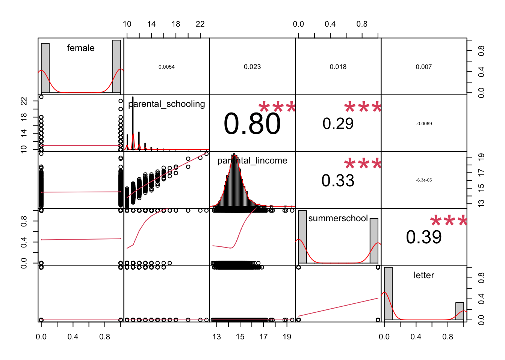
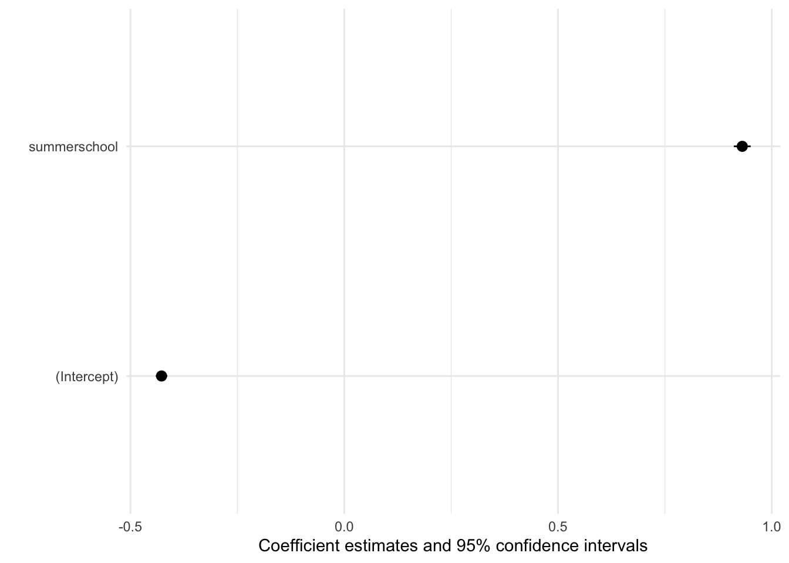
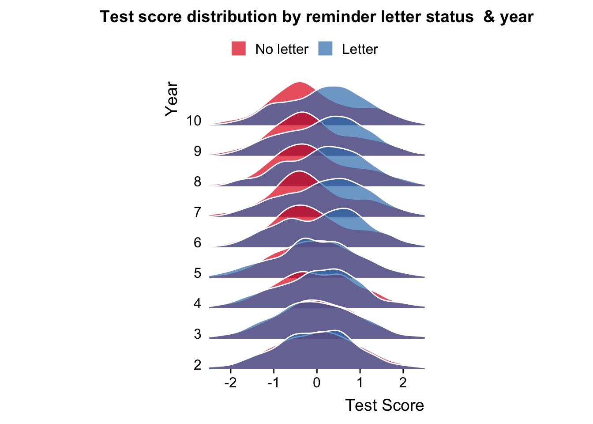
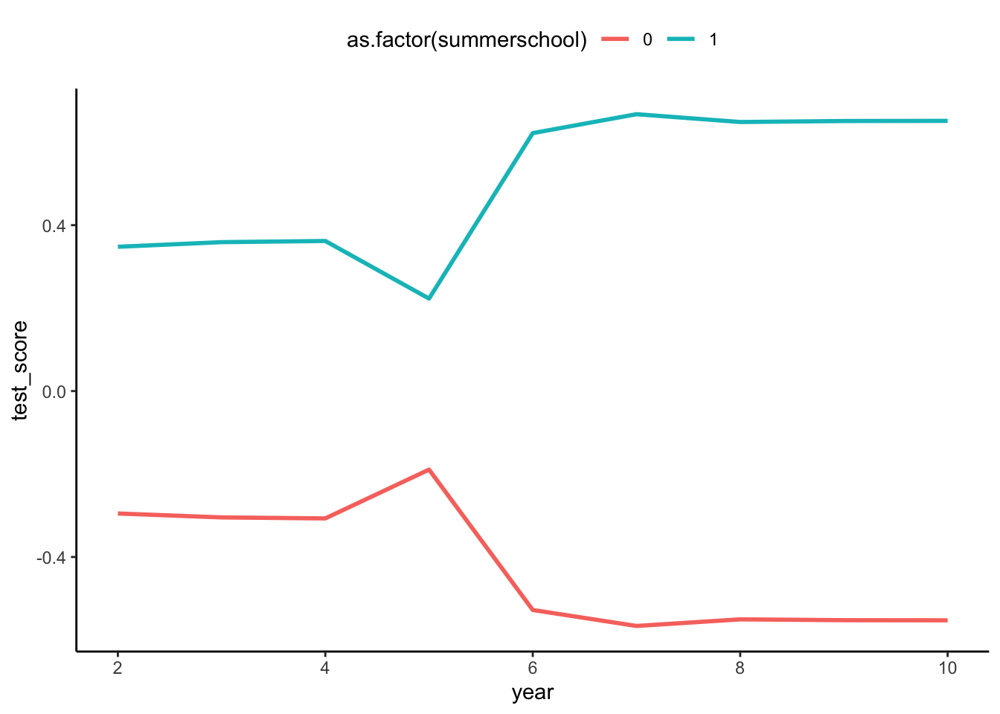
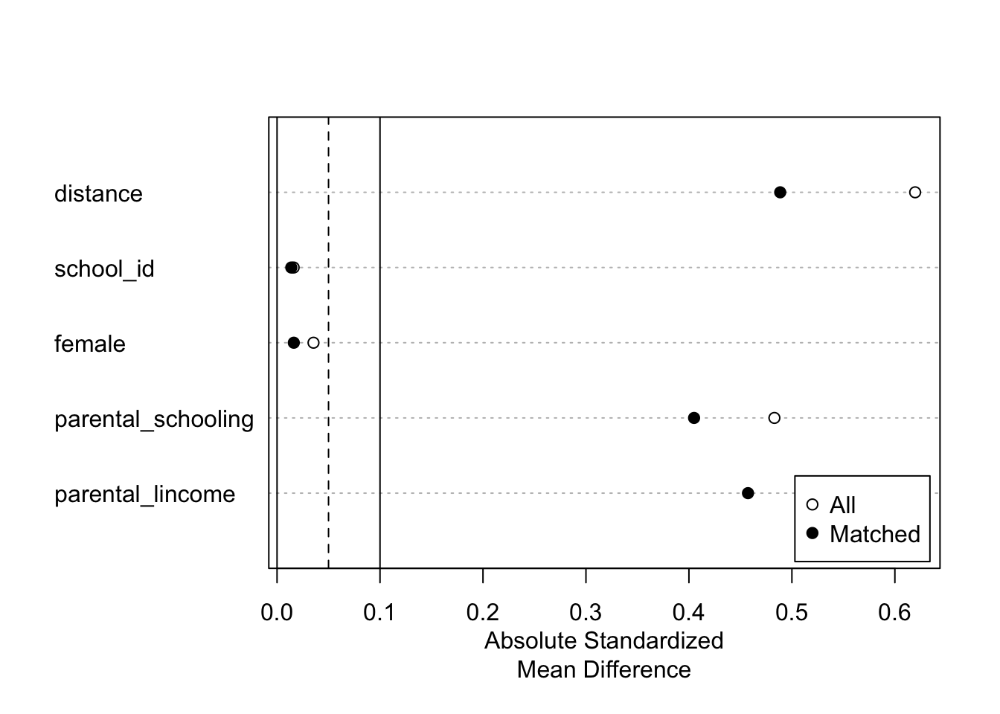

# I. Bienvenida al tutorial

Hola, este tutorial está escrito como la actividad de aplicación de la ayudantía 2 del curso

La idea es ir desarrollando el tutorial en paralelo a la sesión y que puedan tomar apuntes adicionales directamente en el notebook. Está escrito como .qmd, un notebook Quarto y puede ser editado en rstudio, vscode o cualquier otro IDE o editor de texto. El lenguaje utilizado para el procesamiento y análisis es R.

Se recomienda crear un fork al repositorio y trabajar en su propia rama.

**Como funciona**

-   El tutorial se estructura como un proyecto de investigación ficticio completo, que empezaremos cargando datos brutos hasta obtener e interpretar coficientes de regresión.

-   Lo métodos a cubir son:

    [1. Regresión lineal y método de diferencias (en datos experimentales)](#regresión-lineal-y-método-de-diferencias-en-datos-experimentales)

    [2. Logit y probit](#logit-y-probit)

    \[3. Variables Instrumentales\]

    \[4. Regresión Discontinua\]

    \[5. Diferencias en Diferencias\]

    \[6. Efectos fijos, aleatorios y modelos jerárquicos\]

    \[7. Matching\]

-   Los datos y notebook son descargables, así que se recomienda correr todo en tu propio computador o en una instancia en la nube.

-   Este tutorial es una adaptación del trabajo de [Hans H. Sievertsen](https://hhsievertsen.shinyapps.io/applied_econ_with_R_dynamic), con la adición de métodos de matching y con cambios a la situación a analizar.

<br>

## 1 Pregunta de investigación y datos

Vamos a usar una situación ficticia, con datos simulados para poder aplicar de manera consisa los diferentes tipos de estrategias de identificación revisadas en clase. ALgunas (que se supone ya manejan) las revisaremos muy rápidamente y en otras, vamos a tener mayor énfasis.

### 1.1 Pregunta de investigación

Nuestro objetivo es responder la siguiente pregunta **ficticia** de investigación:

> Asistir a preuniversitario mejora los resultados académicos?

Para responder esta pregunta, usaremos unos datos **ficticios y simulados**

### 1.2 Contexto ficticio

La pregunta de investigación se inspira en trabajos como el de [Matsudaira (2007)](https://www.sciencedirect.com/science/article/pii/S0304407607001194?casa_token=hnnF764CKPoAAAAA:5b9WhCManNDsdW4SmOHnnzNr0fZIarW8s6EsvpQW7MdUt470eNPmN2T8IFCsNc6Iajew5tEeNA) e intervenciones en estudiantes de bajo nivel socioeconómico por [Dietrichson et al ( 2017)](https://journals.sagepub.com/doi/abs/10.3102/0034654316687036).

El **escenario ficticio** es el siguiente:

-   Para un conjunto de colegios en una comuna, existe la opción de asistir a pre-unirversitario intensivo los fines de semana durante el segundo semestre de 4to medio.
-   El preuniversitario se enfoca en preparar la prueba de admisión a la universidad vigente (PSU en ese momento)
-   El preuniversitario es gratuito, pero para ser matriculados requiere que los padres se involucren en un proceso.
-   Estamos interesados en testear el impacto de la participación en el preuniversitario en los resultados académicos de los estudiantes.

### 1.3 Datos ficticios dispobibles

1.  school_data_1.csv

-   Usamos esta data para ejemplificar como cargar data guardada en formato csv.
-   Este dataset tiene información sobre cada individuo (con identificador id), la escuela a la que asiste, un indicador si participó en el preuniversitario, sexo, ingreso del hogar, educación de los padres, resultados en diagnostico PSU a incios del año escolar y el puntaje efectivamente obtenido en la prueba oficial.

2.  school_data_2.dta

-   Usamos esta data para ejemplificar como cargar data guardada en formato STATA.
-   Este dataset tiene información de cada individuo (con identificador id).
-   Este dataset tiene la información si el individuo recibió la carta de invitación para participar del preuniversitario.

3.  school_data_3.xlsx

-   Usamos este dataset para practicar como cargar datos guardados en formato Microsoft Excel.
-   Este dataset incluye datos sobre cada individuo (con identificador id)
-   Este dataset tiene información de rendimiento académico antes y después del preuniversitario.

# II. Preparación de los datos

En esta sección vamos a preparar los datos para el análisis. Este proceso generalmente incluye cargarlos, inspeccionarlos, limpiar y dar la estructura deseada. También revisaremos estadísticas descriptivas que nos den una idea antes de estimar cualquier modelo.

En la vida real, este proceso suele ser bastante largo, laborioso e implica volver sobre lso pasos anteriores múltiples veces. También invlocura tomar desiciones por parte de los investigadores, por lo cual la documentación de esta fase es especialmente importante.

En nuestro caso, será bastante lineal y directo, ya que son datos ficticios simulados. Pero en la realidad, no suele ser así.

## 1 Cargar los datos

### 1.1 Intalar y cargar paquetes

Para poder cargar los datos, necesiamos los paquetes adecuados. Siempre hay multiples formas de hacer las cosas en cualquier lenguaje o programa. En este caso, usaremos la función `read_csv()` del paquete *readr*. Para poder usarlo, debemos estar seguros de que está instalado.


::: {.cell}

:::


Si no está instalado, podemos hacerlo con la función `install.packages("[nombre paquete a instalar]")`


::: {.cell}

```{.r .cell-code}
install.packages("readr")
```
:::


Si el paquete ya está instalado, para poder usarlo necesitamos tenerlo cargado en nuestra librería. Para esto usamos la función `library("[nombre paquete a cargar]")`.


::: {.cell}

```{.r .cell-code}
library(readr)
```
:::


Cada paquete lo debemos instalar solo una vez por computador, pero debemos cargarlo en cada sesión para poder utilizarlo.

### 1.2 Cargar datos csv

Con *readr* estamos en condiciones de usar la función `read_csv()` para cargar la primera base de datos.

Vamos a cargar *school_data_1.csv* agregando el path a los datos en paréntesis. Puede reemplazar por el path correspondiente o usar el paquete auxiliar `here`

PS. notemos que tambien estamos incluyendo comentarios en los bloques de código. Las líneas que empiezan con el símbolo `#` son ignoradas por R.


::: {.cell}

```{.r .cell-code}
# load readr package
library("readr", "here")

#prueba el directorio que te dice con here
here::here()
```

::: {.cell-output .cell-output-stdout}
```
[1] "/Users/melita/Documents/GitHub/ayudantiasccs"
```
:::
:::


Entonces, dentro de `here("[Escribes el directorio relativo]")` actuará como el directorio relativo sin errores. Entonces, cargamos los datos y los asignamos a un data frame.


::: {.cell}

```{.r .cell-code}
school_data_1 <- read.csv(here::here("data_raw/school_data_1.csv"))
```
:::


Usualmente, después de cargar un dataset es útil visualizarlo. Empleamos la función `head()` para ver sus primeras 6 observaciones.


::: {.cell}

```{.r .cell-code}
head(school_data_1)
```

::: {.cell-output .cell-output-stdout}
```
  person_id school_id summercamp female parental_schooling parental_lincome
1         1         5          0      1                 10         12.93921
2         2        14          1      0                 11         14.73739
3         3         7          1      0                 14         16.08326
4         4         8          0      0                 12         14.60808
5         5         9          1      0                 11         13.75679
6         6        26          1      1                 11         14.70552
  test_year_5 test_year_6
1          NA    1.636284
2    1.297036    2.561449
3    2.761908    3.526002
4    1.772913    2.381062
5    1.180356    1.959818
6    2.439802    2.810571
```
:::
:::


Una segunda alternativa es descargar y cargar los datos directamente en R desde internet. Puede ser cualquier link directo o, si está alojado en github, tienes que asegurarte de que sea un repositorio público.


::: {.cell}

```{.r .cell-code}
school_data_1 <- read.csv("https://github.com/ClasesMOW/ayudantiasccs/blob/main/data_raw/school_data_1.csv")
```
:::


### 1.3 Cargar datos STATA

En Ciencias Sociales y Economía es muy comun contar con datos para ser utilizados en el programa STATA, estos son archivos que terminan en *.dta*. Para cargarlos, vamos a usar *HAVEN* del paquete *tidyverse*. También usaremos muchas otras funciones de ese paquete, asi que es buen momento para cargalo.


::: {.cell}

```{.r .cell-code}
library(tidyverse)

school_data_2<- haven::read_dta(here::here("data_raw/school_data_2.dta"))
```
:::


Usemos el comando `tail()` para ver las últimas 10 entradas.


::: {.cell}

```{.r .cell-code}
# print the 8 rows in the tail
tail(school_data_2,n=10)
```

::: {.cell-output .cell-output-stdout}
```
# A tibble: 10 × 2
   person_id letter
       <dbl>  <dbl>
 1      3482      1
 2      3483      0
 3      3484      0
 4      3485      0
 5      3486      1
 6      3487      0
 7      3488      1
 8      3489      0
 9      3490      0
10      3491      0
```
:::
:::


### 1.4 Cargar datos Microsoft Excel

Finalmente, cargaremos el tercer dataset guardado como hoja de cálculo de Excel *.xlsx*. Para esto usaremos el paquete *readxl* que viene incluido en *tidyverse*. Luego de asignarlo a un dataframe, démosle una mirada con `glimpse()` (también del tidyverse).


::: {.cell}

```{.r .cell-code}
school_data_3 <- readxl::read_xlsx(here::here("data_raw/school_data_3.xlsx"))

glimpse(school_data_3)
```

::: {.cell-output .cell-output-stdout}
```
Rows: 3,491
Columns: 10
$ person_id    <dbl> 1, 2, 3, 4, 5, 6, 7, 8, 9, 10, 11, 12, 13, 14, 15, 16, 17…
$ test_year_2  <dbl> 1.090117, 1.246309, 2.726472, 2.693032, 1.660545, 2.22377…
$ test_year_3  <dbl> 1.914594, 1.154470, 2.269011, 2.413203, 1.828067, 2.27566…
$ test_year_4  <dbl> 2.065805, 1.582455, 3.247252, 1.479452, 1.361972, 2.38510…
$ test_year_7  <dbl> 2.377697, 1.747376, 3.017764, 2.637954, 1.904636, 3.37613…
$ test_year_8  <dbl> 2.032904, 2.444041, 3.361646, 3.021940, 2.109774, 3.24542…
$ test_year_9  <dbl> 1.493803, 1.663050, 3.387020, 2.761513, 2.285818, 2.96503…
$ test_year_10 <dbl> 1.880512, 1.833769, 2.968617, 2.088086, 1.845694, 3.30819…
$ learnings    <dbl> 10.236394, 8.278911, 8.966529, 8.876466, 8.770518, 10.484…
$ school_id    <dbl> 5, 14, 7, 8, 9, 26, 13, 11, 23, 9, 25, 15, 3, 4, 17, 7, 1…
```
:::
:::


## 2. Unir los datasets

Tenemos 3 bases de datos con información diferente de los mismos individuos. Generalmente es buena idea tener una sola gran tabla con toda esta información, especialmente si estimaremos modelos en base a ésta.

La base de datos 1 y 2 tienen una forma similar: los individuos son filas y las variables columnas y hay una sola fila para cada individuo.

Para hacerlo, podriamos usar varias alternativas.

Una alternativa es usar la función nativa `merge( )`. En esta función, primero mencionamos los datasets a unir, luego informamos cual es la(s) columnas(s) que debe usar para unir ambos datasets con `by=....`. Por defecto, R incluye todas las filas que están en ambos datasets (basados en la variable *by*), pero podemos fijar `all=TRUE` para mantener todas las filas que están en ambos datasets o `all.x=TRUE` para mantener todas las filas coincidentes y las del primer dataset or `all.y=TRUE` para guardar todas las filas del segundo dataset.

Veamos un ejemplo con los dos primeros datasets. Luego usemos `dim()` para conocer las dimensiones del nuevo dataset unido en términos de filas y columnas.


::: {.cell}

```{.r .cell-code}
# merge school_data_1 with school_data_2
school_data_merged <-merge(school_data_1,school_data_2, by="person_id")

# dimensions
dim(school_data_merged)
```

::: {.cell-output .cell-output-stdout}
```
[1] 3491    9
```
:::
:::


Notemos que el dataset unido tiene 3491 filas y 9 columnas. Unimos todas las filas y agregamos al dataset de información del estudiante si recibió o no la carta (school_data_2)

¿Qué ocurre si las columnas tienen igual nombre? R va a renombrarlas automáticamente agregando un sufijo *.x* (a la columna del primer dataset) e *.y* ( a la columna del segundo dataset).

Entonces, en el siguiente bloque:

1.  Unimos *school_data_1* y *school_data_2* usando como variable de unión *person_id* y guardamos el dataset unido como *school_data*.
2.  Unimos *school_data_3* con *school_data* y sobre-escribimos *school_data*.

Notar que acá unimos por las columnas *person_id* y *school_id*. Esto no es realmente necesario porque cada estudiante con id única tiene un solo colegio, pero sirve de ejemplo en como usar más de una columna mediante `c()`. 3. Usamos la función `summary()` para obtener una estadística descriptiva de las variables en el dataset unido.


::: {.cell}

```{.r .cell-code}
# Merge school_data_1 and school_data_2 and save as school_data_merged 
school_data_merged<-merge(school_data_1,school_data_2,by="person_id")

# Merge school_data_3 with school_data_merged
school_data_merged<-merge(school_data_merged,school_data_3,by=c("person_id","school_id"))

# summary statistics
summary(school_data_merged)
```

::: {.cell-output .cell-output-stdout}
```
   person_id        school_id       summercamp         female      
 Min.   :   1.0   Min.   : 1.00   Min.   :0.0000   Min.   :0.0000  
 1st Qu.: 873.5   1st Qu.: 8.00   1st Qu.:0.0000   1st Qu.:0.0000  
 Median :1746.0   Median :15.00   Median :0.0000   Median :1.0000  
 Mean   :1746.0   Mean   :15.66   Mean   :0.4589   Mean   :0.5153  
 3rd Qu.:2618.5   3rd Qu.:23.00   3rd Qu.:1.0000   3rd Qu.:1.0000  
 Max.   :3491.0   Max.   :30.00   Max.   :1.0000   Max.   :1.0000  
                                                                   
 parental_schooling parental_lincome  test_year_5       test_year_6    
 Min.   :10.00      Min.   :12.67    Min.   :-0.2696   Min.   :0.2824  
 1st Qu.:11.00      1st Qu.:14.12    1st Qu.: 1.7997   1st Qu.:2.0071  
 Median :11.00      Median :14.52    Median : 2.2583   Median :2.4492  
 Mean   :11.32      Mean   :14.56    Mean   : 2.2589   Mean   :2.5174  
 3rd Qu.:12.00      3rd Qu.:14.95    3rd Qu.: 2.7154   3rd Qu.:3.0185  
 Max.   :23.00      Max.   :19.45    Max.   : 4.6897   Max.   :4.9831  
 NA's   :5                           NA's   :6         NA's   :5       
     letter        test_year_2       test_year_3      test_year_4     
 Min.   :0.0000   Min.   :-0.5701   Min.   :-0.464   Min.   :0.01425  
 1st Qu.:0.0000   1st Qu.: 1.7712   1st Qu.: 1.818   1st Qu.:1.78282  
 Median :0.0000   Median : 2.2377   Median : 2.249   Median :2.24947  
 Mean   :0.2469   Mean   : 2.2246   Mean   : 2.254   Mean   :2.24952  
 3rd Qu.:0.0000   3rd Qu.: 2.6644   3rd Qu.: 2.715   3rd Qu.:2.70903  
 Max.   :1.0000   Max.   : 4.7373   Max.   : 4.389   Max.   :4.34995  
                                                                      
  test_year_7       test_year_8       test_year_9       test_year_10    
 Min.   :0.03139   Min.   :-0.1856   Min.   :-0.2456   Min.   :-0.3043  
 1st Qu.:1.93768   1st Qu.: 1.9277   1st Qu.: 1.9371   1st Qu.: 1.9415  
 Median :2.36855   Median : 2.3889   Median : 2.3868   Median : 2.3776  
 Mean   :2.44445   Mean   : 2.4506   Mean   : 2.4531   Mean   : 2.4541  
 3rd Qu.:2.97207   3rd Qu.: 2.9596   3rd Qu.: 2.9861   3rd Qu.: 2.9693  
 Max.   :4.77111   Max.   : 5.0451   Max.   : 4.6565   Max.   : 4.9295  
                                                                        
   learnings     
 Min.   : 5.386  
 1st Qu.: 9.181  
 Median :10.041  
 Mean   :10.064  
 3rd Qu.:10.959  
 Max.   :14.621  
                 
```
:::
:::


Otra opción de hacer lo mismo es con join del paquete `dplyr` del `tidyverse`.

[{fig-alt="Diferentes tipos de join en dplyr" fig-align="center"}](https://statisticsglobe.com/r-dplyr-join-inner-left-right-full-semi-anti) (foto sacada de [link](https://statisticsglobe.com/r-dplyr-join-inner-left-right-full-semi-anti), puedes ver ejemplos detallados de los diferentes tipos de join)

En este caso, podríamos hacer en un pipe `%>%` dos left joins seguidos.


::: {.cell}

```{.r .cell-code}
school_data_merged <- school_data_1 %>%
                        left_join(school_data_2, by="person_id") %>%
                        left_join(school_data_3, by=c("person_id", "school_id"))
```
:::


## 3. Lipiar los datos

### 3.1 Tidyng los datos

Ahora que hemos unido las bases de datos, trataremos de que satisfazgan los principios de [Tidy Data](https://vita.had.co.nz/papers/tidy-data.pdf).

A data frame is said to be tidy (Hadley's paper) if the following conditions are met:

-   A single column (variable) contains all measures of the same data feature of the observations.
-   A row contains measures of the same observation.

(puedes profundizar y ver más ejemplos aplicados en <https://sscc.wisc.edu/sscc/pubs/DWE/book/6-2-tidy-data.html> )

Uno de estos, es que cada columna debe ser una variable y cafa fila una unidad de observación.

Si inspeccionamos el número de columnas:


::: {.cell}

```{.r .cell-code}
# Alternatively we can use the nrow() functions to get the number of columns
ncol(school_data_merged)
```

::: {.cell-output .cell-output-stdout}
```
[1] 17
```
:::
:::


Son 17, pero tenemos 9 variables.


::: {.cell}

```{.r .cell-code}
head(school_data_merged)
```

::: {.cell-output .cell-output-stdout}
```
  person_id school_id summercamp female parental_schooling parental_lincome
1         1         5          0      1                 10         12.93921
2         2        14          1      0                 11         14.73739
3         3         7          1      0                 14         16.08326
4         4         8          0      0                 12         14.60808
5         5         9          1      0                 11         13.75679
6         6        26          1      1                 11         14.70552
  test_year_5 test_year_6 letter test_year_2 test_year_3 test_year_4
1          NA    1.636284      0    1.090117    1.914594    2.065805
2    1.297036    2.561449      0    1.246309    1.154470    1.582455
3    2.761908    3.526002      0    2.726472    2.269011    3.247252
4    1.772913    2.381062      0    2.693032    2.413203    1.479452
5    1.180356    1.959818      0    1.660545    1.828067    1.361972
6    2.439802    2.810571      0    2.223775    2.275665    2.385106
  test_year_7 test_year_8 test_year_9 test_year_10 learnings
1    2.377697    2.032904    1.493803     1.880512 10.236394
2    1.747376    2.444041    1.663050     1.833769  8.278911
3    3.017764    3.361646    3.387020     2.968617  8.966529
4    2.637954    3.021940    2.761513     2.088086  8.876466
5    1.904636    2.109774    2.285818     1.845694  8.770518
6    3.376130    3.245426    2.965039     3.308194 10.484683
```
:::
:::


Es porque tenemos puntajes de las pruebas del año 2 al 10. Este tipo de datos son de *panel*


Generalmente, que hagamos con este tipo de datos depende del tipo de modelos que queramos usar. Si bien el formato wide es facil de entender, generlamente para modelos y análisi preferimos que esté en formato long. Especialmente cuando modelamos incluyendo efectos fijos También es este el que adhiere a los principios tidy de mejor manera.

Para cambiar a long, usamos `pivot_longer()`


::: {.cell}

```{.r .cell-code}
# load tidyr package. Ya etsá incluido en tidyverse, pero  también se puede llamar por si solo.

library("tidyr")

# make data tidy (make long)
school_data_tidy<-school_data_merged%>%
       tidyr::pivot_longer(
                            cols = starts_with("test_year"),
                            names_to = "year",
                            names_prefix = "test_year_",
                            names_transform = list(year = as.integer),
                            values_to = "test_score",
                             )

# ncol to get the number of columns of the new dataset
ncol(school_data_tidy)
```

::: {.cell-output .cell-output-stdout}
```
[1] 10
```
:::
:::


Ahora tenemos nuestros datos listos para que los inspeccionemos.

### 3.2 Selección de muestra

Ya que contamos con datos que siguen los principios de tidy data, lo siguiente es seleccionar la muestra apropiada. En este trabajo, los unicos problemas que podríamos enfrentar son relacionados con valores faltantes o missing. Para inspeccionarlos vamos a usar la función `skim()` del paquete `skimr`, esta función nos muestra los vaores faltantes en nuestro dataset de una manera global.


::: {.cell}

```{.r .cell-code}
# Cargar skimr
library("skimr")

# Usamos skim() para inspeccionar los datos
skim(school_data_tidy)
```

::: {.cell-output-display}
Table: Data summary

|                         |                 |
|:------------------------|:----------------|
|Name                     |school_data_tidy |
|Number of rows           |31419            |
|Number of columns        |10               |
|_______________________  |                 |
|Column type frequency:   |                 |
|numeric                  |10               |
|________________________ |                 |
|Group variables          |None             |


**Variable type: numeric**

|skim_variable      | n_missing| complete_rate|    mean|      sd|    p0|    p25|     p50|     p75|    p100|hist  |
|:------------------|---------:|-------------:|-------:|-------:|-----:|------:|-------:|-------:|-------:|:-----|
|person_id          |         0|             1| 1746.00| 1007.78|  1.00| 873.00| 1746.00| 2619.00| 3491.00|▇▇▇▇▇ |
|school_id          |         0|             1|   15.66|    8.67|  1.00|   8.00|   15.00|   23.00|   30.00|▇▇▇▇▇ |
|summercamp         |         0|             1|    0.46|    0.50|  0.00|   0.00|    0.00|    1.00|    1.00|▇▁▁▁▇ |
|female             |         0|             1|    0.52|    0.50|  0.00|   0.00|    1.00|    1.00|    1.00|▇▁▁▁▇ |
|parental_schooling |        45|             1|   11.32|    1.10| 10.00|  11.00|   11.00|   12.00|   23.00|▇▁▁▁▁ |
|parental_lincome   |         0|             1|   14.56|    0.69| 12.67|  14.11|   14.52|   14.95|   19.45|▂▇▁▁▁ |
|letter             |         0|             1|    0.25|    0.43|  0.00|   0.00|    0.00|    0.00|    1.00|▇▁▁▁▂ |
|learnings          |         0|             1|   10.06|    1.28|  5.39|   9.18|   10.04|   10.96|   14.62|▁▃▇▃▁ |
|year               |         0|             1|    6.00|    2.58|  2.00|   4.00|    6.00|    8.00|   10.00|▇▇▃▇▇ |
|test_score         |        11|             1|    2.37|    0.72| -0.57|   1.88|    2.33|    2.84|    5.05|▁▂▇▃▁ |
:::
:::


Con esta función podemos ver facilmente cuantas filas y comunas son, los tipos de varables y número de missing values. Además la media, desviación estándar, percentiles e incluso un histograma para cada variable.

En estos casos, para *parental_schooling* tenemos 45 missing y para *test_score* 11. Asumamos que estos valores missing son random y deseamos remover estas filas. Para esto usamos `filter()`. Esta funcion toma dos argumentos, el dataset a filtrar y la condición para que se mantenga en el dataset, en este caso que no sea na o `!is.na(partental_schoolin)`. La función `is.na()` es verdad cuando el elemento en `()` es missing y usamos `!`para mostrar que queremos lo contrario a esto condición. En otras palabras queremos que la educaión parental no esté missing.


::: {.cell}

```{.r .cell-code}
# Seleccionamos las columnas sin missing values
school_data_selected<-dplyr::filter(school_data_tidy,!is.na(parental_schooling),!is.na(test_score))

# Use skim() to skim the data again
skim(school_data_selected)
```

::: {.cell-output-display}
Table: Data summary

|                         |                     |
|:------------------------|:--------------------|
|Name                     |school_data_selected |
|Number of rows           |31363                |
|Number of columns        |10                   |
|_______________________  |                     |
|Column type frequency:   |                     |
|numeric                  |10                   |
|________________________ |                     |
|Group variables          |None                 |


**Variable type: numeric**

|skim_variable      | n_missing| complete_rate|    mean|      sd|    p0|    p25|     p50|     p75|    p100|hist  |
|:------------------|---------:|-------------:|-------:|-------:|-----:|------:|-------:|-------:|-------:|:-----|
|person_id          |         0|             1| 1746.67| 1007.89|  1.00| 873.00| 1746.00| 2620.00| 3491.00|▇▇▇▇▇ |
|school_id          |         0|             1|   15.66|    8.68|  1.00|   8.00|   15.00|   23.00|   30.00|▇▇▇▇▇ |
|summercamp         |         0|             1|    0.46|    0.50|  0.00|   0.00|    0.00|    1.00|    1.00|▇▁▁▁▇ |
|female             |         0|             1|    0.52|    0.50|  0.00|   0.00|    1.00|    1.00|    1.00|▇▁▁▁▇ |
|parental_schooling |         0|             1|   11.32|    1.10| 10.00|  11.00|   11.00|   12.00|   23.00|▇▁▁▁▁ |
|parental_lincome   |         0|             1|   14.56|    0.69| 12.67|  14.11|   14.52|   14.95|   19.45|▂▇▁▁▁ |
|letter             |         0|             1|    0.25|    0.43|  0.00|   0.00|    0.00|    0.00|    1.00|▇▁▁▁▂ |
|learnings          |         0|             1|   10.06|    1.28|  5.39|   9.18|   10.04|   10.96|   14.62|▁▃▇▃▁ |
|year               |         0|             1|    6.00|    2.58|  2.00|   4.00|    6.00|    8.00|   10.00|▇▇▃▇▇ |
|test_score         |         0|             1|    2.37|    0.72| -0.57|   1.88|    2.33|    2.84|    5.05|▁▂▇▃▁ |
:::
:::


Hemos removido todos los missing.

### 3.3 Modificar los datos

Un último paso que haremos antes de hacer estadística decsriptiva es modificar los nombres de algunas columnas para que se vean bien en la tablas.

Vambos renombrar la variable preu a preuniversitario. Lo hacemos con `rename()` del paquete dplyr. Esta función tiene una sintaxix similar a `filter()`


::: {.cell}

```{.r .cell-code}
# renombremos preu a preuniversitario
analysisdata<-rename(school_data_selected, summerschool=summercamp)

# use head to view the first 6 observations 
head(analysisdata)
```

::: {.cell-output .cell-output-stdout}
```
# A tibble: 6 × 10
  person_id school…¹ summe…² female paren…³ paren…⁴ letter learn…⁵  year test_…⁶
      <dbl>    <dbl>   <int>  <int>   <int>   <dbl>  <dbl>   <dbl> <int>   <dbl>
1         1        5       0      1      10    12.9      0    10.2     6    1.64
2         1        5       0      1      10    12.9      0    10.2     2    1.09
3         1        5       0      1      10    12.9      0    10.2     3    1.91
4         1        5       0      1      10    12.9      0    10.2     4    2.07
5         1        5       0      1      10    12.9      0    10.2     7    2.38
6         1        5       0      1      10    12.9      0    10.2     8    2.03
# … with abbreviated variable names ¹​school_id, ²​summerschool,
#   ³​parental_schooling, ⁴​parental_lincome, ⁵​learnings, ⁶​test_score
```
:::
:::


En un siguiente paso, vamos a transformar los puntajes en la prueba PSU y las notas a una variable que tenga media 0 y desviación estándar 1. Nosotros como chilenos cnocemos el sistema, pero un lector de la investigación probablemente no. Es por esto que es mejor trabajar con variables estandarizadas.


::: {.cell}

```{.r .cell-code}
# Standardize test score
# Group analysisdata by year
analysisdata<-group_by(analysisdata,year)

# Create a new variable with mutate
analysisdata<-mutate(analysisdata, test_score=(test_score-mean(test_score))/sd(test_score))
```
:::


Esto tambien podemos hacerlo dentro de un pipe:


::: {.cell}

```{.r .cell-code}
# Standardize test score
# Group analysisdata by year
analysisdata<-group_by(analysisdata,year)
# Create a new variable with mutate
analysisdata<-mutate(analysisdata, test_score=(test_score-mean(test_score))/sd(test_score))
# show mean of test_score
print(paste("Mean of test score:",mean(analysisdata$test_score)))
```

::: {.cell-output .cell-output-stdout}
```
[1] "Mean of test score: 1.66440088479111e-17"
```
:::
:::


Podemos comprobar que efectivamente la media y desviación estándar corresponden a dichos valores:


::: {.cell}

```{.r .cell-code}
# show mean of test_score
print(paste("Mean of test score:",mean(analysisdata$test_score)))
```

::: {.cell-output .cell-output-stdout}
```
[1] "Mean of test score: 1.66440088479111e-17"
```
:::

```{.r .cell-code}
#show sd of test_score
print(paste("SD of test score:",sd(analysisdata$test_score)))
```

::: {.cell-output .cell-output-stdout}
```
[1] "SD of test score: 0.999872448979073"
```
:::
:::


Notar que si aplicamos `mean()` o `sd()` o cualquier otra función matemática a columnas que tienen valores missing, también dará un valor missing a menos que usemos la opción na.rm=FALSE.

Ya estamos bien, ahora pasamos a conocer mejor nuestros datos con estadística descriptiva.

## 4. Estadística descriptiva

Hasta ahora, cargamos datos en diversos formatos (csv, dta y xlsx) los unimos, re-estructuramos el dataset, removimos valores missing y generamos algunas transformaciones. El siguiente paso es empezar a conocer nuestros datos. Para esto haremos tablas de estadísticas descriptivas y también algunos graficos descriptivos.

### 4.1 Tablas de estadística descriptiva

Hasta ahora, ya conocemos dos maneras de calcular estadísticas resumen:

1.  `sumary()` de R base. Esta función en realidad funciona en muchos tipos de objetos de R y suele dar un bien resumen. Pero no en el formato de una tabla exportable a un documento latex, word o etc. que podamos presentar en nuestra investigación o resultados.

2.  `skim()` del paquete *skimr*

#### 4.1.1 Tabla de estadísticas descriptivas "lista para llevar"

Una forma rápida de obtener una tabla de estadísticas descriptivas es con un primo de `skim()` del paquete *modelsummary*.


::: {.cell}

```{.r .cell-code}
# load modelsummary

library("modelsummary")
# create a summary stat table in Latex format
analysisdata%>%
  filter(year==2)%>%
  select(female,starts_with("paren"),letter,summerschool,test_score)%>%
  datasummary_skim( fmt="%.2f")
```

::: {.cell-output-display}

`````{=html}
<table class="table" style="width: auto !important; margin-left: auto; margin-right: auto;">
 <thead>
  <tr>
   <th style="text-align:left;">   </th>
   <th style="text-align:right;"> Unique (#) </th>
   <th style="text-align:right;"> Missing (%) </th>
   <th style="text-align:right;"> Mean </th>
   <th style="text-align:right;"> SD </th>
   <th style="text-align:right;"> Min </th>
   <th style="text-align:right;"> Median </th>
   <th style="text-align:right;"> Max </th>
   <th style="text-align:right;">    </th>
  </tr>
 </thead>
<tbody>
  <tr>
   <td style="text-align:left;"> year </td>
   <td style="text-align:right;"> 1 </td>
   <td style="text-align:right;"> 0 </td>
   <td style="text-align:right;"> 2.00 </td>
   <td style="text-align:right;"> 0.00 </td>
   <td style="text-align:right;"> 2.00 </td>
   <td style="text-align:right;"> 2.00 </td>
   <td style="text-align:right;"> 2.00 </td>
   <td style="text-align:right;">  <svg xmlns="http://www.w3.org/2000/svg" xmlns:xlink="http://www.w3.org/1999/xlink" class="svglite" width="48.00pt" height="12.00pt" viewBox="0 0 48.00 12.00"><defs><style type="text/css">
    .svglite line, .svglite polyline, .svglite polygon, .svglite path, .svglite rect, .svglite circle {
      fill: none;
      stroke: #000000;
      stroke-linecap: round;
      stroke-linejoin: round;
      stroke-miterlimit: 10.00;
    }
    .svglite text {
      white-space: pre;
    }
  </style></defs><rect width="100%" height="100%" style="stroke: none; fill: none;"></rect><defs><clipPath id="cpMC4wMHw0OC4wMHwwLjAwfDEyLjAw"><rect x="0.00" y="0.00" width="48.00" height="12.00"></rect></clipPath></defs><g clip-path="url(#cpMC4wMHw0OC4wMHwwLjAwfDEyLjAw)">
</g><defs><clipPath id="cpMC4wMHw0OC4wMHwyLjg4fDEyLjAw"><rect x="0.00" y="2.88" width="48.00" height="9.12"></rect></clipPath></defs><g clip-path="url(#cpMC4wMHw0OC4wMHwyLjg4fDEyLjAw)"><rect x="-31.56" y="3.22" width="55.56" height="8.44" style="stroke-width: 0.38; fill: #000000;"></rect></g></svg>
</td>
  </tr>
  <tr>
   <td style="text-align:left;"> female </td>
   <td style="text-align:right;"> 2 </td>
   <td style="text-align:right;"> 0 </td>
   <td style="text-align:right;"> 0.52 </td>
   <td style="text-align:right;"> 0.50 </td>
   <td style="text-align:right;"> 0.00 </td>
   <td style="text-align:right;"> 1.00 </td>
   <td style="text-align:right;"> 1.00 </td>
   <td style="text-align:right;">  <svg xmlns="http://www.w3.org/2000/svg" xmlns:xlink="http://www.w3.org/1999/xlink" class="svglite" width="48.00pt" height="12.00pt" viewBox="0 0 48.00 12.00"><defs><style type="text/css">
    .svglite line, .svglite polyline, .svglite polygon, .svglite path, .svglite rect, .svglite circle {
      fill: none;
      stroke: #000000;
      stroke-linecap: round;
      stroke-linejoin: round;
      stroke-miterlimit: 10.00;
    }
    .svglite text {
      white-space: pre;
    }
  </style></defs><rect width="100%" height="100%" style="stroke: none; fill: none;"></rect><defs><clipPath id="cpMC4wMHw0OC4wMHwwLjAwfDEyLjAw"><rect x="0.00" y="0.00" width="48.00" height="12.00"></rect></clipPath></defs><g clip-path="url(#cpMC4wMHw0OC4wMHwwLjAwfDEyLjAw)">
</g><defs><clipPath id="cpMC4wMHw0OC4wMHwyLjg4fDEyLjAw"><rect x="0.00" y="2.88" width="48.00" height="9.12"></rect></clipPath></defs><g clip-path="url(#cpMC4wMHw0OC4wMHwyLjg4fDEyLjAw)"><rect x="1.78" y="3.73" width="4.44" height="7.94" style="stroke-width: 0.38; fill: #000000;"></rect><rect x="6.22" y="11.66" width="4.44" height="0.00" style="stroke-width: 0.38; fill: #000000;"></rect><rect x="10.67" y="11.66" width="4.44" height="0.00" style="stroke-width: 0.38; fill: #000000;"></rect><rect x="15.11" y="11.66" width="4.44" height="0.00" style="stroke-width: 0.38; fill: #000000;"></rect><rect x="19.56" y="11.66" width="4.44" height="0.00" style="stroke-width: 0.38; fill: #000000;"></rect><rect x="24.00" y="11.66" width="4.44" height="0.00" style="stroke-width: 0.38; fill: #000000;"></rect><rect x="28.44" y="11.66" width="4.44" height="0.00" style="stroke-width: 0.38; fill: #000000;"></rect><rect x="32.89" y="11.66" width="4.44" height="0.00" style="stroke-width: 0.38; fill: #000000;"></rect><rect x="37.33" y="11.66" width="4.44" height="0.00" style="stroke-width: 0.38; fill: #000000;"></rect><rect x="41.78" y="3.22" width="4.44" height="8.44" style="stroke-width: 0.38; fill: #000000;"></rect></g></svg>
</td>
  </tr>
  <tr>
   <td style="text-align:left;"> parental_schooling </td>
   <td style="text-align:right;"> 12 </td>
   <td style="text-align:right;"> 0 </td>
   <td style="text-align:right;"> 11.32 </td>
   <td style="text-align:right;"> 1.10 </td>
   <td style="text-align:right;"> 10.00 </td>
   <td style="text-align:right;"> 11.00 </td>
   <td style="text-align:right;"> 23.00 </td>
   <td style="text-align:right;">  <svg xmlns="http://www.w3.org/2000/svg" xmlns:xlink="http://www.w3.org/1999/xlink" class="svglite" width="48.00pt" height="12.00pt" viewBox="0 0 48.00 12.00"><defs><style type="text/css">
    .svglite line, .svglite polyline, .svglite polygon, .svglite path, .svglite rect, .svglite circle {
      fill: none;
      stroke: #000000;
      stroke-linecap: round;
      stroke-linejoin: round;
      stroke-miterlimit: 10.00;
    }
    .svglite text {
      white-space: pre;
    }
  </style></defs><rect width="100%" height="100%" style="stroke: none; fill: none;"></rect><defs><clipPath id="cpMC4wMHw0OC4wMHwwLjAwfDEyLjAw"><rect x="0.00" y="0.00" width="48.00" height="12.00"></rect></clipPath></defs><g clip-path="url(#cpMC4wMHw0OC4wMHwwLjAwfDEyLjAw)">
</g><defs><clipPath id="cpMC4wMHw0OC4wMHwyLjg4fDEyLjAw"><rect x="0.00" y="2.88" width="48.00" height="9.12"></rect></clipPath></defs><g clip-path="url(#cpMC4wMHw0OC4wMHwyLjg4fDEyLjAw)"><rect x="1.78" y="3.22" width="3.42" height="8.44" style="stroke-width: 0.38; fill: #000000;"></rect><rect x="5.20" y="9.46" width="3.42" height="2.20" style="stroke-width: 0.38; fill: #000000;"></rect><rect x="8.62" y="10.86" width="3.42" height="0.80" style="stroke-width: 0.38; fill: #000000;"></rect><rect x="12.03" y="11.39" width="3.42" height="0.27" style="stroke-width: 0.38; fill: #000000;"></rect><rect x="15.45" y="11.55" width="3.42" height="0.12" style="stroke-width: 0.38; fill: #000000;"></rect><rect x="18.87" y="11.60" width="3.42" height="0.065" style="stroke-width: 0.38; fill: #000000;"></rect><rect x="22.29" y="11.65" width="3.42" height="0.014" style="stroke-width: 0.38; fill: #000000;"></rect><rect x="25.71" y="11.65" width="3.42" height="0.014" style="stroke-width: 0.38; fill: #000000;"></rect><rect x="29.13" y="11.66" width="3.42" height="0.00" style="stroke-width: 0.38; fill: #000000;"></rect><rect x="32.55" y="11.66" width="3.42" height="0.0068" style="stroke-width: 0.38; fill: #000000;"></rect><rect x="35.97" y="11.66" width="3.42" height="0.00" style="stroke-width: 0.38; fill: #000000;"></rect><rect x="39.38" y="11.66" width="3.42" height="0.0034" style="stroke-width: 0.38; fill: #000000;"></rect><rect x="42.80" y="11.66" width="3.42" height="0.0034" style="stroke-width: 0.38; fill: #000000;"></rect></g></svg>
</td>
  </tr>
  <tr>
   <td style="text-align:left;"> parental_lincome </td>
   <td style="text-align:right;"> 3486 </td>
   <td style="text-align:right;"> 0 </td>
   <td style="text-align:right;"> 14.56 </td>
   <td style="text-align:right;"> 0.69 </td>
   <td style="text-align:right;"> 12.67 </td>
   <td style="text-align:right;"> 14.52 </td>
   <td style="text-align:right;"> 19.45 </td>
   <td style="text-align:right;">  <svg xmlns="http://www.w3.org/2000/svg" xmlns:xlink="http://www.w3.org/1999/xlink" class="svglite" width="48.00pt" height="12.00pt" viewBox="0 0 48.00 12.00"><defs><style type="text/css">
    .svglite line, .svglite polyline, .svglite polygon, .svglite path, .svglite rect, .svglite circle {
      fill: none;
      stroke: #000000;
      stroke-linecap: round;
      stroke-linejoin: round;
      stroke-miterlimit: 10.00;
    }
    .svglite text {
      white-space: pre;
    }
  </style></defs><rect width="100%" height="100%" style="stroke: none; fill: none;"></rect><defs><clipPath id="cpMC4wMHw0OC4wMHwwLjAwfDEyLjAw"><rect x="0.00" y="0.00" width="48.00" height="12.00"></rect></clipPath></defs><g clip-path="url(#cpMC4wMHw0OC4wMHwwLjAwfDEyLjAw)">
</g><defs><clipPath id="cpMC4wMHw0OC4wMHwyLjg4fDEyLjAw"><rect x="0.00" y="2.88" width="48.00" height="9.12"></rect></clipPath></defs><g clip-path="url(#cpMC4wMHw0OC4wMHwyLjg4fDEyLjAw)"><rect x="0.68" y="11.52" width="3.28" height="0.14" style="stroke-width: 0.38; fill: #000000;"></rect><rect x="3.96" y="10.44" width="3.28" height="1.22" style="stroke-width: 0.38; fill: #000000;"></rect><rect x="7.23" y="7.25" width="3.28" height="4.41" style="stroke-width: 0.38; fill: #000000;"></rect><rect x="10.51" y="3.29" width="3.28" height="8.37" style="stroke-width: 0.38; fill: #000000;"></rect><rect x="13.79" y="3.22" width="3.28" height="8.44" style="stroke-width: 0.38; fill: #000000;"></rect><rect x="17.06" y="7.61" width="3.28" height="4.06" style="stroke-width: 0.38; fill: #000000;"></rect><rect x="20.34" y="10.13" width="3.28" height="1.54" style="stroke-width: 0.38; fill: #000000;"></rect><rect x="23.62" y="11.14" width="3.28" height="0.53" style="stroke-width: 0.38; fill: #000000;"></rect><rect x="26.89" y="11.40" width="3.28" height="0.26" style="stroke-width: 0.38; fill: #000000;"></rect><rect x="30.17" y="11.60" width="3.28" height="0.058" style="stroke-width: 0.38; fill: #000000;"></rect><rect x="33.44" y="11.62" width="3.28" height="0.042" style="stroke-width: 0.38; fill: #000000;"></rect><rect x="36.72" y="11.66" width="3.28" height="0.00" style="stroke-width: 0.38; fill: #000000;"></rect><rect x="40.00" y="11.65" width="3.28" height="0.017" style="stroke-width: 0.38; fill: #000000;"></rect><rect x="43.27" y="11.65" width="3.28" height="0.0083" style="stroke-width: 0.38; fill: #000000;"></rect></g></svg>
</td>
  </tr>
  <tr>
   <td style="text-align:left;"> letter </td>
   <td style="text-align:right;"> 2 </td>
   <td style="text-align:right;"> 0 </td>
   <td style="text-align:right;"> 0.25 </td>
   <td style="text-align:right;"> 0.43 </td>
   <td style="text-align:right;"> 0.00 </td>
   <td style="text-align:right;"> 0.00 </td>
   <td style="text-align:right;"> 1.00 </td>
   <td style="text-align:right;">  <svg xmlns="http://www.w3.org/2000/svg" xmlns:xlink="http://www.w3.org/1999/xlink" class="svglite" width="48.00pt" height="12.00pt" viewBox="0 0 48.00 12.00"><defs><style type="text/css">
    .svglite line, .svglite polyline, .svglite polygon, .svglite path, .svglite rect, .svglite circle {
      fill: none;
      stroke: #000000;
      stroke-linecap: round;
      stroke-linejoin: round;
      stroke-miterlimit: 10.00;
    }
    .svglite text {
      white-space: pre;
    }
  </style></defs><rect width="100%" height="100%" style="stroke: none; fill: none;"></rect><defs><clipPath id="cpMC4wMHw0OC4wMHwwLjAwfDEyLjAw"><rect x="0.00" y="0.00" width="48.00" height="12.00"></rect></clipPath></defs><g clip-path="url(#cpMC4wMHw0OC4wMHwwLjAwfDEyLjAw)">
</g><defs><clipPath id="cpMC4wMHw0OC4wMHwyLjg4fDEyLjAw"><rect x="0.00" y="2.88" width="48.00" height="9.12"></rect></clipPath></defs><g clip-path="url(#cpMC4wMHw0OC4wMHwyLjg4fDEyLjAw)"><rect x="1.78" y="3.22" width="4.44" height="8.44" style="stroke-width: 0.38; fill: #000000;"></rect><rect x="6.22" y="11.66" width="4.44" height="0.00" style="stroke-width: 0.38; fill: #000000;"></rect><rect x="10.67" y="11.66" width="4.44" height="0.00" style="stroke-width: 0.38; fill: #000000;"></rect><rect x="15.11" y="11.66" width="4.44" height="0.00" style="stroke-width: 0.38; fill: #000000;"></rect><rect x="19.56" y="11.66" width="4.44" height="0.00" style="stroke-width: 0.38; fill: #000000;"></rect><rect x="24.00" y="11.66" width="4.44" height="0.00" style="stroke-width: 0.38; fill: #000000;"></rect><rect x="28.44" y="11.66" width="4.44" height="0.00" style="stroke-width: 0.38; fill: #000000;"></rect><rect x="32.89" y="11.66" width="4.44" height="0.00" style="stroke-width: 0.38; fill: #000000;"></rect><rect x="37.33" y="11.66" width="4.44" height="0.00" style="stroke-width: 0.38; fill: #000000;"></rect><rect x="41.78" y="8.89" width="4.44" height="2.77" style="stroke-width: 0.38; fill: #000000;"></rect></g></svg>
</td>
  </tr>
  <tr>
   <td style="text-align:left;"> summerschool </td>
   <td style="text-align:right;"> 2 </td>
   <td style="text-align:right;"> 0 </td>
   <td style="text-align:right;"> 0.46 </td>
   <td style="text-align:right;"> 0.50 </td>
   <td style="text-align:right;"> 0.00 </td>
   <td style="text-align:right;"> 0.00 </td>
   <td style="text-align:right;"> 1.00 </td>
   <td style="text-align:right;">  <svg xmlns="http://www.w3.org/2000/svg" xmlns:xlink="http://www.w3.org/1999/xlink" class="svglite" width="48.00pt" height="12.00pt" viewBox="0 0 48.00 12.00"><defs><style type="text/css">
    .svglite line, .svglite polyline, .svglite polygon, .svglite path, .svglite rect, .svglite circle {
      fill: none;
      stroke: #000000;
      stroke-linecap: round;
      stroke-linejoin: round;
      stroke-miterlimit: 10.00;
    }
    .svglite text {
      white-space: pre;
    }
  </style></defs><rect width="100%" height="100%" style="stroke: none; fill: none;"></rect><defs><clipPath id="cpMC4wMHw0OC4wMHwwLjAwfDEyLjAw"><rect x="0.00" y="0.00" width="48.00" height="12.00"></rect></clipPath></defs><g clip-path="url(#cpMC4wMHw0OC4wMHwwLjAwfDEyLjAw)">
</g><defs><clipPath id="cpMC4wMHw0OC4wMHwyLjg4fDEyLjAw"><rect x="0.00" y="2.88" width="48.00" height="9.12"></rect></clipPath></defs><g clip-path="url(#cpMC4wMHw0OC4wMHwyLjg4fDEyLjAw)"><rect x="1.78" y="3.22" width="4.44" height="8.44" style="stroke-width: 0.38; fill: #000000;"></rect><rect x="6.22" y="11.66" width="4.44" height="0.00" style="stroke-width: 0.38; fill: #000000;"></rect><rect x="10.67" y="11.66" width="4.44" height="0.00" style="stroke-width: 0.38; fill: #000000;"></rect><rect x="15.11" y="11.66" width="4.44" height="0.00" style="stroke-width: 0.38; fill: #000000;"></rect><rect x="19.56" y="11.66" width="4.44" height="0.00" style="stroke-width: 0.38; fill: #000000;"></rect><rect x="24.00" y="11.66" width="4.44" height="0.00" style="stroke-width: 0.38; fill: #000000;"></rect><rect x="28.44" y="11.66" width="4.44" height="0.00" style="stroke-width: 0.38; fill: #000000;"></rect><rect x="32.89" y="11.66" width="4.44" height="0.00" style="stroke-width: 0.38; fill: #000000;"></rect><rect x="37.33" y="11.66" width="4.44" height="0.00" style="stroke-width: 0.38; fill: #000000;"></rect><rect x="41.78" y="4.50" width="4.44" height="7.16" style="stroke-width: 0.38; fill: #000000;"></rect></g></svg>
</td>
  </tr>
  <tr>
   <td style="text-align:left;"> test_score </td>
   <td style="text-align:right;"> 3486 </td>
   <td style="text-align:right;"> 0 </td>
   <td style="text-align:right;"> 0.00 </td>
   <td style="text-align:right;"> 1.00 </td>
   <td style="text-align:right;"> −4.13 </td>
   <td style="text-align:right;"> 0.02 </td>
   <td style="text-align:right;"> 3.71 </td>
   <td style="text-align:right;">  <svg xmlns="http://www.w3.org/2000/svg" xmlns:xlink="http://www.w3.org/1999/xlink" class="svglite" width="48.00pt" height="12.00pt" viewBox="0 0 48.00 12.00"><defs><style type="text/css">
    .svglite line, .svglite polyline, .svglite polygon, .svglite path, .svglite rect, .svglite circle {
      fill: none;
      stroke: #000000;
      stroke-linecap: round;
      stroke-linejoin: round;
      stroke-miterlimit: 10.00;
    }
    .svglite text {
      white-space: pre;
    }
  </style></defs><rect width="100%" height="100%" style="stroke: none; fill: none;"></rect><defs><clipPath id="cpMC4wMHw0OC4wMHwwLjAwfDEyLjAw"><rect x="0.00" y="0.00" width="48.00" height="12.00"></rect></clipPath></defs><g clip-path="url(#cpMC4wMHw0OC4wMHwwLjAwfDEyLjAw)">
</g><defs><clipPath id="cpMC4wMHw0OC4wMHwyLjg4fDEyLjAw"><rect x="0.00" y="2.88" width="48.00" height="9.12"></rect></clipPath></defs><g clip-path="url(#cpMC4wMHw0OC4wMHwyLjg4fDEyLjAw)"><rect x="-0.32" y="11.65" width="2.83" height="0.012" style="stroke-width: 0.38; fill: #000000;"></rect><rect x="2.51" y="11.66" width="2.83" height="0.00" style="stroke-width: 0.38; fill: #000000;"></rect><rect x="5.35" y="11.59" width="2.83" height="0.073" style="stroke-width: 0.38; fill: #000000;"></rect><rect x="8.18" y="11.41" width="2.83" height="0.26" style="stroke-width: 0.38; fill: #000000;"></rect><rect x="11.01" y="11.07" width="2.83" height="0.60" style="stroke-width: 0.38; fill: #000000;"></rect><rect x="13.85" y="9.85" width="2.83" height="1.81" style="stroke-width: 0.38; fill: #000000;"></rect><rect x="16.68" y="7.63" width="2.83" height="4.03" style="stroke-width: 0.38; fill: #000000;"></rect><rect x="19.51" y="5.36" width="2.83" height="6.30" style="stroke-width: 0.38; fill: #000000;"></rect><rect x="22.35" y="3.95" width="2.83" height="7.71" style="stroke-width: 0.38; fill: #000000;"></rect><rect x="25.18" y="3.22" width="2.83" height="8.44" style="stroke-width: 0.38; fill: #000000;"></rect><rect x="28.01" y="4.90" width="2.83" height="6.77" style="stroke-width: 0.38; fill: #000000;"></rect><rect x="30.85" y="7.82" width="2.83" height="3.85" style="stroke-width: 0.38; fill: #000000;"></rect><rect x="33.68" y="10.10" width="2.83" height="1.56" style="stroke-width: 0.38; fill: #000000;"></rect><rect x="36.51" y="10.97" width="2.83" height="0.69" style="stroke-width: 0.38; fill: #000000;"></rect><rect x="39.35" y="11.43" width="2.83" height="0.23" style="stroke-width: 0.38; fill: #000000;"></rect><rect x="42.18" y="11.59" width="2.83" height="0.073" style="stroke-width: 0.38; fill: #000000;"></rect><rect x="45.01" y="11.65" width="2.83" height="0.012" style="stroke-width: 0.38; fill: #000000;"></rect></g></svg>
</td>
  </tr>
</tbody>
</table>

`````

:::
:::


Esta se puede exportar a varios formatos, como word o latex con el parámetro `output=["ruta donde guardar la tabla"]`. Primero hagámoslo en word:


::: {.cell}

```{.r .cell-code}
# load modelsummary
library("modelsummary")

# create a summary stat table in Latex format
analysisdata%>%
  filter(year==2)%>%
  select(female,starts_with("paren"),letter,summerschool,test_score)%>%
  datasummary_skim( fmt="%.2f",
                 histogram=FALSE, output="tab_summary_statistics.docx")
```

::: {.cell-output .cell-output-stdout}
```
[1] "tab_summary_statistics.docx"
```
:::
:::


La guardó en la carpeta por default. Si quieremos que esté en nuestra carpeta de output, podemos usar el paquete here::


::: {.cell}

```{.r .cell-code}
# load modelsummary
library("modelsummary")

# create a summary stat table in Latex format
analysisdata%>%
  filter(year==2)%>%
  select(female,starts_with("paren"),letter,summerschool,test_score)%>%
  datasummary_skim( fmt="%.2f",
                 histogram=FALSE, output=here::here("output/tab_summary_statistics.docx") )
```

::: {.cell-output .cell-output-stdout}
```
[1] "/Users/melita/Documents/GitHub/ayudantiasccs/output/tab_summary_statistics.docx"
```
:::
:::


Ahora la hacemos en formato latex:


::: {.cell}

```{.r .cell-code}
# load modelsummary
#library("modelsummary")
# create a summary stat table in Latex format
#analysisdata%>%
#  filter(year==2)%>%
#  select(female,starts_with("paren"),letter,summerschool,test_score)%>%
#  datasummary_skim( fmt="%.2f", 
#                    histogram=FALSE, output=here::here("output/tab_summary_statistics.tex"))
```
:::


#### 4.1.2 Tablas customizadas

Para customizar nuestra tabla aun más, podemos usar la función `datasummary()` tambien del pquete modelsummary. Esta función perimte que definamos una *fórmula* de la estructura de la tabla.


::: {.cell}

```{.r .cell-code}
# creamos una tabla de estadísticas descriptivas resumen

datasummary(female+parental_schooling+
              letter+test_score~Factor(summerschool)*(Mean+SD),
            sparse_header = FALSE,
            data=filter(analysisdata,year==2))
```

::: {.cell-output-display}

`````{=html}
<table class="table" style="width: auto !important; margin-left: auto; margin-right: auto;">
 <thead>
<tr>
<th style="empty-cells: hide;border-bottom:hidden;" colspan="1"></th>
<th style="border-bottom:hidden;padding-bottom:0; padding-left:3px;padding-right:3px;text-align: center; " colspan="4"><div style="border-bottom: 1px solid #ddd; padding-bottom: 5px; ">summerschool</div></th>
</tr>
<tr>
<th style="empty-cells: hide;border-bottom:hidden;" colspan="1"></th>
<th style="border-bottom:hidden;padding-bottom:0; padding-left:3px;padding-right:3px;text-align: center; " colspan="2"><div style="border-bottom: 1px solid #ddd; padding-bottom: 5px; ">0</div></th>
<th style="border-bottom:hidden;padding-bottom:0; padding-left:3px;padding-right:3px;text-align: center; " colspan="2"><div style="border-bottom: 1px solid #ddd; padding-bottom: 5px; ">1</div></th>
</tr>
  <tr>
   <th style="text-align:left;">   </th>
   <th style="text-align:right;"> Mean </th>
   <th style="text-align:right;"> SD </th>
   <th style="text-align:right;"> Mean  </th>
   <th style="text-align:right;"> SD  </th>
  </tr>
 </thead>
<tbody>
  <tr>
   <td style="text-align:left;"> female </td>
   <td style="text-align:right;"> 0.51 </td>
   <td style="text-align:right;"> 0.50 </td>
   <td style="text-align:right;"> 0.52 </td>
   <td style="text-align:right;"> 0.50 </td>
  </tr>
  <tr>
   <td style="text-align:left;"> parental_schooling </td>
   <td style="text-align:right;"> 11.03 </td>
   <td style="text-align:right;"> 0.74 </td>
   <td style="text-align:right;"> 11.67 </td>
   <td style="text-align:right;"> 1.34 </td>
  </tr>
  <tr>
   <td style="text-align:left;"> letter </td>
   <td style="text-align:right;"> 0.09 </td>
   <td style="text-align:right;"> 0.29 </td>
   <td style="text-align:right;"> 0.43 </td>
   <td style="text-align:right;"> 0.49 </td>
  </tr>
  <tr>
   <td style="text-align:left;"> test_score </td>
   <td style="text-align:right;"> −0.30 </td>
   <td style="text-align:right;"> 0.85 </td>
   <td style="text-align:right;"> 0.35 </td>
   <td style="text-align:right;"> 1.05 </td>
  </tr>
</tbody>
</table>

`````

:::
:::


En este ejemplo: - Listamos las variables a incluir separadas por un + similar to in a `female+parental_schooling+pa...` - Usamos a `~` para separar la lista de variables en la f´romula - Usamos la formula `Factor(summerschool)*(Mean+SD)` para mostror la media y desviación estándar por separado para cada grupo creado por la variable *preunivsersitario*. - Usamos `Factor()` para indicarle a R que debería considerar *preuniversitario* como una variable binaria.\
- También podríamos haber hecho esto al limpiar y procesar la base de datos. - Podemos tambien invertir el orden `(Mean+SD)*Factor(summerschool)`, lo que entonces daría primero la media y devsicacion estándar y luego separar por los valores de preuniversitario.

-   Usamos la opción `sparce_header=FALSE` para especificar que queremos incluir e *preuniversitario* como título.

#### 4.1.3 Nombres de variables

Hasta ahora hemos utilizado los nombres de variables directamente en las tablas. Estó no es muy estético, podemos cambiarle el nombre directamente con espacios y mayúsculas en el nombre para darle un emjor aspecto. También es posible asignanrle una "label" o etiqueta cuando creamos la tabla, como lo vemos en el ejemplo:


::: {.cell}

```{.r .cell-code}
# load modelsummary
library("modelsummary")
# create a summary stat table

datasummary((`Female`=female)+
            (`Parental schooling (years)`=parental_schooling)+
            (`Parental income (log)`=parental_lincome)+
            (`Received reminder letter`=letter)+
            (`Test Score`=test_score)~
            (`Attended summer school`=Factor(summerschool))*
              (Mean+SD),
            sparse_header = FALSE,
            data=filter(analysisdata,year==2))
```

::: {.cell-output-display}

`````{=html}
<table class="table" style="width: auto !important; margin-left: auto; margin-right: auto;">
 <thead>
<tr>
<th style="empty-cells: hide;border-bottom:hidden;" colspan="1"></th>
<th style="border-bottom:hidden;padding-bottom:0; padding-left:3px;padding-right:3px;text-align: center; " colspan="4"><div style="border-bottom: 1px solid #ddd; padding-bottom: 5px; ">Attended summer school</div></th>
</tr>
<tr>
<th style="empty-cells: hide;border-bottom:hidden;" colspan="1"></th>
<th style="border-bottom:hidden;padding-bottom:0; padding-left:3px;padding-right:3px;text-align: center; " colspan="2"><div style="border-bottom: 1px solid #ddd; padding-bottom: 5px; ">0</div></th>
<th style="border-bottom:hidden;padding-bottom:0; padding-left:3px;padding-right:3px;text-align: center; " colspan="2"><div style="border-bottom: 1px solid #ddd; padding-bottom: 5px; ">1</div></th>
</tr>
  <tr>
   <th style="text-align:left;">   </th>
   <th style="text-align:right;"> Mean </th>
   <th style="text-align:right;"> SD </th>
   <th style="text-align:right;"> Mean  </th>
   <th style="text-align:right;"> SD  </th>
  </tr>
 </thead>
<tbody>
  <tr>
   <td style="text-align:left;"> Female </td>
   <td style="text-align:right;"> 0.51 </td>
   <td style="text-align:right;"> 0.50 </td>
   <td style="text-align:right;"> 0.52 </td>
   <td style="text-align:right;"> 0.50 </td>
  </tr>
  <tr>
   <td style="text-align:left;"> Parental schooling (years) </td>
   <td style="text-align:right;"> 11.03 </td>
   <td style="text-align:right;"> 0.74 </td>
   <td style="text-align:right;"> 11.67 </td>
   <td style="text-align:right;"> 1.34 </td>
  </tr>
  <tr>
   <td style="text-align:left;"> Parental income (log) </td>
   <td style="text-align:right;"> 14.35 </td>
   <td style="text-align:right;"> 0.51 </td>
   <td style="text-align:right;"> 14.81 </td>
   <td style="text-align:right;"> 0.79 </td>
  </tr>
  <tr>
   <td style="text-align:left;"> Received reminder letter </td>
   <td style="text-align:right;"> 0.09 </td>
   <td style="text-align:right;"> 0.29 </td>
   <td style="text-align:right;"> 0.43 </td>
   <td style="text-align:right;"> 0.49 </td>
  </tr>
  <tr>
   <td style="text-align:left;"> Test Score </td>
   <td style="text-align:right;"> −0.30 </td>
   <td style="text-align:right;"> 0.85 </td>
   <td style="text-align:right;"> 0.35 </td>
   <td style="text-align:right;"> 1.05 </td>
  </tr>
</tbody>
</table>

`````

:::
:::


#### 4.1.4 Exportando nuestras tablas

Podemos exportar nuestras tablas a word o Latex podemos usar la expresión `output="[nombre del archivo y ruta]"`. En `datasummary()` se ve así:


::: {.cell}

```{.r .cell-code}
# load modelsummary
library("modelsummary")
# create a summary stat table

datasummary((`Female`=female)+
            (`Parental schooling (years)`=parental_schooling)+
            (`Parental income (log)`=parental_lincome)+
            (`Received reminder letter`=letter)+
            (`Test Score`=test_score)~
            (Mean+SD+P25+P50+P75),
            sparse_header = FALSE,
            data=filter(analysisdata,year==2),
            output = 'tab_descriptive_statistics.docx')
```
:::


### 4.2 Gráficos de estadística descriptiva

Vamos a usar principalmente la librería ggplot2 para crear nuestros gráficos.

#### 4.2.1 Scatter plot (o gráfico de dispersión)

Nuestro primer grafico es un gráfico de dispersión. En este queremos ver como dos variables se relacionan en los datos. En estos podemos inlcuir curvas que describan la relación.

En este gráfico

1.  Iniciamos un objeto de grafico `ggplot()` usando los datos *analysisdata* que ya procesamos y la vamos a filtrar solo para incluir el año 5.
2.  Especificamos que *parental_income* sea el eje x y *test_score* el eje y en `aes()`
3.  Usamos `geom_point()` para incluir los puntos que describen la dispersión.
4.  Usamos `geom_smooth()` para agregar una linea que describa la relación.
5.  Usamos `theme()` para darle formato a los elementos
6.  Usamos `labs()` para incorporar etiquetas a los ejes y al título.


::: {.cell}

```{.r .cell-code}
# load ggplot2
library("ggplot2")
# create a scatter plot with a fitted line
ggplot(analysisdata%>%filter(year==5),  
       aes(x=parental_lincome,y=test_score))+
       geom_point(alpha=0.1,size=0.85,color="#63a668")+
       geom_smooth(color="#145c21") +
       theme(panel.background = element_rect(fill="#ededed",color="#ededed"),
             plot.background = element_rect(fill="#ededed",color="#ededed"),
             panel.grid.major = element_line(colour="#a3a3a3",size=0.1))+
  labs(x="Log(Parental Income)",y="Test Score (Mean=0,SD=1)", title="Test scores & Parental income")
```

::: {.cell-output-display}
{width=672}
:::
:::


#### 4.2.2 Graficos de barras y boxplot

Del grafico anteriro podemos observar que los resultados de los test se correlacionan con ingreso parental. Esto no es una sorpresa. Veamos si tambien el asistir al preuniversitario se correlaciona con estas características individuales.

Primero, creamos un scatter plot de eduación de los padres y test score en el semestre antes del preuniversitario. Usemos el mismo código de arriba pero en lugar de ingreso, usamos educación parental. Segundo, creemos un gráfico de barras que muestre que el promedio de puntaje en la prueba diagnostico por asistencia al preuniversitario. Tercero, creamos un box plot de ingreso de los padres por asistencia al preuniversitario.

Nuestro codigo ahora tiene estos elementos.

-   Creamos el objeto `ggplot()` y cargamos la data y el tema. Este objeto es llamado un *rawchart*
-   Creamos 3 gráficos basados en *rawchart*, cada uno lo guardamos con un nombre.
    -   Para el de barras, usamos `geom_bar()` y fijamos `stat="summary", fun="mean"` para decirle a R que cree un grafico de barras con la media de *test_score*\
    -   usamos `labs()` para decir los ejes y titulos.
    -   Usamos `geom_boxplot()` para crear el boxplot.
-   Usamos el paquete *patchwork* para combinar varios gráficos en uno.
-   usamos *ggsave()* para guardar el gráfico combinado como un archivo *png*


::: {.cell}

```{.r .cell-code}
# Load patchwork 
library("patchwork")
# Create raw chart element
rawchart<-ggplot(analysisdata%>%filter(year==4),x=as.factor(fill))+
          theme_classic()
# Create bar chart of pre summer school test score and summer school 
p1<-rawchart+
       geom_smooth(aes(x=parental_schooling,y=test_score)) +
       geom_point(aes(x=parental_schooling,y=test_score),alpha=0.1)+
       labs(x="Parental schooling", y="Test Score Year 5")
# Create bar chart of pre summer school test score and summer school 
p2<-rawchart+
       geom_bar(aes(x=as.factor(summerschool),y=test_score),
                    stat="summary",fun="mean")+
       labs(y="Test Score Year 5", x="Attended Summer School")
# Create bar chart of parental schooling and summer school attendance
p3<-rawchart+
              geom_boxplot(aes(x=as.factor(summerschool),y=parental_lincome))+
       labs(y="Parental Income (log)", x="Attended Summer School")
# Combine charts
p1/(p2+p3)
```

::: {.cell-output-display}
{width=672}
:::

```{.r .cell-code}
# Export chart
ggsave("fig1.png")
```
:::


Estos tres gráficos nos muestran que los puntajes en las pruebas se correlacionan con características de los padres (ambos scatters) y que aquellos que asistieron al preuniversitario tenían mejores puntaje sincluso antes de hacer el preuniversitario y que las caraterísticas de los padres se relaciona con la asistencia al preuniversitario.

Es decir, tenemos **SESGO DE SELECCIÓN**

#### 4.1.3 Histogramas y gráficos de densidad

Comaperemos la distribución de los puntajes depués de asistir al preuniversitario por quienes fueron y los que no fueron a dicho reu. Crea,os un histograma con una linea que muestre las densidades estimadas.


::: {.cell}

```{.r .cell-code}
# create a histogram and density chart
ggplot(filter(analysisdata,year==6),
       aes(x=test_score,fill=as.factor(summerschool)))+
       geom_histogram(aes(y=..density..),bins = 50,alpha=0.5,
                       position="identity",color="white")+
       geom_density(alpha=0.0,size=1,show.legend= FALSE)+
       theme_minimal()+
       labs(y="Densidad",x="Puntaje en prueba de selección (estandarizado)",fill=" ")+
       scale_fill_brewer(palette="Set2",labels=c("No asistió","Asistío a preuniversitario"))+
       theme(legend.position="top")
```

::: {.cell-output-display}
{width=672}
:::
:::


Claramente hay diferencias en sus resultados. Pero la estimación directa va a confundir cuanto de esto proviene del sesgo de selección y cuanto es el efecto real de ir al preu.

#### 4.1.4 Correalograma

Muchas veces queremos saber que tán correlacionadas estan las variables en una muestra. Podríamos simplementa calular una tabla de correlaciones, pero el paquete \[PerformanceAnalytics\] tiene una función muy conveniente: `chart.Correlation()` que nos presenta un gráico con las correlaciones de a pares, su significancia estadística, gráficos de dispersión y distribución.


::: {.cell}

```{.r .cell-code}
#Cargamos el paquete
library("PerformanceAnalytics")

correlations_graph <-  analysisdata %>%
            dplyr::filter(year==6) %>%
            ungroup() %>%
            dplyr::select(female, parental_schooling, parental_lincome, summerschool, letter )  #variables para el correalograma

chart.Correlation(correlations_graph, histogram=TRUE, pch=19)
```

::: {.cell-output-display}
{width=672}
:::
:::


# III. Estimación e identifiación

Tenemos nuestro problema base claro, ahora usemos algunas estrategias de identificaión para encontrar el efecto de asitir a un preuniversitario en esta muestra.

Para esto, partiremos del mejor caso: contamos con un experimento y luego iremos variando la información disponible y la estrategia que es factible emplear.

## 1. Regresión lineal ingenua

Nuestro objetivo es estimar la relación el puntaje en la prueba de admisión a la universidad y participar del preuniversitario intensivo. Para esto podríamos pensar en un modelo que directamente incluya a etsos dos elementos.

$$ Puntaje_i = \beta_0 + \beta_1 I(PREU=0)_i + u_i $$ El modelo estimado sería:


::: {.cell}

```{.r .cell-code}
ols <- lm ( test_score ~ summerschool, data= analysisdata )
ols
```

::: {.cell-output .cell-output-stdout}
```

Call:
lm(formula = test_score ~ summerschool, data = analysisdata)

Coefficients:
 (Intercept)  summerschool  
     -0.4273        0.9309  
```
:::
:::

::: {.cell}

```{.r .cell-code}
summary(ols)
```

::: {.cell-output .cell-output-stdout}
```

Call:
lm(formula = test_score ~ summerschool, data = analysisdata)

Residuals:
    Min      1Q  Median      3Q     Max 
-3.7025 -0.5296  0.0601  0.5993  3.2100 

Coefficients:
             Estimate Std. Error t value Pr(>|t|)    
(Intercept)  -0.42732    0.00680  -62.84   <2e-16 ***
summerschool  0.93095    0.01004   92.75   <2e-16 ***
---
Signif. codes:  0 '***' 0.001 '**' 0.01 '*' 0.05 '.' 0.1 ' ' 1

Residual standard error: 0.8858 on 31361 degrees of freedom
Multiple R-squared:  0.2153,	Adjusted R-squared:  0.2152 
F-statistic:  8603 on 1 and 31361 DF,  p-value: < 2.2e-16
```
:::
:::


Podemos hacer una mejor tabla usando el paquete *stargazer*


::: {.cell}

```{.r .cell-code}
library(stargazer)

stargazer::stargazer(ols, type = "text", out="tabla1.tex")
```

::: {.cell-output .cell-output-stdout}
```

================================================
                        Dependent variable:     
                    ----------------------------
                             test_score         
------------------------------------------------
summerschool                  0.931***          
                              (0.010)           
                                                
Constant                     -0.427***          
                              (0.007)           
                                                
------------------------------------------------
Observations                   31,363           
R2                             0.215            
Adjusted R2                    0.215            
Residual Std. Error      0.886 (df = 31361)     
F Statistic         8,603.086*** (df = 1; 31361)
================================================
Note:                *p<0.1; **p<0.05; ***p<0.01
```
:::
:::


Stargazer es util, pero esta siendo reemplazado por otros paquetes, particularmente [modelsummary](https://vincentarelbundock.github.io/modelsummary/index.html). Para una refrencia extra recomiendo revisar este [link](https://elbersb.de/public/pdf/web-7-regression-tables-graphs.pdf)


::: {.cell}

```{.r .cell-code}
# Podemos hacer un mapeo de nombres de variables


cm <- c( "test_score" = "Test Score",
         "summerschool" = "Pre universitario" )
```
:::

::: {.cell}

```{.r .cell-code}
library(modelsummary)

modelsummary::modelsummary(ols, stars= TRUE, fmt=3, 
                           estimate = "{estimate} ({std.error}){stars}", statistic=NULL,  gof_omit = "AIC|BIC|Lik",
                             coef_map = cm)
```

::: {.cell-output-display}

`````{=html}
<table class="table" style="width: auto !important; margin-left: auto; margin-right: auto;">
 <thead>
  <tr>
   <th style="text-align:left;">   </th>
   <th style="text-align:center;"> Model 1 </th>
  </tr>
 </thead>
<tbody>
  <tr>
   <td style="text-align:left;box-shadow: 0px 1px"> Pre universitario </td>
   <td style="text-align:center;box-shadow: 0px 1px"> 0.931 (0.010)*** </td>
  </tr>
  <tr>
   <td style="text-align:left;"> Num.Obs. </td>
   <td style="text-align:center;"> 31363 </td>
  </tr>
  <tr>
   <td style="text-align:left;"> R2 </td>
   <td style="text-align:center;"> 0.215 </td>
  </tr>
  <tr>
   <td style="text-align:left;"> R2 Adj. </td>
   <td style="text-align:center;"> 0.215 </td>
  </tr>
  <tr>
   <td style="text-align:left;"> F </td>
   <td style="text-align:center;"> 8603.086 </td>
  </tr>
  <tr>
   <td style="text-align:left;"> RMSE </td>
   <td style="text-align:center;"> 0.89 </td>
  </tr>
</tbody>
</table>

`````

:::
:::


También permite graficar:


::: {.cell}

```{.r .cell-code}
modelsummary::modelplot(ols, coef_omit = "intercept")
```

::: {.cell-output-display}
{width=672}
:::
:::


No se ve muy bien para solo 1 modelo. Otra opcion es con el paquete parameters (<https://easystats.github.io/parameters/>)


::: {.cell}

```{.r .cell-code}
library(parameters)

m <- parameters::model_parameters(ols)
m
```

::: {.cell-output .cell-output-stdout}
```
Parameter    | Coefficient |       SE |         95% CI | t(31361) |      p
--------------------------------------------------------------------------
(Intercept)  |       -0.43 | 6.80e-03 | [-0.44, -0.41] |   -62.84 | < .001
summerschool |        0.93 |     0.01 | [ 0.91,  0.95] |    92.75 | < .001
```
:::
:::


Este modelo, como ya lo revisamos de la estadística descriptiva, podemos pensar que sufre de sesgo de selección. Es posible que los estudiantes con padres más involucrados, con más educación y mayor ingreso

Si solo fueran el problema la eduación de los padres y su ingreso, podríamos controlar por estos. Incluyámoslos al modelo en "cascada". Una manera de hacerlo es con varios modelos en una lista.


::: {.cell}

```{.r .cell-code}
#modelos

naive_ols_models <- list(
   " (1)" = lm( test_score ~ summerschool , data= analysisdata), 
    "(2)" = lm ( test_score ~ summerschool + parental_lincome, data= analysisdata ),
    "(3)" = lm ( test_score ~ summerschool + parental_schooling, data= analysisdata ),
    "(4)" = lm ( test_score ~ summerschool + parental_lincome + parental_schooling, data= analysisdata )      )

# Mapeo de nombre de variables

cm <- c( "test_score" = "Test Score",
         "summerschool" = "Pre universitario",
         "parental_lincome" = "Parental Income (log)",
         "parental_schooling" = "Parental schooling" )
```
:::


Tabla con stargazer:


::: {.cell}

```{.r .cell-code}
library(stargazer)

stargazer::stargazer(naive_ols_models, type = "text", out="tabla1.tex")
```

::: {.cell-output .cell-output-stdout}
```

=========================================================================================================================================
                                                                     Dependent variable:                                                 
                    ---------------------------------------------------------------------------------------------------------------------
                                                                         test_score                                                      
                                (1)                           (2)                          (3)                           (4)             
-----------------------------------------------------------------------------------------------------------------------------------------
summerschool                  0.931***                     0.551***                      0.685***                     0.554***           
                              (0.010)                       (0.008)                      (0.009)                       (0.008)           
                                                                                                                                         
parental_lincome                                           0.824***                                                   0.889***           
                                                            (0.006)                                                    (0.010)           
                                                                                                                                         
parental_schooling                                                                       0.381***                     -0.051***          
                                                                                         (0.004)                       (0.006)           
                                                                                                                                         
Constant                     -0.427***                    -12.255***                    -4.626***                    -12.622***          
                              (0.007)                       (0.087)                      (0.047)                       (0.097)           
                                                                                                                                         
-----------------------------------------------------------------------------------------------------------------------------------------
Observations                   31,363                       31,363                        31,363                       31,363            
R2                             0.215                         0.506                        0.377                         0.507            
Adjusted R2                    0.215                         0.506                        0.377                         0.507            
Residual Std. Error      0.886 (df = 31361)           0.703 (df = 31360)            0.789 (df = 31360)           0.702 (df = 31359)      
F Statistic         8,603.086*** (df = 1; 31361) 16,082.240*** (df = 2; 31360) 9,495.218*** (df = 2; 31360) 10,769.820*** (df = 3; 31359)
=========================================================================================================================================
Note:                                                                                                         *p<0.1; **p<0.05; ***p<0.01
```
:::
:::


Tabla con modelsummary:


::: {.cell}

```{.r .cell-code}
modelsummary::modelsummary(naive_ols_models, stars= TRUE, fmt=3, 
                           estimate = "{estimate} ({std.error}){stars}", statistic=NULL,  gof_omit = "AIC|BIC|Lik",
                             coef_map = cm)
```

::: {.cell-output-display}

`````{=html}
<table class="table" style="width: auto !important; margin-left: auto; margin-right: auto;">
 <thead>
  <tr>
   <th style="text-align:left;">   </th>
   <th style="text-align:center;"> (1) </th>
   <th style="text-align:center;"> (2) </th>
   <th style="text-align:center;"> (3) </th>
   <th style="text-align:center;"> (4) </th>
  </tr>
 </thead>
<tbody>
  <tr>
   <td style="text-align:left;"> Pre universitario </td>
   <td style="text-align:center;"> 0.931 (0.010)*** </td>
   <td style="text-align:center;"> 0.551 (0.008)*** </td>
   <td style="text-align:center;"> 0.685 (0.009)*** </td>
   <td style="text-align:center;"> 0.554 (0.008)*** </td>
  </tr>
  <tr>
   <td style="text-align:left;"> Parental Income (log) </td>
   <td style="text-align:center;">  </td>
   <td style="text-align:center;"> 0.824 (0.006)*** </td>
   <td style="text-align:center;">  </td>
   <td style="text-align:center;"> 0.889 (0.010)*** </td>
  </tr>
  <tr>
   <td style="text-align:left;box-shadow: 0px 1px"> Parental schooling </td>
   <td style="text-align:center;box-shadow: 0px 1px">  </td>
   <td style="text-align:center;box-shadow: 0px 1px">  </td>
   <td style="text-align:center;box-shadow: 0px 1px"> 0.381 (0.004)*** </td>
   <td style="text-align:center;box-shadow: 0px 1px"> −0.051 (0.006)*** </td>
  </tr>
  <tr>
   <td style="text-align:left;"> Num.Obs. </td>
   <td style="text-align:center;"> 31363 </td>
   <td style="text-align:center;"> 31363 </td>
   <td style="text-align:center;"> 31363 </td>
   <td style="text-align:center;"> 31363 </td>
  </tr>
  <tr>
   <td style="text-align:left;"> R2 </td>
   <td style="text-align:center;"> 0.215 </td>
   <td style="text-align:center;"> 0.506 </td>
   <td style="text-align:center;"> 0.377 </td>
   <td style="text-align:center;"> 0.507 </td>
  </tr>
  <tr>
   <td style="text-align:left;"> R2 Adj. </td>
   <td style="text-align:center;"> 0.215 </td>
   <td style="text-align:center;"> 0.506 </td>
   <td style="text-align:center;"> 0.377 </td>
   <td style="text-align:center;"> 0.507 </td>
  </tr>
  <tr>
   <td style="text-align:left;"> F </td>
   <td style="text-align:center;"> 8603.086 </td>
   <td style="text-align:center;"> 16082.240 </td>
   <td style="text-align:center;"> 9495.218 </td>
   <td style="text-align:center;"> 10769.815 </td>
  </tr>
  <tr>
   <td style="text-align:left;"> RMSE </td>
   <td style="text-align:center;"> 0.89 </td>
   <td style="text-align:center;"> 0.70 </td>
   <td style="text-align:center;"> 0.79 </td>
   <td style="text-align:center;"> 0.70 </td>
  </tr>
</tbody>
</table>

`````

:::
:::


Sin embargo, si creemos que lo que también correlacona es una inobservable como la preocupación / involucramiento de los padres aun preservan el problema de la autoselección, todavía tenemos presencia de sesgo por variables omitidad.

¿Qué hacer?

Vamos a revisra varias alternativas: - Experimental - Datos observacionales: 1. Método de diferencias (en datos experimentales)

    [2. Logit y probit](#logit-y-probit)

    [3. Variables Instrumentales]

    [4. Regresión Discontinua]

    [5. Diferencias en Diferencias]

    [6. Efectos fijos, aleatorios y modelos jerárquicos]

    [7. Matching]

## 2. Método de diferencias (en datos experimentales)

Un primer caso, es que antes de asistir al preuniversitario se selecciona al azar un grupo de estudiantes para enviarles una carta de invitación que recuerda sus características y detalla como participar.

¿Podría ser este un buen experimento?

-   Asignación aleatoria
-   Tratamiento: recibir la carta -\> no es directamente el preuniversitario. Nos permite ver el efecto causal de recibir la carta, pero no de asistir al preuniversitario. Vamos a usar una técnica para enfrentar etso posteriormente.

Por ahora, supongamos que conocer el efecto de la carta en el puntaje es una pregunta lo suficientemente interesante.

$testscore_i=\beta_0+\beta_1Letter_i+u_i$.

Este tipo de modelos podemos estimarlos con el paquete *linear modelos* `lm()` o también, con `feols()` del paquete *fixtest*

### 2.1 Estimación OLS

#### 2.1.2 Usando lm()


::: {.cell}

```{.r .cell-code}
#modelos

ols_letter_experiment <- list(
   " (1)" = lm( test_score ~ letter , data= analysisdata)    )

# Mapeo de nombre de variables

cm <- c( "test_score" = "Test Score",
         "summerschool" = "Pre universitario",
         "parental_lincome" = "Parental Income (log)",
         "parental_schooling" = "Parental schooling" )
```
:::


Tabla con stargazer:


::: {.cell}

```{.r .cell-code}
library(stargazer)

stargazer::stargazer(ols_letter_experiment, type = "text", out="tabla1.tex")
```

::: {.cell-output .cell-output-stdout}
```

===============================================
                        Dependent variable:    
                    ---------------------------
                            test_score         
-----------------------------------------------
letter                       0.136***          
                              (0.013)          
                                               
Constant                     -0.034***         
                              (0.006)          
                                               
-----------------------------------------------
Observations                  31,363           
R2                             0.003           
Adjusted R2                    0.003           
Residual Std. Error     0.998 (df = 31361)     
F Statistic         108.471*** (df = 1; 31361) 
===============================================
Note:               *p<0.1; **p<0.05; ***p<0.01
```
:::
:::


Podemos ver que los que recibieron la carta, tienen 0.13 más puntaje que los que no, manteniendo lo demás constante.

Si le creemos a la asignción aleatoria, entonces este efecto podría ser interpetado como casual.

Para saber si la signación aletaoria efectivamente separó a dos grupos comparables de tratados y controles lo que debemos hacer es probar el **balance en obbservables**. Esto quiere decir que al menos en las variables observables, efectivamente ambos grupos no son estadísticamente diferentes antes del tratamiento.

### 2.1 Balance en observables

#### 2.1 Comparación de a pares

Una primera opción es realizar una prueba t en las variables observables en ambos grupos, usamos el comando `t.tes()` . Por ejemplo podriamos comparar el ingreso de los padres con `parental_income~summerschool` para probar si la media de test_score es significantemente diferente en los dos grupos especificados por la asistencia al preuniversitario.


::: {.cell}

```{.r .cell-code}
# Realizamos la prueba T
t.test(parental_lincome~summerschool,data=analysisdata)
```

::: {.cell-output .cell-output-stdout}
```

	Welch Two Sample t-test

data:  parental_lincome by summerschool
t = -60.203, df = 24016, p-value < 2.2e-16
alternative hypothesis: true difference in means between group 0 and group 1 is not equal to 0
95 percent confidence interval:
 -0.4765320 -0.4464809
sample estimates:
mean in group 0 mean in group 1 
       14.35102        14.81252 
```
:::
:::


Podemos notar que no hay diferencias significativas entre los grupos.

Esto tendríamos que realizarlo en todas las variables y se suele presentar en una **tabla de balance**

#### 2.3 Tabla de balance

Una tabla de balance presenta la diferencia de medias para grupos tratados y de control. Lo que deseamos es que no haya diferencias significativas antes del tratamiento en los grupos.

Podemos hacer una tabla que se vea bien usando `datasummary_balance()` del paquete *modelsummary*. Cargamos tambien el paquete *estimatr* porque le permite a `datasummary_balance()` calcular e inluir pruebas t de a pares directamente en la tabla.


::: {.cell}

```{.r .cell-code}
# Load libraries
library(modelsummary)
library(estimatr)
# Filter and modify data
testdata<-filter(analysisdata,year==5)
testdata<-ungroup(testdata)
testdata<-mutate(testdata,Treated=ifelse(letter==1,"Letter","No Letter"))
testdata<-select(testdata,female,parental_schooling,parental_lincome,test_score,Treated)
testdata<-rename(testdata,`Female`=female,
          `Parental schooling (years)`=parental_schooling,
          `Parental income (log)`=parental_lincome,
          `Test Score`=test_score)
     
# Table with balancing test
datasummary_balance(~Treated,
                    data = testdata,
                    title = "Balance of pre-treatment variables",
                    notes = "Notes: This is a brilliant table!",
                    fmt= '%.5f',
                    dinm_statistic = "p.value")
```

::: {.cell-output-display}

`````{=html}
<table style="NAborder-bottom: 0; width: auto !important; margin-left: auto; margin-right: auto;" class="table">
<caption>Balance of pre-treatment variables</caption>
 <thead>
<tr>
<th style="empty-cells: hide;border-bottom:hidden;" colspan="1"></th>
<th style="border-bottom:hidden;padding-bottom:0; padding-left:3px;padding-right:3px;text-align: center; " colspan="2"><div style="border-bottom: 1px solid #ddd; padding-bottom: 5px; ">Letter (N=861)</div></th>
<th style="border-bottom:hidden;padding-bottom:0; padding-left:3px;padding-right:3px;text-align: center; " colspan="2"><div style="border-bottom: 1px solid #ddd; padding-bottom: 5px; ">No Letter (N=2619)</div></th>
<th style="empty-cells: hide;border-bottom:hidden;" colspan="2"></th>
</tr>
  <tr>
   <th style="text-align:left;">   </th>
   <th style="text-align:right;"> Mean </th>
   <th style="text-align:right;"> Std. Dev. </th>
   <th style="text-align:right;"> Mean  </th>
   <th style="text-align:right;"> Std. Dev.  </th>
   <th style="text-align:right;"> Diff. in Means </th>
   <th style="text-align:right;"> p </th>
  </tr>
 </thead>
<tbody>
  <tr>
   <td style="text-align:left;"> Female </td>
   <td style="text-align:right;"> 0.52033 </td>
   <td style="text-align:right;"> 0.49988 </td>
   <td style="text-align:right;"> 0.51355 </td>
   <td style="text-align:right;"> 0.49991 </td>
   <td style="text-align:right;"> -0.00677 </td>
   <td style="text-align:right;"> 0.73032 </td>
  </tr>
  <tr>
   <td style="text-align:left;"> Parental schooling (years) </td>
   <td style="text-align:right;"> 11.31359 </td>
   <td style="text-align:right;"> 0.97129 </td>
   <td style="text-align:right;"> 11.32952 </td>
   <td style="text-align:right;"> 1.14573 </td>
   <td style="text-align:right;"> 0.01593 </td>
   <td style="text-align:right;"> 0.69028 </td>
  </tr>
  <tr>
   <td style="text-align:left;"> Parental income (log) </td>
   <td style="text-align:right;"> 14.56467 </td>
   <td style="text-align:right;"> 0.66201 </td>
   <td style="text-align:right;"> 14.56289 </td>
   <td style="text-align:right;"> 0.70338 </td>
   <td style="text-align:right;"> -0.00178 </td>
   <td style="text-align:right;"> 0.94629 </td>
  </tr>
  <tr>
   <td style="text-align:left;"> Test Score </td>
   <td style="text-align:right;"> -0.01950 </td>
   <td style="text-align:right;"> 0.99990 </td>
   <td style="text-align:right;"> 0.00641 </td>
   <td style="text-align:right;"> 1.00014 </td>
   <td style="text-align:right;"> 0.02591 </td>
   <td style="text-align:right;"> 0.50968 </td>
  </tr>
</tbody>
<tfoot><tr><td style="padding: 0; " colspan="100%">
<sup></sup> Notes: This is a brilliant table!</td></tr></tfoot>
</table>

`````

:::
:::


Los reslutados de la tabla sugieren que no hay diferencias significativas entre tratados y controles ANTES del tratamiento. ¡ Muy bien!

Y como antes, podríamos directaente agregar la opción `outpu=tab_balancing.docx` para exportarla en word (o latex).

#### 2.4 Aproximación gráfica

Podemos ver el efecto causal propuesto en la siguiente gráfica. En los años antes del tratamiento son iguales y en los años posteriores, las distribuciones se empiezan a separar.


::: {.cell}

```{.r .cell-code}
# Load ggridges
library("ggridges")

# create a ggridges  chart
ggplot(analysisdata,aes(y=as.factor(year),x=test_score,fill=as.factor(letter) ))+
        geom_density_ridges(  alpha = .7, scale=1.5,color = "white", from = -2.5, to = 2.5)+
        theme_minimal()+
        theme_ridges(grid = FALSE)+
  scale_y_discrete(expand = c(0, 0)) +
  scale_x_continuous(expand = c(0, 0)) +
        scale_fill_brewer(palette="Set1",labels=c("No letter","Letter"))+
        labs(x="Test Score",y="Year",fill=" ",
            title="Test score distribution by reminder letter status  & year")+
        theme(legend.position="top",aspect.ratio=4/3,plot.title = element_text(hjust = 0.5))
```

::: {.cell-output-display}
{width=672}
:::
:::


## 3. Efectos fijos, aleatorios y modelos jerárquicos

Muchas veces, los datos estan agrupados en diferentes categorías o dimensiones.

En nuestro caso los estudiantes están agrupados en colegios y es esperable que dentro de un colegio los resultados de dichos estudiantes estén correlacionados. Esto también ocurre al tener datos temporales o cualquier forma de agrupación lógica de la información.

Podemos ignorar esta estructura en los datos y simplemente considerarlos como un conjunto de unidades comparables, es decir tratarlo como un **pooled cross-section**. Si las diferencias entre grupos no son sistemáticas, no deberíamos observar diferencias, sin embargo esto puede estar haciendo que caigamos en problemas como la *paradoja de Simpson* o el *Mathew effect*

Para profundizar recomiendo: https://ds4ps.org/pe4ps-textbook/docs/p-040-fixed-effects.html o el capítulo


En nuestro caso, tenemos por ejemplo 30 colegios en los datos. 

Otro punto es considerar que no solo el efecto está modulado por la organziación de agrupación de la data, sino también los errores. Esto lo llamamos clusterizar.

#### 3.1.2 Estimación usando lm()

Si cada grupo está afectando los resultados, calculemos el efecto el un OLS solo del año 5, un pooled en los años hasta el 5 y en este ultimo, incluyamos un efecto fijo por colegio  y luego por año.


::: {.cell}

```{.r .cell-code}
# No siempre necesitamos hacer una lista de
OLS_year5_data <-filter(analysisdata,year==5)

OLS_year5 = lm( test_score ~ letter , data= OLS_year5_data )


# Para el pooled, usemos todos los años antes del 5

POLS_data <-filter(analysisdata,year<=5)

Pooled_OLS = lm (  test_score ~ letter , data= POLS_data )

# Fixed effect por colegio

FE = lm (  test_score ~ letter + factor(school_id), data= POLS_data )

# Usemos stargazer para la tabla esta vez

stargazer( OLS_year5, Pooled_OLS, FE,
           type = "text", 
           dep.var.labels = ("Test score"),
           column.labels = c("Cross-Sectional OLS (year 5)", "Pooled OLS", "School FE"),
          covariate.labels = c("Intercept", "letter"),
           keep =c("Intercept", "letter"),
           omit.stat = "all", 
           digits = 2, intercept.bottom = FALSE )
```

::: {.cell-output .cell-output-stdout}
```

===========================================================
                         Dependent variable:               
          -------------------------------------------------
                             Test score                    
          Cross-Sectional OLS (year 5) Pooled OLS School FE
                      (1)                 (2)        (3)   
-----------------------------------------------------------
Intercept            -0.03               -0.01      -0.02  
                     (0.04)              (0.02)    (0.02)  
                                                           
===========================================================
===========================================================
Note:                           *p<0.1; **p<0.05; ***p<0.01
```
:::
:::


#### 3.1.2 Estimación usando feols()

En el caso de que deseemos hacer un modelamiento más complejo, como opr ejemplo incluir efectos fijos (lo revisaremos al final de la sesión) o calcular los errores estándar en cluster podemos usar la función `feols()` del paquete *fixest*.

El paquete *fixest* permite la inclusión de múltiples efectos fijos y clusterización de errores es, nosotros usaremos la función `feols()`

Esta función espera una fórmula de especificación de la forma:

`y~x1+x2+..|fixed effects|IV specification,cluster=..`

Por ejemplo, en ese caso queremos clusterizar los errores a nivel de colegio:


::: {.cell}

```{.r .cell-code}
# Load packages
library(fixest)

# Select data
regdata<-filter(analysisdata,year==6)

# Regression
m1<-feols(test_score~letter+parental_lincome+female+parental_schooling, cluster="school_id",data=regdata)

# Summary of regression
summary(m1)
```

::: {.cell-output .cell-output-stdout}
```
OLS estimation, Dep. Var.: test_score
Observations: 3,481 
Standard-errors: Clustered (school_id) 
                     Estimate Std. Error    t value   Pr(>|t|)    
(Intercept)        -14.571682   0.331506 -43.955950  < 2.2e-16 ***
letter               0.206422   0.026758   7.714325 1.6593e-08 ***
parental_lincome     1.019714   0.035335  28.858689  < 2.2e-16 ***
female              -0.014779   0.020544  -0.719393 4.7766e-01    
parental_schooling  -0.028398   0.022283  -1.274430 2.1263e-01    
---
Signif. codes:  0 '***' 0.001 '**' 0.01 '*' 0.05 '.' 0.1 ' ' 1
RMSE: 0.725145   Adj. R2: 0.473408
```
:::
:::


Quisieramos compararlo con el modelo sin dicha clusterización, podriamos hacer una mejor tabla. Aprovechamos la función `modelsummary()` y:

1.  Corremos ambas regresiones y guardamos los modelos en una lista. La primera es sin ajustar los errores, la segunda con cluster, la tercera con un efecto fijo por colegio.

2.  Usamos `modelsummary()`para el output de las regresiones.

3.  Especificamos que entre paréntesis esté el error estándar y que omita la constante en la tabla.

4.  Definimos el formato de los números con `fmt=...`


::: {.cell}

```{.r .cell-code}
# Load flextable and modelsummary
library(modelsummary)
# Select data

regdata<-filter(analysisdata,year==6)

# Regressions
models<-list(
  m1<-lm(test_score~letter+parental_lincome+female+parental_schooling ,data=regdata),
  m2<-feols(test_score~letter+parental_lincome+female+parental_schooling, cluster="school_id",data=regdata),
  m3<-feols(test_score~letter+parental_lincome+female+parental_schooling|school_id, cluster="school_id",data=regdata)
  )

# Generate table
modelsummary(models, stars = TRUE, statistic = 'std.error',
             fmt= '%.4f',
              coef_omit= '(Intercept)')
```

::: {.cell-output-display}

`````{=html}
<table style="NAborder-bottom: 0; width: auto !important; margin-left: auto; margin-right: auto;" class="table">
 <thead>
  <tr>
   <th style="text-align:left;">   </th>
   <th style="text-align:center;"> Model 1 </th>
   <th style="text-align:center;"> Model 2 </th>
   <th style="text-align:center;"> Model 3 </th>
  </tr>
 </thead>
<tbody>
  <tr>
   <td style="text-align:left;"> letter </td>
   <td style="text-align:center;"> 0.2064*** </td>
   <td style="text-align:center;"> 0.2064*** </td>
   <td style="text-align:center;"> 0.2110*** </td>
  </tr>
  <tr>
   <td style="text-align:left;">  </td>
   <td style="text-align:center;"> (0.0285) </td>
   <td style="text-align:center;"> (0.0268) </td>
   <td style="text-align:center;"> (0.0276) </td>
  </tr>
  <tr>
   <td style="text-align:left;"> parental_lincome </td>
   <td style="text-align:center;"> 1.0197*** </td>
   <td style="text-align:center;"> 1.0197*** </td>
   <td style="text-align:center;"> 1.0222*** </td>
  </tr>
  <tr>
   <td style="text-align:left;">  </td>
   <td style="text-align:center;"> (0.0299) </td>
   <td style="text-align:center;"> (0.0353) </td>
   <td style="text-align:center;"> (0.0363) </td>
  </tr>
  <tr>
   <td style="text-align:left;"> female </td>
   <td style="text-align:center;"> −0.0148 </td>
   <td style="text-align:center;"> −0.0148 </td>
   <td style="text-align:center;"> −0.0100 </td>
  </tr>
  <tr>
   <td style="text-align:left;">  </td>
   <td style="text-align:center;"> (0.0246) </td>
   <td style="text-align:center;"> (0.0205) </td>
   <td style="text-align:center;"> (0.0200) </td>
  </tr>
  <tr>
   <td style="text-align:left;"> parental_schooling </td>
   <td style="text-align:center;"> −0.0284 </td>
   <td style="text-align:center;"> −0.0284 </td>
   <td style="text-align:center;"> −0.0310 </td>
  </tr>
  <tr>
   <td style="text-align:left;box-shadow: 0px 1px">  </td>
   <td style="text-align:center;box-shadow: 0px 1px"> (0.0187) </td>
   <td style="text-align:center;box-shadow: 0px 1px"> (0.0223) </td>
   <td style="text-align:center;box-shadow: 0px 1px"> (0.0227) </td>
  </tr>
  <tr>
   <td style="text-align:left;"> Num.Obs. </td>
   <td style="text-align:center;"> 3481 </td>
   <td style="text-align:center;"> 3481 </td>
   <td style="text-align:center;"> 3481 </td>
  </tr>
  <tr>
   <td style="text-align:left;"> R2 </td>
   <td style="text-align:center;"> 0.474 </td>
   <td style="text-align:center;"> 0.474 </td>
   <td style="text-align:center;"> 0.480 </td>
  </tr>
  <tr>
   <td style="text-align:left;"> R2 Adj. </td>
   <td style="text-align:center;"> 0.473 </td>
   <td style="text-align:center;"> 0.473 </td>
   <td style="text-align:center;"> 0.475 </td>
  </tr>
  <tr>
   <td style="text-align:left;"> R2 Within </td>
   <td style="text-align:center;">  </td>
   <td style="text-align:center;">  </td>
   <td style="text-align:center;"> 0.473 </td>
  </tr>
  <tr>
   <td style="text-align:left;"> R2 Pseudo </td>
   <td style="text-align:center;">  </td>
   <td style="text-align:center;">  </td>
   <td style="text-align:center;">  </td>
  </tr>
  <tr>
   <td style="text-align:left;"> AIC </td>
   <td style="text-align:center;"> 7653.2 </td>
   <td style="text-align:center;"> 7651.2 </td>
   <td style="text-align:center;"> 7669.0 </td>
  </tr>
  <tr>
   <td style="text-align:left;"> BIC </td>
   <td style="text-align:center;"> 7690.1 </td>
   <td style="text-align:center;"> 7682.0 </td>
   <td style="text-align:center;"> 7878.3 </td>
  </tr>
  <tr>
   <td style="text-align:left;"> Log.Lik. </td>
   <td style="text-align:center;"> −3820.589 </td>
   <td style="text-align:center;"> −3820.589 </td>
   <td style="text-align:center;"> −3800.520 </td>
  </tr>
  <tr>
   <td style="text-align:left;"> F </td>
   <td style="text-align:center;"> 783.133 </td>
   <td style="text-align:center;">  </td>
   <td style="text-align:center;">  </td>
  </tr>
  <tr>
   <td style="text-align:left;"> RMSE </td>
   <td style="text-align:center;"> 0.73 </td>
   <td style="text-align:center;">  </td>
   <td style="text-align:center;">  </td>
  </tr>
  <tr>
   <td style="text-align:left;"> Std.Errors </td>
   <td style="text-align:center;">  </td>
   <td style="text-align:center;"> by: school_id </td>
   <td style="text-align:center;"> by: school_id </td>
  </tr>
  <tr>
   <td style="text-align:left;"> FE: school_id </td>
   <td style="text-align:center;">  </td>
   <td style="text-align:center;">  </td>
   <td style="text-align:center;"> X </td>
  </tr>
</tbody>
<tfoot><tr><td style="padding: 0; " colspan="100%">
<sup></sup> + p &lt; 0.1, * p &lt; 0.05, ** p &lt; 0.01, *** p &lt; 0.001</td></tr></tfoot>
</table>

`````

:::
:::


Podemos obsercar que no cambian los estimadores entre el modelo 1 y 2, pero si el error. Podemos ver que en el modelo 3 también cambia el estimador.

#### 3.1.3 Elementos clave de los efectos fijos:

Los elementos centrales de efectos fijos son:

- Usar efectos fijos nos permite controlar por todas las características invariantes en la unidad de analisis.

- Asumimos que algunas de las características de la entidad que estamos estudiando afectan nuestra prediccion y necesitamos controlar por estas.  Notar que efectos fijos nos permite entonces, capturar todas las caracteristicas que no varian en el tiempo en dicha entidad reduciendo indirectamente el sesgo de variables omitidas.

- Importante saber que no podemos estudiar el efecto de estas caracter+pisticas que no varian en el tiempo usando efectos fijos. Por ejemplo, no podríamos estudiar ni el impacto del sexo, ni de la educación de los padres en este ejemplo. Como dichas variables no cambian en el tiempo, la constante que agregamos en el efecto fijo absorve dicho efecto tambien, pues son perefectaente colineares.

-  Por esto, es importante tener en cuenta que los efectos fijos estan diseñados para estudiar características  que cambian en el tiempo para una entidad.

_ finalmente. efectos fijos tambien asume que cada entidad es única, tal que el error de dicha entidad es constante y no se correlaciona con el error de otra entidad. Es decir, asume independencia entre entidades. 

### 3.2 Random vs fixed effects

CUn supuesto subyacente de la implementación de efectos fijos es que no hay correlación entre los errores de las entidades de agrucación y las constantes, es decir, que cada colegio es indepediente del otro (en nuestro caso).

Este supuesto se puede testear estadísticamente mediante un modelo aletrnativo que, si bien calcula agrupando los datos permite que los efectos sean aleatorios, es decir calculamos asumiendo que las diferencias entre las entidades afectan a la variable dependiente y que hau correlación entre el error de las entidades y sus constantes. Podemos usar la función `plm()` del paquete plm especificando model="random".

Necesitamos que el panel esté bien conformado para poder aplicar este paquete, es decir tener una observación por unidad dimensionada y variables que cambien intra y entre grupos.


::: {.cell}

```{.r .cell-code}
#regdata <- analysisdata %>%
#            group_by(school_id, year)%>%
#            dplyr::summarize( test_score = mean(test_score), summerschool= mean(letter), female= mean(female), suma=n() ) %>%
#            ungroup()

#head(regdata)
```
:::

::: {.cell}

```{.r .cell-code}
# cargamos la librería
#library(plm)

# Para especificar un modelo correctaente, necesitamos variables entre e intra entidades. EN este caso, agruparemos la data por colegio y año.

#regdata <- analysisdata %>%
#           group_by(school_id, year) %>%
#           summary( test_score = mean(test_score), summerschool=test_score ) %>%
#           ungroup()


#Fixed effects
#fixed <- plm( test_score ~ summerschool, data=regdata, index=c("school_id", "year"), model="within" )

#Random effects
#random <- plm( test_score ~ summerschool, data=regdata, index=c("school_id", "year"), model="random" )
```
:::


Podemos comparar ambos modelos mediante la prueba de Hausman para decidir que modelo es mejor. Generalmente se prefiere efecto fijo ya que es más eficiente, si ambos están correctos.

Algunos otros elementos a tener en cuenta:
- Los efectos aleatorios permiten icnluir elementos que son invariables en el tiempo dado que asume que el error de la entidad no está correlacionado con el predictor.
- Los efectos aleatorios están influenciados por sesgo de variable omitida, ya que no estamos incluyendo directamente las dummies.


## 3. Logit y probit {#logit-y-probit}

Un segundo elemento es revisar que ocurre con probabilidad de entrar al preuniversitario dado que se recibió la carta.

En este caso, el modelo a estimar tendría como outcome de interés a una variable dicotómica.

$$ preuniversitario_i = g(letter_i)+u_i $$

### 3.1 Probabilidad lineal

Una primera aproximación sería sencillamente estimar un modelo lineal:

$$ preuniversitario_i = \beta_0+ \beta_1 letter_i + \gamma' X_i+u_i $$ Ya sabemos como hacerlo, simplemente usamos lm() o felm(). Aprovechemos esta oportunidad para agregar una fila con la media de la variable dependiente, este es genralemnte un elemento importante a incluir cuando estamos rabajando con variables dicotómicas ya que pone en contexto el análisis. Esto lo hacemos con el parámetro `add_rows=...`


::: {.cell}

```{.r .cell-code}
# Estimate LPM

models<-list(
  m1<-feols(summerschool ~letter, cluster="school_id",data=regdata),
  m2<-feols(summerschool ~letter+parental_schooling+parental_lincome+female,cluster="school_id",data=regdata)
  )

# Store the mean of dependent variable in a data frame
added_stats<-tibble("Mean of Dep. ",m1=mean(regdata$summerschool),m2=mean(regdata$summerschool))

# Generate table
modelsummary(models, stars = TRUE,statistic = 'std.error',  
             fmt= '%.4f',add_rows = added_stats,
              coef_omit= '(Intercept)', output = 'flextable')
```

::: {.cell-output-display}

```{=html}
<div class="tabwid"><style>.cl-0b7efc78{}.cl-0b7b0e7e{font-family:'Helvetica';font-size:11pt;font-weight:normal;font-style:normal;text-decoration:none;color:rgba(0, 0, 0, 1.00);background-color:transparent;}.cl-0b7b1dec{margin:0;text-align:left;border-bottom: 0 solid rgba(0, 0, 0, 1.00);border-top: 0 solid rgba(0, 0, 0, 1.00);border-left: 0 solid rgba(0, 0, 0, 1.00);border-right: 0 solid rgba(0, 0, 0, 1.00);padding-bottom:5pt;padding-top:5pt;padding-left:5pt;padding-right:5pt;line-height: 1;background-color:transparent;}.cl-0b7b44ca{width:54pt;background-color:transparent;vertical-align: middle;border-bottom: 0 solid rgba(0, 0, 0, 1.00);border-top: 0 solid rgba(0, 0, 0, 1.00);border-left: 0 solid rgba(0, 0, 0, 1.00);border-right: 0 solid rgba(0, 0, 0, 1.00);margin-bottom:0;margin-top:0;margin-left:0;margin-right:0;}.cl-0b7b44cb{width:54pt;background-color:transparent;vertical-align: middle;border-bottom: 2pt solid rgba(102, 102, 102, 1.00);border-top: 0 solid rgba(0, 0, 0, 1.00);border-left: 0 solid rgba(0, 0, 0, 1.00);border-right: 0 solid rgba(0, 0, 0, 1.00);margin-bottom:0;margin-top:0;margin-left:0;margin-right:0;}.cl-0b7b44d4{width:54pt;background-color:transparent;vertical-align: middle;border-bottom: 0 solid rgba(0, 0, 0, 1.00);border-top: 1pt solid rgba(0, 0, 0, 1.00);border-left: 0 solid rgba(0, 0, 0, 1.00);border-right: 0 solid rgba(0, 0, 0, 1.00);margin-bottom:0;margin-top:0;margin-left:0;margin-right:0;}.cl-0b7b44d5{width:54pt;background-color:transparent;vertical-align: middle;border-bottom: 0 solid rgba(255, 255, 255, 0.00);border-top: 0 solid rgba(255, 255, 255, 0.00);border-left: 0 solid rgba(255, 255, 255, 0.00);border-right: 0 solid rgba(255, 255, 255, 0.00);margin-bottom:0;margin-top:0;margin-left:0;margin-right:0;}.cl-0b7b44d6{width:54pt;background-color:transparent;vertical-align: middle;border-bottom: 2pt solid rgba(102, 102, 102, 1.00);border-top: 2pt solid rgba(102, 102, 102, 1.00);border-left: 0 solid rgba(0, 0, 0, 1.00);border-right: 0 solid rgba(0, 0, 0, 1.00);margin-bottom:0;margin-top:0;margin-left:0;margin-right:0;}</style><table class='cl-0b7efc78'>
```

```{=html}
<thead><tr style="overflow-wrap:break-word;"><td class="cl-0b7b44d6"><p class="cl-0b7b1dec"><span class="cl-0b7b0e7e"> </span></p></td><td class="cl-0b7b44d6"><p class="cl-0b7b1dec"><span class="cl-0b7b0e7e">Model 1</span></p></td><td class="cl-0b7b44d6"><p class="cl-0b7b1dec"><span class="cl-0b7b0e7e">Model 2</span></p></td></tr></thead><tbody><tr style="overflow-wrap:break-word;"><td class="cl-0b7b44ca"><p class="cl-0b7b1dec"><span class="cl-0b7b0e7e">letter</span></p></td><td class="cl-0b7b44ca"><p class="cl-0b7b1dec"><span class="cl-0b7b0e7e">0.4451***</span></p></td><td class="cl-0b7b44ca"><p class="cl-0b7b1dec"><span class="cl-0b7b0e7e">0.4457***</span></p></td></tr><tr style="overflow-wrap:break-word;"><td class="cl-0b7b44ca"><p class="cl-0b7b1dec"><span class="cl-0b7b0e7e"></span></p></td><td class="cl-0b7b44ca"><p class="cl-0b7b1dec"><span class="cl-0b7b0e7e">(0.0134)</span></p></td><td class="cl-0b7b44ca"><p class="cl-0b7b1dec"><span class="cl-0b7b0e7e">(0.0134)</span></p></td></tr><tr style="overflow-wrap:break-word;"><td class="cl-0b7b44ca"><p class="cl-0b7b1dec"><span class="cl-0b7b0e7e">parental_schooling</span></p></td><td class="cl-0b7b44ca"><p class="cl-0b7b1dec"><span class="cl-0b7b0e7e"></span></p></td><td class="cl-0b7b44ca"><p class="cl-0b7b1dec"><span class="cl-0b7b0e7e">0.0353**</span></p></td></tr><tr style="overflow-wrap:break-word;"><td class="cl-0b7b44ca"><p class="cl-0b7b1dec"><span class="cl-0b7b0e7e"></span></p></td><td class="cl-0b7b44ca"><p class="cl-0b7b1dec"><span class="cl-0b7b0e7e"></span></p></td><td class="cl-0b7b44ca"><p class="cl-0b7b1dec"><span class="cl-0b7b0e7e">(0.0120)</span></p></td></tr><tr style="overflow-wrap:break-word;"><td class="cl-0b7b44ca"><p class="cl-0b7b1dec"><span class="cl-0b7b0e7e">parental_lincome</span></p></td><td class="cl-0b7b44ca"><p class="cl-0b7b1dec"><span class="cl-0b7b0e7e"></span></p></td><td class="cl-0b7b44ca"><p class="cl-0b7b1dec"><span class="cl-0b7b0e7e">0.1925***</span></p></td></tr><tr style="overflow-wrap:break-word;"><td class="cl-0b7b44ca"><p class="cl-0b7b1dec"><span class="cl-0b7b0e7e"></span></p></td><td class="cl-0b7b44ca"><p class="cl-0b7b1dec"><span class="cl-0b7b0e7e"></span></p></td><td class="cl-0b7b44ca"><p class="cl-0b7b1dec"><span class="cl-0b7b0e7e">(0.0228)</span></p></td></tr><tr style="overflow-wrap:break-word;"><td class="cl-0b7b44ca"><p class="cl-0b7b1dec"><span class="cl-0b7b0e7e">female</span></p></td><td class="cl-0b7b44ca"><p class="cl-0b7b1dec"><span class="cl-0b7b0e7e"></span></p></td><td class="cl-0b7b44ca"><p class="cl-0b7b1dec"><span class="cl-0b7b0e7e">0.0086</span></p></td></tr><tr style="overflow-wrap:break-word;"><td class="cl-0b7b44ca"><p class="cl-0b7b1dec"><span class="cl-0b7b0e7e"></span></p></td><td class="cl-0b7b44ca"><p class="cl-0b7b1dec"><span class="cl-0b7b0e7e"></span></p></td><td class="cl-0b7b44ca"><p class="cl-0b7b1dec"><span class="cl-0b7b0e7e">(0.0104)</span></p></td></tr><tr style="overflow-wrap:break-word;"><td class="cl-0b7b44d4"><p class="cl-0b7b1dec"><span class="cl-0b7b0e7e">Num.Obs.</span></p></td><td class="cl-0b7b44d4"><p class="cl-0b7b1dec"><span class="cl-0b7b0e7e">3481</span></p></td><td class="cl-0b7b44d4"><p class="cl-0b7b1dec"><span class="cl-0b7b0e7e">3481</span></p></td></tr><tr style="overflow-wrap:break-word;"><td class="cl-0b7b44ca"><p class="cl-0b7b1dec"><span class="cl-0b7b0e7e">R2</span></p></td><td class="cl-0b7b44ca"><p class="cl-0b7b1dec"><span class="cl-0b7b0e7e">0.148</span></p></td><td class="cl-0b7b44ca"><p class="cl-0b7b1dec"><span class="cl-0b7b0e7e">0.260</span></p></td></tr><tr style="overflow-wrap:break-word;"><td class="cl-0b7b44ca"><p class="cl-0b7b1dec"><span class="cl-0b7b0e7e">R2 Adj.</span></p></td><td class="cl-0b7b44ca"><p class="cl-0b7b1dec"><span class="cl-0b7b0e7e">0.148</span></p></td><td class="cl-0b7b44ca"><p class="cl-0b7b1dec"><span class="cl-0b7b0e7e">0.260</span></p></td></tr><tr style="overflow-wrap:break-word;"><td class="cl-0b7b44ca"><p class="cl-0b7b1dec"><span class="cl-0b7b0e7e">R2 Within</span></p></td><td class="cl-0b7b44ca"><p class="cl-0b7b1dec"><span class="cl-0b7b0e7e"></span></p></td><td class="cl-0b7b44ca"><p class="cl-0b7b1dec"><span class="cl-0b7b0e7e"></span></p></td></tr><tr style="overflow-wrap:break-word;"><td class="cl-0b7b44ca"><p class="cl-0b7b1dec"><span class="cl-0b7b0e7e">R2 Pseudo</span></p></td><td class="cl-0b7b44ca"><p class="cl-0b7b1dec"><span class="cl-0b7b0e7e"></span></p></td><td class="cl-0b7b44ca"><p class="cl-0b7b1dec"><span class="cl-0b7b0e7e"></span></p></td></tr><tr style="overflow-wrap:break-word;"><td class="cl-0b7b44ca"><p class="cl-0b7b1dec"><span class="cl-0b7b0e7e">AIC</span></p></td><td class="cl-0b7b44ca"><p class="cl-0b7b1dec"><span class="cl-0b7b0e7e">4474.4</span></p></td><td class="cl-0b7b44ca"><p class="cl-0b7b1dec"><span class="cl-0b7b0e7e">3989.4</span></p></td></tr><tr style="overflow-wrap:break-word;"><td class="cl-0b7b44ca"><p class="cl-0b7b1dec"><span class="cl-0b7b0e7e">BIC</span></p></td><td class="cl-0b7b44ca"><p class="cl-0b7b1dec"><span class="cl-0b7b0e7e">4486.7</span></p></td><td class="cl-0b7b44ca"><p class="cl-0b7b1dec"><span class="cl-0b7b0e7e">4020.2</span></p></td></tr><tr style="overflow-wrap:break-word;"><td class="cl-0b7b44ca"><p class="cl-0b7b1dec"><span class="cl-0b7b0e7e">Log.Lik.</span></p></td><td class="cl-0b7b44ca"><p class="cl-0b7b1dec"><span class="cl-0b7b0e7e">-2235.192</span></p></td><td class="cl-0b7b44ca"><p class="cl-0b7b1dec"><span class="cl-0b7b0e7e">-1989.700</span></p></td></tr><tr style="overflow-wrap:break-word;"><td class="cl-0b7b44ca"><p class="cl-0b7b1dec"><span class="cl-0b7b0e7e">Std.Errors</span></p></td><td class="cl-0b7b44ca"><p class="cl-0b7b1dec"><span class="cl-0b7b0e7e">by: school_id</span></p></td><td class="cl-0b7b44ca"><p class="cl-0b7b1dec"><span class="cl-0b7b0e7e">by: school_id</span></p></td></tr><tr style="overflow-wrap:break-word;"><td class="cl-0b7b44cb"><p class="cl-0b7b1dec"><span class="cl-0b7b0e7e">Mean of Dep. </span></p></td><td class="cl-0b7b44cb"><p class="cl-0b7b1dec"><span class="cl-0b7b0e7e">0.4591</span></p></td><td class="cl-0b7b44cb"><p class="cl-0b7b1dec"><span class="cl-0b7b0e7e">0.4591</span></p></td></tr></tbody><tfoot><tr style="overflow-wrap:break-word;"><td  colspan="3"class="cl-0b7b44d5"><p class="cl-0b7b1dec"><span class="cl-0b7b0e7e">+ p &lt; 0.1, * p &lt; 0.05, ** p &lt; 0.01, *** p &lt; 0.001</span></p></td></tr></tfoot></table></div>
```

:::
:::


Podemos ver que recubir la carta aumenta la probabilidad de asistir al preuniversitario en 44%, lo que es un incremento de casi un 100% considerando que la media de dicha variable era 0.46.

A pesar de su gran interpretabilidad, los modelos de probabilidad lineal tienen varios problemas: predicciones pueden salir del rango \[0,1\] y que son heterocedasticos por definición.

Una alternativa a este modelamiento es usar una forma funciónal que asegure que la predicciones estén en el rango \[0,1\] es con logit o probit.

### 3.2 Logit y probit

Para estimar logit usamos `glm()` para estimar modelos logit y probit. Espeificamos la función en `family=binomial(link="probit")` o `family=binomial(link="logit")`.

Estimemos con logit:


::: {.cell}

```{.r .cell-code}
#  Estimate a binary outcomes model using a logit
logit_results <- glm(summerschool ~letter, data = regdata, family = binomial(link="logit"))

# Print the results
summary(logit_results)
```

::: {.cell-output .cell-output-stdout}
```

Call:
glm(formula = summerschool ~ letter, family = binomial(link = "logit"), 
    data = regdata)

Deviance Residuals: 
    Min       1Q   Median       3Q      Max  
-1.7781  -0.9267  -0.9267   1.4508   1.4508  

Coefficients:
            Estimate Std. Error z value Pr(>|z|)    
(Intercept) -0.62298    0.04098  -15.20   <2e-16 ***
letter       1.97333    0.09377   21.04   <2e-16 ***
---
Signif. codes:  0 '***' 0.001 '**' 0.01 '*' 0.05 '.' 0.1 ' ' 1

(Dispersion parameter for binomial family taken to be 1)

    Null deviance: 4802.3  on 3480  degrees of freedom
Residual deviance: 4265.4  on 3479  degrees of freedom
AIC: 4269.4

Number of Fisher Scoring iterations: 4
```
:::
:::


El problema es que estos parámetros no son directamente interpretables porque son las pendientes en la función logistica. Para esto, calculamos los efectos marginales.

### 3.3 Efectos marginales

Usamos la librería margins para obtener los efectos marginales promedio. Simplemente usamos la función `margins()` en un objeto que tenga la estimación por probit o logit.


::: {.cell}

```{.r .cell-code}
# Load margins package
library("margins")

# Select data
regdata<-filter(analysisdata,year==6)

##  Estimate a binary outcomes model using a logit and probit
logit_results <- glm(summerschool ~letter+parental_lincome+female+parental_schooling, data = regdata, family = binomial(link="logit"))
probit_results <- glm(summerschool ~letter+parental_lincome+female+parental_schooling, data = regdata, family = binomial(link="probit"))

# Estimate linear probability model
lpm<-feols(summerschool ~letter+parental_schooling+parental_lincome+female, cluster="school_id",data=regdata)

#  Compute marginal effects
mfx_logit<- margins(logit_results)
mfx_probit<- margins(probit_results)

# Include in table
modelsummary(list("LPM"=lpm,"Logit"=mfx_logit,"Probit"=mfx_probit))
```

::: {.cell-output-display}

`````{=html}
<table class="table" style="width: auto !important; margin-left: auto; margin-right: auto;">
 <thead>
  <tr>
   <th style="text-align:left;">   </th>
   <th style="text-align:center;"> LPM </th>
   <th style="text-align:center;"> Logit </th>
   <th style="text-align:center;"> Probit </th>
  </tr>
 </thead>
<tbody>
  <tr>
   <td style="text-align:left;"> (Intercept) </td>
   <td style="text-align:center;"> −2.859 </td>
   <td style="text-align:center;">  </td>
   <td style="text-align:center;">  </td>
  </tr>
  <tr>
   <td style="text-align:left;">  </td>
   <td style="text-align:center;"> (0.237) </td>
   <td style="text-align:center;">  </td>
   <td style="text-align:center;">  </td>
  </tr>
  <tr>
   <td style="text-align:left;"> letter </td>
   <td style="text-align:center;"> 0.446 </td>
   <td style="text-align:center;"> 0.408 </td>
   <td style="text-align:center;"> 0.414 </td>
  </tr>
  <tr>
   <td style="text-align:left;">  </td>
   <td style="text-align:center;"> (0.013) </td>
   <td style="text-align:center;"> (0.013) </td>
   <td style="text-align:center;"> (0.013) </td>
  </tr>
  <tr>
   <td style="text-align:left;"> parental_schooling </td>
   <td style="text-align:center;"> 0.035 </td>
   <td style="text-align:center;"> 0.046 </td>
   <td style="text-align:center;"> 0.048 </td>
  </tr>
  <tr>
   <td style="text-align:left;">  </td>
   <td style="text-align:center;"> (0.012) </td>
   <td style="text-align:center;"> (0.012) </td>
   <td style="text-align:center;"> (0.012) </td>
  </tr>
  <tr>
   <td style="text-align:left;"> parental_lincome </td>
   <td style="text-align:center;"> 0.193 </td>
   <td style="text-align:center;"> 0.189 </td>
   <td style="text-align:center;"> 0.183 </td>
  </tr>
  <tr>
   <td style="text-align:left;">  </td>
   <td style="text-align:center;"> (0.023) </td>
   <td style="text-align:center;"> (0.017) </td>
   <td style="text-align:center;"> (0.017) </td>
  </tr>
  <tr>
   <td style="text-align:left;"> female </td>
   <td style="text-align:center;"> 0.009 </td>
   <td style="text-align:center;"> 0.009 </td>
   <td style="text-align:center;"> 0.009 </td>
  </tr>
  <tr>
   <td style="text-align:left;box-shadow: 0px 1px">  </td>
   <td style="text-align:center;box-shadow: 0px 1px"> (0.010) </td>
   <td style="text-align:center;box-shadow: 0px 1px"> (0.014) </td>
   <td style="text-align:center;box-shadow: 0px 1px"> (0.014) </td>
  </tr>
  <tr>
   <td style="text-align:left;"> Num.Obs. </td>
   <td style="text-align:center;"> 3481 </td>
   <td style="text-align:center;"> 3481 </td>
   <td style="text-align:center;"> 3481 </td>
  </tr>
  <tr>
   <td style="text-align:left;"> R2 </td>
   <td style="text-align:center;"> 0.260 </td>
   <td style="text-align:center;">  </td>
   <td style="text-align:center;">  </td>
  </tr>
  <tr>
   <td style="text-align:left;"> R2 Adj. </td>
   <td style="text-align:center;"> 0.260 </td>
   <td style="text-align:center;">  </td>
   <td style="text-align:center;">  </td>
  </tr>
  <tr>
   <td style="text-align:left;"> R2 Within </td>
   <td style="text-align:center;">  </td>
   <td style="text-align:center;">  </td>
   <td style="text-align:center;">  </td>
  </tr>
  <tr>
   <td style="text-align:left;"> R2 Pseudo </td>
   <td style="text-align:center;">  </td>
   <td style="text-align:center;">  </td>
   <td style="text-align:center;">  </td>
  </tr>
  <tr>
   <td style="text-align:left;"> AIC </td>
   <td style="text-align:center;"> 3989.4 </td>
   <td style="text-align:center;"> 3778.4 </td>
   <td style="text-align:center;"> 3785.3 </td>
  </tr>
  <tr>
   <td style="text-align:left;"> BIC </td>
   <td style="text-align:center;"> 4020.2 </td>
   <td style="text-align:center;"> 3809.2 </td>
   <td style="text-align:center;"> 3816.0 </td>
  </tr>
  <tr>
   <td style="text-align:left;"> Log.Lik. </td>
   <td style="text-align:center;"> −1989.700 </td>
   <td style="text-align:center;"> −1884.212 </td>
   <td style="text-align:center;"> −1887.635 </td>
  </tr>
  <tr>
   <td style="text-align:left;"> Std.Errors </td>
   <td style="text-align:center;"> by: school_id </td>
   <td style="text-align:center;">  </td>
   <td style="text-align:center;">  </td>
  </tr>
</tbody>
</table>

`````

:::
:::


Acá podemos ver una tabla con los tres modelos y compararlos.

## 4. Variables Instrumentales

Volviendo a nuestra pregunta de investigación inicial queríamos conocer elefecto de asistir al preuniversitario en los puntajes, no de la carta.

Sin embargo, sabemos que la carta se asignó aleatoriamente y que afecta a la probabilidad de asitir al preuniversitario. En otras palabras: **podemos usar la carta como instrumento**

Es más, podríamos no realizar ninguna estimación y recurrir a lo ya obtenido:

-   Sabemos que el estimador de la forma reducida: $$ testscore_i = \beta_0 + \beta_1 letter_i + u_i $$ es 0.2 SD.}
-   En el punto anterior calculamos la primera etapa: $$ preuniversitario_o = \alpha_0 + \alpha_1 letter_i + \mu_i$$ que corresponde aproximadamente a 0.4.

Entonces, el **Estimador de Wald** de variables instrumentales es: IV=0.2/0.4 =0.5

Podríamos obtener este estimador directamente ahora desde los datos. Vamos a revisar dos métodos.

### 4.2 IV usando ivreg()

Primero usemos la función del paquete AER (Applied Economics with R). La sintaxis es: - `ivreg(outcome equation| exogenous variables, data)`


::: {.cell}

```{.r .cell-code}
# Load the AER package
library(AER)

# Select data
regdata<-filter(analysisdata,year==6)

# Estimate IV specification with
summary(ivreg(test_score~summerschool+female+parental_lincome+parental_schooling|
                         female+parental_lincome+parental_schooling+letter,data=regdata))
```

::: {.cell-output .cell-output-stdout}
```

Call:
ivreg(formula = test_score ~ summerschool + female + parental_lincome + 
    parental_schooling | female + parental_lincome + parental_schooling + 
    letter, data = regdata)

Residuals:
      Min        1Q    Median        3Q       Max 
-2.334605 -0.443619  0.007695  0.435387  2.560634 

Coefficients:
                    Estimate Std. Error t value Pr(>|t|)    
(Intercept)        -13.24728    0.30615 -43.271  < 2e-16 ***
summerschool         0.46319    0.05723   8.093 7.96e-16 ***
female              -0.01878    0.02203  -0.853    0.394    
parental_lincome     0.93053    0.02898  32.107  < 2e-16 ***
parental_schooling  -0.04476    0.01687  -2.654    0.008 ** 
---
Signif. codes:  0 '***' 0.001 '**' 0.01 '*' 0.05 '.' 0.1 ' ' 1

Residual standard error: 0.649 on 3476 degrees of freedom
Multiple R-Squared: 0.5793,	Adjusted R-squared: 0.5788 
Wald test: 979.1 on 4 and 3476 DF,  p-value: < 2.2e-16 
```
:::
:::


Observamos que el estimador es cercano a 0.5.

### 4.2 IV usando feols()

Podemos usar nuevamente `feols()` e incluir variables instrumentales. Además `felm()` también permite estimar especificaciones. En este caso no incluirmos efecto fijo, así que le poneos 0.


::: {.cell}

```{.r .cell-code}
# Estimate IV specification with felm 
m1<-feols(test_score~parental_lincome+female+parental_schooling| # Outcome eq.
           0|                                                    # Fixed effects
           summerschool~letter                                   # First stage
           ,cluster="school_id"                                  # Cluster var
            ,data=regdata)
# Summary of results
summary(m1)
```

::: {.cell-output .cell-output-stdout}
```
TSLS estimation, Dep. Var.: test_score, Endo.: summerschool, Instr.: letter
Second stage: Dep. Var.: test_score
Observations: 3,481 
Standard-errors: Clustered (school_id) 
                     Estimate Std. Error    t value   Pr(>|t|)    
(Intercept)        -13.247279   0.326357 -40.591334  < 2.2e-16 ***
fit_summerschool     0.463188   0.058299   7.945045 9.2096e-09 ***
parental_lincome     0.930534   0.030648  30.362006  < 2.2e-16 ***
female              -0.018783   0.018942  -0.991616 3.2959e-01    
parental_schooling  -0.044757   0.019024  -2.352669 2.5636e-02 *  
---
Signif. codes:  0 '***' 0.001 '**' 0.01 '*' 0.05 '.' 0.1 ' ' 1
RMSE: 0.648514   Adj. R2: 0.578825
F-test (1st stage), summerschool: stat = 699.1, p < 2.2e-16 , on 1 and 3,476 DoF.
                      Wu-Hausman: stat =  40.7, p = 1.96e-10, on 1 and 3,475 DoF.
```
:::
:::


Los coeficientes son iguales que antes, pero los errores estándar cambiaron ya que los clusterizamos al nivel del colegio. Notemos que `feols()` nos indica que el F-stat del isntrumento excluido es 687 (cumpliendo la condición de relevancia del isntrumento).

### 4.3 Tabla de reporte IV

Terminemos la sección de IV con una tabla que muestre la correlación pira entre la asistencia al preuniversitario y puntajes (ingenuo), la forma reducida, la primera etapa y la estimación de variable instrumental

Notemos que usaremos `coef_map= c( )` para renombrar las variables en la tabla, espeficicar los coeficientes a incluiry permitir que dos coeficientes con diferente nombre aparezcan en la misma fila (preuniversitario y fit_preuniversitario)


::: {.cell}

```{.r .cell-code}
# Estimate OLS
OLS<-feols(test_score~summerschool+parental_lincome+female+parental_schooling,cluster="school_id",data=regdata)
# Estimate reduced form 
RF<-feols(test_score~letter+parental_lincome+female+parental_schooling,cluster="school_id",data=regdata)
# Estimate first stage 
FS<-feols(summerschool~letter+parental_lincome+female+parental_schooling,cluster="school_id",data=regdata)
# Estimate IV specification 
IV<-feols(test_score~parental_lincome+female+parental_schooling| # Outcome eq.
           0|                                                    # Fixed effects
           summerschool~letter                                   # First stage
           ,cluster="school_id"                                  # Cluster var
            ,data=regdata)
# Combine results
IVresults<-list("OLS"=OLS,"RF"=RF,"FS"=FS,"IV"=IV)
# Coefficients
cm <- c('fit_summerschool' = 'Summer School',
        'summerschool' = 'Summer School','parental_lincome' = 'Parental Income', 
        'letter' = 'Reminder letter', "female"="Female","parental_schooling"="Parental Schooling")
# Output Table
modelsummary(IVresults, stars = TRUE,statistic = 'std.error',  
             fmt= '%.4f',coef_map=cm, output =      )
```

::: {.cell-output-display}

`````{=html}
<table style="NAborder-bottom: 0; width: auto !important; margin-left: auto; margin-right: auto;" class="table">
 <thead>
  <tr>
   <th style="text-align:left;">   </th>
   <th style="text-align:center;"> OLS </th>
   <th style="text-align:center;"> RF </th>
   <th style="text-align:center;"> FS </th>
   <th style="text-align:center;"> IV </th>
  </tr>
 </thead>
<tbody>
  <tr>
   <td style="text-align:left;"> Summer School </td>
   <td style="text-align:center;"> 0.7855*** </td>
   <td style="text-align:center;">  </td>
   <td style="text-align:center;">  </td>
   <td style="text-align:center;"> 0.4632*** </td>
  </tr>
  <tr>
   <td style="text-align:left;">  </td>
   <td style="text-align:center;"> (0.0160) </td>
   <td style="text-align:center;">  </td>
   <td style="text-align:center;">  </td>
   <td style="text-align:center;"> (0.0583) </td>
  </tr>
  <tr>
   <td style="text-align:left;"> Parental Income </td>
   <td style="text-align:center;"> 0.8671*** </td>
   <td style="text-align:center;"> 1.0197*** </td>
   <td style="text-align:center;"> 0.1925*** </td>
   <td style="text-align:center;"> 0.9305*** </td>
  </tr>
  <tr>
   <td style="text-align:left;">  </td>
   <td style="text-align:center;"> (0.0278) </td>
   <td style="text-align:center;"> (0.0353) </td>
   <td style="text-align:center;"> (0.0228) </td>
   <td style="text-align:center;"> (0.0306) </td>
  </tr>
  <tr>
   <td style="text-align:left;"> Reminder letter </td>
   <td style="text-align:center;">  </td>
   <td style="text-align:center;"> 0.2064*** </td>
   <td style="text-align:center;"> 0.4457*** </td>
   <td style="text-align:center;">  </td>
  </tr>
  <tr>
   <td style="text-align:left;">  </td>
   <td style="text-align:center;">  </td>
   <td style="text-align:center;"> (0.0268) </td>
   <td style="text-align:center;"> (0.0134) </td>
   <td style="text-align:center;">  </td>
  </tr>
  <tr>
   <td style="text-align:left;"> Female </td>
   <td style="text-align:center;"> −0.0224 </td>
   <td style="text-align:center;"> −0.0148 </td>
   <td style="text-align:center;"> 0.0086 </td>
   <td style="text-align:center;"> −0.0188 </td>
  </tr>
  <tr>
   <td style="text-align:left;">  </td>
   <td style="text-align:center;"> (0.0185) </td>
   <td style="text-align:center;"> (0.0205) </td>
   <td style="text-align:center;"> (0.0104) </td>
   <td style="text-align:center;"> (0.0189) </td>
  </tr>
  <tr>
   <td style="text-align:left;"> Parental Schooling </td>
   <td style="text-align:center;"> −0.0551** </td>
   <td style="text-align:center;"> −0.0284 </td>
   <td style="text-align:center;"> 0.0353** </td>
   <td style="text-align:center;"> −0.0448* </td>
  </tr>
  <tr>
   <td style="text-align:left;box-shadow: 0px 1px">  </td>
   <td style="text-align:center;box-shadow: 0px 1px"> (0.0164) </td>
   <td style="text-align:center;box-shadow: 0px 1px"> (0.0223) </td>
   <td style="text-align:center;box-shadow: 0px 1px"> (0.0120) </td>
   <td style="text-align:center;box-shadow: 0px 1px"> (0.0190) </td>
  </tr>
  <tr>
   <td style="text-align:left;"> Num.Obs. </td>
   <td style="text-align:center;"> 3481 </td>
   <td style="text-align:center;"> 3481 </td>
   <td style="text-align:center;"> 3481 </td>
   <td style="text-align:center;"> 3481 </td>
  </tr>
  <tr>
   <td style="text-align:left;"> R2 </td>
   <td style="text-align:center;"> 0.602 </td>
   <td style="text-align:center;"> 0.474 </td>
   <td style="text-align:center;"> 0.260 </td>
   <td style="text-align:center;"> 0.579 </td>
  </tr>
  <tr>
   <td style="text-align:left;"> R2 Adj. </td>
   <td style="text-align:center;"> 0.602 </td>
   <td style="text-align:center;"> 0.473 </td>
   <td style="text-align:center;"> 0.260 </td>
   <td style="text-align:center;"> 0.579 </td>
  </tr>
  <tr>
   <td style="text-align:left;"> R2 Within </td>
   <td style="text-align:center;">  </td>
   <td style="text-align:center;">  </td>
   <td style="text-align:center;">  </td>
   <td style="text-align:center;">  </td>
  </tr>
  <tr>
   <td style="text-align:left;"> R2 Pseudo </td>
   <td style="text-align:center;">  </td>
   <td style="text-align:center;">  </td>
   <td style="text-align:center;">  </td>
   <td style="text-align:center;">  </td>
  </tr>
  <tr>
   <td style="text-align:left;"> AIC </td>
   <td style="text-align:center;"> 6678.6 </td>
   <td style="text-align:center;"> 7651.2 </td>
   <td style="text-align:center;"> 3989.4 </td>
   <td style="text-align:center;"> 6873.6 </td>
  </tr>
  <tr>
   <td style="text-align:left;"> BIC </td>
   <td style="text-align:center;"> 6709.3 </td>
   <td style="text-align:center;"> 7682.0 </td>
   <td style="text-align:center;"> 4020.2 </td>
   <td style="text-align:center;"> 6904.4 </td>
  </tr>
  <tr>
   <td style="text-align:left;"> Log.Lik. </td>
   <td style="text-align:center;"> −3334.286 </td>
   <td style="text-align:center;"> −3820.589 </td>
   <td style="text-align:center;"> −1989.700 </td>
   <td style="text-align:center;"> −3431.801 </td>
  </tr>
  <tr>
   <td style="text-align:left;"> Std.Errors </td>
   <td style="text-align:center;"> by: school_id </td>
   <td style="text-align:center;"> by: school_id </td>
   <td style="text-align:center;"> by: school_id </td>
   <td style="text-align:center;"> by: school_id </td>
  </tr>
</tbody>
<tfoot><tr><td style="padding: 0; " colspan="100%">
<sup></sup> + p &lt; 0.1, * p &lt; 0.05, ** p &lt; 0.01, *** p &lt; 0.001</td></tr></tfoot>
</table>

`````

:::
:::


La primera columna nos muestra que si ignoramos el problema de selección y etsimamos la regresión directamente entre el puntaje y la asistencia al preuniversitario (condicional en los controles) nos dá un efecto promedio de 0.78 SD. Como sería esperable, este efecto está **sobrestimado** pueso incluye el sesgo por selección, lo que podemos comprobar al comprarlo con el estimador de IV de 0.47SD.

Las estadísticas descriptivas que estudiamos, sugieren que quienes asistieron al preuniversitario ya tenían mejores puntajes antes del preuniversitario y que sus padres tenían mayores ingresos y años de educación. Entonces, el coeficiente en la primera columna no solo captura el efecto rpopio del preuniversitario, sino todas estas caracteristicas inobservables correlacionadas positivamente con los puntajes y con la asistencia al preuniversitario.

## 6. Diferencias en Diferencias

La estrategia que tomamos con IV es bastante convincente, porque se basa en un exterimento aleatorio (RCT) y el coeficiente "ingenuo" era mayor que el de IV, como era esperable.

¿Pero que hacemos si no contamos con una carta? Imaginemos que no tenemos la carta, pero si contamos con mediciones antes y despues del preuniversitario (como lo hacemos). Podemos usar la estrategia de **DiD** .

Estaría dada por la siguiente especificación:

$$test_score=\beta1+\beta_2summerschool_i+\beta_3after_i+\beta_4after_i\times summerschool+\gamma'X_i+u_i$$

en el cual after es una variable dictotómica que considera el periodo después de asistir al preuniversitario.

### 6.1 Tendencias paralelas

Un supuesto clave en la estrategia de diferencias en diferencias es que, en ausencia del tratamiento los grupos habrian estado evolucionando "en paralelo". Con esto argumentamos que la evolución en los controles son un buen contrafactual a la evolución de los tratados.


::: {.cell}

```{.r .cell-code}
# Collapse data on the year X summer school level

df<-group_by(analysisdata,year,summerschool)

# Calculate the mean test score by year
df<-summarise(df,test_score=mean(test_score))

# Create a chart
ggplot(df,aes(x=year,y=test_score,color=as.factor(summerschool)))+
  geom_line(size=1)+
  theme_classic()+
  theme(legend.position = "top")
```

::: {.cell-output-display}
{width=672}
:::
:::


Observamos que previo al preuniversitario iban "mas o menos" en paralelo. Pero después del tratamiento, estos caen para lso controles. Eto e sun poco preocupante, pero fuera de eso, se ven similares.

Generalmente, no contamos con tantas mediciones para tener una evaluación empirica de las tendencias.

### 6.2 Estimación modelo de diferencias en diferencias.

Primero, en un caso más similar, usemos solo las estimaciones justo antes y una despues del preuniversitario usando la función `lm()`.

Primero, creamos la variable dummy de después usando `mutate()` y `ifelse()`.


::: {.cell}

```{.r .cell-code}
# Select  year 5 and year 6 observations
df<-analysisdata%>%filter(year%in%c(5,6))


# Generate an after indicator and the interaction between after and summer school
df<-mutate(df,after=ifelse(year==6,1,0),afterXsumerschool=after*summerschool)

# Estimate the DiD regression and save the results in an element called m1
m<-lm(test_score~summerschool+after+afterXsumerschool,data=df)

# Print the results
summary(m)
```

::: {.cell-output .cell-output-stdout}
```

Call:
lm(formula = test_score ~ summerschool + after + afterXsumerschool, 
    data = df)

Residuals:
    Min      1Q  Median      3Q     Max 
-3.5022 -0.5325  0.0603  0.6072  3.3260 

Coefficients:
                  Estimate Std. Error t value Pr(>|t|)    
(Intercept)       -0.18933    0.02081  -9.098   <2e-16 ***
summerschool       0.41230    0.03071  13.426   <2e-16 ***
after             -0.33844    0.02942 -11.502   <2e-16 ***
afterXsumerschool  0.73736    0.04343  16.980   <2e-16 ***
---
Signif. codes:  0 '***' 0.001 '**' 0.01 '*' 0.05 '.' 0.1 ' ' 1

Residual standard error: 0.9027 on 6957 degrees of freedom
Multiple R-squared:  0.1853,	Adjusted R-squared:  0.1849 
F-statistic: 527.4 on 3 and 6957 DF,  p-value: < 2.2e-16
```
:::
:::


Bien, observamos que el estiamodr de DIF es de 0.75SD. Observamos que es mayor que el que obtuvimos en IV y menor que el de OLS, pero por poco.

Veamos que ocurre si ahora usamos todos los datos disponibles. Podemos usar la función `feols()` para estimar con todos los años (también podriamos usar `lm()`). Este es el enfoque tradiciona, con una variable que indica después del tratamiento y la interacción entre después y tratamiento y una dummy por tratamiento. En el segundo modelo ponemos la otra opción, que es agregar un efecto fijo temporal en bez de la dummy de después. En el tercer modelo, agregamos controles.


::: {.cell}

```{.r .cell-code}
# Modify data
df<-mutate(analysisdata,after=ifelse(year>5,1,0),afterXsummerschool=after*summerschool)
df<-rename(df,school=summerschool)
# Estimate DiD without controls and fixed effects
m1<-feols(test_score~school+afterXsummerschool+after,cluster="school_id",data=df)
# Estimate DiD without controls
m2<-feols(test_score~school+afterXsummerschool|school_id+year,cluster="school_id",data=df)
# Estimate DiD  with controls
m3<-feols(test_score~afterXsummerschool+school+parental_lincome+female+parental_schooling
         |school_id+year,cluster="school_id",data=df)
# Leave year 5 out to avoid dip
m4<-feols(test_score~afterXsummerschool+school+parental_lincome+female+parental_schooling
         |school_id+year,cluster="school_id",data=filter(df,year!=5))

# Coefficients
cm <- c('afterXsummerschool'  = 'Summer School X After',
        'school'        = 'Summer School',
        'after'='After')
# Output Table
modelsummary(list(m1,m2,m3,m4), stars = TRUE,statistic = 'std.error',  
             statistic_override = vcov,
             fmt= '%.4f',coef_map=cm, output = 'gt'
        )
```

::: {.cell-output-display}

```{=html}
<div id="wmermvbgqh" style="overflow-x:auto;overflow-y:auto;width:auto;height:auto;">
<style>html {
  font-family: -apple-system, BlinkMacSystemFont, 'Segoe UI', Roboto, Oxygen, Ubuntu, Cantarell, 'Helvetica Neue', 'Fira Sans', 'Droid Sans', Arial, sans-serif;
}

#wmermvbgqh .gt_table {
  display: table;
  border-collapse: collapse;
  margin-left: auto;
  margin-right: auto;
  color: #333333;
  font-size: 16px;
  font-weight: normal;
  font-style: normal;
  background-color: #FFFFFF;
  width: auto;
  border-top-style: solid;
  border-top-width: 2px;
  border-top-color: #A8A8A8;
  border-right-style: none;
  border-right-width: 2px;
  border-right-color: #D3D3D3;
  border-bottom-style: solid;
  border-bottom-width: 2px;
  border-bottom-color: #A8A8A8;
  border-left-style: none;
  border-left-width: 2px;
  border-left-color: #D3D3D3;
}

#wmermvbgqh .gt_heading {
  background-color: #FFFFFF;
  text-align: center;
  border-bottom-color: #FFFFFF;
  border-left-style: none;
  border-left-width: 1px;
  border-left-color: #D3D3D3;
  border-right-style: none;
  border-right-width: 1px;
  border-right-color: #D3D3D3;
}

#wmermvbgqh .gt_title {
  color: #333333;
  font-size: 125%;
  font-weight: initial;
  padding-top: 4px;
  padding-bottom: 4px;
  padding-left: 5px;
  padding-right: 5px;
  border-bottom-color: #FFFFFF;
  border-bottom-width: 0;
}

#wmermvbgqh .gt_subtitle {
  color: #333333;
  font-size: 85%;
  font-weight: initial;
  padding-top: 0;
  padding-bottom: 6px;
  padding-left: 5px;
  padding-right: 5px;
  border-top-color: #FFFFFF;
  border-top-width: 0;
}

#wmermvbgqh .gt_bottom_border {
  border-bottom-style: solid;
  border-bottom-width: 2px;
  border-bottom-color: #D3D3D3;
}

#wmermvbgqh .gt_col_headings {
  border-top-style: solid;
  border-top-width: 2px;
  border-top-color: #D3D3D3;
  border-bottom-style: solid;
  border-bottom-width: 2px;
  border-bottom-color: #D3D3D3;
  border-left-style: none;
  border-left-width: 1px;
  border-left-color: #D3D3D3;
  border-right-style: none;
  border-right-width: 1px;
  border-right-color: #D3D3D3;
}

#wmermvbgqh .gt_col_heading {
  color: #333333;
  background-color: #FFFFFF;
  font-size: 100%;
  font-weight: normal;
  text-transform: inherit;
  border-left-style: none;
  border-left-width: 1px;
  border-left-color: #D3D3D3;
  border-right-style: none;
  border-right-width: 1px;
  border-right-color: #D3D3D3;
  vertical-align: bottom;
  padding-top: 5px;
  padding-bottom: 6px;
  padding-left: 5px;
  padding-right: 5px;
  overflow-x: hidden;
}

#wmermvbgqh .gt_column_spanner_outer {
  color: #333333;
  background-color: #FFFFFF;
  font-size: 100%;
  font-weight: normal;
  text-transform: inherit;
  padding-top: 0;
  padding-bottom: 0;
  padding-left: 4px;
  padding-right: 4px;
}

#wmermvbgqh .gt_column_spanner_outer:first-child {
  padding-left: 0;
}

#wmermvbgqh .gt_column_spanner_outer:last-child {
  padding-right: 0;
}

#wmermvbgqh .gt_column_spanner {
  border-bottom-style: solid;
  border-bottom-width: 2px;
  border-bottom-color: #D3D3D3;
  vertical-align: bottom;
  padding-top: 5px;
  padding-bottom: 5px;
  overflow-x: hidden;
  display: inline-block;
  width: 100%;
}

#wmermvbgqh .gt_group_heading {
  padding-top: 8px;
  padding-bottom: 8px;
  padding-left: 5px;
  padding-right: 5px;
  color: #333333;
  background-color: #FFFFFF;
  font-size: 100%;
  font-weight: initial;
  text-transform: inherit;
  border-top-style: solid;
  border-top-width: 2px;
  border-top-color: #D3D3D3;
  border-bottom-style: solid;
  border-bottom-width: 2px;
  border-bottom-color: #D3D3D3;
  border-left-style: none;
  border-left-width: 1px;
  border-left-color: #D3D3D3;
  border-right-style: none;
  border-right-width: 1px;
  border-right-color: #D3D3D3;
  vertical-align: middle;
}

#wmermvbgqh .gt_empty_group_heading {
  padding: 0.5px;
  color: #333333;
  background-color: #FFFFFF;
  font-size: 100%;
  font-weight: initial;
  border-top-style: solid;
  border-top-width: 2px;
  border-top-color: #D3D3D3;
  border-bottom-style: solid;
  border-bottom-width: 2px;
  border-bottom-color: #D3D3D3;
  vertical-align: middle;
}

#wmermvbgqh .gt_from_md > :first-child {
  margin-top: 0;
}

#wmermvbgqh .gt_from_md > :last-child {
  margin-bottom: 0;
}

#wmermvbgqh .gt_row {
  padding-top: 8px;
  padding-bottom: 8px;
  padding-left: 5px;
  padding-right: 5px;
  margin: 10px;
  border-top-style: solid;
  border-top-width: 1px;
  border-top-color: #D3D3D3;
  border-left-style: none;
  border-left-width: 1px;
  border-left-color: #D3D3D3;
  border-right-style: none;
  border-right-width: 1px;
  border-right-color: #D3D3D3;
  vertical-align: middle;
  overflow-x: hidden;
}

#wmermvbgqh .gt_stub {
  color: #333333;
  background-color: #FFFFFF;
  font-size: 100%;
  font-weight: initial;
  text-transform: inherit;
  border-right-style: solid;
  border-right-width: 2px;
  border-right-color: #D3D3D3;
  padding-left: 5px;
  padding-right: 5px;
}

#wmermvbgqh .gt_stub_row_group {
  color: #333333;
  background-color: #FFFFFF;
  font-size: 100%;
  font-weight: initial;
  text-transform: inherit;
  border-right-style: solid;
  border-right-width: 2px;
  border-right-color: #D3D3D3;
  padding-left: 5px;
  padding-right: 5px;
  vertical-align: top;
}

#wmermvbgqh .gt_row_group_first td {
  border-top-width: 2px;
}

#wmermvbgqh .gt_summary_row {
  color: #333333;
  background-color: #FFFFFF;
  text-transform: inherit;
  padding-top: 8px;
  padding-bottom: 8px;
  padding-left: 5px;
  padding-right: 5px;
}

#wmermvbgqh .gt_first_summary_row {
  border-top-style: solid;
  border-top-color: #D3D3D3;
}

#wmermvbgqh .gt_first_summary_row.thick {
  border-top-width: 2px;
}

#wmermvbgqh .gt_last_summary_row {
  padding-top: 8px;
  padding-bottom: 8px;
  padding-left: 5px;
  padding-right: 5px;
  border-bottom-style: solid;
  border-bottom-width: 2px;
  border-bottom-color: #D3D3D3;
}

#wmermvbgqh .gt_grand_summary_row {
  color: #333333;
  background-color: #FFFFFF;
  text-transform: inherit;
  padding-top: 8px;
  padding-bottom: 8px;
  padding-left: 5px;
  padding-right: 5px;
}

#wmermvbgqh .gt_first_grand_summary_row {
  padding-top: 8px;
  padding-bottom: 8px;
  padding-left: 5px;
  padding-right: 5px;
  border-top-style: double;
  border-top-width: 6px;
  border-top-color: #D3D3D3;
}

#wmermvbgqh .gt_striped {
  background-color: rgba(128, 128, 128, 0.05);
}

#wmermvbgqh .gt_table_body {
  border-top-style: solid;
  border-top-width: 2px;
  border-top-color: #D3D3D3;
  border-bottom-style: solid;
  border-bottom-width: 2px;
  border-bottom-color: #D3D3D3;
}

#wmermvbgqh .gt_footnotes {
  color: #333333;
  background-color: #FFFFFF;
  border-bottom-style: none;
  border-bottom-width: 2px;
  border-bottom-color: #D3D3D3;
  border-left-style: none;
  border-left-width: 2px;
  border-left-color: #D3D3D3;
  border-right-style: none;
  border-right-width: 2px;
  border-right-color: #D3D3D3;
}

#wmermvbgqh .gt_footnote {
  margin: 0px;
  font-size: 90%;
  padding-left: 4px;
  padding-right: 4px;
  padding-left: 5px;
  padding-right: 5px;
}

#wmermvbgqh .gt_sourcenotes {
  color: #333333;
  background-color: #FFFFFF;
  border-bottom-style: none;
  border-bottom-width: 2px;
  border-bottom-color: #D3D3D3;
  border-left-style: none;
  border-left-width: 2px;
  border-left-color: #D3D3D3;
  border-right-style: none;
  border-right-width: 2px;
  border-right-color: #D3D3D3;
}

#wmermvbgqh .gt_sourcenote {
  font-size: 90%;
  padding-top: 4px;
  padding-bottom: 4px;
  padding-left: 5px;
  padding-right: 5px;
}

#wmermvbgqh .gt_left {
  text-align: left;
}

#wmermvbgqh .gt_center {
  text-align: center;
}

#wmermvbgqh .gt_right {
  text-align: right;
  font-variant-numeric: tabular-nums;
}

#wmermvbgqh .gt_font_normal {
  font-weight: normal;
}

#wmermvbgqh .gt_font_bold {
  font-weight: bold;
}

#wmermvbgqh .gt_font_italic {
  font-style: italic;
}

#wmermvbgqh .gt_super {
  font-size: 65%;
}

#wmermvbgqh .gt_two_val_uncert {
  display: inline-block;
  line-height: 1em;
  text-align: right;
  font-size: 60%;
  vertical-align: -0.25em;
  margin-left: 0.1em;
}

#wmermvbgqh .gt_footnote_marks {
  font-style: italic;
  font-weight: normal;
  font-size: 75%;
  vertical-align: 0.4em;
}

#wmermvbgqh .gt_asterisk {
  font-size: 100%;
  vertical-align: 0;
}

#wmermvbgqh .gt_slash_mark {
  font-size: 0.7em;
  line-height: 0.7em;
  vertical-align: 0.15em;
}

#wmermvbgqh .gt_fraction_numerator {
  font-size: 0.6em;
  line-height: 0.6em;
  vertical-align: 0.45em;
}

#wmermvbgqh .gt_fraction_denominator {
  font-size: 0.6em;
  line-height: 0.6em;
  vertical-align: -0.05em;
}
</style>
<table class="gt_table">
  
  <thead class="gt_col_headings">
    <tr>
      <th class="gt_col_heading gt_columns_bottom_border gt_left" rowspan="1" colspan="1"> </th>
      <th class="gt_col_heading gt_columns_bottom_border gt_center" rowspan="1" colspan="1">Model 1</th>
      <th class="gt_col_heading gt_columns_bottom_border gt_center" rowspan="1" colspan="1">Model 2</th>
      <th class="gt_col_heading gt_columns_bottom_border gt_center" rowspan="1" colspan="1">Model 3</th>
      <th class="gt_col_heading gt_columns_bottom_border gt_center" rowspan="1" colspan="1">Model 4</th>
    </tr>
  </thead>
  <tbody class="gt_table_body">
    <tr><td class="gt_row gt_left">Summer School X After</td>
<td class="gt_row gt_center">0.6010***</td>
<td class="gt_row gt_center">0.6011***</td>
<td class="gt_row gt_center">0.6010***</td>
<td class="gt_row gt_center">0.5395***</td></tr>
    <tr><td class="gt_row gt_left"></td>
<td class="gt_row gt_center">(0.0125)</td>
<td class="gt_row gt_center">(0.0125)</td>
<td class="gt_row gt_center">(0.0125)</td>
<td class="gt_row gt_center">(0.0132)</td></tr>
    <tr><td class="gt_row gt_left">Summer School</td>
<td class="gt_row gt_center">0.5970***</td>
<td class="gt_row gt_center">0.5924***</td>
<td class="gt_row gt_center">0.2153***</td>
<td class="gt_row gt_center">0.2836***</td></tr>
    <tr><td class="gt_row gt_left"></td>
<td class="gt_row gt_center">(0.0345)</td>
<td class="gt_row gt_center">(0.0344)</td>
<td class="gt_row gt_center">(0.0208)</td>
<td class="gt_row gt_center">(0.0211)</td></tr>
    <tr><td class="gt_row gt_left">After</td>
<td class="gt_row gt_center">-0.2758***</td>
<td class="gt_row gt_center"></td>
<td class="gt_row gt_center"></td>
<td class="gt_row gt_center"></td></tr>
    <tr><td class="gt_row gt_left" style="border-bottom-width: 1px; border-bottom-style: solid; border-bottom-color: #000000;"></td>
<td class="gt_row gt_center" style="border-bottom-width: 1px; border-bottom-style: solid; border-bottom-color: #000000;">(0.0077)</td>
<td class="gt_row gt_center" style="border-bottom-width: 1px; border-bottom-style: solid; border-bottom-color: #000000;"></td>
<td class="gt_row gt_center" style="border-bottom-width: 1px; border-bottom-style: solid; border-bottom-color: #000000;"></td>
<td class="gt_row gt_center" style="border-bottom-width: 1px; border-bottom-style: solid; border-bottom-color: #000000;"></td></tr>
    <tr><td class="gt_row gt_left">Num.Obs.</td>
<td class="gt_row gt_center">31363</td>
<td class="gt_row gt_center">31363</td>
<td class="gt_row gt_center">31363</td>
<td class="gt_row gt_center">27883</td></tr>
    <tr><td class="gt_row gt_left">R2</td>
<td class="gt_row gt_center">0.237</td>
<td class="gt_row gt_center">0.244</td>
<td class="gt_row gt_center">0.533</td>
<td class="gt_row gt_center">0.549</td></tr>
    <tr><td class="gt_row gt_left">R2 Adj.</td>
<td class="gt_row gt_center">0.237</td>
<td class="gt_row gt_center">0.243</td>
<td class="gt_row gt_center">0.533</td>
<td class="gt_row gt_center">0.548</td></tr>
    <tr><td class="gt_row gt_left">R2 Within</td>
<td class="gt_row gt_center"></td>
<td class="gt_row gt_center">0.236</td>
<td class="gt_row gt_center">0.528</td>
<td class="gt_row gt_center">0.544</td></tr>
    <tr><td class="gt_row gt_left">R2 Pseudo</td>
<td class="gt_row gt_center"></td>
<td class="gt_row gt_center"></td>
<td class="gt_row gt_center"></td>
<td class="gt_row gt_center"></td></tr>
    <tr><td class="gt_row gt_left">AIC</td>
<td class="gt_row gt_center">80502.3</td>
<td class="gt_row gt_center">80296.3</td>
<td class="gt_row gt_center">65185.0</td>
<td class="gt_row gt_center">56995.6</td></tr>
    <tr><td class="gt_row gt_left">BIC</td>
<td class="gt_row gt_center">80535.7</td>
<td class="gt_row gt_center">80630.5</td>
<td class="gt_row gt_center">65544.2</td>
<td class="gt_row gt_center">57341.5</td></tr>
    <tr><td class="gt_row gt_left">Log.Lik.</td>
<td class="gt_row gt_center">-40247.160</td>
<td class="gt_row gt_center">-40108.165</td>
<td class="gt_row gt_center">-32549.481</td>
<td class="gt_row gt_center">-28455.818</td></tr>
    <tr><td class="gt_row gt_left">FE: school_id</td>
<td class="gt_row gt_center"></td>
<td class="gt_row gt_center">X</td>
<td class="gt_row gt_center">X</td>
<td class="gt_row gt_center">X</td></tr>
    <tr><td class="gt_row gt_left">FE: year</td>
<td class="gt_row gt_center"></td>
<td class="gt_row gt_center">X</td>
<td class="gt_row gt_center">X</td>
<td class="gt_row gt_center">X</td></tr>
  </tbody>
  <tfoot class="gt_sourcenotes">
    <tr>
      <td class="gt_sourcenote" colspan="5">+ p &lt; 0.1, * p &lt; 0.05, ** p &lt; 0.01, *** p &lt; 0.001</td>
    </tr>
  </tfoot>
  
</table>
</div>
```

:::
:::


Podemos ver que el efecto de tratamiento es cercano a 0.6SD, lo que se acerca más al de IV y se aleja aun más que del OLS ingenuo.

La última columna (4) excluye el año 5 donde veiamos la desviación en las tendencias. Esto nos da un estimador aun más cerca del de IV.


## 8. Matching

Otra alternativa de análisis es mediante el matching. EN este caso, buscaremos para cada individuo que fue al preuniversitario algun compañero similar en observables que no haya asisitido. 

Hay dos formas de hacerlo, buscar alguien que sea exactamente igual (exact matching) o que la probabilidad de asistir al preuniversitario basado en un set de observables sea igual (propensity score matching). Vamos a ver ambos.

Una revisión completa de matching está acá: [ds4ps](https://ds4ps.org/pe4ps-textbook/docs/p-080-matching#matchit-function-in-r)

La estrategia de matching sigue los siguientes dos pasos:

1 -  Para cada tratado encontramos a su "clon". Para esto hay dos alternativos, usamos uno (o varios) match exactos o usamos el propensity score matching.
2 -  Usando los "clones" calculamos calculamos el ATE.


Lo primero que deberíamos hacer entonces es obtener los clones. 
Vamos a trabajar con el paquete [*MatchIT* ](https://kosukeimai.github.io/MatchIt/articles/MatchIt.html) (Muy recomendable revisar su documentación)


::: {.cell}

```{.r .cell-code}
#cargar el paquete

library("MatchIt")
```
:::


 
### 8.1 Exact matching


Un exact match, lo que hace es identificar uno ( varios) contrafactuales que se encuentren más cercanos a cada individuo tratado en la muestra.

Lo que hacemos es definir en que variables vamos a considerar el match. En este caso lo haremos por colegio, sexo, educacion de los padres e ingreso de los padres.


::: {.cell}

```{.r .cell-code}
# Definamos un matching con todo por defecto.

a <- MatchIt::matchit( summerschool ~ school_id + female + parental_schooling + parental_lincome, data=analysisdata  )

a
```

::: {.cell-output .cell-output-stdout}
```
A matchit object
 - method: 1:1 nearest neighbor matching without replacement
 - distance: Propensity score
             - estimated with logistic regression
 - number of obs.: 31363 (original), 28792 (matched)
 - target estimand: ATT
 - covariates: school_id, female, parental_schooling, parental_lincome
```
:::
:::


Observemos que lo que obtenemos es un objeto de matchit usando por edefto el vecino más cercano sin reemplazo.


::: {.cell}

```{.r .cell-code}
summary(a)
```

::: {.cell-output .cell-output-stdout}
```

Call:
MatchIt::matchit(formula = summerschool ~ school_id + female + 
    parental_schooling + parental_lincome, data = analysisdata)

Summary of Balance for All Data:
                   Means Treated Means Control Std. Mean Diff. Var. Ratio
distance                  0.5226        0.4051          0.6197     2.1851
school_id                15.5788       15.7210         -0.0161     1.0578
female                    0.5251        0.5074          0.0354          .
parental_schooling       11.6746       11.0281          0.4830     3.2933
parental_lincome         14.8125       14.3510          0.5854     2.3482
                   eCDF Mean eCDF Max
distance              0.1864   0.3147
school_id             0.0110   0.0331
female                0.0177   0.0177
parental_schooling    0.0536   0.2586
parental_lincome      0.1849   0.3127

Summary of Balance for Matched Data:
                   Means Treated Means Control Std. Mean Diff. Var. Ratio
distance                  0.5226        0.4299          0.4886     2.4397
school_id                15.5788       15.7006         -0.0138     1.0616
female                    0.5251        0.5169          0.0163          .
parental_schooling       11.6746       11.1325          0.4050     3.4192
parental_lincome         14.8125       14.4520          0.4574     2.7339
                   eCDF Mean eCDF Max Std. Pair Dist.
distance              0.1358   0.2825          0.4889
school_id             0.0116   0.0337          1.1368
female                0.0081   0.0081          1.0056
parental_schooling    0.0449   0.2281          0.4797
parental_lincome      0.1365   0.2806          0.4948

Sample Sizes:
          Control Treated
All         16967   14396
Matched     14396   14396
Unmatched    2571       0
Discarded       0       0
```
:::
:::


Podemos graficar el balance


::: {.cell}

```{.r .cell-code}
plot(summary(a))
```

::: {.cell-output-display}
{width=672}
:::
:::


### 8.2 Propensity score matching


From the package MatchIt we will use the function matchit to create the propensity scores and the new dataset with the matched observation.

Note the function code. First, we specificy the logit model to calculate the propensity scores as we did before in section @ref:creating-matching-score. We then specify the method to match the scores. We will use the nearest neighbor method (see @ref:nearest-neighbor-matching-and-caliper-distance). The default method is “withour replacement”.


::: {.cell}

```{.r .cell-code}
#m1 = matchit(df$school ~ df$income + df$occ_score + df$y_educ, method = "nearest", data = df)
```
:::


We can see the outcome of the process by using summary.

Have a look at the column “Mean Diff” and compare results in the “Summary of balance for all data” vs “Summary of balance for matched data”. You can see that the mean difference is drastically reduced in the matched data.

We can also look at the “Sample sizes” summary at the very end of the output. We started with 8841 control cases and 1159 treated cases. The algorithm matched all treated cases with only one control case, discarding 7682 observations.


::: {.cell}

```{.r .cell-code}
#summary(m1)
```
:::


Once the algotrithm has calculated and matched the propensity scores, we can create a new dataset that contains all matched observations using the function match.data.


::: {.cell}

```{.r .cell-code}
#m1data = match.data(m1)
```
:::


ow that we have the dataset with the matched observations, we can have another look at the covariates and compare the treated and untreated cases.

Para esto, hacemos una tabla de balance como lo hicismos anteriormente:


::: {.cell}

```{.r .cell-code}
#t.test(m1data$y_educ[m1data$school==1], m1data$y_educ[m1data$school==0], paired = T)
```
:::


We can see this graphically by looking at the dentisy plots for each independent variables in the treated and untreated group.


::: {.cell}

```{.r .cell-code}
#m1data$school = as.factor(m1data$school2)
# 
# ggplot(m1data, aes(x = m1data$y_educ, fill = m1data$school2)) +
#     geom_density(position="identity", alpha=0.6) +
#     scale_fill_brewer(palette="Dark2") +
#     ggtitle("Density plot of years of education, by group") +
#     scale_x_continuous(name = "Years of education",
#     breaks = seq(14, 25, 2),
#         limits=c(14, 25)) +
#     scale_y_continuous(name = "Density") +
#         theme(plot.title = element_text(size = 14, face = "bold"),
#               text = element_text(size = 12)) +
#     guides(fill=guide_legend(title=NULL))+ 
#     scale_fill_discrete(labels=c("Control - Public School", "Treatment - Private School"))
```
:::

::: {.cell}

```{.r .cell-code}
# ggplot(m1data, aes(x = m1data$income, fill = m1data$school2)) +
#     geom_density(position="identity", alpha=0.6) +
#     scale_fill_brewer(palette="Dark2") +
#     ggtitle("Density plot of income, by group") +
#     scale_x_continuous(name = "Income",
#     breaks = seq(11, 13, 0.5),
#         limits=c(11, 13)) +
#     scale_y_continuous(name = "Density") +
#         theme(plot.title = element_text(size = 14, face = "bold"),
#               text = element_text(size = 12)) +
#     guides(fill=guide_legend(title=NULL))+ 
#     scale_fill_discrete(labels=c("Control - Public School", "Treatment - Private School"))
```
:::


### 8.2.2 Efecto tratamiento de matching


Now that we have a matched dataset we can calculate the effect of treatment ( = being in a private school). As before, we can do a simple t-test across the two groups and compare the math skill scores between students in a private school and students in a public school.


::: {.cell}

```{.r .cell-code}
# t.test(m1data$math_skills[m1data$school==1], m1data$math_skills[m1data$school==0], paired = T)
```
:::


he t-test shows that there is a statistically significant difference across the two groups (p-value < 0.001). The difference is equal to -0.34, suggesting that students attending a private school report, on average, a math skills score that is 4.33 points lower that students in public schools.

Obtenemos este mismo resultado al realizar la regresión con la dummy de tratamiento:


::: {.cell}

:::


As before, we can look at results in a graphical form below. The treatment density curve (blue) tend more towards lower scores, marked on the left side of the graph, compared to the control (pink) curve.


::: {.cell}

```{.r .cell-code}
# ggplot(m1data, aes(x = m1data$math_skills, fill = m1data$school2)) +
#     geom_density(position="identity", alpha=0.6) +
#     scale_fill_brewer(palette="Dark2") +
#     ggtitle("Density plot of math skill score, by group") +
#     scale_x_continuous(name = "Math skill score",
#     breaks = seq(0, 100, 20),
#         limits=c(0, 100)) +
#     scale_y_continuous(name = "Density") +
#         theme(plot.title = element_text(size = 14, face = "bold"),
#               text = element_text(size = 12)) +
#     guides(fill=guide_legend(title=NULL))+ 
#     scale_fill_discrete(labels=c("Control - Public School", "Treatment - Private School"))
```
:::


## 5. Regresión Discontinua

La última técnica que usaremos el la regresión discontinua. Vamos a hacer un ejemplo muy corto, pero necesitaremos más datos.

Pensemos que para asistir al preuniversitario, los estudiantes tenían que dar una prueba diagnóstico y se invitaron a participar del preuniversitario que los estudiantes solo que sacaron hasta 500 puntos.


# IV. Presentación de los resultados

El ultimo elemento que vamos a preparar son un conjunto de tablas que puedan dar cuenta de nuestros resultados.

Para esto usaremos dos paquetes: stargazer & modelsummary
